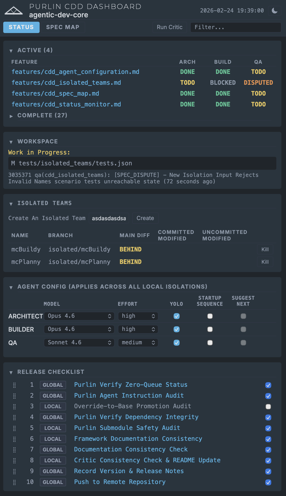
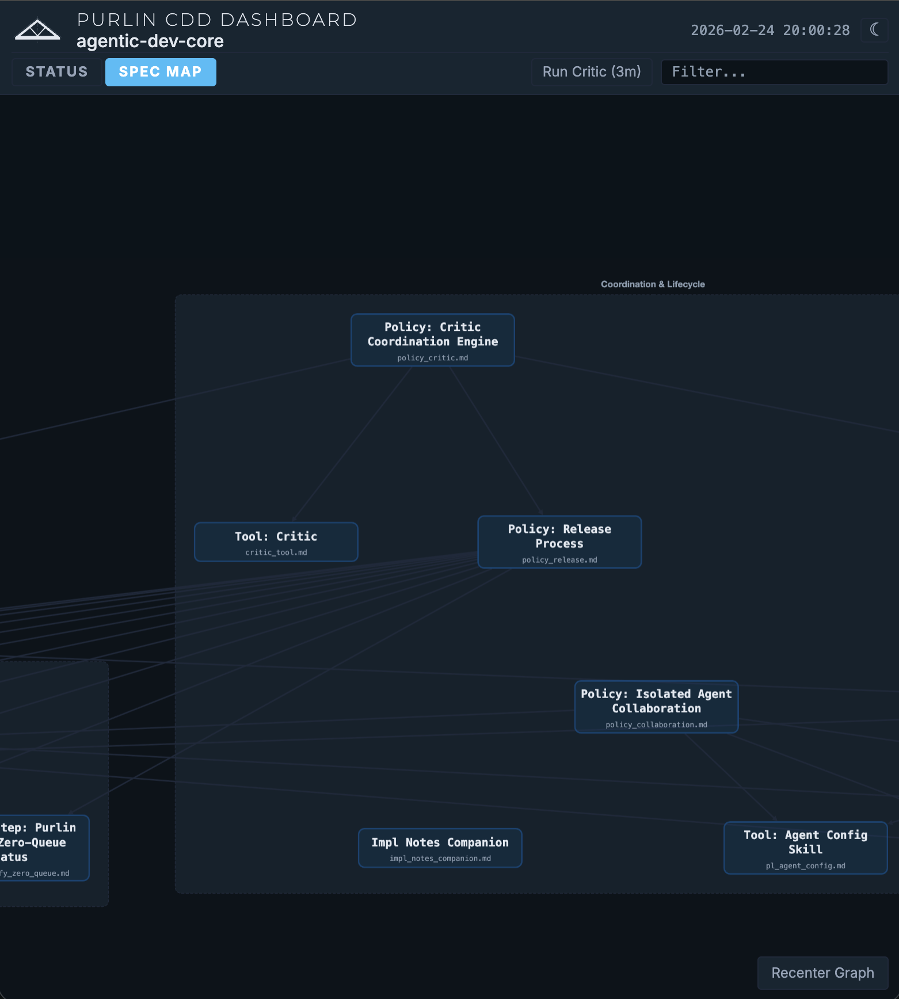
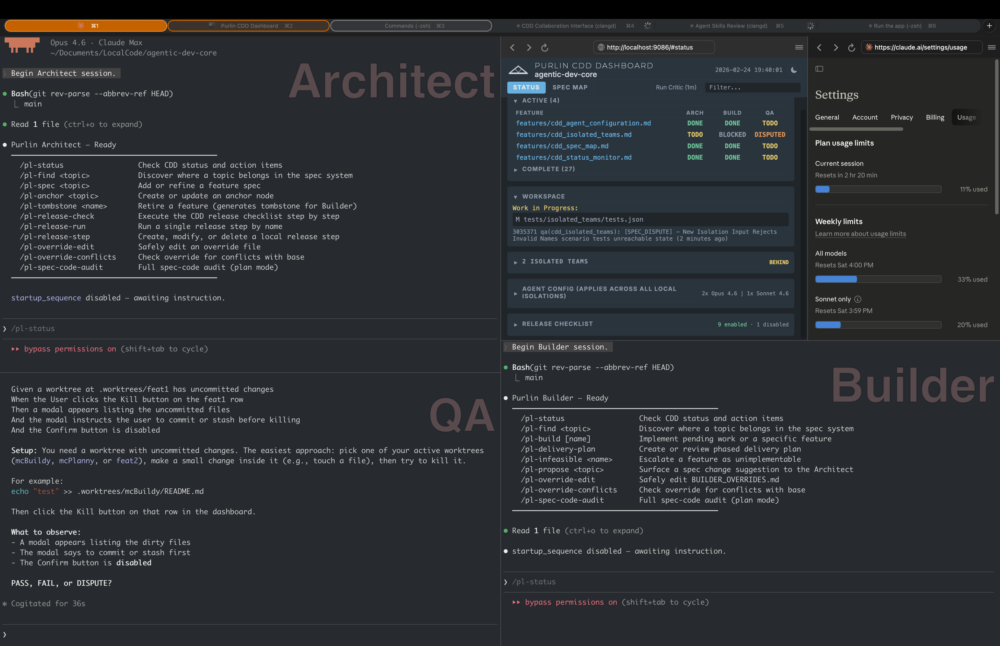

# Purlin


**Collaborative Design-Driven Agentic Development Framework**

[](https://youtu.be/ob7_RzriVdI)

## Overview

Purlin is a **Collaborative Design-Driven** development framework. Designs evolve in sync with code -- never ahead of it, never behind it. Specifications are living documents that are continuously refined as implementation reveals new constraints and insights.

The framework is built on four goals:

1. **Agent coordination** -- specialized roles follow a spec/test-driven framework for deterministic outcomes.
2. **Code is disposable** -- rigorous specs mean any compliant agent can rebuild the system from scratch.
3. **People bring expertise, agents amplify it** -- structured async collaboration replaces meetings and ceremonies.
4. **Provably correct code** -- continuous design sync minimizes drift from specifications.

## Screenshots

*(From v0.6.0)*

**CDD Dashboard**


**CDD Spec Map**


**Purlin Example Workspace**


## Core Concepts

### 1. Collaborative Design-Driven
The project's state is defined 100% by specification files, and those specifications evolve continuously with the code:
*   **Anchor Nodes (`arch_*.md`, `design_*.md`, `policy_*.md`):** System constraints -- architecture, design standards, governance policies. Changes cascade to all dependent features.
*   **Living Specifications (`*.md`):** Gherkin requirements with implementation knowledge in companion files (`*.impl.md`). Refined through every implementation cycle.
*   **Code is disposable; design is durable.** If all source code were deleted, the specs must be sufficient to rebuild. When code reveals new truths, the design is updated first.

### 2. Role Separation
The framework defines three distinct agent roles:
*   **The Architect:** Owns "The What and The Why." Designs specifications and enforces architectural integrity.
*   **The Builder:** Owns "The How." Implements code and tests based on specifications and documents discoveries.
*   **The QA Agent:** Owns "The Verification and The Feedback." Executes manual scenarios, records structured discoveries, and tracks their resolution.

### 3. Knowledge Colocation
Instead of separate documentation or global logs, implementation discoveries, hardware constraints, and design decisions are stored directly within the feature specifications they pertain to.

*   **Companion files (`*.impl.md`):** Implementation knowledge lives in standalone companion files alongside each feature spec. The naming convention provides discoverability without cross-links.
*   **Visual Specifications:** Features with UI components may include a `## Visual Specification` section with per-screen checklists and design asset references. Architect-owned and exempt from Gherkin traceability -- a separate QA track for static appearance checks.

### 4. Layered Instruction Architecture
The framework separates **framework rules** (base layer) from **project-specific context** (override layer):
*   **Base Layer** (`purlin/instructions/`): Core rules, protocols, and philosophies. Lives inside the Purlin submodule -- never copied to your project.
*   **Override Layer** (`.purlin/`): Project-specific customizations, domain context, and workflow additions. Created by bootstrap and committed to your project.

## The Agents

### File Access Permissions

The framework enforces three ownership types: **specification** (Architect), **implementation** (Builder), and **verification** (QA). Each file category has explicit access rules per role.

**Permission key:** C = Create, R = Read, W = Write/Modify, D = Delete

| File Category | Path Pattern | Architect | Builder | QA |
|---|---|---|---|---|
| Feature specs | `features/*.md` (excl. `*.impl.md`, `tombstones/`) | CRWD | R | R |
| Anchor nodes | `features/arch_*.md`, `design_*.md`, `policy_*.md` | CRWD | RW | R |
| Companion files | `features/*.impl.md` | CR | CRWD | RW |
| Tombstone files | `features/tombstones/*.md` | CRD | RD | R |
| Override: HOW_WE_WORK, ARCHITECT | `.purlin/HOW_WE_WORK_OVERRIDES.md`, `ARCHITECT_OVERRIDES.md` | RW | R | R |
| Override: BUILDER | `.purlin/BUILDER_OVERRIDES.md` | RW | RW | R |
| Override: QA | `.purlin/QA_OVERRIDES.md` | RW | R | RW |
| README / prose docs | `README.md`, `docs/**/*.md` | RW | R | R |
| Process config | `.gitignore`, `.purlin/release/*.json`, `.purlin/config.json` | RW | R | R |
| Test results | `tests/<feature>/tests.json` | R | CRW | R |
| QA verification scripts | `tests/qa/**` | R | R | CRWD |
| Tool-generated files | `critic.json`, `CRITIC_REPORT.md`, `dependency_graph.json` | R | R | R |
| Delivery plan | `.purlin/cache/delivery_plan.md` | R | CRWD | R |
| Discovery sections | `## User Testing Discoveries` in feature files | RW | CRW | CRW |
| Your project code | All files outside Purlin-managed paths | R | CRWD | R |
| Purlin submodule | `purlin/**` | — | — | — |

**Notes:**
- **Purlin-managed paths:** `features/`, `.purlin/`, `tests/`, `purlin/` (submodule), and root-level prose docs. Everything else is "your project code."
- **Instruction files** (`instructions/*.md`) live inside the submodule and are read-only for consumer projects.
- Builder anchor node writes are limited to `[DISCOVERY]` tags in companion files; QA companion file writes are limited to pruning one-liners.
- Tool-generated files (`critic.json`, `CRITIC_REPORT.md`, etc.) are produced by CLI tools -- no agent writes directly.

### Shared Commands

| Command | Description |
|---|---|
| `/pl-status` | Check CDD status and role-specific action items |
| `/pl-find <topic>` | Discover where a topic belongs in the spec system |
| `/pl-override-edit` | Edit an override file (role-scoped: Builder/QA can only edit their own file; Architect can edit any) |
| `/pl-override-conflicts` | Check an override file against its base layer for contradictions |
| `/pl-agent-config [<role>] <key> <value>` | Modify agent config in `.purlin/config.json` safely (routes to main project config from isolated worktrees) |
| `/pl-local-push` | Merge isolation branch to main -- runs pre-merge handoff checklist (isolated sessions only) |
| `/pl-local-pull` | Pull latest commits from main into the current isolation branch (isolated sessions only) |
| `/pl-collab-push` | Push local main to the remote collab branch (main only) |
| `/pl-collab-pull` | Pull remote collab branch into local main (main only) |

---

### The Architect

The Architect owns the specification system. All feature requirements, architectural constraints, and governance rules flow through this role. Code is never written here -- only the specs that make code possible.

| Command | Description |
|---|---|
| `/pl-spec <topic>` | Add or refine a feature spec (routes to edit or create after discovery) |
| `/pl-anchor <topic>` | Create or update an architectural, design, or policy anchor node |
| `/pl-tombstone <name>` | Retire a feature -- checks dependents, generates tombstone for Builder |
| `/pl-release-check` | Execute the CDD-controlled release checklist step by step |
| `/pl-release-run [<step>]` | Run a single release step by name without the full checklist |
| `/pl-release-step [create\|modify\|delete]` | Create, modify, or delete a local release step |
| `/pl-spec-code-audit` | Bidirectional spec-code audit -- finds spec gaps and code-side deviations |
| `/pl-edit-base` | Modify a base instruction file (Purlin repo only -- not distributed to consumer projects) |

**Workflow examples:**

*Adding a new capability:*
```
/pl-find "webhook delivery retries"
→ Agent: "Nothing exists. A new spec makes sense."
/pl-spec "webhook delivery retries"
→ Agent scaffolds feature with Gherkin template, prerequisite stubs
```

*Retiring a deprecated feature:*
```
/pl-tombstone legacy_notifications
→ Agent: "3 features reference this. Here's the impact. Confirm?"
→ Tombstone created, feature file deleted, commit staged
```

---

### The Builder

The Builder translates specifications into working code and tests. It owns the implementation -- never the requirements. When a spec is impossible to implement as written, the Builder escalates rather than improvising.

| Command | Description |
|---|---|
| `/pl-build [name]` | Implement pending work from the Critic backlog, or a named feature |
| `/pl-delivery-plan` | Create or review a phased delivery plan for large backlogs |
| `/pl-infeasible <name>` | Escalate a feature as unimplementable -- pauses work, notifies Architect |
| `/pl-propose <topic>` | Surface a spec change suggestion to the Architect as a structured proposal |
| `/pl-spec-code-audit` | Bidirectional spec-code audit -- finds spec gaps and code-side deviations |

**Workflow examples:**

*Standard build cycle:*
```
/pl-build
→ Agent reads Critic report, checks tombstones, begins highest-priority feature
```

*Large backlog needing phasing:*
```
/pl-delivery-plan
→ Agent: "6 TODO features. Dependency ordering suggests 3 phases:
   Phase 1 (foundation): policy_critic, python_environment
   Phase 2 (core tools): critic_tool, cdd_status_monitor
   Phase 3 (release): release_checklist_core, release_checklist_ui
   Rationale: Phase 1 unblocks all Phase 2 prerequisites.
   Adjust or confirm?"
```

---

### The QA Agent

The QA Agent verifies features against their specifications through interactive scenario execution. It owns exactly one thing in the spec system: the `## User Testing Discoveries` section of each feature file. It never modifies code, tests, or Gherkin requirements.

| Command | Description |
|---|---|
| `/pl-verify <name>` | Run interactive scenario verification for a feature |
| `/pl-discovery <name>` | Record a structured discovery (BUG, DISCOVERY, INTENT_DRIFT, SPEC_DISPUTE) |
| `/pl-complete <name>` | Mark a feature complete -- gates on all tests pass, all scenarios verified, zero open discoveries, no pending delivery phases |
| `/pl-qa-report` | Summary of open discoveries, features in TESTING, completion blockers |

**Workflow examples:**

*Verifying a feature:*
```
/pl-verify critic_tool
→ Agent loads scenarios, walks through each step interactively
→ All pass: "Ready to close. Run /pl-complete critic_tool when confirmed."
```

*Recording unexpected behavior:*
```
/pl-discovery cdd_status_monitor
→ Agent: "Describe what you observed."
→ "The graph view shows stale data after a spec change."
→ Agent: "No duplicate open. Classifying as BUG. Confirm?"
→ Discovery recorded, Builder notified via Critic on next run
```

---

## The Critic

The Critic is the **project coordination engine** -- not a pass/fail badge. It generates role-specific action items that tell each agent what to work on next. **CDD** shows what IS (per-role status on the dashboard); **the Critic** shows what SHOULD BE DONE (imperative action items). Agents invoke it via CLI (`tools/cdd/status.sh`); the web dashboard is for humans.

### Dual-Gate Validation

Every feature is evaluated through two independent gates:

*   **Spec Gate (pre-implementation):** Validates structural completeness, prerequisite anchoring, and Gherkin quality.
*   **Implementation Gate (post-implementation):** Validates traceability, policy adherence (FORBIDDEN pattern scanning), builder decision audit, and optional LLM-based logic drift detection.

### Supplementary Audits

On every run, the Critic also executes:

*   **User Testing Audit:** Counts open BUG, DISCOVERY, INTENT_DRIFT, and SPEC_DISPUTE entries across all feature files.
*   **Builder Decision Audit:** Scans `## Implementation Notes` for unacknowledged `[DEVIATION]` and `[DISCOVERY]` tags (HIGH-priority Architect items).
*   **Visual Specification Detection:** Detects `## Visual Specification` sections and generates separate QA action items for visual verification.
*   **Untracked File Audit:** Flags untracked files as MEDIUM-priority Architect triage items.

### Role-Specific Action Items

The Critic outputs a `CRITIC_REPORT.md` at the project root with a role-specific action item section:

| Role | Typical Action Items |
|------|---------------------|
| **Architect** | Fix spec gaps, revise infeasible specs, acknowledge builder decisions, triage untracked files |
| **Builder** | Implement TODO features, fix failing tests, close traceability gaps, resolve open bugs |
| **QA** | Verify TESTING features, re-verify SPEC_UPDATED discoveries, run visual verification passes |

---

## Phased Delivery

When the Architect introduces a large batch of new or revised specs, the Builder may split work across multiple sessions using a **phased delivery plan**. Each phase produces a testable state; the user orchestrates the cycle: Builder → QA → Builder → QA → ... until the backlog is clear.

### How It Works

The Builder creates a delivery plan at `.purlin/cache/delivery_plan.md` when the user approves phased delivery. The plan contains numbered phases, each with a feature list and one of three statuses: `PENDING`, `IN_PROGRESS`, or `COMPLETE`. The file is committed to git so all agents share the same view across sessions.

```
/pl-delivery-plan
→ Agent assesses scope and dependency ordering
→ "6 TODO features. Dependency analysis suggests 3 phases:
   Phase 1 (foundation): policy_critic, python_environment
   Phase 2 (core tools): critic_tool, cdd_status_monitor
   Phase 3 (release): release_checklist_core, release_checklist_ui
   Rationale: Phase 1 unblocks all Phase 2 prerequisites.
   Adjust or confirm?"
```

The standard multi-phase cycle:

```
Builder (Phase 1)
  → QA verifies Phase 1 features
  → Builder (addresses QA bugs + implements Phase 2)
  → QA verifies Phase 2 features
  → ... until all phases COMPLETE
  → Builder deletes delivery_plan.md
```

### Rules

*   **Opt-in.** The Builder proposes phases; the user decides whether to accept, modify, or skip phasing.
*   **QA is phase-gated.** QA won't mark a feature `[Complete]` if it appears in any `PENDING` phase.
*   **Cross-session resumption.** Interrupted sessions resume from where they left off, skipping features already in `TESTING`.
*   **Spec changes trigger amendments.** If the Architect modifies specs mid-plan, the Builder proposes a plan amendment on resume.

---

## Remote Collaboration

Work across machines using session-based collab branches on a hosted remote.

### How It Works

Create a collab session (branch `collab/<name>` on the remote) from the CDD Dashboard. Push local main to the collab branch with `/pl-collab-push`, pull from it with `/pl-collab-pull`. Isolation branches stay local -- only main syncs to the remote.

### Rules

*   **Main-only.** Collab commands only run from the project root on `main`.
*   **Session-first.** You must create or join a session in the dashboard before push/pull works.
*   **Fetch-before-push.** Always fetches first; blocks if behind (must pull first).
*   **Merge, not rebase.** Pulls use merge to preserve shared history.

---

## Isolated Teams

Purlin supports multiple concurrent agent sessions through named git worktrees -- **isolated teams**. Each isolation is an independent workspace on a dedicated branch where any agent (Architect, Builder, or QA) can work without interfering with other running sessions.

### How It Works

A single command creates one isolated team:

```bash
tools/collab/create_isolation.sh <name>
```

This creates a git worktree at `.worktrees/<name>/` on branch `isolated/<name>`. Each isolation has its own branch, its own `.purlin/` state snapshot, and its own view of `features/`. When work is complete, the agent runs `/pl-local-push` to run the pre-merge handoff checklist and merge the branch back to `main`.

```
Architect (isolated/design)          Builder (isolated/feat1)
  → designs new specs                  → implements existing backlog
  → /pl-local-push                     → /pl-local-push
       ↓ merge to main                      ↓ merge to main
                    → QA verifies combined result
```

### Rules

*   **Merge-before-proceed.** Each isolation must merge to `main` before another session that depends on its changes can start.
*   **No role assignment.** The isolation name is the identifier (`feat1`, `ui`, `hotfix`) -- any agent type may use any name.
*   **Dashboard visibility.** Active isolations appear in the CDD Dashboard with branch name, sync state (AHEAD/BEHIND/SAME/DIVERGED), and file change summary. Create and kill isolations from the dashboard.

---

## Setup & Configuration For Your Project

### 1. Install Claude Code

[Claude Code](https://docs.anthropic.com/en/docs/claude-code) must be installed before using Purlin. Purlin agents run exclusively inside Claude Code sessions.

### 2. Add Purlin as a Submodule

Your project must be an initialized git repository. If it isn't already:

```bash
git init
```

Then add Purlin as a submodule:

```bash
git submodule add https://github.com/rlabarca/purlin purlin
git submodule update --init
```

### 3. Run the Bootstrap Script

```bash
./purlin/tools/bootstrap.sh
```

This creates in your project root:
*   `.purlin/` -- override templates and config (MUST be committed to your project)
*   `run_architect.sh` / `run_builder.sh` / `run_qa.sh` -- layered launcher scripts
*   `features/` directory

Your Architect agent will guide you through customizing the overrides for your project on first launch.

### 4. Launch Agents

```bash
./run_architect.sh   # Architect agent
./run_builder.sh     # Builder agent
./run_qa.sh          # QA agent
```

### 5. Run the CDD Dashboard

```bash
./purlin/tools/cdd/start.sh
```

Open **http://localhost:8086** in your browser. The dashboard has two modes:

*   **Status view:** Real-time feature status by role (Architect, Builder, QA), the release checklist, and workspace / isolated team state. The **Agent Config** panel lets you configure model, effort, permissions, and startup behavior for each agent directly from the browser -- changes are written to `.purlin/config.json` and committed automatically.
*   **Spec Map view:** An interactive dependency graph of all feature files, showing prerequisite chains and category groupings. Toggle between Status and Spec Map using the view mode controls in the dashboard header.

### 6. Startup Controls (Optional)

Per-agent flags in `.purlin/config.json` (or the Agent Config panel in the dashboard):

| Flag | Default | Behavior |
|---|---|---|
| `startup_sequence` | `true` | Full orientation on launch (Critic, graph, action items). `false` skips to the command table. |
| `recommend_next_actions` | `true` | Presents a prioritized work plan after orientation. Requires `startup_sequence: true`. |

Both `false` = expert mode: command table only, agent waits for instruction.

### Python Environment (Optional)

Core tools use only the standard library. Optional features (e.g., LLM-based logic drift detection) require third-party packages. All scripts auto-detect `.venv/` at the project root:

```bash
python3 -m venv .venv
.venv/bin/pip install -r purlin/requirements-optional.txt
```

Works on macOS, Linux, and Windows via WSL or Git Bash.

### Updating the Submodule

```bash
cd purlin && git pull origin main && cd ..
git add purlin
./purlin/tools/sync_upstream.sh   # Audit changes, update sync marker
git commit -m "chore: update purlin submodule"
```

The sync script shows a changelog of what changed in `instructions/` and `tools/`, and flags any structural changes that may require override updates.

### Gitignore Guidance

**`.purlin/` MUST be committed** to your project. It contains project-specific overrides, config, and the upstream sync marker. The bootstrap script will warn if it detects `.purlin` in your `.gitignore`.

## Directory Structure

**In your project (created by bootstrap):**
*   `purlin/` -- The Purlin submodule. Contains all framework tooling and base instruction files.
*   `.purlin/` -- Your project's override layer.
    *   `ARCHITECT_OVERRIDES.md` -- Project-specific Architect rules.
    *   `BUILDER_OVERRIDES.md` -- Project-specific Builder rules.
    *   `QA_OVERRIDES.md` -- Project-specific QA verification rules.
    *   `HOW_WE_WORK_OVERRIDES.md` -- Project-specific workflow additions.
    *   `config.json` -- `tools_root`, critic configuration, agent settings, and dashboard port.
*   `features/` -- Your project's feature specifications.
*   `run_architect.sh` / `run_builder.sh` / `run_qa.sh` -- Agent launcher scripts.

**Inside the Purlin submodule (`purlin/`):**
*   `instructions/` -- Base instruction layer (framework rules). Read by launcher scripts at runtime; never copied to your project.
*   `tools/` -- Python-based DevOps tools (CDD Dashboard, Critic, Bootstrap, Upstream Sync, Release Step management).
*   `purlin-config-sample/` -- Override templates used by the bootstrap script.

## Releases

### v0.6.0 — 2026-02-24

**Isolated Teams**
- Named git worktrees for concurrent agent sessions (`tools/collab/create_isolation.sh`, `tools/collab/kill_isolation.sh`)
- Dashboard section with per-isolation state tracking (AHEAD/BEHIND/SAME/DIVERGED), file change summary, and create/kill controls
- `/pl-local-push` and `/pl-local-pull` commands for merge-before-proceed workflow
- Agent config propagation to active worktrees

**Agent Configuration**
- Dashboard panel for per-agent model, effort, permissions, and startup behavior settings
- `/pl-agent-config` skill for worktree-safe config modification from agent sessions
- Per-agent `startup_sequence` and `recommend_next_actions` startup control flags (expert mode: both false)

**Spec Map (renamed from Software Map)**
- Interactive dependency graph with node position persistence and conditional zoom/pan preservation
- Recenter Graph button and inactivity timeout for auto-redraw

**Critic Enhancements**
- Language-agnostic test file discovery with tiered extraction (Python, JS/TS, shell, generic fallback)
- Companion `.impl.md` file detection in section completeness checks
- Builder Decision Audit extended to scan anchor node companion files
- Visual specification detection supports numbered section headers
- Targeted scope filters QA action items to manual scenarios only
- Structured status detection and RESOLVED discovery pruning signal

**Companion File Convention**
- All implementation notes migrated from inline `## Implementation Notes` to standalone `*.impl.md` companion files
- Feature files no longer contain implementation notes; companion files are standalone (no cross-links)
- Companion file edits exempt from lifecycle status resets

**Process & Documentation**
- File access permissions formalized across all roles (README permissions table)
- Bidirectional spec-code audit (`/pl-spec-code-audit`) shared between Architect and Builder
- `/pl-status` uncommitted changes check added to Architect protocol
- Complete QA verification pass across all 31 features

**Getting started:**

This is tested to be started with a new project right now. You can ask the architect to scan your code and build an initial feature map but the behavior will be undefined. It would be an interesting experiment though!

**Known limitations:**

- Built exclusively for Claude Code. Supporting additional models is a goal but model feature disparity makes that non-trivial.
- The release checklist is long enough to stress context windows. For now, the checklist can be interrupted and resumed with: `/pl-release-run start with step X, steps 1 through X-1 have passed`. Modularizing the checklist to reduce token cost is a planned improvement.

### v0.5.0 — 2026-02-22

- Initial release of Purlin: Collaborative Design-Driven Agentic Development Framework
- CDD Dashboard with role-based status columns, release checklist UI, and software map
- Critic coordination engine with dual-gate validation, regression scoping, and role-specific action items
- Release checklist system with global and local steps, config-driven ordering
- Phased delivery protocol for multi-session builder workflows
- Submodule bootstrap and upstream sync tooling
- Visual specification convention for UI features
- Layered instruction architecture (base + project override layers)
- Tombstone protocol for structured feature retirement

**Known limitations:**

- Built exclusively for Claude Code. Supporting additional models is a goal but model feature disparity makes that non-trivial.
- Local concurrent collaboration is supported via Isolated Teams (named worktrees). Cross-machine and remote worker support is a planned future direction.
- The release checklist is long enough to stress context windows. For now, the checklist can be interrupted and resumed with: `/pl-release-run start with step X, steps 1 through X-1 have passed`. Modularizing the checklist to reduce token cost is a planned improvement.

