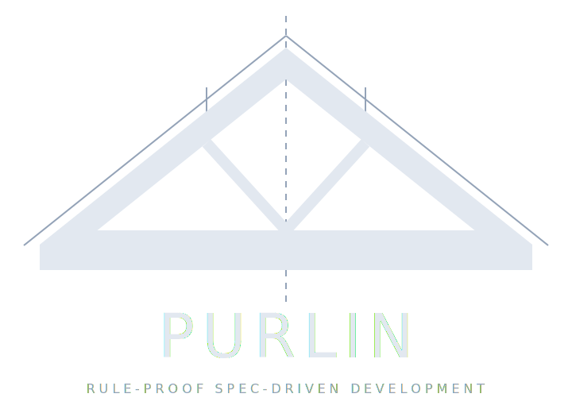

# Purlin



**Continuous Design-Driven Development Framework**

## Overview

Purlin is a **Continuous Design-Driven (CDD)** development framework. Designs evolve in sync with code -- never ahead of it, never behind it. Specifications are living documents that are continuously refined as implementation reveals new constraints and insights.

The framework is built on four goals:

1. **Coordinate specialized agents** following a spec/test-driven framework for deterministic outcomes.
2. **Specifications and tests are the backbone** -- code is disposable. If specs are rigorous enough, any compliant agent can rebuild the entire system from scratch.
3. **Enable real people to bring expertise, amplified through agents** -- replaces meetings and ceremonies with structured, async collaboration.
4. **Code is more provably correct** with least drift from specifications.

By colocating technical implementation knowledge with behavioral specifications (Gherkin), the framework ensures that system context is never lost and that codebases can be reliably rebuilt or refactored by AI agents with minimal human intervention.

## Core Concepts

### 1. Continuous Design-Driven (CDD)
The project's state is defined 100% by specification files, and those specifications evolve continuously with the code:
*   **Anchor Nodes (`arch_*.md`, `design_*.md`, `policy_*.md`):** Define the constraints of the system -- technical architecture, design standards, and governance policies. Changes cascade to all dependent features.
*   **Living Specifications (`*.md`):** Behavioral requirements (Gherkin) coupled with Implementation Notes (Tribal Knowledge). Refined through every implementation cycle -- not written once and handed off.
*   **Code is disposable; design is durable.** If all source code were deleted, the specs must be sufficient to rebuild. When code reveals new truths, the design is updated first.

### 2. Role Separation
The framework defines three distinct agent roles:
*   **The Architect:** Owns "The What and The Why." Designs specifications and enforces architectural integrity.
*   **The Builder:** Owns "The How." Implements code and tests based on specifications and documents discoveries.
*   **The QA Agent:** Owns "The Verification and The Feedback." Executes manual scenarios, records structured discoveries, and tracks their resolution.

### 3. Knowledge Colocation
Instead of separate documentation or global logs, implementation discoveries, hardware constraints, and design decisions are stored directly within the feature specifications they pertain to.

### 4. Layered Instruction Architecture
The framework separates **framework rules** (base layer) from **project-specific context** (override layer):
*   **Base Layer** (`instructions/`): Core rules, protocols, and philosophies. Read-only from the consumer's perspective.
*   **Override Layer** (`.purlin/`): Project-specific customizations, domain context, and workflow additions.

> **Compatibility note:** The `.purlin/` internal directory name is retained for backward compatibility with existing consumer projects and tooling. It functions as the project's override and configuration directory regardless of the framework's product name.

At launch, the launcher scripts concatenate base + override files into a single agent prompt. This allows upstream framework updates without merge conflicts in project-specific configuration.

### 5. Automated Test Status
Automated test results are not a separate dashboard column. They are embedded in the existing role status model:
*   **Builder `DONE`** = spec is complete and automated tests passed. **Builder `FAIL`** = automated tests failed.
*   **QA `CLEAN`** = automated tests exist and passed. **QA `N/A`** = no automated test coverage exists.

There is no separate "test status" indicator. Builder status reflects test *health*; QA status reflects test *coverage*.

## The Agents

### Shared Commands

| Command | Description |
|---|---|
| `/pl-status` | Check CDD status and role-specific action items |
| `/pl-find <topic>` | Discover where a topic belongs in the spec system |
| `/pl-override-edit` | Edit an override file (role-scoped: Builder/QA can only edit their own file; Architect can edit any) |
| `/pl-override-conflicts` | Check an override file against its base layer for contradictions |

---

### The Architect

The Architect owns the specification system. All feature requirements, architectural constraints, and governance rules flow through this role. Code is never written here -- only the specs that make code possible.

| Command | Description |
|---|---|
| `/pl-spec <topic>` | Add or refine a feature spec (routes to edit or create after discovery) |
| `/pl-anchor <topic>` | Create or update an architectural, design, or policy anchor node |
| `/pl-tombstone <name>` | Retire a feature -- checks dependents, generates tombstone for Builder |
| `/pl-release-check` | Execute the CDD-controlled release checklist step by step |
| `/pl-release-run [<step>]` | Run a single release step by name without the full checklist |
| `/pl-release-step [create\|modify\|delete]` | Create, modify, or delete a local release step |

**Workflow examples:**

*Adding a new capability:*
```
/pl-find "webhook delivery retries"
→ Agent: "Nothing exists. A new spec makes sense."
/pl-spec "webhook delivery retries"
→ Agent scaffolds feature with Gherkin template, prerequisite stubs
```

*Retiring a deprecated feature:*
```
/pl-tombstone legacy_notifications
→ Agent: "3 features reference this. Here's the impact. Confirm?"
→ Tombstone created, feature file deleted, commit staged
```

---

### The Builder

The Builder translates specifications into working code and tests. It owns the implementation -- never the requirements. When a spec is impossible to implement as written, the Builder escalates rather than improvising.

| Command | Description |
|---|---|
| `/pl-build [name]` | Implement pending work from the Critic backlog, or a named feature |
| `/pl-delivery-plan` | Create or review a phased delivery plan for large backlogs |
| `/pl-infeasible <name>` | Escalate a feature as unimplementable -- pauses work, notifies Architect |
| `/pl-propose <topic>` | Surface a spec change suggestion to the Architect as a structured proposal |

**Workflow examples:**

*Standard build cycle:*
```
/pl-build
→ Agent reads Critic report, checks tombstones, begins highest-priority feature
```

*Large backlog needing phasing:*
```
/pl-delivery-plan
→ Agent: "6 TODO features. Dependency ordering suggests 3 phases:
   Phase 1 (foundation): policy_critic, python_environment
   Phase 2 (core tools): critic_tool, cdd_status_monitor
   Phase 3 (release): release_checklist_core, release_checklist_ui
   Rationale: Phase 1 unblocks all Phase 2 prerequisites.
   Adjust or confirm?"
```

---

### The QA Agent

The QA Agent verifies features against their specifications through interactive scenario execution. It owns exactly one thing in the spec system: the `## User Testing Discoveries` section of each feature file. It never modifies code, tests, or Gherkin requirements.

| Command | Description |
|---|---|
| `/pl-verify <name>` | Run interactive scenario verification for a feature |
| `/pl-discovery <name>` | Record a structured discovery (BUG, DISCOVERY, INTENT_DRIFT, SPEC_DISPUTE) |
| `/pl-complete <name>` | Mark a feature complete -- gates on all tests pass, all scenarios verified, zero open discoveries, no pending delivery phases |
| `/pl-qa-report` | Summary of open discoveries, features in TESTING, completion blockers |

**Workflow examples:**

*Verifying a feature:*
```
/pl-verify critic_tool
→ Agent loads scenarios, walks through each step interactively
→ All pass: "Ready to close. Run /pl-complete critic_tool when confirmed."
```

*Recording unexpected behavior:*
```
/pl-discovery cdd_status_monitor
→ Agent: "Describe what you observed."
→ "The graph view shows stale data after a spec change."
→ Agent: "No duplicate open. Classifying as BUG. Confirm?"
→ Discovery recorded, Builder notified via Critic on next run
```

---

## The Critic

The Critic is the **project coordination engine** -- not a pass/fail badge. It generates role-specific action items that tell each agent what to work on next.

### Dual-Gate Validation

Every feature is evaluated through two independent gates:

*   **Spec Gate (pre-implementation):** Validates structural completeness, prerequisite anchoring, and Gherkin quality. Runs before any code exists.
*   **Implementation Gate (post-implementation):** Validates traceability (automated scenarios matched to test functions), policy adherence (FORBIDDEN pattern scanning), builder decision audit, and optional LLM-based logic drift detection.

A feature that passes the Spec Gate but fails the Implementation Gate has a code problem. A feature that passes the Implementation Gate but fails the Spec Gate has a specification problem.

### Supplementary Audits

On every run, the Critic also executes:

*   **User Testing Audit:** Counts open BUG, DISCOVERY, INTENT_DRIFT, and SPEC_DISPUTE entries across all feature files.
*   **Builder Decision Audit:** Scans `## Implementation Notes` for unacknowledged `[DEVIATION]` and `[DISCOVERY]` tags (HIGH-priority Architect items).
*   **Visual Specification Detection:** Detects `## Visual Specification` sections and generates separate QA action items for visual verification.
*   **Untracked File Audit:** Flags untracked files as MEDIUM-priority Architect triage items.

### Role-Specific Action Items

The Critic outputs a `CRITIC_REPORT.md` at the project root with a role-specific action item section:

| Role | Typical Action Items |
|------|---------------------|
| **Architect** | Fix spec gaps, revise infeasible specs, acknowledge builder decisions, triage untracked files |
| **Builder** | Implement TODO features, fix failing tests, close traceability gaps, resolve open bugs |
| **QA** | Verify TESTING features, re-verify SPEC_UPDATED discoveries, run visual verification passes |

### CDD vs. The Critic

*   **CDD** shows what IS — per-role status (Architect, Builder, QA) on the dashboard.
*   **The Critic** shows what SHOULD BE DONE — imperative action items per role.

CDD does not run the Critic. It reads the `role_status` values from pre-computed `tests/<feature>/critic.json` files.

### CLI Invocation

```bash
tools/cdd/status.sh           # Run Critic automatically + show CDD status (primary agent interface)
tools/critic/run.sh           # Run Critic directly
```

Agents use the CLI exclusively. The CDD web dashboard is for human consumption only.

---

## Phased Delivery

When the Architect introduces a large batch of new or revised specs, the Builder may split work across multiple sessions using a **phased delivery plan**. Each phase produces a testable state; the user orchestrates the cycle: Builder → QA → Builder → QA → ... until the backlog is clear.

### How It Works

The Builder creates a delivery plan at `.purlin/cache/delivery_plan.md` when the user approves phased delivery. The plan contains numbered phases, each with a feature list and one of three statuses: `PENDING`, `IN_PROGRESS`, or `COMPLETE`. The file is committed to git so all agents share the same view across sessions.

```
/pl-delivery-plan
→ Agent assesses scope and dependency ordering
→ "6 TODO features. Dependency analysis suggests 3 phases:
   Phase 1 (foundation): policy_critic, python_environment
   Phase 2 (core tools): critic_tool, cdd_status_monitor
   Phase 3 (release): release_checklist_core, release_checklist_ui
   Rationale: Phase 1 unblocks all Phase 2 prerequisites.
   Adjust or confirm?"
```

The standard multi-phase cycle:

```
Builder (Phase 1)
  → QA verifies Phase 1 features
  → Builder (addresses QA bugs + implements Phase 2)
  → QA verifies Phase 2 features
  → ... until all phases COMPLETE
  → Builder deletes delivery_plan.md
```

### Rules

*   **Phasing is opt-in.** The Builder proposes phases; the user always decides whether to accept, modify, or proceed as a single session.
*   **QA is phase-gated.** QA will not mark a feature `[Complete]` if it appears in any `PENDING` phase of the delivery plan, even if all currently-delivered scenarios pass.
*   **Cross-session resumption.** If a Builder session is interrupted mid-phase, the next Builder session resumes from where it left off -- skipping features already in `TESTING` state.
*   **Spec changes trigger amendments.** If the Architect modifies specs while a plan is active, the Builder detects the mismatch on resume and proposes a plan amendment before continuing.
*   **Dashboard visibility.** While a plan is active, the CDD Dashboard annotates the active section: `ACTIVE (N) [PHASE (current/total)]`.
*   **Flexible exit.** At any approval checkpoint, the user may collapse remaining phases, re-split, or abandon phasing entirely.

---

## Setup & Configuration

### Option A: Using as a Submodule (Recommended for Projects)

1.  **Add the submodule:**
    ```bash
    git submodule add https://github.com/rlabarca/purlin purlin
    git submodule update --init
    ```

2.  **Run the bootstrap:**
    ```bash
    ./purlin/tools/bootstrap.sh
    ```
    This creates:
    *   `.purlin/` -- override templates and config (MUST be committed to your project)
    *   `run_architect.sh` / `run_builder.sh` / `run_qa.sh` -- layered launcher scripts
    *   `features/` directory

3.  **Customize your overrides:**
    Edit the files in `.purlin/`:
    *   `ARCHITECT_OVERRIDES.md` -- project-specific Architect rules and domain context
    *   `BUILDER_OVERRIDES.md` -- tech stack constraints, build environment rules
    *   `QA_OVERRIDES.md` -- project-specific QA verification rules
    *   `HOW_WE_WORK_OVERRIDES.md` -- project-specific workflow additions
    *   `config.json` -- ports and tool paths

4.  **Launch agents:**
    ```bash
    ./run_architect.sh   # Architect agent
    ./run_builder.sh     # Builder agent
    ./run_qa.sh          # QA agent
    ```

### Option B: Standalone (For Framework Development)

1.  **Launch agents directly:**
    ```bash
    ./run_architect.sh
    ./run_builder.sh
    ```
    The launcher scripts detect standalone mode and use `instructions/` and `.purlin/` from the repo root.

    All three launchers (`run_architect.sh`, `run_builder.sh`, `run_qa.sh`) are available in standalone mode.

### Python Environment (Optional)

The framework's Python tools use only the standard library -- no packages need to be installed for core functionality. However, optional features (e.g., LLM-based logic drift detection in the Critic) require third-party packages.

All tool scripts auto-detect a `.venv/` at the project root. To set up:

```bash
python3 -m venv .venv
.venv/bin/pip install -r purlin/requirements-optional.txt   # submodule
# or
.venv/bin/pip install -r requirements-optional.txt               # standalone
```

No additional configuration is needed -- all shell scripts that invoke Python use a shared resolver (`tools/resolve_python.sh`) that checks for the venv automatically. The resolution priority is:
1. `$AGENTIC_PYTHON` env var (explicit override)
2. `$PURLIN_PROJECT_ROOT/.venv/`
3. Climbing detection from script directory
4. System `python3`, then `python`

This works on macOS, Linux, and Windows via WSL or Git Bash. Native PowerShell is not supported.

### Updating the Submodule

```bash
cd purlin && git pull origin main && cd ..
git add purlin
./purlin/tools/sync_upstream.sh   # Audit changes, update sync marker
git commit -m "chore: update purlin submodule"
```

The sync script shows a changelog of what changed in `instructions/` and `tools/`, and flags any structural changes that may require override updates.

### Gitignore Guidance

**`.purlin/` MUST be committed** to your project. It contains project-specific overrides, config, and the upstream sync marker. The bootstrap script will warn if it detects `.purlin` in your `.gitignore`.

## Directory Structure

*   `instructions/` -- Base instruction layer (framework rules, read-only for consumers).
    *   `ARCHITECT_BASE.md` -- Core Architect mandates and protocols.
    *   `BUILDER_BASE.md` -- Core Builder implementation protocol.
    *   `QA_BASE.md` -- Core QA verification and discovery protocol.
    *   `HOW_WE_WORK_BASE.md` -- Core workflow philosophy and lifecycle.
*   `.purlin/` -- Override layer (project-specific customizations).
    *   `ARCHITECT_OVERRIDES.md` -- Project-specific Architect rules.
    *   `BUILDER_OVERRIDES.md` -- Project-specific Builder rules.
    *   `QA_OVERRIDES.md` -- Project-specific QA verification rules.
    *   `HOW_WE_WORK_OVERRIDES.md` -- Project-specific workflow additions.
    *   `config.json` -- Ports, `tools_root`, critic configuration, and other settings.
*   `purlin-config-sample/` -- Override templates for new consumer projects.
*   `features/` -- Meta-specifications for the framework's own tools.
*   `tools/` -- Python-based DevOps tools (CDD Dashboard, Critic, Bootstrap, Upstream Sync, Release Step management).

## Port Allocation

| Context | CDD Dashboard Port |
|---------|--------------------|
| purlin standalone | 9086 |
| Consumer project default | 8086 |

Consumer projects get 8086 by default (from `purlin-config-sample/config.json`). Core development uses 9086.

## Claude CLI

Purlin agents run exclusively on the Claude CLI.

| Parameter | Flag |
|-----------|------|
| Model | `--model <id>` |
| Effort | `--effort low/medium/high` |
| Permissions bypass | `--dangerously-skip-permissions` |

Agent model, effort, and permissions are configured per-role in `.purlin/config.json` under `agents.<role>`.

### Installing the Claude CLI

```bash
npm install -g @anthropic-ai/claude-code
```

Authenticate with `claude` on first run.

## Releases

