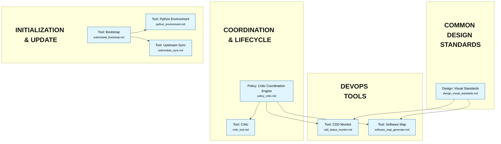

# Purlin


**Continuous Design-Driven Development Framework**

## Overview

Purlin is a **Continuous Design-Driven (CDD)** development framework. Designs evolve in sync with code -- never ahead of it, never behind it. Specifications are living documents that are continuously refined as implementation reveals new constraints and insights.

The framework is built on four goals:

1. **Coordinate specialized agents** following a spec/test-driven framework for deterministic outcomes.
2. **Specifications and tests are the backbone** -- code is disposable. If specs are rigorous enough, any compliant agent can rebuild the entire system from scratch.
3. **Enable real people to bring expertise, amplified through agents** -- replaces meetings and ceremonies with structured, async collaboration.
4. **Code is more provably correct** with least drift from specifications.

By colocating technical implementation knowledge with behavioral specifications (Gherkin), the framework ensures that system context is never lost and that codebases can be reliably rebuilt or refactored by AI agents with minimal human intervention.

## Core Concepts

### 1. Continuous Design-Driven (CDD)
The project's state is defined 100% by specification files, and those specifications evolve continuously with the code:
*   **Anchor Nodes (`arch_*.md`, `design_*.md`, `policy_*.md`):** Define the constraints of the system -- technical architecture, design standards, and governance policies. Changes cascade to all dependent features.
*   **Living Specifications (`*.md`):** Behavioral requirements (Gherkin) coupled with Implementation Notes (Tribal Knowledge). Refined through every implementation cycle -- not written once and handed off.
*   **Code is disposable; design is durable.** If all source code were deleted, the specs must be sufficient to rebuild. When code reveals new truths, the design is updated first.

### 2. Role Separation
The framework defines three distinct agent roles:
*   **The Architect:** Owns "The What and The Why." Designs specifications and enforces architectural integrity.
*   **The Builder:** Owns "The How." Implements code and tests based on specifications and documents discoveries.
*   **The QA Agent:** Owns "The Verification and The Feedback." Executes manual scenarios, records structured discoveries, and tracks their resolution.

### 3. Knowledge Colocation
Instead of separate documentation or global logs, implementation discoveries, hardware constraints, and design decisions are stored directly within the feature specifications they pertain to.

### 4. Layered Instruction Architecture
The framework separates **framework rules** (base layer) from **project-specific context** (override layer):
*   **Base Layer** (`instructions/`): Core rules, protocols, and philosophies. Read-only from the consumer's perspective.
*   **Override Layer** (`.agentic_devops/`): Project-specific customizations, domain context, and workflow additions.

> **Compatibility note:** The `.agentic_devops/` internal directory name is retained for backward compatibility with existing consumer projects and tooling. It functions as the project's override and configuration directory regardless of the framework's product name.

At launch, the launcher scripts concatenate base + override files into a single agent prompt. This allows upstream framework updates without merge conflicts in project-specific configuration.

### 5. Automated Test Status
Automated test results are not a separate dashboard column. They are embedded in the existing role status model:
*   **Builder `DONE`** = spec is complete and automated tests passed. **Builder `FAIL`** = automated tests failed.
*   **QA `CLEAN`** = automated tests exist and passed. **QA `N/A`** = no automated test coverage exists.

There is no separate "test status" indicator. Builder status reflects test *health*; QA status reflects test *coverage*.

## Setup & Configuration

### Option A: Using as a Submodule (Recommended for Projects)

1.  **Add the submodule:**
    ```bash
    git submodule add https://github.com/rlabarca/purlin purlin
    git submodule update --init
    ```

2.  **Run the bootstrap:**
    ```bash
    ./purlin/tools/bootstrap.sh
    ```
    This creates:
    *   `.agentic_devops/` -- override templates and config (MUST be committed to your project)
    *   `run_claude_architect.sh` / `run_claude_builder.sh` / `run_claude_qa.sh` -- layered launcher scripts
    *   `features/` directory and `PROCESS_HISTORY.md`

3.  **Customize your overrides:**
    Edit the files in `.agentic_devops/`:
    *   `ARCHITECT_OVERRIDES.md` -- project-specific Architect rules and domain context
    *   `BUILDER_OVERRIDES.md` -- tech stack constraints, build environment rules
    *   `QA_OVERRIDES.md` -- project-specific QA verification rules
    *   `HOW_WE_WORK_OVERRIDES.md` -- project-specific workflow additions
    *   `config.json` -- ports and tool paths

4.  **Launch agents:**
    ```bash
    ./run_claude_architect.sh   # Architect agent
    ./run_claude_builder.sh     # Builder agent
    ./run_claude_qa.sh          # QA agent
    ```

### Option B: Standalone (For Framework Development)

1.  **Launch agents directly:**
    ```bash
    ./run_claude_architect.sh
    ./run_claude_builder.sh
    ```
    The launcher scripts detect standalone mode and use `instructions/` and `.agentic_devops/` from the repo root.

    All three launchers (`run_claude_architect.sh`, `run_claude_builder.sh`, `run_claude_qa.sh`) are available in standalone mode.

### Python Environment (Optional)

The framework's Python tools use only the standard library -- no packages need to be installed for core functionality. However, optional features (e.g., LLM-based logic drift detection in the Critic) require third-party packages.

All tool scripts auto-detect a `.venv/` at the project root. To set up:

```bash
python3 -m venv .venv
.venv/bin/pip install -r purlin/requirements-optional.txt   # submodule
# or
.venv/bin/pip install -r requirements-optional.txt               # standalone
```

No additional configuration is needed -- all shell scripts that invoke Python use a shared resolver (`tools/resolve_python.sh`) that checks for the venv automatically. The resolution priority is:
1. `$AGENTIC_PYTHON` env var (explicit override)
2. `$AGENTIC_PROJECT_ROOT/.venv/`
3. Climbing detection from script directory
4. System `python3`, then `python`

This works on macOS, Linux, and Windows via WSL or Git Bash. Native PowerShell is not supported.

### Updating the Submodule

```bash
cd purlin && git pull origin main && cd ..
git add purlin
./purlin/tools/sync_upstream.sh   # Audit changes, update sync marker
git commit -m "chore: update purlin submodule"
```

The sync script shows a changelog of what changed in `instructions/` and `tools/`, and flags any structural changes that may require override updates.

### Gitignore Guidance

**`.agentic_devops/` MUST be committed** to your project. It contains project-specific overrides, config, and the upstream sync marker. The bootstrap script will warn if it detects `.agentic_devops` in your `.gitignore`.

## Directory Structure

*   `instructions/` -- Base instruction layer (framework rules, read-only for consumers).
    *   `ARCHITECT_BASE.md` -- Core Architect mandates and protocols.
    *   `BUILDER_BASE.md` -- Core Builder implementation protocol.
    *   `QA_BASE.md` -- Core QA verification and discovery protocol.
    *   `HOW_WE_WORK_BASE.md` -- Core workflow philosophy and lifecycle.
*   `.agentic_devops/` -- Override layer (project-specific customizations).
    *   `ARCHITECT_OVERRIDES.md` -- Project-specific Architect rules.
    *   `BUILDER_OVERRIDES.md` -- Project-specific Builder rules.
    *   `QA_OVERRIDES.md` -- Project-specific QA verification rules.
    *   `HOW_WE_WORK_OVERRIDES.md` -- Project-specific workflow additions.
    *   `config.json` -- Ports, `tools_root`, critic configuration, and other settings.
*   `agentic_devops.sample/` -- Override templates for new consumer projects.
*   `features/` -- Meta-specifications for the framework's own tools.
*   `tools/` -- Python-based DevOps tools (CDD Monitor, Software Map, Critic, Bootstrap, Upstream Sync).
*   `PROCESS_HISTORY.md` -- Changelog tracking Agentic Workflow and DevOps tool evolution.

## Port Allocation

| Context | CDD Port | Map Port |
|---------|----------|----------|
| purlin standalone | 9086 | 9087 |
| Consumer project default | 8086 | 8087 |

Consumer projects get 8086/8087 by default (from `agentic_devops.sample/config.json`). Core development uses 9086/9087. No collision when both run simultaneously.

## Feature Map
<!-- MERMAID_START -->

<!-- MERMAID_END -->

## Purlin Evolution

| Version | Milestone | Workflow Changes |
| :--- | :--- | :--- |
| v3.1.0 | Critic Coordination Engine + CLI-First Agents | Critic redesigned from quality gate to coordination engine with role-specific action items and role_status computation; CDD redesigned with Architect/Builder/QA columns; SPEC_DISPUTE and INFEASIBLE escalation protocols; QA completion authority for manually-verified features; Builder self-directing startup protocol; CLI-first agent interface (servers for humans only); submodule compatibility safety requirements; documentation drift audit and corrections. |
| v3.0.0 | Critic Quality Gate + QA Persona | Dual-gate validation (Spec Gate + Implementation Gate); Critic tool with traceability engine, policy adherence scanner, and optional LLM logic drift; QA Agent role with structured discovery protocol; Builder Decision Protocol with structured tags. |
| v2.0.0 | Submodule-Ready Layered Architecture | Split instructions into base+override layers; submodule consumption model with bootstrap and sync tools; port isolation (9086/9087 core, 8086/8087 consumer). |
| v1.0.1 | Port Isolation & Spec Refinement | Configurable ports for tool isolation; Meta-mode support; Refined instruction specs. |
| v1.0.0 | Framework Bootstrap | Isolated workflow from project context; Generalized role definitions. |

## License

This project is licensed under the MIT License.
