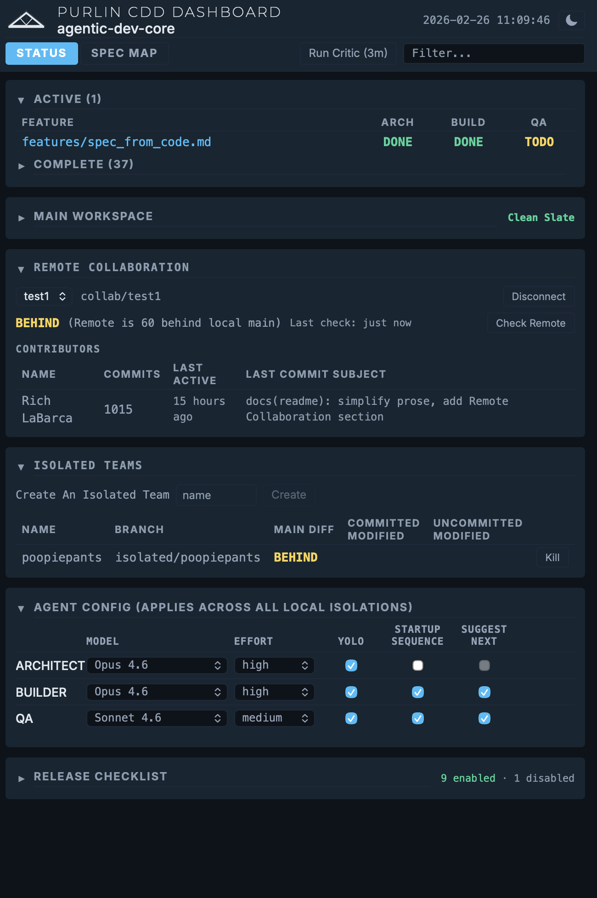
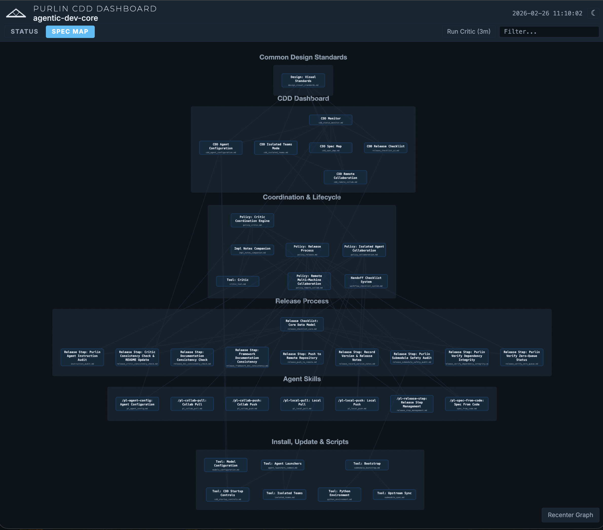

# Purlin


## Current Release: v0.7.5 &mdash; [RELEASE NOTES](RELEASE_NOTES.md)

**Collaborative Design-Driven Agentic Development Framework**

[](https://youtu.be/ob7_RzriVdI)

## Overview

Purlin helps AI agents build software together using a shared set of specs. The specs stay in sync with the code -- when code teaches us something new, the specs get updated to match.

The framework is built on four goals:

1. **Agents stay coordinated** -- three specialized roles (Architect, Builder, QA) each know exactly what to do next.
2. **Specs are the source of truth** -- if the code disappeared tomorrow, any agent could rebuild it from the specs alone.
3. **People steer, agents execute** -- you set the direction; agents handle the back-and-forth without meetings.
4. **Code stays correct** -- specs and code are always in sync, so bugs from "stale requirements" don't happen.

## Screenshots

*(From v0.7.0)*

**CDD Dashboard**


**CDD Spec Map**


## Core Concepts

### 1. Specs Drive Everything
The project's state is defined by specification files in `features/`. Those specs evolve continuously with the code:
*   **Anchor nodes** are project-wide rules (architecture, design standards, policies) stored as files. When you change a rule, every feature that depends on it gets flagged for review automatically.
*   **Feature specs** describe requirements in plain-language scenarios, with implementation notes stored in companion files alongside them. They're refined through every build cycle.
*   **Code is disposable; design is durable.** If all source code were deleted, the specs must be sufficient to rebuild. When code reveals new truths, the design is updated first.

### 2. Role Separation
The framework defines three distinct agent roles:
*   **The Architect:** Owns "The What and The Why." Designs specifications and enforces architectural integrity.
*   **The Builder:** Owns "The How." Implements code and tests based on specifications and documents discoveries.
*   **The QA Agent:** Owns "The Verification and The Feedback." Executes manual scenarios, records structured discoveries, and tracks their resolution.

### 3. Keep Notes Where They Belong
Instead of a separate wiki or shared doc, implementation notes live right next to the feature spec they're about. Nothing gets lost in a side channel.

*   **Companion files (`*.impl.md`):** Each feature spec can have a companion file that captures implementation decisions, gotchas, and lessons learned.
*   **Visual specs:** Features with UI components can include a visual checklist with design references -- a separate QA track for checking how things look.

### 4. Your Rules Layer on Top
Purlin's built-in rules live inside the submodule. Your project-specific tweaks go in `.purlin/`. The agents combine both at launch -- you never need to edit framework files.

## The Agents

### File Access Permissions

The Architect owns specs and policies. The Builder owns code, tests, and implementation notes. QA owns verification scripts and testing discoveries. Each role can read everything but only write to their own files. The Purlin submodule is read-only for all roles.

<details>
<summary>Full permissions matrix</summary>

**Permission key:** C = Create, R = Read, W = Write/Modify, D = Delete

| File Category | Path Pattern | Architect | Builder | QA |
|---|---|---|---|---|
| Feature specs | `features/*.md` (excl. `*.impl.md`, `tombstones/`) | CRWD | R | R |
| Anchor nodes | `features/arch_*.md`, `design_*.md`, `policy_*.md` | CRWD | RW | R |
| Companion files | `features/*.impl.md` | CR | CRWD | RW |
| Tombstone files | `features/tombstones/*.md` | CRD | RD | R |
| Override: HOW_WE_WORK, ARCHITECT | `.purlin/HOW_WE_WORK_OVERRIDES.md`, `ARCHITECT_OVERRIDES.md` | RW | R | R |
| Override: BUILDER | `.purlin/BUILDER_OVERRIDES.md` | RW | RW | R |
| Override: QA | `.purlin/QA_OVERRIDES.md` | RW | R | RW |
| README / prose docs | `README.md`, `docs/**/*.md` | RW | R | R |
| Process config | `.gitignore`, `.purlin/release/*.json`, `.purlin/config.json` | RW | R | R |
| Test results | `tests/<feature>/tests.json` | R | CRW | R |
| QA verification scripts | `tests/qa/**` | R | R | CRWD |
| Tool-generated files | `critic.json`, `CRITIC_REPORT.md`, `dependency_graph.json` | R | R | R |
| Delivery plan | `.purlin/cache/delivery_plan.md` | R | CRWD | R |
| Discovery sections | `## User Testing Discoveries` in feature files | RW | CRW | CRW |
| Your project code | All files outside Purlin-managed paths | R | CRWD | R |
| Purlin submodule | `purlin/**` | — | — | — |

**Notes:**
- **Purlin-managed paths:** `features/`, `.purlin/`, `tests/`, `purlin/` (submodule), and root-level prose docs. Everything else is "your project code."
- **Instruction files** (`instructions/*.md`) live inside the submodule and are read-only for consumer projects.
- Builder anchor node writes are limited to `[DISCOVERY]` tags in companion files; QA companion file writes are limited to pruning one-liners.
- Tool-generated files (`critic.json`, `CRITIC_REPORT.md`, etc.) are produced by CLI tools -- no agent writes directly.

</details>

### Shared Commands

| Command | Description |
|---|---|
| `/pl-status` | Check CDD status and role-specific action items |
| `/pl-resume [save\|role]` | Save or restore session state across context clears |
| `/pl-find <topic>` | Discover where a topic belongs in the spec system |
| `/pl-override-edit` | Edit an override file (role-scoped: Builder/QA can only edit their own file; Architect can edit any) |
| `/pl-override-conflicts` | Check an override file against its base layer for contradictions |
| `/pl-agent-config [<role>] <key> <value>` | Modify agent config in `.purlin/config.json` safely (routes to main project config from isolated worktrees) |
| `/pl-local-push` | Merge isolation branch to collaboration branch -- runs pre-merge handoff checklist (isolated sessions only) |
| `/pl-local-pull` | Pull collaboration branch into the current isolation branch (isolated sessions only) |
| `/pl-collab-push` | Push local collab branch to remote (collab session only) |
| `/pl-collab-pull` | Pull remote collab branch into local (collab session only) |
| `/pl-whats-different` | Compare current branch to main -- summary of all changes (main checkout only) |
| `/pl-update-purlin` | Intelligent submodule update with semantic analysis and conflict resolution |

---

### The Architect

The Architect owns the specification system. All feature requirements, architectural constraints, and governance rules flow through this role. Code is never written here -- only the specs that make code possible.

| Command | Description |
|---|---|
| `/pl-spec <topic>` | Add or refine a feature spec (routes to edit or create after discovery) |
| `/pl-anchor <topic>` | Create or update an architectural, design, or policy anchor node |
| `/pl-tombstone <name>` | Retire a feature -- checks dependents, generates tombstone for Builder |
| `/pl-release-check` | Execute the CDD-controlled release checklist step by step |
| `/pl-release-run [<step>]` | Run a single release step by name without the full checklist |
| `/pl-release-step [create\|modify\|delete]` | Create, modify, or delete a local release step |
| `/pl-design-ingest` | Ingest a design artifact into a feature's visual spec |
| `/pl-design-audit` | Audit design artifact integrity and staleness |
| `/pl-spec-code-audit` | Bidirectional spec-code audit -- finds spec gaps and code-side deviations |
| `/pl-spec-from-code` | Reverse-engineer feature specs from existing code |
| `/pl-edit-base` | Modify a base instruction file (Purlin repo only -- not distributed to consumer projects) |

**Workflow examples:**

*Adding a new capability:*
```
/pl-find "webhook delivery retries"
→ Agent: "Nothing exists. A new spec makes sense."
/pl-spec "webhook delivery retries"
→ Agent scaffolds feature with Gherkin template, prerequisite stubs
```

*Retiring a deprecated feature:*
```
/pl-tombstone legacy_notifications
→ Agent: "3 features reference this. Here's the impact. Confirm?"
→ Tombstone created, feature file deleted, commit staged
```

---

### The Builder

The Builder translates specifications into working code and tests. It owns the implementation -- never the requirements. When a spec is impossible to implement as written, the Builder escalates rather than improvising.

| Command | Description |
|---|---|
| `/pl-build [name]` | Implement pending work from the Critic backlog, or a named feature |
| `/pl-delivery-plan` | Create or review a phased delivery plan for large backlogs |
| `/pl-infeasible <name>` | Escalate a feature as unimplementable -- pauses work, notifies Architect |
| `/pl-propose <topic>` | Surface a spec change suggestion to the Architect as a structured proposal |
| `/pl-spec-code-audit` | Bidirectional spec-code audit -- finds spec gaps and code-side deviations |

**Workflow examples:**

*Standard build cycle:*
```
/pl-build
→ Agent reads Critic report, checks tombstones, begins highest-priority feature
```

*Large backlog needing phasing:*
```
/pl-delivery-plan
→ Agent: "6 TODO features. Dependency ordering suggests 3 phases:
   Phase 1 (foundation): policy_critic, python_environment
   Phase 2 (core tools): critic_tool, cdd_status_monitor
   Phase 3 (release): release_checklist_core, release_checklist_ui
   Rationale: Phase 1 unblocks all Phase 2 prerequisites.
   Adjust or confirm?"
```

---

### The QA Agent

The QA Agent verifies features against their specifications through interactive scenario execution. It owns exactly one thing in the spec system: the `## User Testing Discoveries` section of each feature file. It never modifies code, tests, or Gherkin requirements.

| Command | Description |
|---|---|
| `/pl-verify <name>` | Run interactive scenario verification for a feature |
| `/pl-discovery <name>` | Record a structured discovery (BUG, DISCOVERY, INTENT_DRIFT, SPEC_DISPUTE) |
| `/pl-complete <name>` | Mark a feature complete -- gates on all tests pass, all scenarios verified, zero open discoveries, no pending delivery phases |
| `/pl-qa-report` | Summary of open discoveries, features in TESTING, completion blockers |

**Workflow examples:**

*Verifying a feature:*
```
/pl-verify critic_tool
→ Agent loads scenarios, walks through each step interactively
→ All pass: "Ready to close. Run /pl-complete critic_tool when confirmed."
```

*Recording unexpected behavior:*
```
/pl-discovery cdd_status_monitor
→ Agent: "Describe what you observed."
→ "The graph view shows stale data after a spec change."
→ Agent: "No duplicate open. Classifying as BUG. Confirm?"
→ Discovery recorded, Builder notified via Critic on next run
```

---

## The Critic

The Critic scans every feature and tells each agent what to work on next. Think of it as an automated project manager: it checks specs for gaps, verifies tests match requirements, and generates a prioritized to-do list per role. You can see results on the CDD Dashboard or agents can check from the command line.

### Dual-Gate Validation

Every feature gets checked twice:

*   **Before coding:** Is the spec complete? Are all dependencies declared?
*   **After coding:** Do the tests match the spec? Does the code follow project rules?

### Role-Specific Action Items

The Critic outputs a `CRITIC_REPORT.md` at the project root with a role-specific action item section:

| Role | Typical Action Items |
|------|---------------------|
| **Architect** | Fix spec gaps, revise infeasible specs, acknowledge builder decisions, triage untracked files |
| **Builder** | Implement TODO features, fix failing tests, close traceability gaps, resolve open bugs |
| **QA** | Verify TESTING features, re-verify SPEC_UPDATED discoveries, run visual verification passes |

---

## Phased Delivery

When there's a large backlog, the Builder can split work into numbered phases. Each phase produces a testable state, and the cycle repeats -- Builder implements, QA verifies -- until the backlog is clear.

The Builder creates the plan with `/pl-delivery-plan`. It lives at `.purlin/cache/delivery_plan.md` and is committed to git so all agents share the same view across sessions.

```
/pl-delivery-plan
→ "6 TODO features. Dependency analysis suggests 3 phases:
   Phase 1 (foundation): policy_critic, python_environment
   Phase 2 (core tools): critic_tool, cdd_status_monitor
   Phase 3 (release): release_checklist_core, release_checklist_ui
   Adjust or confirm?"
```

Phasing is opt-in -- the user decides whether to accept, modify, or skip it. QA won't mark a feature complete if it appears in a pending phase. Interrupted sessions resume where they left off.

---

## Remote Collaboration

Work across machines using session-based collab branches on a hosted remote.

### How It Works

Create a collab session (branch `collab/<name>` on the remote) from the CDD Dashboard. Check out the `collab/<session>` branch locally, then push and pull are symmetric same-branch operations: `/pl-collab-push` pushes the local collab branch to the remote, `/pl-collab-pull` pulls the remote into the local collab branch. Isolation branches merge to the collaboration branch (which is the collab branch during an active session, or `main` when no session is active).

### Rules

*   **Collab branch only.** Collab commands only run from a checked-out `collab/<session>` branch.
*   **Session-first.** You must create or join a session in the dashboard before push/pull works.
*   **Fetch-before-push.** Always fetches first; blocks if behind (must pull first).
*   **Merge, not rebase.** Pulls use merge to preserve shared history.

---

## Isolated Teams

Purlin supports multiple concurrent agent sessions through named git worktrees -- **isolated teams**. Each isolation is an independent workspace on a dedicated branch where any agent (Architect, Builder, or QA) can work without interfering with other running sessions.

### How It Works

A single command creates one isolated team:

```bash
tools/collab/create_isolation.sh <name>
```

This creates a git worktree at `.worktrees/<name>/` on branch `isolated/<name>`. Each isolation has its own branch, its own `.purlin/` state snapshot, and its own view of `features/`. When work is complete, the agent runs `/pl-local-push` to run the pre-merge handoff checklist and merge the branch back to the collaboration branch.

```
Architect (isolated/design)          Builder (isolated/feat1)
  → designs new specs                  → implements existing backlog
  → /pl-local-push                     → /pl-local-push
       ↓ merge to collab branch              ↓ merge to collab branch
                    → QA verifies combined result
```

### Rules

*   **Merge-before-proceed.** Each isolation must merge to the collaboration branch before another session that depends on its changes can start.
*   **No role assignment.** The isolation name is the identifier (`feat1`, `ui`, `hotfix`) -- any agent type may use any name.
*   **Dashboard visibility.** Active isolations appear in the CDD Dashboard with branch name, sync state (AHEAD/BEHIND/SAME/DIVERGED), and file change summary. Create and kill isolations from the dashboard.

---

## Setup & Configuration For Your Project

### 1. Install Claude Code

[Claude Code](https://docs.anthropic.com/en/docs/claude-code) must be installed before using Purlin. Purlin agents run exclusively inside Claude Code sessions.

### 2. Add Purlin and Initialize

Your project must be an initialized git repository. If it isn't already:

```bash
git init
```

Add Purlin as a submodule and run the init script:

```bash
git submodule add https://github.com/rlabarca/purlin purlin
git submodule update --init
./purlin/init.sh
```

This creates in your project root:
*   `.purlin/` -- override templates and config (MUST be committed to your project)
*   `run_architect.sh` / `run_builder.sh` / `run_qa.sh` -- layered launcher scripts
*   `purlin_init.sh` -- a shim for collaborators to initialize or refresh Purlin (commit this)
*   `purlin_cdd_start.sh` / `purlin_cdd_stop.sh` -- CDD dashboard convenience symlinks
*   `features/` directory
*   `.claude/commands/` -- agent slash commands

Commit everything:

```bash
git add -A && git commit -m "init purlin"
```

Your Architect agent will guide you through customizing the overrides for your project on first launch.

### 3. Collaborator Setup (Fresh Clone)

When a team member clones your repository (even without `--recurse-submodules`), a single command handles everything:

```bash
./purlin_init.sh
```

This automatically initializes the Purlin submodule if needed, then runs the init script in refresh mode -- creating or repairing launchers, commands, and symlinks without touching project-specific config or overrides.

### 4. Launch Agents

```bash
./run_architect.sh   # Architect agent
./run_builder.sh     # Builder agent
./run_qa.sh          # QA agent
```

### 5. Run the CDD Dashboard

```bash
./purlin_cdd_start.sh                  # uses port from config (default: 8086)
./purlin_cdd_start.sh -p 9090         # override port at runtime
```

Open **http://localhost:8086** (or your chosen port) in your browser. The `-p` flag overrides the `cdd_port` value in `.purlin/config.json` without modifying it -- useful when running multiple projects on the same machine or when collaborators use different ports. The dashboard has two modes:

*   **Status view:** Real-time feature status by role (Architect, Builder, QA), the release checklist, and workspace / isolated team state. The **Agent Config** panel lets you configure model, effort, permissions, and startup behavior for each agent directly from the browser -- changes are written to `.purlin/config.json` and committed automatically.
*   **Spec Map view:** An interactive dependency graph of all feature files, showing prerequisite chains and category groupings. Toggle between Status and Spec Map using the view mode controls in the dashboard header.

### 6. Startup Controls (Optional)

Per-agent flags in `.purlin/config.json` (or the Agent Config panel in the dashboard):

| Flag | Default | Behavior |
|---|---|---|
| `startup_sequence` | `true` | Full orientation on launch (Critic, graph, action items). `false` skips to the command table. |
| `recommend_next_actions` | `true` | Presents a prioritized work plan after orientation. Requires `startup_sequence: true`. |

Both `false` = expert mode: command table only, agent waits for instruction.

### Python Environment (Optional)

Core tools use only the standard library. Optional features (e.g., LLM-based logic drift detection) require third-party packages. All scripts auto-detect `.venv/` at the project root:

```bash
python3 -m venv .venv
.venv/bin/pip install -r purlin/requirements-optional.txt
```

Works on macOS, Linux, and Windows via WSL or Git Bash.

### Updating the Submodule

Use the `/pl-update-purlin` agent skill to intelligently update Purlin:

```bash
./run_architect.sh   # or run_builder.sh / run_qa.sh
# In the Claude Code session:
/pl-update-purlin
```

The agent skill:
- Fetches upstream and reports commits behind
- Analyzes changes semantically (not just textually)
- Preserves your customizations in `.purlin/` folder
- Tracks and updates top-level scripts (`run_*.sh`, etc.)
- Offers smart merge strategies for conflicts
- Generates migration plans for breaking changes

After the update completes:
```bash
git add purlin .purlin
git commit -m "chore: update purlin submodule"
```

### Gitignore Guidance

**`.purlin/` MUST be committed** to your project. It contains project-specific overrides, config, and the upstream sync marker. The init script will warn if it detects `.purlin` in your `.gitignore`.

## Directory Structure

Created by `init.sh` in your project root:

*   `purlin/` -- The Purlin submodule (framework tooling and base rules). Treat as read-only.
*   `.purlin/` -- Your project-specific overrides and config.
*   `features/` -- Your feature specifications.
*   `run_architect.sh` / `run_builder.sh` / `run_qa.sh` -- Agent launcher scripts.
*   `purlin_init.sh` -- Collaborator setup shim. Commit this.
*   `purlin_cdd_start.sh` / `purlin_cdd_stop.sh` -- CDD dashboard start/stop scripts.


