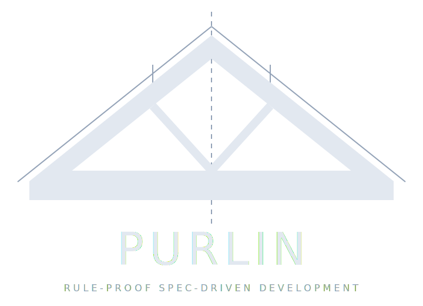
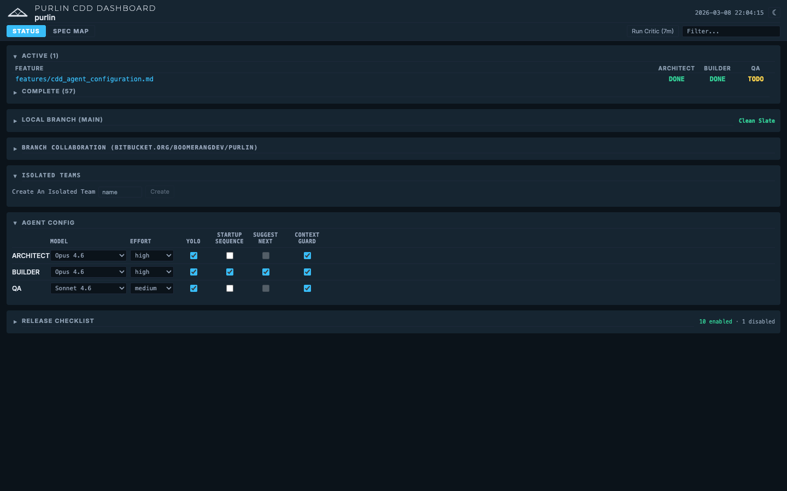
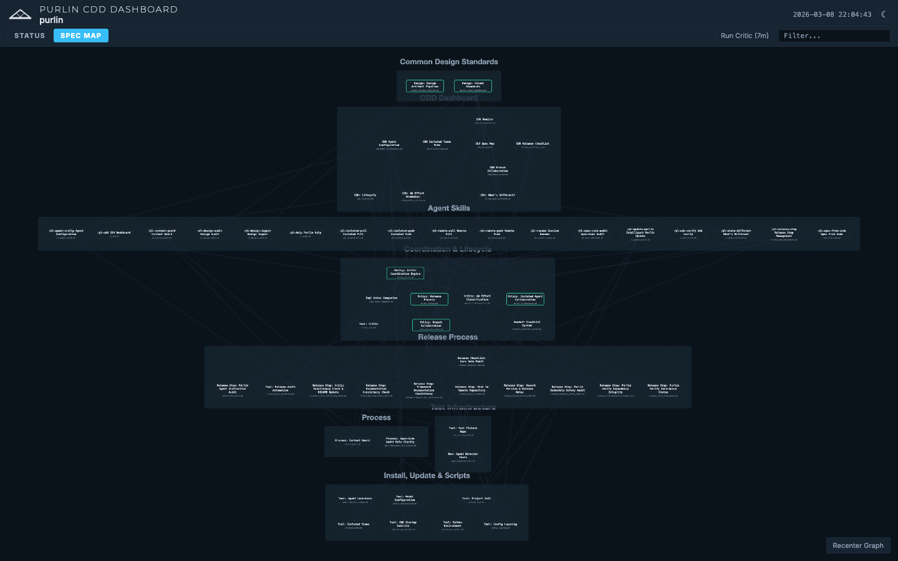

# Purlin



## Current Release: v0.8.0 &mdash; [RELEASE NOTES](RELEASE_NOTES.md)

**Collaborative Design-Driven Agentic Development Framework**

[](https://youtu.be/ob7_RzriVdI)

**Have questions?** Chat with the [Purlin NotebookLM](https://notebooklm.google.com/notebook/bd65eb37-09a1-43fc-862e-21f6fce160bf) -- an AI-powered knowledge base that can answer questions about how Purlin works.

**How to work with the agents:** [English](https://youtu.be/sLk6YqoVW4c) | [Portugues Brasileiro](https://youtu.be/hxARP-1TMk0)

## Overview

Purlin helps AI agents build software together using a shared set of specs. The specs stay in sync with the code -- when code teaches us something new, the specs get updated to match.

The framework is built on four goals:

1. **Agents stay coordinated** -- three specialized roles (Architect, Builder, QA) each know exactly what to do next.
2. **Specs are the source of truth** -- if the code disappeared tomorrow, any agent could rebuild it from the specs alone.
3. **People steer, agents execute** -- you set the direction; agents handle the back-and-forth without meetings.
4. **Code stays correct** -- specs and code are always in sync, so bugs from "stale requirements" don't happen.

## Screenshots

*(From v0.8.0)*

**CDD Dashboard**


**CDD Spec Map**


## Core Concepts

### 1. Specs Drive Everything
The project's state is defined by specification files in `features/`. Those specs evolve continuously with the code:
*   **Anchor nodes** are project-wide rules (architecture, design standards, policies) stored as files. When you change a rule, every feature that depends on it gets flagged for review automatically.
*   **Feature specs** describe requirements in plain-language scenarios, with implementation notes stored in companion files alongside them. They're refined through every build cycle.
*   **Code is disposable; design is durable.** If all source code were deleted, the specs must be sufficient to rebuild. When code reveals new truths, the design is updated first.

### 2. Role Separation
The framework defines three distinct agent roles:
*   **The Architect:** Owns "The What and The Why." Designs specifications and enforces architectural integrity.
*   **The Builder:** Owns "The How." Implements code and tests based on specifications and documents discoveries.
*   **The QA Agent:** Owns "The Verification and The Feedback." Executes manual scenarios, records structured discoveries, and tracks their resolution.

### 3. Keep Notes Where They Belong
Instead of a separate wiki or shared doc, implementation notes live right next to the feature spec they're about. Nothing gets lost in a side channel.

*   **Companion files (`*.impl.md`):** Each feature spec can have a companion file that captures implementation decisions, gotchas, and lessons learned.
*   **Visual specs:** Features with UI components can include a visual checklist with design references -- a separate QA track for checking how things look.

### 4. Your Rules Layer on Top
Purlin's built-in rules live inside the submodule. Your project-specific tweaks go in `.purlin/`. The agents combine both at launch -- you never need to edit framework files.

## The Agents

### File Access Permissions

Each role can read everything but only writes to its own domain. The Purlin submodule is read-only for all roles.

| Domain | Architect | Builder | QA |
|---|---|---|---|
| Feature specs (`features/*.md`) | **Owner** | Read | Read |
| Anchor nodes (`arch_*`, `design_*`, `policy_*`) | **Owner** | Read | Read |
| Companion files (`*.impl.md`) | Create | **Owner** | Read |
| Override files (`.purlin/*.md`) | **Owner** | Own file | Own file |
| Project code and config | Read | **Owner** | Read |
| Tests and traceability | Read | **Owner** | Read |
| QA scripts and discoveries | Read | Read | **Owner** |
| Purlin submodule (`purlin/`) | -- | -- | -- |

### Shared Commands

| Command | Description |
|---|---|
| `/pl-status` | Check CDD status and role-specific action items |
| `/pl-resume [save\|role]` | Save or restore session state across context clears |
| `/pl-help` | Re-display the command list for the current role |
| `/pl-find <topic>` | Discover where a topic belongs in the spec system |
| `/pl-cdd` | Start, stop, or check the CDD Dashboard |
| `/pl-agent-config` | Modify per-agent settings (model, effort, permissions) |
| `/pl-override-edit` | Edit an override file with conflict scanning |
| `/pl-update-purlin` | Update the Purlin submodule with semantic analysis |
| `/pl-remote-push` | Push collaboration branch to remote |
| `/pl-remote-pull` | Pull remote into collaboration branch |
| `/pl-whats-different` | Compare current branch to main (main checkout only) |
| `/pl-fixture` | Manage test fixture repos for reproducible scenario state |

---

### The Architect

Owns the specification system. Designs feature requirements, architectural constraints, and governance rules. Never writes code.

| Command | Description |
|---|---|
| `/pl-spec <topic>` | Add or refine a feature spec |
| `/pl-anchor <topic>` | Create or update an anchor node |
| `/pl-tombstone <name>` | Retire a feature with a tombstone for the Builder |
| `/pl-release-check` | Run the release checklist step by step |
| `/pl-release-run [<step>]` | Run a single release step by name |
| `/pl-release-step` | Create, modify, or delete a local release step |
| `/pl-design-ingest` | Ingest a design artifact into a feature's visual spec |
| `/pl-design-audit` | Audit design artifact integrity and staleness |
| `/pl-spec-code-audit` | Find spec gaps and code-side deviations |
| `/pl-spec-from-code` | Reverse-engineer feature specs from existing code |

---

### The Builder

Translates specifications into working code and tests. Owns the implementation -- never the requirements. Escalates when a spec is impossible to implement as written.

| Command | Description |
|---|---|
| `/pl-build [name]` | Implement pending work from the Critic backlog |
| `/pl-delivery-plan` | Create or review a phased delivery plan |
| `/pl-infeasible <name>` | Escalate a feature as unimplementable |
| `/pl-propose <topic>` | Suggest a spec change to the Architect |
| `/pl-spec-code-audit` | Find spec gaps and code-side deviations |
| `/pl-web-verify` | Run manual scenarios and visual checks via Playwright |

---

### The QA Agent

Verifies features against their specifications through interactive scenario execution. Owns the `## User Testing Discoveries` section of each feature file. Never modifies code or Gherkin requirements.

| Command | Description |
|---|---|
| `/pl-verify <name>` | Run interactive scenario verification for a feature |
| `/pl-discovery <name>` | Record a structured discovery (BUG, DISCOVERY, INTENT_DRIFT, SPEC_DISPUTE) |
| `/pl-complete <name>` | Mark a feature complete after all checks pass |
| `/pl-qa-report` | Summary of open discoveries and completion blockers |
| `/pl-web-verify` | Run manual scenarios and visual checks via Playwright |

---

## The Critic

The Critic scans every feature and tells each agent what to work on next. Think of it as an automated project manager: it checks specs for gaps, verifies tests match requirements, and generates a prioritized to-do list per role. You can see results on the CDD Dashboard or agents can check from the command line.

### Dual-Gate Validation

Every feature gets checked twice:

*   **Before coding:** Is the spec complete? Are all dependencies declared?
*   **After coding:** Do the tests match the spec? Does the code follow project rules?

### Role-Specific Action Items

The Critic outputs a `CRITIC_REPORT.md` at the project root with a role-specific action item section:

| Role | Typical Action Items |
|------|---------------------|
| **Architect** | Fix spec gaps, revise infeasible specs, acknowledge builder decisions, triage untracked files |
| **Builder** | Implement TODO features, fix failing tests, close traceability gaps, resolve open bugs |
| **QA** | Verify TESTING features, re-verify SPEC_UPDATED discoveries, run visual verification passes |

### Test Fixtures

Scenarios that need controlled project state (specific git history, config values, branch topologies) can use a test fixture repo. Each fixture is an immutable git tag representing the preconditions for one scenario -- no complex setup code needed. Use `/pl-fixture` to manage them.

---

## Remote Collaboration

Collaboration uses plain git branches on your existing remote -- no extra services required. The CDD Dashboard provides a UI for creating and joining branches, but underneath it's just `git push`, `git pull`, and `git fetch`.

1. **Create a branch** from the CDD Dashboard (or the command line -- it's a normal git branch).
2. **Join the branch** on another machine. The dashboard fetches, shows sync state, and checks out the branch.
3. **Sync** with `/pl-remote-push` and `/pl-remote-pull` while you work. Pulls use merge to preserve shared history. Pushes always fetch first and block if behind.

The dashboard shows per-branch sync state (SAME, AHEAD, BEHIND, DIVERGED), a contributors table, and last-sync timestamps. All of this reads from locally cached git refs -- no polling the remote during normal use.

---

## Setup & Configuration

### 1. Install Claude Code

[Claude Code](https://docs.anthropic.com/en/docs/claude-code) must be installed before using Purlin. Purlin agents run exclusively inside Claude Code sessions.

### 2. Add Purlin and Initialize

```bash
git init                  # skip if already a git repo
git submodule add https://github.com/rlabarca/purlin purlin
git submodule update --init
./purlin/pl-init.sh
```

This creates `features/`, `.purlin/` (overrides and config), agent launchers (`pl-run-*.sh`), dashboard scripts (`pl-cdd-*.sh`), and slash commands (`.claude/commands/`). The `.purlin/` directory **must be committed** -- it contains project-specific overrides.

```bash
git add -A && git commit -m "init purlin"
```

### 3. Collaborator Setup (Fresh Clone)

When a team member clones your repository, a single command handles everything:

```bash
./pl-init.sh
```

This initializes the submodule if needed, then creates or repairs launchers, commands, and symlinks without touching project-specific config.

### 4. Launch Agents

```bash
./pl-run-architect.sh   # Architect agent
./pl-run-builder.sh     # Builder agent
./pl-run-qa.sh          # QA agent
```

### 5. Run the CDD Dashboard

```bash
./pl-cdd-start.sh                  # uses port from config (default: 8086)
./pl-cdd-start.sh -p 9090         # override port at runtime
```

Open **http://localhost:8086** (or your chosen port). Two views:

*   **Status view:** Feature status by role, release checklist, workspace state, and agent configuration.
*   **Spec Map view:** Interactive dependency graph of all feature files with prerequisite chains.

---

## Upgrading

### From v0.7.5 or earlier

```bash
git submodule update --remote purlin   # fetch latest
./purlin/pl-init.sh                    # refresh launchers and commands
rm -f run_architect.sh run_builder.sh run_qa.sh   # remove old launcher names
git add -A && git commit -m "chore: upgrade purlin to v0.8.0"
```

The init script creates the new `pl-run-*.sh` launchers but does not auto-delete old `run_*.sh` names.

### From v0.8.0+

Use `/pl-update-purlin` from any agent session. It fetches upstream, analyzes changes semantically, preserves your `.purlin/` customizations, and offers merge strategies for conflicts.

---

## Configuration (Optional)

**Startup controls:** Per-agent flags in `.purlin/config.json` (or the Agent Config panel in the dashboard). Set `startup_sequence: false` to skip orientation on launch. Set `recommend_next_actions: false` to skip the prioritized work plan. Both `false` = expert mode.

**Python environment:** Core tools use only the standard library. Optional features (e.g., LLM-based logic drift detection) need: `python3 -m venv .venv && .venv/bin/pip install -r purlin/requirements-optional.txt`

---

## Directory Structure

Created by `pl-init.sh` in your project root:

*   `purlin/` -- The Purlin submodule (framework tooling and base rules). Treat as read-only.
*   `.purlin/` -- Your project-specific overrides and config.
*   `features/` -- Your feature specifications.
*   `pl-run-architect.sh` / `pl-run-builder.sh` / `pl-run-qa.sh` -- Agent launcher scripts.
*   `pl-init.sh` -- Collaborator setup shim. Commit this.
*   `pl-cdd-start.sh` / `pl-cdd-stop.sh` -- CDD dashboard start/stop scripts.
