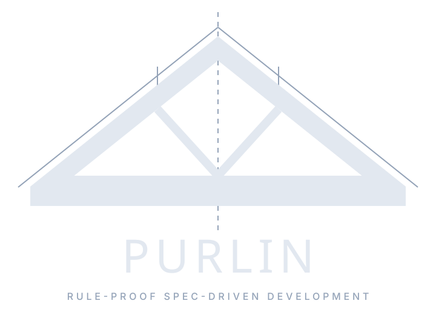

<p align="center">
  
</p>

# Purlin

[Documentation](docs/index.md)

**Rule-Proof Spec-Driven Development**

Purlin is a Claude Code plugin that adds spec-driven development to your workflow. You use Claude exactly as you normally would — Purlin just gives it a structured way to track what your code should do, prove that it does it, and tell you what's missing.

It measures three different things, and keeping them apart is most of the value:

| Question | Answered by | Needs tests? |
|----------|-------------|-------------|
| Is the claim **provable**? | Proof Design | No — a spec is enough |
| Is the claim **proven**? | Proof Integrity | Yes |
| Does it **pass right now**? | `purlin:verify` | Yes, and this alone signs off |

Because Proof Design needs no tests, you can perfect a spec's proofs before a line of code
exists — and get a real number for it.

## Install

**Prerequisites:** git, Python 3.8+, [Claude Code](https://docs.anthropic.com/en/docs/claude-code)

```bash
cd my-project
git init                # required — Purlin needs git
claude plugin marketplace add https://github.com/rlabarca/purlin.git --scope project
```

The `--scope project` flag stores the marketplace in the project so teammates get it automatically when they clone. Omit it for user-level install.

Already added `purlin` using the SSH URL (`git@github.com:...`)? Run `claude plugin marketplace remove purlin` first, then the command above. The name `purlin` stays bound to whichever URL it was added with.

Then start Claude Code and install:

```bash
claude
```

```
/plugin install purlin@purlin
```

Reload plugins so skill autocomplete takes effect:
```
/reload-plugins
```

Then initialize:

```
purlin:init
```

This creates `.purlin/`, `specs/`, detects your test framework, scaffolds the proof plugin, and installs git hooks.

## What a Session Looks Like

You don't need to learn a new workflow. You just use Claude Code as usual. Here's what a typical session looks like:

**If you have an existing codebase**, generate specs from your code:

```
purlin:spec-from-code
```

**Day-to-day work** — use any combination of these, in any order:

```
purlin:spec auth_login     ← define what a feature must do, and how you'd prove it
purlin:audit --design      ← grade the proof descriptions (no tests needed yet)
purlin:build auth_login    ← Claude writes code + tests, iterates until rules pass
purlin:verify              ← sign off — verification receipts committed
```

There is no required order. Write the spec and perfect its proofs first, or build and test in
one pass, or write tests later — `purlin:status` reads what actually exists and tells you the
next step for the state you are in.

**See what needs attention:**

```
purlin:status              ← coverage table with → directives telling you what to do next
purlin:drift               ← what changed since last verification, who needs to act
```

You can tell Claude to handle the items that come back from status and drift — they're actionable directives, not just reports.

**Check proof quality:**

```
purlin:audit               ← both gauges; picks its mode from what exists
purlin:audit --design      ← are the proofs provable? specs only, cheap, no tests needed
purlin:audit --integrity   ← do the tests deliver? needs tests, and costs LLM calls
```

Design grading is cheap and worth running whenever you edit a spec. Integrity grading is the
expensive one. Note the order matters: most Integrity checks compare a test against its proof
description, so a vague description leaves them nothing to catch — a high Integrity score over
vague proofs means the spec is unfalsifiable, not that the tests are good.

**Visual dashboard** — `purlin:status` prints a dashboard link at the bottom. Open it in your browser for a visual view of coverage and both quality gauges, per feature and in aggregate. You don't need to use it — the CLI table carries the same five columns and the same numbers — but it's there if you want it.

### Upgrading from an older version of Purlin

If you have a pre-0.9.0 Purlin installation, keep your `features/` directory — `spec-from-code` migrates your old specs to the new format. Remove only the non-spec artifacts:

```bash
rm -rf .purlin/ pl-* *.sh
```

Then initialize and migrate:

```
purlin:init
purlin:spec-from-code
```

Your old scenarios and rules are preserved as input for the new-format specs. See the [Installation Guide](docs/installation-guide.md#upgrading-from-an-older-version-of-purlin) for details.

## How It Works

1. **Specs** define what your code must do. Each spec has rules (testable constraints) and proofs (observable assertions).
2. **Proof descriptions are graded** on their own merits — `purlin:audit` scores each as
   PROVABLE, LOOSE, UNPROVABLE or STRUCTURAL without reading any test code. A vague proof caps
   what the eventual test can demonstrate, so this is worth fixing before building.
3. **Proof markers** in your tests link test cases to spec rules. Test runners emit proof files automatically.
4. **`sync_status`** reads specs and proof files, diffs them, and tells you exactly what to do next.

```
auth_login: 2/3 rules proved
  RULE-1: PASS (PROOF-1 in tests/test_login.py)
  RULE-2: PASS (PROOF-2 in tests/test_login.py)
  RULE-3: NO PROOF
  → Fix: write a test with @pytest.mark.proof("auth_login", "PROOF-3", "RULE-3")
  → Run: purlin:test
```

## Skills

| Skill | Purpose |
|-------|---------|
| `purlin:spec` | Create/edit specs |
| `purlin:build` | Implement from spec rules |
| `purlin:verify` | Run all tests, issue receipts |
| `purlin:test` | Run tests, emit proof files |
| `purlin:audit` | Evaluate proof quality — Proof Design and Proof Integrity |
| `purlin:status` | Show coverage + directives |
| `purlin:drift` | Drift detection and change summary |
| `purlin:init` | Initialize project |
| `purlin:anchor` | Sync external constraints |
| `purlin:find` | Search specs |
| `purlin:rename` | Rename feature across artifacts |
| `purlin:spec-from-code` | Generate specs from code |

Skills are **optional** — you can write specs, code, and tests without invoking any skill. Skills provide scaffolding and workflow automation.

## Stakeholder Tools

The `tools/` directory contains skills for non-engineer stakeholders who interact with Purlin projects through Claude Desktop. These don't require a development environment — just a repo URL.

| Tool | Audience | What it does |
|------|----------|-------------|
| `tools/QA/purlin-qa-report` | QA | Fetches project digest, produces triaged HTML report of failures, drift, both quality gauges, manual tests due, and sign-off readiness |
| `tools/PM/purlin-anchor-userstories` | Product | Creates and maintains user story anchor files that drive spec-driven development |

Install these as Claude Desktop skills (drag the `.skill` file or paste the `.md` contents into project instructions). They clone the repo, read the project digest, and produce visual reports — no dev tools needed.

## Hard Gate (only 1)

1. **Proof coverage** — `purlin:verify` won't issue a receipt unless every rule has a passing proof.

Everything else is optional guidance. In particular **neither quality gauge is a gate**: a low
Proof Design or Proof Integrity score never blocks a commit, a push, or a receipt. They tell
you how good the evidence is; the gate only asks whether it exists.

## Architecture

```
.purlin/
  config.json             # Project settings
  report-data.js          # Project digest (auto-generated on commit)
  plugins/                # Proof plugin (scaffolded by init)
specs/
  <category>/
    <feature>.md          # Feature specs (3-section format)
    <feature>.proofs-*.json  # Proof files (emitted by test runners)
    <feature>.receipt.json   # Verification receipts
  _anchors/
    <name>.md             # Cross-cutting constraints (optionally synced from external sources)
tools/
  QA/                     # QA report skill for Claude Desktop
  PM/                     # Product anchor skill for Claude Desktop
```

**MCP Server:** `scripts/mcp/purlin_server.py` — provides `sync_status`, `drift`, and `purlin_config` tools.
**Proof Plugins:** `scripts/proof/` — proof collectors for pytest (Python), Jest and Vitest (JS/TS), xUnit (.NET — C#, F#, VB.NET), C, PHP, SQL, and shell. See [references/supported_frameworks.md](references/supported_frameworks.md).
**Git Hooks:** `scripts/hooks/` — pre-push (coverage check) and pre-commit (digest auto-generation).
