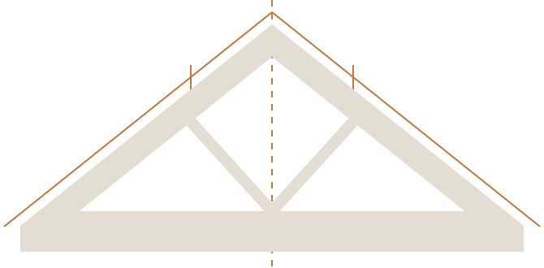

<p align="center">
  
</p>

# Purlin

For anyone deciding whether to put Purlin in a project, and for the engineer who sets it up.

Purlin is a Claude Code plugin for spec-driven development. A **rule** is one line in a spec
saying what the software must do. A **proof** says how that claim is observed. A **test** is the
executable form of a proof, tagged with the rule it settles. A **record** is the machine's
evidence of one `purlin:audit` run, written into the repository and committed. A **signature**
is a named person's attestation that a rule, its proof and its test belong together.

A rule answers up to three questions, each one an **evidence level**, each answered by a
**cell**: **passed**, every tagged test for the rule passed; **strong**, the tests are worth
trusting; **signed**, a person signed the rule, proof and test hashes. Three commands carry the
three levels: `purlin:test`, `purlin:audit` and `purlin:sign`.

Purlin cannot prove your code is correct. It gives you a paper trail: every claim, how it is
observed, what ran, on which commit, and who said so.

## Three ways to work

One setting, the **gate**, says what CI must see before a change can merge. `purlin:init` asks
that one question and nothing else.

| Gate | Who it fits | What CI requires before merge |
|------|-------------|-------------------------------|
| `passed` | One developer | Every rule's passed cell is met: a tagged test for every proof, passing. A pass from any source counts |
| `strong` | A team of PM, designers, engineers and QA | Every rule's strong cell is met: a CI pass at this commit, the test strength at or above `min_strength`, no finding and no hold. Only a record CI wrote counts |
| `signed` | The same team under GxP | Every rule's signed cell is met: a current signature on every rule at or above `sign_at`, in a signed commit by someone on the signer list |

Raise or lower the gate later with `purlin:init --gate <level>`. Raising adds what is missing;
lowering deletes nothing. The one definition lives in
[references/hard_gates.md](references/hard_gates.md).

## Install

Purlin needs git, Python 3.9 or later, and
[Claude Code](https://docs.anthropic.com/en/docs/claude-code).

Install it from the marketplace, which is how a project uses it:

```bash
cd my-project
git init                # Purlin needs a git repository
claude plugin marketplace add https://github.com/rlabarca/purlin.git --scope project
```

Then, inside Claude Code, `/plugin install purlin@purlin` and `/reload-plugins`. The plugin
lands under `~/.claude/plugins/cache/purlin/purlin/<version>/`. `--scope project` records the
marketplace entry in the project's `.claude/settings.json`, so a teammate who clones the
repository resolves the same source; each teammate still runs the install and the reload in
their own checkout.

To work on Purlin itself, or to try a checkout before installing it, load it from disk:

```bash
claude --plugin-dir /path/to/purlin
```

A consumer project carries no copy of Purlin, so CI clones Purlin at a pinned tag and runs the
audit from that checkout.

## Your first session

```
purlin:init
```

Answer the one question with `passed`. Init detects the language and the test framework from the
tree, reads the git host from the remote URL, writes `.purlin/` and `specs/`, installs the proof
plugin, and prints every file it wrote.

```
purlin:spec "Users sign in with email and password. After five failed attempts the
account is locked for fifteen minutes."
```

That sentence becomes three rules, each with a proof, because each of the three can fail on its
own. The skill ends with `Spec created: login. Build it now?`

```
purlin:build login
```

Build writes the code and one tagged test per proof, runs them, commits the changeset, and
prints every rule's cells.

```
purlin:audit
```

The audit runs the tests, breaks the code on purpose to measure how much the tests catch, writes
`.purlin/records/login/<timestamp>-<commit7>-developer.json`, commits it, and prints the test
strength. Then push.

Every command ends by naming the next step, computed from the cells it found.

## Commands

| Command | Purpose |
|---------|---------|
| `purlin:spec <name>` | Scaffold or edit a feature spec in the 2-section format |
| `purlin:build [name]` | Inject a spec's rules into context, then implement them |
| `purlin:test [feature]` | Run the tagged tests and print each rule's passed cell |
| `purlin:audit [feature]` | Run the tests and the breaks, then write the record |
| `purlin:sign [feature] [RULE-N]` | Walk the review list, or sign a rule, a feature or a batch as a signed commit |
| `purlin:drift [role]` | Report what changed since the last record, by role |
| `purlin:init` | Initialize a project for Purlin |
| `purlin:anchor <cmd>` | Create and manage anchor specs, local or pinned from elsewhere |
| `purlin:status` | Show every rule's cells and what blocks the gate |
| `purlin:find [name]` | Find a spec by name and show its rules' cells |
| `purlin:rename <old> <new>` | Rename a feature across specs, tests, signatures and records |
| `purlin:spec-from-code [dir]` | Reverse-engineer 2-section specs from existing code |

Plain language reaches every one of them: "run the tests" reaches `purlin:test`, and "what needs
a person" reaches `purlin:sign`. The syntax above is canonical, never required.

## Documentation

Start at [docs/index.md](docs/index.md), which maps every guide by who it is for.
[docs/getting-started.md](docs/getting-started.md) walks the first session in full.
