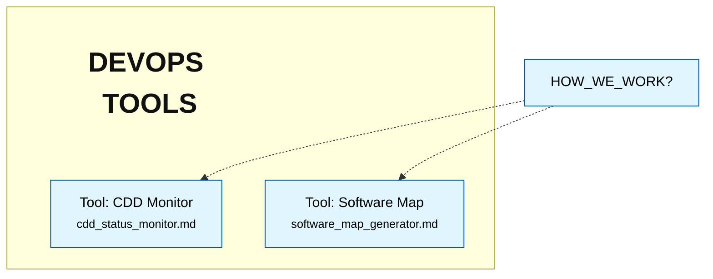

# Agentic DevOps Core

A project-agnostic, spec-driven development framework for AI-collaborative software engineering.

## Overview

Agentic DevOps Core is a workflow engine designed to maximize the effectiveness of LLM-based agents (Architects and Builders) in the software development lifecycle. It operates on the core principle that **"Code is Disposable, but Specifications are Eternal."**

By colocating technical implementation knowledge with behavioral specifications (Gherkin), the framework ensures that system context is never lost and that codebases can be reliably rebuilt or refactored by AI agents with minimal human intervention.

## Core Concepts

### 1. Spec-Driven Development
The project's state is defined 100% by specification files:
*   **Architectural Policies (`arch_*.md`):** Defining the "Constitution" and constraints of the system.
*   **Living Specifications (`*.md`):** Behavioral requirements (Gherkin) coupled with Implementation Notes (Tribal Knowledge).

### 2. Role Separation
The framework defines two distinct agent roles:
*   **The Architect:** Owns "The What and The Why." Designs specifications and enforces architectural integrity.
*   **The Builder:** Owns "The How." Implements code and tests based on specifications and documents discoveries.

### 3. Knowledge Colocation
Instead of separate documentation or global logs, implementation discoveries, hardware constraints, and design decisions are stored directly within the feature specifications they pertain to.

## Setup & Configuration

1.  **Initialize the Environment:**
    Copy the sample configuration folder to your project root:
    ```bash
    cp -r agentic_devops.sample .agentic_devops
    ```

2.  **Agent Context:**
    Point your AI agents (Architect and Builder) to the instructions located in `.agentic_devops/`:
    *   **Architect:** `.agentic_devops/ARCHITECT_INSTRUCTIONS.md`
    *   **Builder:** `.agentic_devops/BUILDER_INSTRUCTIONS.md`

3.  **Customize Config:**
    Edit `.agentic_devops/config.json` to set your preferred ports or enable Meta-Mode (`is_meta_agentic_dev: true`) if developing the framework itself.

## Directory Structure

*   `features/`: Meta-specifications for the Agentic Workflow itself.
*   `tools/`: Python-based DevOps tools that support the workflow (CDD Monitor, Software Map, etc.).
*   `ARCHITECT_INSTRUCTIONS.md`: The "Constitution" for the Architect role.
*   `BUILDER_INSTRUCTIONS.md`: The "Protocol" for the Builder role.
*   `HOW_WE_WORK.md`: The high-level philosophy and lifecycle.

## Feature Map
<!-- MERMAID_START -->

<!-- MERMAID_END -->

## Agentic Evolution

| Version | Milestone | Workflow Changes |
| :--- | :--- | :--- |
| v1.0.1 | Port Isolation & Spec Refinement | Configurable ports for tool isolation; Meta-mode support; Refined instruction specs. |
| v1.0.0 | Framework Bootstrap | Isolated workflow from project context; Generalized role definitions. |

## License

This project is licensed under the MIT License.
