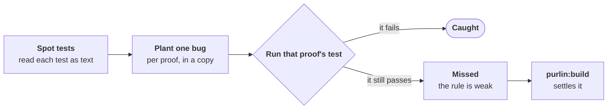

# The audit: would your tests catch a bug?

A passing test is not proof that it checks anything. The audit tries to make each test fail.

Run `purlin:audit` whenever you like. Nothing waits on it.

## How it works



**1. Heuristic spot tests.** Purlin flags tests that check nothing, check the code against
itself, or never check the result the proof expects. It reads the tests as text. No AI is asked
and no test runs. The seven checks are in
[the heuristic spot tests reference](../references/review_criteria.md#heuristic-spot-tests).

**2. Plant one bug.** For each proof, an AI writes the one small bug its test is most likely
to miss, such as a sample age off by one hour. The bug must break the case the proof names. It
goes into a throwaway copy of your code.

**3. Run that proof's test.** Each rule then reads one word:

| The rule reads | When |
|---|---|
| `strong` | the spot tests found nothing, and a test failed on its planted bug |
| `weak` | a spot test flagged a test, or a test still passes with the bug in place |
| `spot-checked` | the spot tests found nothing, and no bug was planted and caught; the audit says why |

A weak rule shows the bug its test missed and the case the AI says it breaks:

```
PROOF-1: the test still passes when src/age.py:12 reads "return minutes + 60"
PROOF-1: the AI says this breaks: a sample collected 90 minutes ago; the proof says 90; the changed code gives 150
```

Most surviving bugs show a case the test does not check. Some rest on a strict reading of the
proof's words. A test run tells them apart.

Every audit ends on the share of rules it found strong, such as
`The audit found 42 of 50 rules strong (84%): 42 strong, 8 weak.` You can give the agent a
target:

> Build and audit until 80% of rules are strong.

## What to do with a finding

- Read each `weak` finding. It names the missed bug and the case the AI says it breaks.
- Run `purlin:build`. It writes the check the proof names and runs it against that bug.
- **The check fails**: the finding was right. The test is now stronger and the rule reads
  `strong`.
- **The check passes**: the bug did not break what the proof says. The audit plants one more.
  If that one is wrong too, the rule reads `spot-checked` and nothing more is asked.
- **The proof is too loose to write a check from**: `purlin:build` stops and proposes a
  sharper proof.
- Never change a sound test or narrow a rule to clear a finding.

A spot test's finding is settled too. `purlin:build` fixes the test, the spot tests read it
again, and the finding is gone.

Auditing again does not clear a finding. While the test is as it was, `purlin:audit` plants
the same bug again before any new one.

A rule with several proofs reads `weak` while any finding is left. With none left, it reads
`strong` where one of its proofs has a caught bug.
[Settling a finding](../references/review_criteria.md#settling-a-finding) gives each step.

## For an AI proof, the audit plants a wrong output

The test of an AI proof reads an output. So the audit changes a copy of an output a run kept,
until what the proof says no longer holds, and hands the test that copy. No model is asked
for an output again.

```
PROOF-4: the test still passes when reply.md:12 reads "The report holds two findings."
PROOF-4: the AI says this breaks: the sample report; the proof says the reply names three findings; the changed output names two
```

| The proof | A wrong output caught shows | It does not show |
|---|---|---|
| Exact, `@ai` | the test noticed one output going wrong | that the prompt or the skill is a good one |
| Graded, `@ai` with `@graded` | the grader rejected one wrong output | that the grader is right every time |

- **No bug is planted in the prompt or the skill itself.** The audit tests the check, and for
  a graded proof the grader.
- **What the AI was given is never changed.** The change is in the reply or in a file the
  session wrote.
- **A grader that accepts the wrong output leaves the test passing.** The rule reads `weak`.
- **The kept output must be on this machine.** A fresh clone holds the results and not the
  folders. Nothing is planted there, and the audit says why:
  `No wrong output was planted: this machine keeps no passing output of PROOF-1. Run purlin:test --clean to take one here.`
  A clean run starts every test and every model again, so it keeps an output here.
- **A seventh spot test reads the tag.** It flags the test of a graded proof that never asks
  for the grade.

[testing-ai.md](testing-ai.md) walks an AI proof, [graded-by-ai.md](graded-by-ai.md) is the
page on a grade, and [A wrong output](../references/review_criteria.md#a-wrong-output) gives
each step.

## What you can count on

- **Your code is never changed.** Every bug is planted in a copy, and the copy is thrown away.
- **Nothing waits on it.** A weak rule is listed as `to strengthen`. The tests still read
  `met`, and a sign-off goes ahead.
- **The test run decides.** The AI writes the bug and says which case it breaks. Whether the
  bug was caught is the test's own pass or fail.
- **The AI is given no tools.** It is started with no tools, no plugins and none of your
  settings, in an empty folder. It can read and change nothing.
- **A result goes out of date.** When a rule, its proof, its test or the code it covers
  changes, the rule reads `out of date` until the audit reads it again.
- **Only what changed gets a new bug.** A proof whose test and code are as the audit last read
  them keeps its result.
- **Nothing to install.** Any test Purlin can run, it can audit.
- **What it found is kept.** Each finding and each planted bug goes into the evidence. The
  signer can read the findings at sign-off.

## What it does not do

- **It does not prove your tests catch every bug.** It tests what each proof says, one bug at
  a time.
- **It does not check the AI's claim** about which case a bug breaks. `purlin:build` puts the
  claim to a test run.
- **It does not give the same bug every time.** Two audits of the same code may plant
  different bugs, so a result is kept until something changes.
- **It reads only rules whose tests pass.** A failing test is fixed first.
- **It plants no bug for an anchor's rule**, a `@manual` proof or a proof tagged for another
  system. An anchor's rule reads `spot-checked`, never `strong`.
- **The share of strong rules is a guide, not a score.** A high share with the rest read is
  done.

## On Purlin's own tests

Purlin audited every one of its own specs: 577 rules, of which 569 can read `strong`.

- **The first read found 115 rules weak, about 1 in 5.** 137 planted bugs got past a test, and
  the spot tests flagged 2 more tests.
- **136 of 140 findings held.** Each test was given the value its proof names, the same bug
  was planted again, and the test failed. 3 of the 140 came from a later read, aimed past
  tests already made stronger.
- **4 tests already checked what their proof names.** Each was left as it was, with that
  judgment recorded. A second bug got past each, so those proofs hold no caught bug.
- **5 proofs were sharpened** to say exactly what their tests check. A new bug then got past 3
  of them, and those tests were strengthened again.
- **No strengthened test failed on the code as it stood.** Every finding was a gap in a test.
  None was a defect in the code.
- **It ended at `566 of 569 rules strong (99%)`.** The other 3 read `spot-checked`: one proof
  needs Windows, one has no change that would break it, and one is among the 4 above.

The tests that hold pages and printed lines were the weakest: a test that looks for a word
passes when the sentence says the opposite.

Each of these tests was strengthened after its bug was seen. A new bug aimed past a stronger
test can find a new gap, so auditing again does not end at zero in one pass.

## Why this works

AI-written tests often check what the code does, not what was asked
([Konstantinou, Degiovanni and Papadakis, 2024](https://arxiv.org/pdf/2410.21136)). A test
suite that catches more planted bugs tends to catch more real ones
([Just et al., FSE 2014](https://homes.cs.washington.edu/~mernst/pubs/mutation-effectiveness-fse2014.pdf)).
In one study a bug aimed past the tests found a real gap 87.7% of the time, against 12.2% for
a bug written without seeing them ([Kiele et al., ESEM 2026](https://arxiv.org/pdf/2609.35841)).
A model can give the same verdict every time and still be wrong
([Norman, Rivera and Hughes, 2026](https://arxiv.org/pdf/2606.19544)), so the AI writes the
bug and the test run decides.
[The research behind the audit](audit-research.md) has every source, the quotes, a trial on a
sample project and what Purlin does not claim.
