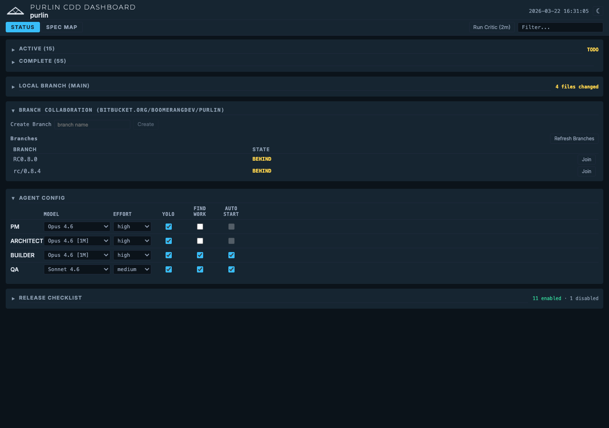
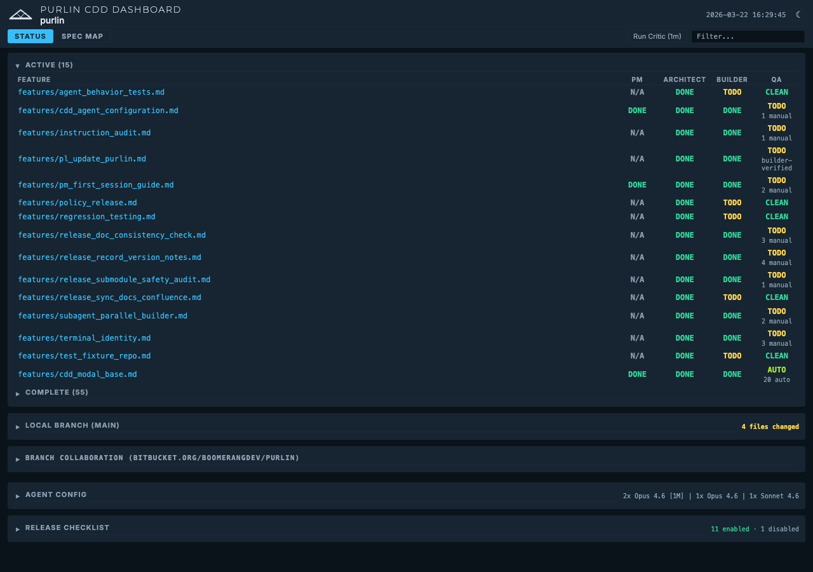

# Branch Collaboration Guide

## Overview

Purlin uses named git branches as integration points for multi-machine collaboration. When a PM and an engineer need to work together on the same project from different machines, they share a branch: one person creates it, the other joins it, and both push and pull changes through a shared remote repository.

Each machine tracks one active collaboration branch at a time, stored in `.purlin/runtime/active_branch` (this file is gitignored, so it is always local to the machine). The [CDD Dashboard](status-grid-guide.md) provides a visual interface for creating branches, joining branches, checking sync status, and understanding what changed since your last pull.

This guide walks through the full workflow -- from first-time remote setup through daily collaboration -- so that a PM and an engineer can stay in sync without stepping on each other's work.

---

## Setting Up Your Remote

Before any branch collaboration can happen, your project needs a remote repository that both machines can reach.

If your project does not yet have a remote, run `/pl-remote-add`. Purlin scans for hosting hints (SSH keys in `~/.ssh/config`, credential helpers, hosting CLIs) and prompts you for a git remote URL. Any git-compatible host works -- GitHub, GitLab, Bitbucket, self-hosted, or even a local bare repo.

Behind the scenes, this executes `git remote add <name> <url>` and verifies connectivity with `git ls-remote`. The default remote name is `origin`, configured in `.purlin/config.json` under `branch_collab.remote`.

**You only need to do this once per project.** After the remote is configured, both machines use it automatically.

---

## Creating a Collaboration Branch

The easiest way to create a branch is through the CDD Dashboard.

1. Open the CDD Dashboard.
2. In the Branch Collaboration section, type your branch name into the "Create Branch" input field (for example, `feature-sprint-q2`).
3. Click **Create**.

When you create a branch, Purlin:

- Creates the branch from the current HEAD.
- Records the base branch for later reference.
- Sets `.purlin/runtime/active_branch` to the new branch name.
- Checks out the branch locally.
- Pushes the branch to the remote.

After creation, the branch appears in the dashboard's branch list with a sync state indicator.

---

## Joining an Existing Branch

When your collaborator has already created a branch, you join it rather than creating a new one.

1. Open the CDD Dashboard.
2. Find the branch in the branch list.
3. Click the **Join** button next to the branch name.

When you join a branch, Purlin:

1. Performs a best-effort push of your current branch (so you do not lose uncommitted collaboration work on a previous branch).
2. Fetches the remote branch.
3. Computes the sync state between your local copy and the remote.
4. Checks out the branch.

If this is the first time you are joining the branch and the sync state is anything other than SAME, Purlin displays a safety confirmation before proceeding. This prevents accidental overwrites when joining a branch that has diverged from what you expect.

---

## The Push/Pull Workflow

Daily collaboration follows a simple cycle: work locally, push your changes, pull your collaborator's changes.

### Pushing Changes

Run `/pl-remote-push` when you have local commits to share.

The command:

1. Reads your active collaboration branch from `.purlin/runtime/active_branch`.
2. Verifies you are on the correct branch.
3. Checks that your working tree is clean (except for `.purlin/` files, which are local).
4. Fetches from the remote and computes the sync state.
5. If you are **AHEAD** (you have commits the remote does not), it pushes.
6. If you are **BEHIND** (the remote has commits you do not), it blocks and tells you to run `/pl-remote-pull` first.
7. If the branches have **DIVERGED**, it blocks. You must pull and reconcile before pushing.

Purlin never runs `git push --force`. This is a hard rule -- force-pushing destroys shared history and is never permitted on collaboration branches.

### Pulling Changes

Run `/pl-remote-pull` when the dashboard shows your collaborator has pushed new commits.

The command:

1. Fetches from the remote and computes the sync state.
2. If you are **BEHIND**, it performs `git merge --ff-only` (a clean fast-forward).
3. If the branches have **DIVERGED**, it performs a full `git merge` with conflict handling.
4. After a successful merge, it auto-generates a "What's Different?" digest so you can see exactly what changed.

You can also run `/pl-remote-pull` with an explicit branch name if you are not currently on the collaboration branch.

---

## Understanding Sync States

The CDD Dashboard displays a colored badge next to each branch indicating its sync state. These states tell you at a glance whether you need to push, pull, or resolve a divergence.

| State | Color | Meaning | Action Required |
|-------|-------|---------|-----------------|
| **EMPTY** | -- | New branch with no unique commits yet | None -- start working |
| **SAME** | Green | Local and remote are identical | None -- you are in sync |
| **AHEAD** | Yellow | You have N commits the remote does not | Run `/pl-remote-push` |
| **BEHIND** | Yellow | The remote has N commits you do not | Run `/pl-remote-pull` |
| **DIVERGED** | Orange | Both sides have unique commits | Run `/pl-remote-pull` to merge, then `/pl-remote-push` |

The dashboard also shows an annotation with the exact number of commits ahead or behind, and a contributors panel listing who has been committing to the branch.

An auto-fetch daemon runs in the background every 300 seconds, so sync states stay reasonably current without manual intervention.

---

## The "What's Different?" Digest

After every successful pull, Purlin auto-generates a digest comparing the changes that just arrived. The digest breaks down changes into categories:

- **Spec changes** -- New or modified feature specifications.
- **Code changes** -- Application code additions or modifications.
- **Test changes** -- New or updated tests.
- **Purlin changes** -- Updates to Purlin configuration or workflow files.

This digest helps you quickly understand what your collaborator has been working on without reading every commit message or diff.

You can also access the digest at any time through the **"What's Different?"** button in the CDD Dashboard. For deeper analysis, use the optional **"Summarize Impact"** feature, which provides a higher-level summary of how the incoming changes affect the project.

---

## A Day in the Life

Here is a realistic walkthrough of a PM (Alex) and an engineer (Jordan) collaborating over a single day.

### Morning: Branch Creation and Setup

**Jordan (Engineer)** starts the day by opening the CDD Dashboard. The team is kicking off a new sprint, so Jordan types `feature-sprint-q2` into the Create Branch input and clicks **Create**. The branch is created from HEAD, checked out, and pushed to the remote.

**Alex (PM)** opens their CDD Dashboard on a different machine. The branch list now shows `feature-sprint-q2` with a **SAME** badge (both machines are at the same commit). Alex clicks **Join** next to the branch. Purlin fetches the remote, confirms the sync state, and checks out the branch. Alex is now on the same branch as Jordan.

### Midday: Engineer Pushes Code

**Jordan** writes a new API module and its unit tests. After committing locally, the CDD Dashboard shows the sync state as **AHEAD -- 2 commits to push**. Jordan runs `/pl-remote-push`. Purlin fetches, confirms Jordan is ahead, and pushes the 2 commits.

**Alex** checks the dashboard and sees **BEHIND -- 2 commits to pull**. Alex runs `/pl-remote-pull`. Purlin performs a fast-forward merge. The "What's Different?" digest appears automatically, showing:

- **Code changes:** New API module (`src/api/endpoints.py`), updated route config.
- **Test changes:** New test file (`tests/test_endpoints.py`).

Alex now has a clear picture of what Jordan built, without needing to ask.

### Afternoon: PM Pushes Specs

**Alex** writes a revised feature specification and updates the project brief based on stakeholder feedback. After committing, the dashboard shows **AHEAD -- 1 commit to push**. Alex runs `/pl-remote-push`.

**Jordan** checks the dashboard: **BEHIND -- 1 commit to pull**. Jordan runs `/pl-remote-pull`. The digest shows:

- **Spec changes:** Updated feature spec (`features/user-auth.md`), revised acceptance criteria.

Jordan reads the digest and adjusts their implementation plan for the afternoon accordingly.

### End of Day: Clean Sync

Both check their dashboards. The sync state shows **SAME** in green. The branch is fully synchronized. Tomorrow they pick up where they left off -- same branch, same workflow.

---

## Handling Conflicts

Conflicts happen when both collaborators commit to the same branch without syncing in between. The dashboard shows this as the **DIVERGED** state (orange badge).

### Resolving a Divergence

1. **Recognize the state.** The dashboard shows DIVERGED, with annotations like "3 commits ahead, 2 commits behind."

2. **Pull first.** Run `/pl-remote-pull`. Since the branches have diverged, Purlin performs a `git merge` (not a fast-forward). If the changes touch different files, the merge completes automatically.

3. **Handle merge conflicts.** If both sides edited the same file in the same region, git marks the conflict. Open the affected files, resolve the conflicts manually, then stage and commit the merge.

4. **Push the resolution.** After the merge commit, run `/pl-remote-push`. Both sides are now back in sync.

### Avoiding Conflicts

The simplest way to avoid conflicts is to push and pull frequently. If both collaborators sync at least once before starting new work, divergence is rare. The 300-second auto-fetch in the dashboard helps by keeping the sync state visible even when you forget to check manually.

### Rules for Shared Branches

- **Never rebase a collaboration branch.** Rebasing rewrites history that your collaborator already has. Use merge instead.
- **Never force-push.** Purlin enforces this -- `/pl-remote-push` will never run `git push --force`.
- **Always fetch before pushing.** Purlin handles this automatically, but it is worth understanding why: fetching first lets Purlin detect whether you need to pull before your push can succeed.

---

## Screenshot References

The following screenshots illustrate the CDD Dashboard's branch collaboration features:

**CDD Dashboard -- Branch Collaboration Section**

This view shows the expanded Branch Collaboration section, including the remote URL, the branch list with sync state badges, the Create Branch input, and Join buttons for each branch.

**CDD Dashboard -- Full Status View**

The full dashboard view, showing how branch collaboration fits alongside other CDD status panels.
