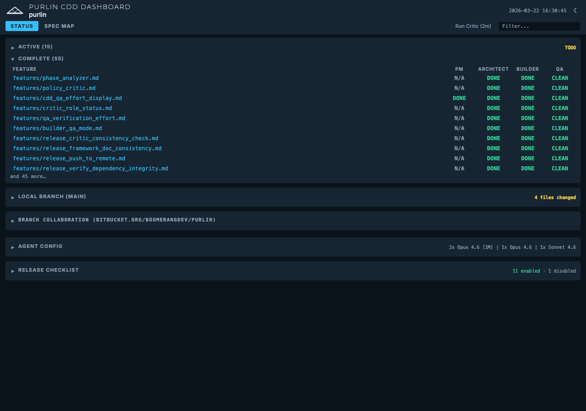

# CDD Dashboard Guide

## Overview

The CDD (Continuous Design-Driven) Dashboard is a web interface that shows
the current state of your project at a glance. It displays every feature,
its lifecycle state, and the status of each role (Architect, Builder, QA, PM)
-- all refreshing automatically as agents commit changes.

The dashboard is for humans. Agents use the CLI (`tools/cdd/status.sh`) to
read project state. The dashboard reads the same data and presents it
visually.

---

## Starting the Dashboard

From any agent session:

```
/pl-cdd
```

Or from a terminal:

```bash
./pl-cdd-start.sh
```

The dashboard prints its URL on startup:

```
CDD Dashboard running at http://localhost:52841
```

The port is auto-selected by the OS. The server runs in the background and
persists after your terminal session exits.

### Stop and Restart

```
/pl-cdd stop       # Stop the server
/pl-cdd restart    # Stop then start on a new port
```

Or from a terminal:

```bash
./pl-cdd-stop.sh
```

### Prerequisites

- Python 3 (the server is a Python HTTP server)
- Git (for branch and status detection)
- No Node.js required

---

## Dashboard Sections

The dashboard has two main views, switchable via tabs in the header.

### Status View (Default)


The Status View contains several sections stacked vertically:

**Active Features** -- Features where at least one role still has work to
do. Sorted by urgency: red statuses (FAIL, INFEASIBLE) first, then yellow
(TODO, DISPUTED), then alphabetical. Each row shows the feature name and
four role status badges. When a delivery plan is active, the section heading
shows phase progress inline (e.g., `ACTIVE (5) [4/10 DONE | 2 RUNNING]`).

**Complete Features** -- Features where all roles are in terminal states
(DONE, CLEAN, N/A). Capped at the 10 most recently completed. These are
ready for release.

**Workspace** -- Git status: current branch, whether the working tree is
clean, and untracked file count.

**[Branch Collaboration](branch-collaboration-guide.md)** -- For multi-machine workflows. Shows collaboration
branches with sync state badges (SAME, AHEAD, BEHIND, DIVERGED), a Create
Branch input, and Join buttons.



**Release Checklist** -- Ordered list of release steps. Each step shows its
name, source (GLOBAL or LOCAL), and enabled/disabled state. Steps can be
reordered via drag-and-drop and toggled on or off.

**Agent Config** -- Per-agent settings: model, effort level, YOLO mode,
Find Work, and Auto Start. Changes save automatically and take effect on
the next agent session launch.

For detailed coverage of each section, see:
- [Reading the CDD Status Grid](status-grid-guide.md)
- [Branch Collaboration Guide](branch-collaboration-guide.md)
- [Agent Configuration Guide](agent-configuration-guide.md)

### Spec Map View


The [Spec Map](spec-map-guide.md) is an interactive [dependency graph](spec-map-guide.md). Every feature appears as a
node, grouped by category, with directed arrows showing prerequisite
relationships. [Anchor nodes](critic-and-cdd-guide.md) (arch\_, design\_, policy\_) are highlighted with
green borders.

- **Zoom and pan** with scroll wheel and drag.
- **Hover** a node to highlight its direct dependencies.
- **Click** a node to open the Feature Detail Modal.
- **Double-click** a category to zoom into it.
- **Search** in the header to dim non-matching nodes.

For the full Spec Map reference, see [Spec Map Guide](spec-map-guide.md).

---

## Feature Detail Modal

Click any feature name (in the [status grid](status-grid-guide.md) or the spec map) to open a
modal showing the full feature specification rendered as formatted markdown.

The modal includes:

- **Metadata tags** (Category, Label, Prerequisites) displayed above the
  content.
- **Tabs** for Specification and Implementation Notes (when a companion
  file exists).
- **Font size slider** to adjust readability.
- **Close** via the X button, Escape key, or clicking outside the modal.

---

## Search

The search box in the header filters both views in real time.

- **Status View**: Hides non-matching feature rows entirely.
- **Spec Map**: Dims non-matching nodes to 15% opacity while keeping
  matching nodes fully visible. This preserves spatial context so you can
  still see where a feature sits relative to the rest of the graph.

Search is case-insensitive substring matching against feature names.

---

## Auto-Refresh

The dashboard polls for changes every 5 seconds. When feature files are
modified (by agents committing changes), the [status grid](status-grid-guide.md) and spec map update
automatically.

On the Spec Map, your zoom and pan position is preserved across refreshes.
After 5 minutes of inactivity, manual overrides reset and the graph
re-fits to the viewport.

---

## Themes

The dashboard supports dark (Blueprint) and light (Architect) themes.
Toggle via the button in the header. Your theme choice persists across
refreshes.

---

## Tips

- **Keep the dashboard open** while running agents. It updates automatically
  as they commit, giving you a live view of project progress.
- **Use search** to find features quickly in large projects.
- **Check the Spec Map** to understand how features depend on each other
  before starting a new spec or refactoring an [anchor node](critic-and-cdd-guide.md).
- **The [status grid](status-grid-guide.md) tells you who needs to act.** Red = blocked, Yellow =
  work pending, Green = done, Gray = not applicable.
- **[Branch Collaboration](branch-collaboration-guide.md)** only matters in multi-machine setups. If you are
  working solo, ignore that section.
