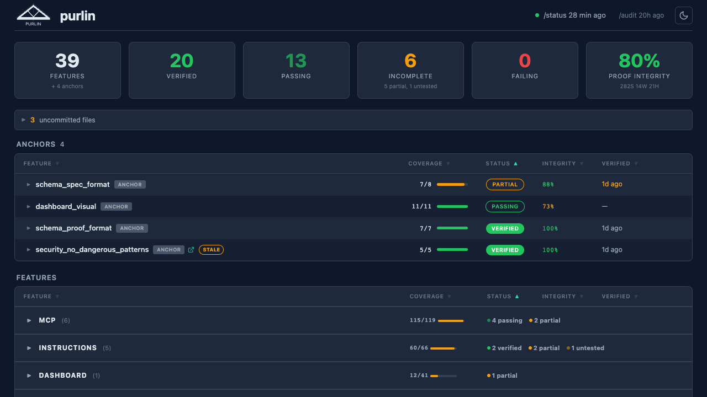
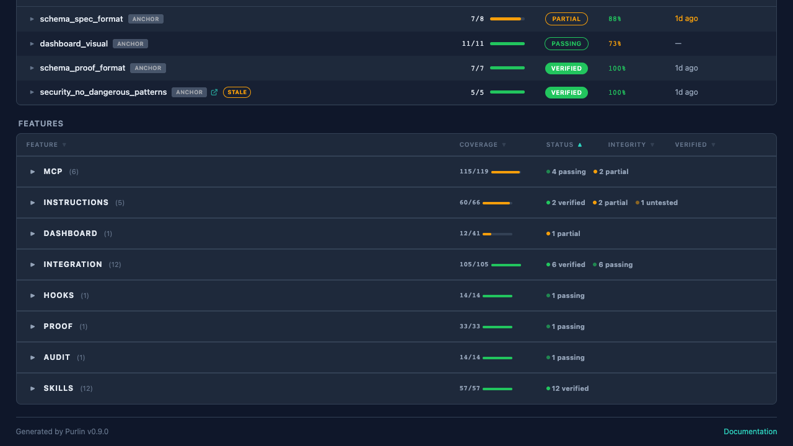

# Dashboard Guide

## What You Need to Know

Open `purlin-report.html` in a browser to see live coverage across your project. It's a static HTML file — no server needed.

```
purlin:init --report    — toggle the dashboard on/off
purlin:status           — updates the dashboard data (prints a clickable link)
```

The dashboard shows: summary strip, anchors section, feature table with coverage bars, and per-rule detail on click. Refresh the browser after running any Purlin command.

---

Purlin includes a static HTML dashboard that visualizes rule-proof coverage across your project. It runs entirely in the browser with no server, no build step, and no dependencies.



## Setup

The dashboard is enabled by default. When you run `purlin:init`, it creates a **symlink** at the project root:

```
purlin-report.html -> <purlin-plugin>/scripts/report/purlin-report.html
```

The symlink ensures the dashboard always reflects the latest Purlin version. When the plugin updates, the dashboard updates automatically.

To toggle the dashboard on or off:

```
purlin:init --report
```

Turning **on** creates the symlink and enables data file generation. Turning **off** disables data file generation but does not remove an existing symlink.

### Open in a browser

Open `purlin-report.html` in any browser. `purlin:status` prints a clickable link at the end of its output:

```
Dashboard: file:///path/to/your-project/purlin-report.html
```

## Status Progression

Every feature moves through a fixed progression. The dashboard shows the current status for each feature and anchor.

```
UNTESTED  →  PARTIAL  →  PASSING  →  VERIFIED
```

| Status | What it means | What to do |
|--------|--------------|------------|
| **UNTESTED** | No proofs exist for this feature. Zero tests reference its rules. | Write tests with proof markers: `test <feature>` |
| **PARTIAL** | Some rules have passing proofs, but not all. No proofs are failing. | Write tests for the remaining rules. Coverage shows `proved/total` (e.g., 3/5). |
| **PASSING** | **All** rules have passing proofs. Ready for verification. | Run `purlin:verify` to issue a receipt and move to VERIFIED. |
| **VERIFIED** | All rules proved + a verification receipt has been issued. The receipt contains a tamper-evident `vhash`. | No action needed. If code changes, the receipt becomes stale and status drops back. |
| **FAILING** | At least one proof exists but its test is failing. | Fix the failing test or the code it tests. This blocks progress. |

### How anchors affect status

A feature's "total rules" count includes rules from **all** sources:

- **Own rules** — defined in the feature's `## Rules` section
- **Required anchor rules** — from anchors listed in the feature's `> Requires:` field
- **Global anchor rules** — from anchors with `> Global: true` (auto-applied to all features)

A feature with 3 own rules and 2 global anchor rules has 5 total rules. It reaches PASSING only when all 5 are proved — including the anchor rules. This is why you may see a feature stuck at PARTIAL even after writing tests for all its own rules: the anchor rules need proofs too.

### Example

A feature `login` requires anchor `rest_conventions` (2 rules) and has a global anchor `no_eval` (1 rule). The feature itself has 3 rules.

```
login: 4/6 rules proved         → PARTIAL
  RULE-1: PASS (own)
  RULE-2: PASS (own)
  RULE-3: PASS (own)
  rest_conventions/RULE-1: PASS (required)
  rest_conventions/RULE-2: NO PROOF (required)
  no_eval/RULE-1: NO PROOF (global)
```

Even though all 3 of login's own rules pass, it's PARTIAL because 2 anchor rules are unproved. Once those are covered, it moves to PASSING.

## What the Dashboard Shows



- **Summary strip** — total features, verified count, passing count, incomplete count, failing count, and proof integrity score
- **Anchors section** — all anchors from `specs/_anchors/` with coverage bars, status badges, and integrity percentages. Anchors are labeled with `ANCHOR` or `GLOBAL` pills.
- **Features section** — features grouped by category (matching `specs/` subdirectories). Click a category to expand and see individual features.
- **Expanded detail** — click any feature row to see per-rule proof status and audit findings (STRONG/WEAK/HOLLOW)
- **Uncommitted files** — when `purlin:status` detects uncommitted spec or proof files, a collapsible section shows which files need committing
- **Staleness indicator** — top-right corner shows time since last `purlin:status` run (amber after 1 hour, red after 24 hours)

## Usage

- **Refresh** the browser to pick up new data after running `purlin:status`, `purlin:verify`, or any skill that checks coverage.
- **Dark/light mode** — toggle via the moon/sun icon in the top right.
- **Sort** — click any column header to sort by that column.
- **Expand** — click a feature row to see per-rule detail and audit findings.

## How Data Flows

### Coverage data

```
purlin:status (or any skill that checks coverage)
    |
    v
writes .purlin/report-data.js
    |
    v
purlin-report.html loads it (via <script> tag)
    |
    v
browser renders the dashboard
```

### Audit and integrity data

```
purlin:audit
    |
    v
writes .purlin/cache/audit_cache.json    (STRONG/WEAK/HOLLOW per proof)
    |
    v
purlin:status reads the cache on next run
    |
    v
includes audit findings + integrity score in .purlin/report-data.js
    |
    v
dashboard shows integrity score in summary strip
    + per-proof STRONG/WEAK/HOLLOW in expanded detail
```

`purlin:audit` populates the audit cache. `purlin:status` reads it and includes the findings in the data file. If no audit has run, the integrity score shows "--" until you run `purlin:audit`.

The HTML file loads `.purlin/report-data.js` through a script tag. No fetch calls, no CORS, no server. Just a static file loading another static file.

## Uncommitted Files

When `purlin:status` detects uncommitted changes to spec or proof files, the dashboard shows a collapsible **uncommitted files section** between the summary strip and the anchors table. This helps you remember to commit proof files after test runs or spec edits.

## Gitignored by Design

Both `purlin-report.html` and `.purlin/report-data.js` are gitignored. The HTML is a local tool, not a shared artifact. Each developer runs `purlin:init` to get their own symlink.
