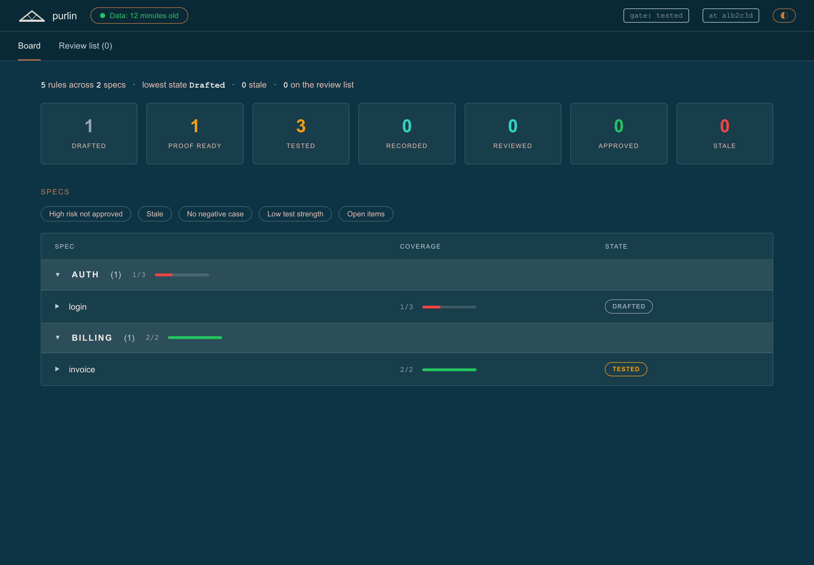
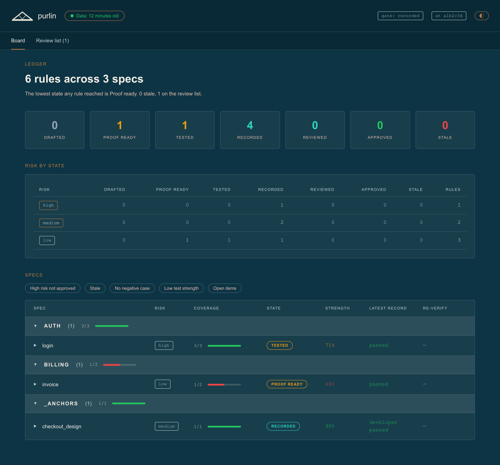
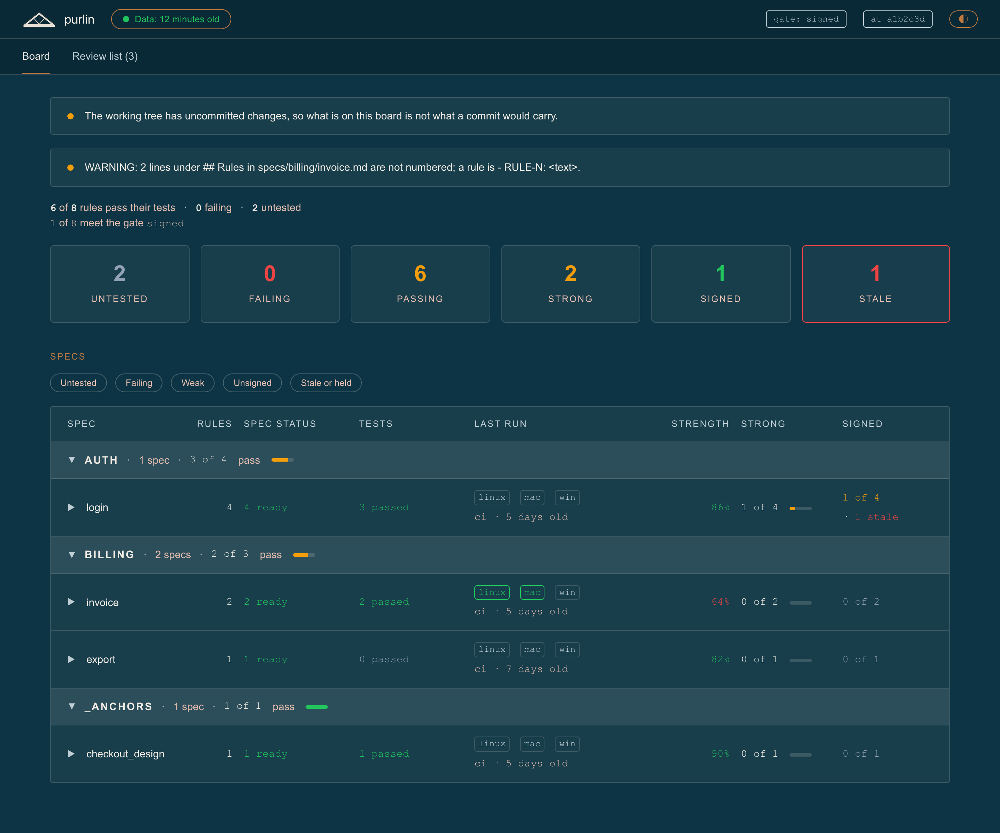
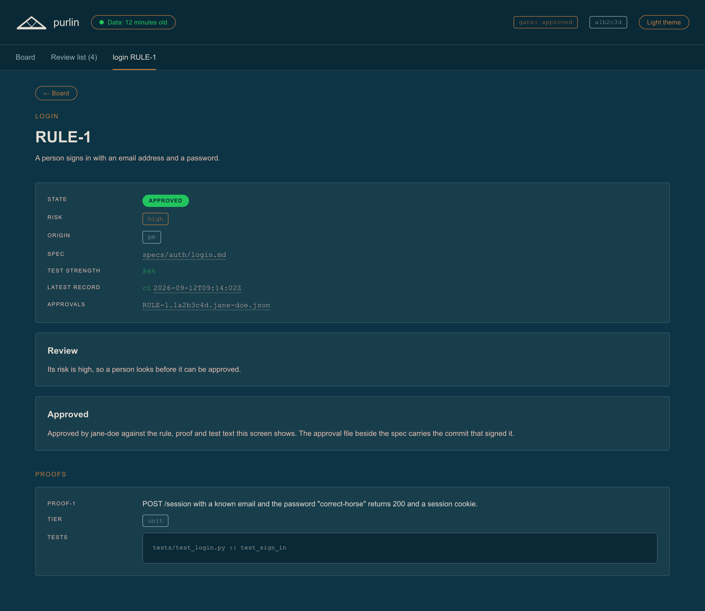
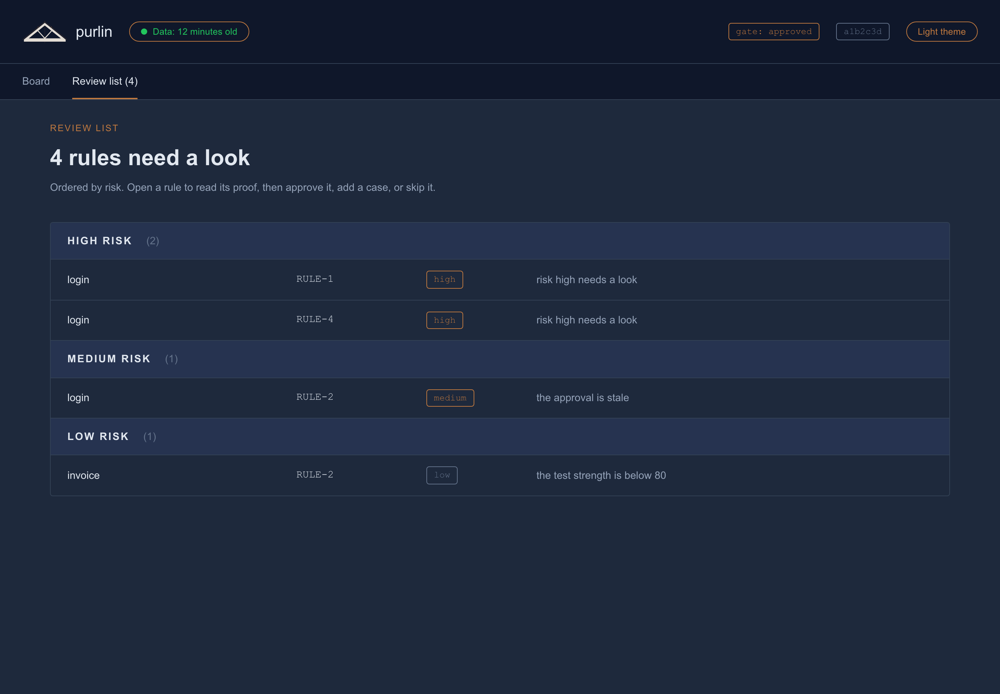

# The dashboard

For anyone who wants to see where every rule stands without reading a spec file.

The dashboard is one HTML file with no server, no build step and no dependencies. It opens from
disk beside your editor, and CI publishes the same page as a build artifact so a PM, a designer
or a QA reviewer can open it from a pull request with no checkout at all.

## The two ways to open it

**Locally.** `purlin:init` copies the page to `purlin-report.html` at the project root. It is a
copy rather than a link, because the only path a plugin install can be linked at is
version-pinned and the link would break on the first plugin update. The copy does not refresh
itself; run `purlin:init --update` after a plugin update. The page is gitignored, so each
person gets their own.

Open it in any browser. It reads `.purlin/report-data.js`, which the plugin rewrites in the
background after a tool call or a turn changed a spec, a proof file, a record or the config.
That file is generated and never committed. The page reloads itself when you come back to the
tab and what it is showing is more than 60 seconds old, keeping the screen and the open rule,
so a signature you have just written appears without you reloading anything. A commit you make
by hand outside Claude Code shows up after the next `purlin:status`.

**From CI.** A CI run copies the page and its data into a build artifact named
`purlin-dashboard-<runner>`, one per job in the matrix, so a run on two operating systems
leaves two pages rather than one. Anyone with repository access downloads one from the run and
opens the page. Nothing is provisioned, nothing is hosted, and no site has to be published.

## The chrome

Every screen carries the same top bar: the logo, how old the data is, the gate in force, the
commit the data was built from, and the theme toggle. How old the data is is a button: press it
to reload the page. The age recomputes itself every 60 seconds from the stamp the data already
carries, so a tab left open does not read `less than a minute old` an hour later. Below it are
the tabs: Board, Review list with its count where the gate has one, and the open rule last when
there is one.

## Board

The Board is where every rule stands. Its headline is one line:

```
3 of 5 rules meet the gate passed · 0 failing
```

A rule meets the gate when every cell up to the gate's level is met. The gate decides how many
cells a rule has, so it also decides how much of this page exists.



At the `passed` gate a rule has two cells, its spec status and its passed cell, so the board
carries three tiles and five columns. The tiles are `Untested`, `Failing` and `Passed`. The
columns are `Spec`, `Rules`, `Spec status`, `Tests` and `Last run`.

| Column | What it reads |
|---|---|
| `Spec` | the feature name, under the band that names its category |
| `Rules` | how many rules the spec holds |
| `Spec status` | `ready · drafted`, the two counts of what the spec says |
| `Tests` | `passed · failing · no test`, each count in its own tone |
| `Last run` | one box per operating system, `linux`, `mac` and `win`, each in the tone of what that system's newest record found, then the newest record's source and age, or the source alone before any record exists |



At `strong` each rule gains a strong cell, so a `Strong` tile joins the three and two columns
join the five: `Strength`, the test strength of the newest counting record, and `Strong`, `n of
m` with a bar. Only a record CI wrote counts at this gate, so a record a person committed reads
`developer` in `Last run` and the rules it covers read `not run`.



At `signed` each rule gains a signed cell. A `Signed` tile joins the four, a `Stale` flag card
sits beside the tiles, and a `Signed` column joins the seven, reading `1 of 4 · 1 stale` with
the stale count in the fail tone. The flag card is counted beside the tiles and never instead
of them: a stale rule is still in whichever tile its cells put it. Warnings sit above the
headline, one per line: an uncommitted working tree, or a spec line the parser could not read
as a rule.

Specs are grouped by category. The band above each group carries the category, how many specs
are in it, and how many of their rules meet the gate as `n of m` with a bar.

**A column exists only where its cell does.** A project at `passed` is not shown two empty
evidence columns, and nothing has to be configured to get the rest: `purlin:init --gate strong`
is the whole of it.

Pressing a spec expands its rules. Each row carries the rule id, the rule text, and one pill per
cell that exists, so a rule at `signed` shows three pills and the same rule at `passed` shows
one. A pill reads the cell's word: `passed`, `failed`, `no test`, `not run` or `code changed` at
level 1; `strong`, `weak` or `needs a person` at level 2; `signed`, `unsigned`, `stale`, `held`
or `not required` at level 3.

## Filters

Filter pills sit above the spec table. Each answers a question someone arrives with, and they
compose: a rule shows when every active filter accepts it, and a spec shows when one of its
rules does. The gate decides which exist, because a filter with no cell behind it selects
nothing.

| Filter | What it selects | Exists at |
|---|---|---|
| `Untested` | rules in the untested tile: drafted, or ready with no test or no current counting run | every gate |
| `Failing` | rules in the failing tile: a counting run failed | every gate |
| `Weak` | rules whose strong cell reads `weak` | `strong` and above |
| `Unsigned` | rules whose signed cell reads `unsigned` | `signed` |
| `Stale or held` | rules flagged stale, held, or both | `signed` |

## Rule

Pressing a rule opens it.



The screen opens with the feature, the rule id and the rule's text, then one panel of facts:
the spec status, `ready` or `drafted`, then one row per cell that exists, then the risk at
`strong` and above, the origin, the spec's path, the last run and the signature files that bind
the rule. Each cell row carries the cell's word as a pill and the reasons it carries:
`failing: tests/test_login.py`, `windows: no record yet`, `code changed since 9f8e7d6`,
`strength 64% under 80%`, `manual proof`, `held by sam@acme.com: the lock expiry is never
read`, `by jane@acme.com`. A cell with nothing to add carries no reason.

At `strong` and above the **Brief panel** follows: the test strength beside `min_strength`, the
free-check findings on the proof text and the test body, what the model review observed, each
in one sentence naming the proofs it concerns, whether the review settled the question, and a
link to the brief file. The brief reports and recommends nothing, so what you read here is what
was seen, not what to do about it.

At `signed` the **Sign panel** comes next. A rule that is not signed is headed `To sign` and
names the command, `purlin:sign <feature> <RULE-N>`, to run in Claude Code: a signature is a
signed commit by someone on the signer list, so this page can only read one back once it is on
the branch. A rule that is signed is headed `Signed` and names who signed it.

The **Proofs** are last, each with its tier, its findings and the tests that ran it.

`← Review list` at the top closes the rule and returns to the list it was opened from; from the
board the same link reads `← Board`.

## Review list

The review list is the rules whose next step is a person. The tab exists at `strong` and above,
because below that there is no cell a person answers.



The header says `<n> rules need a person`. Under it the risk summary prints one line per risk
that has rows, with the counts of unsigned, stale, held and needs-a-person rules in that risk;
a risk with nothing on the list gets no line. Then the rows, grouped by risk with high first,
and within a group the stale and held rules before the rest. A row carries the feature, the
rule id, the rule's text cut to one line, its risk tag, the word of the cell that blocks it,
and that cell's reasons.

A rule is on the list when its blocking cell is the strong cell reading `needs a person`, or
the signed cell reading `unsigned`, `stale` or `held`. Nothing else is: a rule with no test, a
failing rule and a weak rule are all build work, and they stay on the board. When nothing is
waiting the tab reads `Review list (0)` and the screen says so.

`purlin:sign` walks the same list one brief at a time in a checkout. The page is the read-only
view of it, for someone who has no checkout.

## Both themes

The toggle in the top bar switches between dark and light. Every colour on the page is a token
the theme redefines, so nothing else changes and the logo swaps to the colourway that reads on
the new ground. The choice is remembered in the browser.

## Without a checkout: scan.py

Anyone with a repository URL can print the same rollup without cloning the repository whole:

```bash
python3 "${CLAUDE_PLUGIN_ROOT}/scripts/report/scan.py" --repo <url> [--ref <branch-or-tag>]
```

It reads `specs/` and `.purlin/records/` by sparse fetch and prints the headline, one line per
bucket, and the flags beside them, then how far the ref has moved past the newest record, then
the review list, one line per rule with its risk, the rule, the cell that blocks it and why a
person is needed. `--repo` also takes a local path. CI posts the same rollup as a pull request
comment, so a reviewer reads one answer whether they are on the pull request, in a checkout, or
looking at the page.

## Next

- [running-and-records.md](running-and-records.md): what writes the data this page shows.
- [review-and-signing.md](review-and-signing.md): working the review list.
