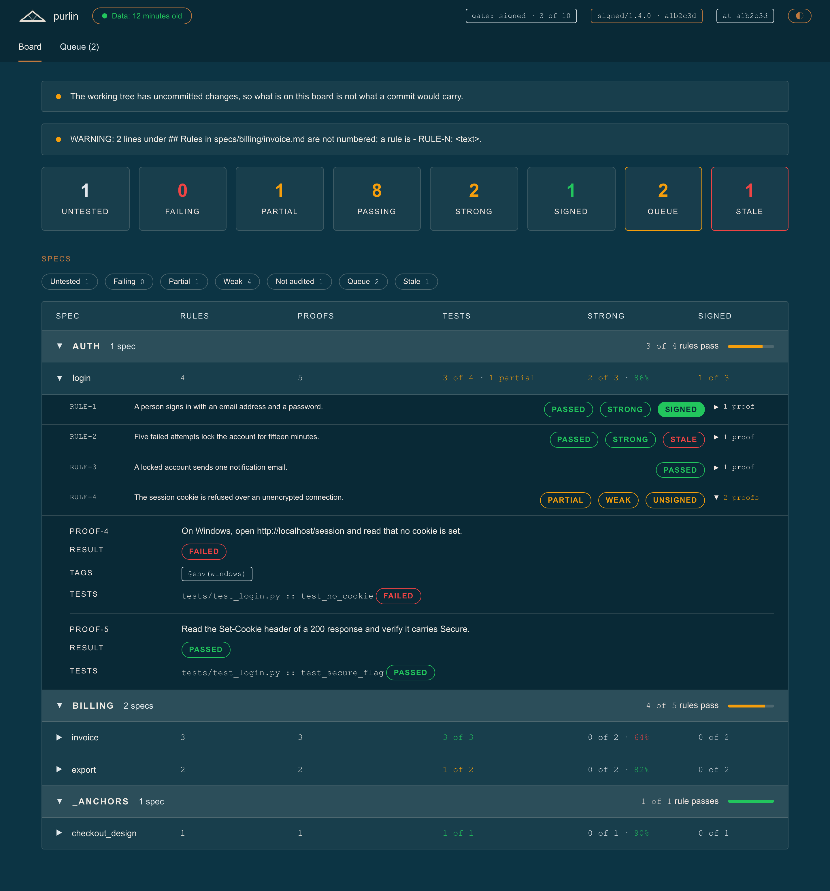

# The dashboard

For anyone who wants to see where every rule stands without reading a spec file.

The dashboard is one HTML file with no server, no build step and no dependencies. It opens from
disk beside your editor, and it asks nothing of anything outside itself.

## Opening it

The page is `purlin-report.html` at the project root. It is kept out of git, so each checkout
has its own copy. Open it in any browser. It reads `.purlin/report-data.js`, which
`purlin:status`, `purlin:test`, `purlin:audit` and `purlin:sign` each write as they finish.
Whenever one of those commands writes the data, it also writes the page where the project's
copy is missing or differs from the plugin's, so the page and its data always come from the
same version of Purlin.

The data is a snapshot of the last of those four commands. Nothing writes it in the background,
so an edit you make with no Purlin command shows up after the next of them. With no data file,
or one written for another version of the page, the page shows one notice naming the command
that writes it.

The page has two screens: the board, and one rule.

## The top bar

- the logo;
- the checkout state the data describes and when it was written, as
  `main at a1b2c3d, written 10:42`: the branch, the first 7 characters of the commit the
  command ran on, and the time in UTC. Its hover gives the date and time in full,
  `2026-10-01 10:42 UTC`. On a detached `HEAD` it reads `detached at a1b2c3d, written 10:42`.
  Each checkout of a repository has its own page and data, and this line says which one you are
  reading;
- the two facts, as two boxes. `Tests` reads `met` where every rule's tests pass on the
  committed evidence and `not met` otherwise. `Sign-off` reads `signed 0.1.0 at a1b2c3d`,
  `signed 0.1.0, 4 commits since` or `not signed`;
- the theme button, which shows the glyph of the theme it turns to, `◐` in the dark theme and
  `◑` in the light, its hover naming that theme, `Light theme` or `Dark theme`.

## Board



**Notices.** A notice sits above the boxes, one per line, when the working tree has uncommitted
changes, `The working tree has uncommitted changes, so what is on this board is not what a
commit would carry.`, and for each warning the status prints, such as a spec mistake. A spec
ahead of its code is one line of information below the warnings, as
`states: 3 files its scope names are not written yet: facts.py, project.py, wording.py. Run purlin:build states, or correct the path with purlin:spec states.`

**Boxes.** `Passing` counts the rules whose tests pass, a hand check included, with the
project's total beneath it, `11 RULES TOTAL`. `Strong` counts the rules the audit found strong;
it is there once the audit has found any rule strong or weak, and absent before. `No proof`
comes first wherever the project writes at least one proof line, counting the rules no proof
line names. A box is green once its count is complete, `No proof` at zero, and amber until
then.

**Columns.** `Spec`, `Rules` and `Tests` are always there. `Proofs` sits between `Rules` and
`Tests` wherever the project writes at least one proof line. `Strong` comes last once the audit
has found any rule strong or weak. A column the project does not reach is absent, not empty.

| Column | What it reads | What its hover says |
|---|---|---|
| `Spec` | the feature name, under the band that names its category; an anchor's name, in the `Anchors` section | the spec's path |
| `Rules` | how many rules the spec has, as `16` | |
| `Proofs` | `5 · 1 no test`: how many proof lines the spec holds and how many no test runs. A `@manual` proof counts as no gap | which proofs have no test |
| `Tests` | `3 of 4 · 1 partial`: how many rules passed everywhere they ran, then `partial` and `failing` | one line per operating system a current run covered, with its newest run's source, age and results |
| `Strong` | `2 of 4`: how many rules the audit found strong | where the newest audit came from and how old it is |

Every count names the word it counts. The first part is always drawn; a later part is drawn
only above zero, so a spec with nothing partial and nothing failing reads `3 of 3`. Every cell
after the spec's name reads the same characters as the status table in the terminal. Every
when, who and platform detail is in a hover, a plain `title` attribute, so it works on a page
opened from disk.

**Anchors.** The anchors stand in a section of their own, headed `ANCHORS`, between the boxes
and the spec table, in the same columns and rows, with no band. A project with no anchor shows
no such section.

**Bands and rows.** The other specs are grouped by category. The band above each group names
the category, how many specs it holds, as `2 specs`, and `4 of 5 rules pass`. A band counts the
rules of the specs it holds. Pressing a band, or Enter or Space on it, folds it. Pressing a
spec opens it: its `> Description:` first, then its rules; pressing it again closes it.

Each rule row carries the rule id, the rule text, a badge for each box that counts it, `PASSED`
and `STRONG`, and `FAILED` where a test of the rule failed on any operating system. A box that
does not count the rule draws nothing: why is on the rule's screen.

## Rule

Pressing a rule opens its screen. A rule is named by the spec that owns it and its id together,
so `ai_audit RULE-1` and `security_no_dangerous_patterns RULE-1` open two different screens.


`Back to the board` at the top returns to the board. The screen states the feature, the rule id
and the rule's text, then the `Passed` row and, once the audit has found any rule of the
project strong or weak, the `Strong` row.

Each row carries the cell's word as a badge and its reasons, such as `failing: Linux/Unix,
local`, `Windows: no run yet` or `code changed since 9f8e7d6`. The passed row adds one box per
operating system a counting run covered, `Lin`, `Mac` or `Win`, green where the rule passed and
red where it failed, with the system, the result, the source and the age in its hover. An
anchor's rule whose proof found nothing to check reads `passed`, and its passed row carries the
reason the test gave, as `PROOF-3: this project has no screens`, so you see the rule was not
exercised. Every rule of a spec to repair reads `failed` with the reason, such as `PROOF-2 is
written twice in the spec`, whatever its tests found.

Once the audit has found any rule strong or weak, the **Audit** panel follows:
`Strong. It found nothing.`, or `Weak.` followed by each finding in the sentence the audit
wrote, then the model's explanation and each planted bug a test missed, with its file, its line
and the line as the bug left it. A rule no audit has read says
`No audit has read this rule's text, proof and test yet.` In a project no audit has read, the
page says nothing of the audit at all.

The **Proofs** are last. Each reads its id, its words in full, its own result (`passed`,
`failed`, `no test`, `not run` or `checked at sign-off`), the operating system its `@env`
names, and each of its tests as `tests/test_login.py :: test_no_cookie` behind a dot in the
colour of that test's result, with the result's word in the dot's hover. A rule with no proof
shows the tests marked with its own id the same way. A hand check, a `@manual` proof, reads
`checked at sign-off`, and beneath it the note of the newest sign-off that holds one:

```
noted at the sign-off of 0.1.0 by quinn.qa@labconnect.example, 4 commits since: the tube is red
```

## Any screen, both themes

The page reads on every screen from 390 to 1500 pixels wide, on the board and on a rule's
screen: it never scrolls sideways, and no count, label, box or rule id breaks onto two lines.

The page opens dark until you choose. The theme button, `◐` or `◑`, switches between dark and
light, and the page opens in the theme you chose the next time it loads. Every colour on the page
is a token the theme redefines, and the logo swaps to the colourway that reads on the new ground.

## Next

- [running-and-evidence.md](running-and-evidence.md): what writes the data this page shows.
- [sign-off.md](sign-off.md): the sign-off the `Sign-off` box names.
- [working-together.md](working-together.md#more-than-one-checkout): one page per checkout.
