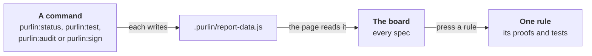

# The dashboard

The dashboard shows where every rule stands, so you do not have to read a spec file. It is one
HTML file. It needs no server, no build step and no network.

## Open `purlin-report.html` from disk

It sits at the project root. Open it in any browser, beside your editor.


```mermaid
flowchart LR
    C["<b>A command</b><br>purlin:status, purlin:test,<br>purlin:audit or purlin:sign"] -->|each writes| D[".purlin/report-data.js"]
    D -->|the page reads it| B["<b>The board</b><br>every spec"]
    B -->|press a rule| R["<b>One rule</b><br>its proofs and tests"]
```

- **The page shows the last command.** Nothing writes the data in the background. An edit you
  make shows up after the next of those four commands.
- **Each checkout has its own page.** Git ignores the page and its data.
- **With no data, the page names the command that writes it.**

## The top bar states the two facts

```
main at a1b2c3d, written 06:42 EDT
```

The header line is the branch, the commit the command ran on, and the time in your own
timezone. Beside it are two boxes:

| Box | What it reads |
|---|---|
| `Tests` | `met` where every rule's tests pass on the committed evidence, `not met` otherwise |
| `Sign-off` | `signed 0.1.0 at a1b2c3d`, in green; `signed 0.1.0, 4 commits since`, in amber; or `not signed` |

## The board counts the rules and lists every spec


**Count boxes.** A box is green once its count is complete, and amber until then.

| Box | What it counts |
|---|---|
| `No proof` | the rules no proof line names |
| `Passing` | the rules that pass their tests, with the project's total beneath, as `11 RULES TOTAL`, and how many of them an AI graded |
| `Failing` | the rules whose tests failed, in red; it is there only while one fails |
| `Strong` | the rules the audit found strong; it is there once an audit has run |

**Notices.** Below the boxes, one per line, are the warnings and the lines of information the
status prints in the terminal. One more says when the working tree has uncommitted changes.

**Columns.** A column the project does not reach is absent.

| Column | It reads | Meaning |
|---|---|---|
| `Spec` | `invoice` | the feature's name, or an anchor's |
| `Rules` | `16` | how many rules the spec has |
| `Proofs` | `5 · 1 no test` | how many proofs the spec holds, then how many have no test |
| `Tests` | `3 of 4 · 1 partial` | how many rules passed, then how many are `by hand`, `partial` or `failing` |
| `Strong` | `2 of 4` | how many rules the audit found strong, of those that pass their tests |

Each cell reads the same characters as the status table in the terminal. Hover over a cell for
when it ran, who ran it and on which operating system.

**Rows.** Anchors have a section of their own, headed `ANCHORS`. The other specs are grouped by
category under a band, such as `▼ BILLING 2 specs 4 of 5 rules pass`. A spec with a failing
rule is listed first. Press a band to fold it. Press a spec to see its rules.

## One rule shows why it reads what it reads

Press a rule to open its screen. `Back to the board` returns.


- **The `Tests` and `Strong` rows.** Each carries its word as a badge, then its reasons, such
  as `Windows: no run yet` or `code changed since 9f8e7d6`.
- **One box per operating system.** `Lin`, `Mac` or `Win`: green where the rule passed, red
  where it failed.
- **The Audit panel.** What the audit found, each finding in the audit's own sentence, the
  model's explanation, and each planted bug the tests missed, with the lines before and after
  it.
- **The proofs.** Each shows its words, its result, its tags and its tests, as
  `tests/test_login.py :: test_no_cookie`.
- **An AI proof shows each model.** One line per model, as `graded 3 of 3 on claude-opus-5-5`,
  with the grader and its reason for each run it read. A rule that passes with a graded proof
  reads `graded`. [graded-by-ai.md](graded-by-ai.md) says what that means.

A hand check, a `@manual` proof, shows the note of the newest sign-off that holds one:

```
noted at the sign-off of 0.1.0 by quinn.qa@labconnect.example, 4 commits since: the tube is red
```

## It reads on any screen, in both themes

The page reads on every screen from 390 to 1500 pixels wide, and never scrolls sideways. It
opens dark. The button at the top right switches between dark and light, and the page keeps
your choice.

## Next

- [running-and-evidence.md](running-and-evidence.md): what writes the data this page shows.
- [sign-off.md](sign-off.md): the sign-off the `Sign-off` box names.
- [working-together.md](working-together.md): one page per checkout.
