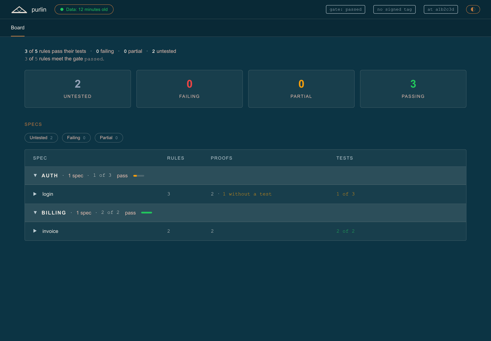
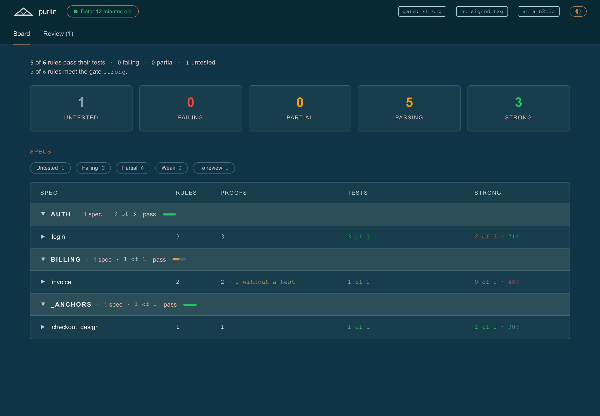
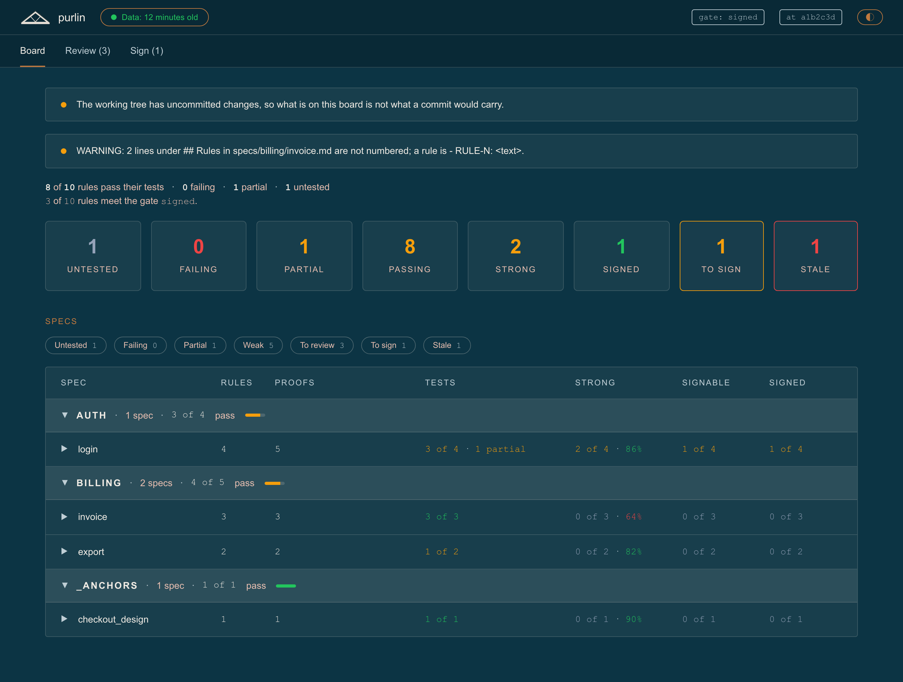
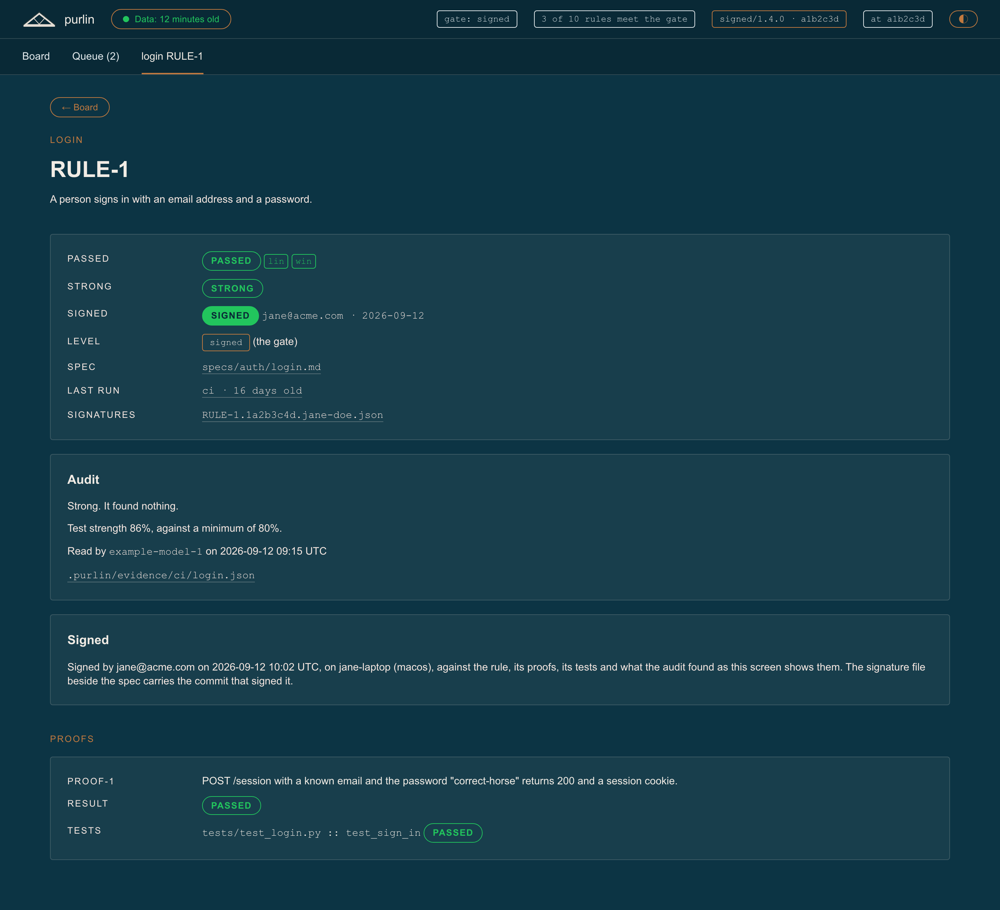
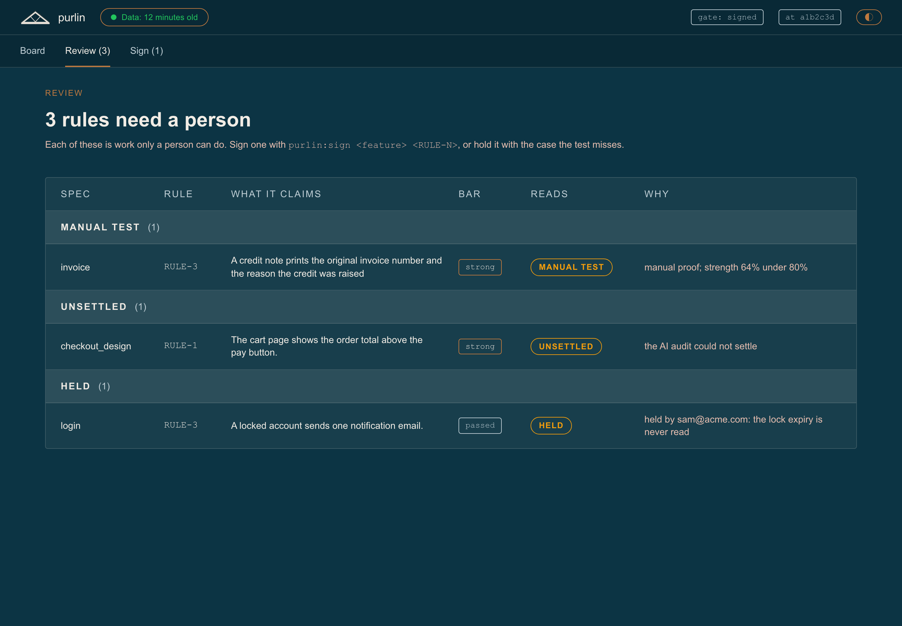
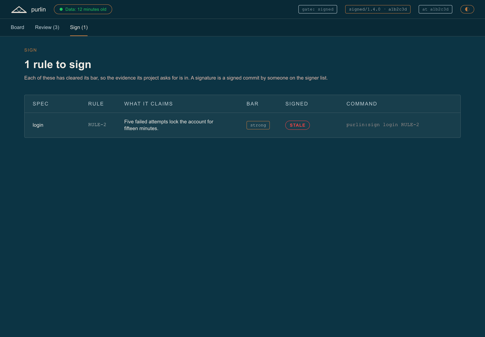

# The dashboard

For anyone who wants to see where every rule stands without reading a spec file.

The dashboard is one HTML file with no server, no build step and no dependencies. It opens from
disk beside your editor. Anyone without a checkout reads `.purlin/tests.md` on the git host,
the table of test results `purlin:test` commits.

## Opening it

`purlin:init` copies the page to `purlin-report.html` at the project root. It is a
copy rather than a link, because the only path a plugin install can be linked at is
version-pinned and the link would break on the first plugin update. The copy does not refresh
itself; run `purlin:init --update` after a plugin update. The page is gitignored, so each
person gets their own.

Open it in any browser. It reads `.purlin/report-data.js`, which the plugin rewrites in the
background after a tool call or a turn changed a spec, a proof file, a record or the config.
That file is generated and never committed. The page reloads itself when you come back to the
tab and what it is showing is more than 60 seconds old, keeping the screen and the open rule,
so a signature you have just written appears without you reloading anything. A commit you make
by hand outside Claude Code shows up after the next `purlin:status`.

Nothing is provisioned, nothing is hosted, and no site has to be published. A remote runner
uploads no artifact and posts no comment: the page is local.

## The chrome

Every screen carries the same top bar: the logo, how old the data is, the gate in force, the
signed tag, the commit the data was built from, and the theme toggle. The tag reads
`signed/<version>` with the first seven characters of the commit it points at, or `no signed
tag` where the data names none: `purlin:sign` writes one only when every rule meets the gate,
so its absence is a statement too. How old the data is is a button: press it to
reload the page. The age recomputes itself every 60 seconds from the stamp the data already
carries, so a tab left open does not read `less than a minute old` an hour later. Below it are
the tabs: Board, then Review with its count at `strong` and above, then Sign with its count at
`signed`, and the open rule last when there is one.

## Board

The Board is where every rule stands. Its headline is two lines:

```
3 of 5 rules pass their tests · 0 failing · 0 partial · 2 untested
3 of 5 rules meet the gate passed.
```

The first line is what the board is mainly about: whether the rules pass their tests. The
second names the gate, in the sentence `purlin:status` opens its own summary on, so the board
and the table lead with the same words. A rule meets the gate when nothing up to the gate's
level blocks it: its tests pass, its bar is cleared, no hold is current, and where a signature
is required it counts. The gate decides how many cells a rule has, so it also decides how much
of this page exists.



At the `passed` gate a rule has two cells, its spec status and its passed cell, so the board
carries four tiles and four columns. The tiles are `Untested`, `Failing`, `Partial` and
`Passing`. The last of them counts levels rather than buckets: a rule that is signed is still
passing, so it is counted in `Passing`, in `Strong` and in `Signed` alike. The three below it
count their own bucket alone. The columns are `Spec`, `Rules`, `Proofs` and `Tests`.

| Column | What it reads | What its hover says |
|---|---|---|
| `Spec` | the feature name, under the band that names its category | the spec's path |
| `Rules` | how many rules the spec holds | — |
| `Proofs` | `24 · 3 without a test`, how many proof lines the spec holds and how many of them no tagged test runs, the second count in the warn tone. A `@manual` proof declares that no test is written for it, so it counts as no gap | which proofs those are |
| `Tests` | `21 of 24 · 1 partial · 2 failing`, how many rules passed everywhere they ran, then the two words that say they did not | one line per operating system a counting run covered, newest first: `linux · ci · 9 days old · 22 passed · 1 failed · 1 not run` |

Every count names the word it counts beside the number. The first part is always drawn, so a
spec with nothing passing reads `0 of 24`; a later part is drawn only where it is above zero,
so a spec with nothing partial and nothing failing reads `24 of 24` and stops there.

A rule reads `partial` when its tests passed on one operating system and failed or did not run
on another. It is not passing and it is not failing, so it has a tile, a filter and a word of
its own rather than hiding inside either.



At `strong` each rule gains a strong cell, so a `Strong` tile joins the four and one column
joins the four: `Strong`, reading `18 of 24 · 71%`, how many rules the audit proved strong and
the test strength of the newest record. Its hover names where that record came from, `local` or
`ci`, how old it is, and the minimum strength this gate asks for. Your own `purlin:audit`
counts at this gate and at the one above it.



At `signed` each rule gains a signed cell. A `Signed` tile joins the five, two flag cards sit
beside the tiles, and two columns join the five.

`Signable` reads `1 of 4`: how many of the spec's rules a signer can act on now. A rule counts
there when it has cleared its bar, it needs a signature, and none counts for it yet, which is
the same rule the Sign tab lists. Its hover names them. `Signed` reads `1 of 4`, and its hover
names each signer with the date of their newest signature and then how many signatures stopped
matching.

The `To sign` card carries how many rules across the project are waiting for a signature, with
one line per spec in its hover, and the `Stale` card how many signatures stopped matching. A
flag card is counted beside the tiles and never instead of them: a stale rule is still in
whichever tile its cells put it. Warnings sit above the headline, one per line: an uncommitted
working tree, or a spec line the parser could not read as a rule.

**Every when, who and platform detail is in a hover.** A hover is a `title` attribute, one item
to a line, so it works on a page opened from disk with no script behind it. That is what let the
board drop from eight columns to seven and fit a 1024-wide window where it used to need 1100.

Specs are grouped by category. The band above each group carries the category, how many specs
are in it, and how many of their rules pass their tests, as `mcp · 6 specs · 108 of 113 pass`
with a bar after it. The gate is not repeated there: the `Signed` column carries it for each
spec and the headline's second line carries it for the project.

Every column holds a minimum width, and those minima sum to less than a 1024-wide window gives
the table, so a laptop shows every column the gate reaches with no sideways scroll. At 1280 and
above every count cell holds its parts on one line. In a window narrower than the sum of the
minima the table scrolls sideways rather than squeezing a heading into its neighbour, and no
text on the board is set smaller than 13 pixels in either theme. Nothing on the table is aligned
right: two bare number columns twelve pixels apart read as one number.

**A column exists only where its cell does.** A project at `passed` is not shown two empty
evidence columns, and nothing has to be configured to get the rest: `purlin:init --gate strong`
is the whole of it.

Pressing a spec expands its rules. Each row carries the rule id, the rule text, and one pill per
cell that exists, so a rule at `signed` shows three pills and the same rule at `passed` shows
one. A pill reads the cell's word: `passed`, `partial`, `failed`, `no test`, `not run` or
`code changed` at level 1; `strong`, `weak`, `not audited`, `unsettled`, `manual test` or
`held` at level 2; `signed`, `unsigned`, `stale` or `held` at level 3.

## Filters

Filter pills sit above the spec table. Each answers a question someone arrives with, and they
compose: a rule shows when every active filter accepts it, and a spec shows when one of its
rules does. The gate decides which exist, because a filter with no cell behind it selects
nothing.

There is one pill per bucket the board shows and one per kind of work beyond the tests, in the
order the tiles and the columns read. Each pill carries the number of rules it accepts, so it
and the tile or the cell it mirrors state the same number before anything is pressed.

| Filter | What it selects | Exists at |
|---|---|---|
| `Untested` | rules in the untested tile: drafted, or ready with no test or no current counting run | every gate |
| `Failing` | rules in the failing tile: every platform that ran the tests found a failure | every gate |
| `Partial` | rules in the partial tile: passed on one platform, failed or did not run on another | every gate |
| `Weak` | rules whose strong cell reads `weak` or `not audited`: the audit measured them and did not prove them, or has not run on this code yet | `strong` and above |
| `To review` | rules whose strong cell reads `manual test`, `unsettled` or `held`: the rows of the Review tab | `strong` and above |
| `To sign` | rules that have cleared their bar and are waiting for a signature: the rows of the Sign tab | `signed` |
| `Stale` | rules whose signature no longer matches | `signed` |

`Weak` and `To review` split the rules the audit did not prove strong: `Weak` is build work and
`To review` is a person's. A rule is in one or the other, never both.

## Rule

Pressing a rule opens it.



The screen opens with the feature, the rule id and the rule's text, then one panel of facts:
the spec status, `ready` or `drafted`, then one row per cell that exists, then the bar at
`strong` and above, the origin, the spec's path, the last run and the signature files that bind
the rule. The bar row reads `strong from the tag` or `strong from the gate`, so you can see at
once whether the rule asked for that bar itself or took the project's. Each cell row carries
the cell's word as a pill and the reasons it carries:
`failing: tests/test_login.py`, `windows: no record yet`, `code changed since 9f8e7d6`,
`strength 64% under 80%`, `manual proof`, `held by sam@acme.com: the lock expiry is never
read`, `by jane@acme.com`. A cell with nothing to add carries no reason.

The passed cell's row also carries one small box per operating system a counting run covered,
labelled `lin`, `mac` or `win`, green where the rule passed there and red where it failed, each
naming that system's word, the source of its newest run and how old that run is in its hover.
The board draws no such box: which platform found what is the rule's business, and the `Tests`
cell's hover sums it for the spec. The signed cell's row names the signer and the date beside
the word.

At `strong` and above the **Brief panel** follows: the test strength beside `min_strength`,
then what the audit observed, one sentence to a line as the audit wrote them, then whether the
audit settled the question, then a link to the brief file. There is no list of check names: the
audit writes sentences. The brief reports and recommends nothing,
so what you read here is what was seen, not what to do about it.

At `signed` the **Sign panel** comes next. A rule that is not signed is headed `To sign` and
names the command, `purlin:sign <feature> <RULE-N>`, to run in Claude Code: a signature is a
signed commit that names its signer, so this page can only read one back once it is
committed. A rule that is signed is headed `Signed` and names who signed it. Where the project
signs from `strong` and this rule's bar is `passed`, the panel says no signature is required
and that one written anyway still counts.

The **Proofs** are last, each with its tier and the tests that ran it.

`← Review` at the top closes the rule and returns to the tab it was opened from; from the Sign
tab the same link reads `← Sign`, and from the board `← Board`.

## Review

The Review tab is the rules whose next step is a person. It exists at `strong` and above,
because below that there is no cell a person answers.



The header says `<n> rules need a person`. Then the rows, grouped by what the strong cell reads
and in this order: `manual test` first, then `unsettled`, then `held`. A row carries the spec,
the rule id, the rule's text cut to one line, the rule's bar, the cell's word, and that cell's
reasons.

Three words put a rule here, and no others:

| Word | What it means | What you do |
|---|---|---|
| `manual test` | every proof of the rule is `@manual`, so no test can be written | run the test yourself and sign with a note saying what you saw |
| `unsettled` | the AI audit ran and could not settle whether the test proves the proof | judge it yourself: sign, add a case, or hold |
| `held` | someone has already stated that the test does not prove the proof, with the missing case | write the case, or lift the hold by signing |

`not audited` is not one of them. A rule reads `not audited` when its bar is `strong` and no
audit has run on this code yet; it waits for `purlin:audit`, not for a person, so it is on no
tab. A rule with no test, a failing rule and a weak rule are build work, and they stay on the
board.

When nothing is waiting the tab reads `Review (0)` and the screen says so.

## Sign

The Sign tab is the rules that have cleared their bar and are waiting for a signature. It
exists at `signed` and nowhere else.

A rule has **cleared its bar** when its bar is `passed` and its tests pass, or its bar is
`strong` and the audit proved it strong. A rule that has cleared its bar, needs a signature
and has none that counts is **signable**: the `Signable` column counts those, the `To sign`
card counts them for the project, and this tab lists them. A rule leaves it the moment someone
signs it.



The header says `<n> rules to sign`. A row carries the spec, the rule id, the rule's text cut
to one line, the rule's bar, the signed cell's word, `unsigned` or `stale`, and the command
that signs it, `purlin:sign <feature> <RULE-N>`.

`purlin:sign` with no argument walks the two lists in the order the page reads them, Review
then Sign: a rule a person has not judged is not a rule to sign. The page is the read-only view
of both, for someone who has no checkout.

## Both themes

The toggle in the top bar switches between dark and light. Every colour on the page is a token
the theme redefines, so nothing else changes and the logo swaps to the colourway that reads on
the new ground. The choice is remembered in the browser.

## Next

- [running-and-records.md](running-and-records.md): what writes the data this page shows.
- [review-and-signing.md](review-and-signing.md): working the Review and Sign tabs.
