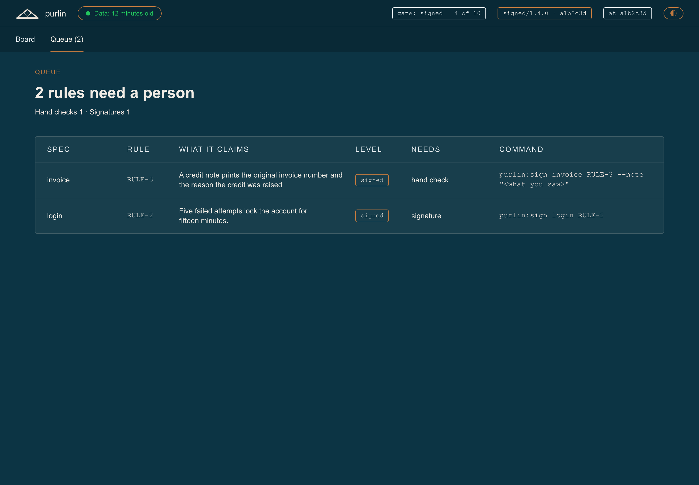

# The dashboard

For anyone who wants to see where every rule stands without reading a spec file.

The dashboard is one HTML file with no server, no build step and no dependencies. It opens from
disk beside your editor. Anyone without a checkout reads `.purlin/tests.md` on the git host,
the table `purlin:test --commit` commits.

## Opening it

`purlin:init` copies the page to `purlin-report.html` at the project root. The page is
gitignored, so each person has their own copy. The copy does not refresh itself: after a plugin
update, run `purlin:init` again and it asks before it replaces the copy.

Open it in any browser. It reads `.purlin/report-data.js`, which `purlin:status`,
`purlin:test`, `purlin:audit` and `purlin:sign` each write as they finish. Nothing writes it in
the background, so an edit you make with no Purlin command shows up after the next of those
four. The data file is generated and never committed. With no data file the page says `No board
data yet. Run purlin:status to write .purlin/report-data.js, then reload this page.`

When you come back to the tab and the data is more than 60 seconds old, the page reloads itself
and keeps the screen and the open rule, so a signature you have just written appears without
you reloading anything.

## The top bar

Every screen carries the same top bar: the logo; how old the data is, as `Data: 12 minutes
old`, which is a button that reloads the page; the gate, `gate: signed`, and beside it how many
rules meet it, `4 of 10 rules meet the gate`, whose hover says how many of those need their
tests only, an audit too or a signature too; at `signed`, the signed tag this commit carries, as
`signed/1.4.0 · a1b2c3d`, or `no signed tag`; the commit the data was built from, as
`at a1b2c3d`; and the theme toggle. The age recomputes every 60 seconds, and from 90 minutes on
it adds `— run purlin:status to refresh`.

Below it are the tabs: `Board`, then `Queue (n)` at `strong` and above, and the open rule, such
as `login RULE-1`, when there is one.

## Board

Warnings sit above the tiles, one per line: `The working tree has uncommitted changes, so
what is on this board is not what a commit would carry.`, and any line the spec parser could
not read. The board then opens on the tiles. A rule meets the gate when its passed cell is met,
its strong cell is met if its level is `strong` or `signed`, and its signed cell is met if its
level is `signed`. The gate decides how many cells a rule has, so it also decides how much of
this page exists: a tile, a column or a filter above the gate is absent, not empty.

**Tiles.** At `passed` there are four: `Untested`, `Failing`, `Partial` and `Passing`. `Strong`
joins at `strong` and `Signed` at `signed`. `Passing`, `Strong` and `Signed` count levels
reached, so a signed rule is counted in all three; the first three count their own rules alone.
At `signed` two cards sit beside the tiles: `Queue`, the rules that wait on a person, and
`Stale`, the rules whose signature does not match. A card is counted beside the tiles, never
instead of them. Each tile and card names what it counts in its hover; the `Untested` hover adds
how many of its rules read each word, as `no test · 3` and `not run · 552`.

**Columns.** `Spec`, `Rules` and `Tests` are there at every gate. `Proofs` sits between `Rules`
and `Tests` from `strong` up, and at `passed` only where the project writes at least one proof
line, since proofs are optional there. `Strong` joins at `strong` and `Signed` at `signed`.

| Column | What it reads | What its hover says |
|---|---|---|
| `Spec` | the feature name, under the band that names its category | the spec's path |
| `Rules` | how many rules the spec owns, then, where it proves rules from an anchor it requires or from a global anchor, `15 (+6 shared)` | each anchor the shared rules come from and how many, as `security_no_dangerous_patterns · 6`; none where there are no shared rules |
| `Proofs` | `24 · 3 no test`: how many proof lines the spec holds and how many no marker above a test names, whether or not that test has run. A `@manual` proof counts as no gap | which proofs those are |
| `Tests` | `21 of 24 · 1 partial · 2 failing`: how many rules passed everywhere they ran, then the two words that say they did not | one line per operating system a current run covered, newest first: `linux · ci · 9 days old · 22 passed · 1 failed · 1 not run` |
| `Strong` | `18 of 20 · 71%`: how many rules reached `strong` of those whose level is `strong` or `signed`, and the test strength, `n/a` where nothing measured one; empty where no rule's level asks for the audit | where the newest audit came from, how old it is, and `minimum strength 80%` |
| `Signed` | `1 of 4`: how many rules carry a signature that counts, of those whose level is `signed`; empty where none is | each signer with the date of their newest signature, then how many are `stale` |

Shared rules count toward every feature that proves them, in `Proofs`, `Tests`, `Strong` and
`Signed`, so `ai_audit` reads `15 (+6 shared)` and `0 of 21` beside it. The tiles, the
filters and the top bar count each rule once, under the spec that owns it.

Every count names the word it counts. The first part is always drawn; a later part is drawn
only above zero, so a spec with nothing partial and nothing failing reads `24 of 24`. Every
when, who and platform detail is in a hover, a plain `title` attribute, so it works on a page
opened from disk. A value never breaks inside itself: `15 (+6 shared)` and `42 · 2 no test`
stay on one line. The six columns fit a 1024-pixel window. Under 1024 pixels the table has no
heading row: each spec is a block, its name first and its values beneath as labelled pairs
that wrap whole, `Rules 15 (+6 shared)`, `Tests 21 of 21`, and a rule in an open spec reads its
id and badges, then its words, then its proofs control. The tiles wrap four to a row, and two
to a row under 600 pixels; the filters and the top bar's chips wrap whole. The page never
scrolls sideways and its text keeps its size, on the board, a rule's screen and the Queue tab.

A spec with no `> Scope:` line names no files, so Purlin cannot tell which code it covers. Its
row reads `<name> · no scope`, and the hover gives the reason. A `purlin:test` with no feature
named always runs such a spec, and at `signed` none of its rules can be signed.

Specs are grouped by category. The band above each group has two ends: the category's name
and `2 specs` at the left, `4 of 5 rules pass` and a bar at the right, every bar one width so
they line up down the page. A band counts each rule once, under the spec that owns it, so the
bands add up to the top bar's total; under 1024 pixels its count sits beneath its name.
Pressing a band, or Enter or Space on it, folds it; pressing a spec expands the rules it owns.
A rule a feature proves from an anchor is listed once, under that anchor, where the board lists
the anchor. Each rule row carries the rule id, the rule text, one pill per cell that exists,
reading the cell's word, and a button that opens the rule's proofs:

| Cell | Words |
|---|---|
| passed | `passed`, `partial`, `failed`, `no test`, `not run`, `out of date` |
| strong | `strong`, `weak`, `waiting`, `not audited`, `manual test`, `no proof` |
| signed | `signed`, `unsigned`, `waiting`, `stale` |

A rule has the cells its level asks for: one whose level is `passed` carries one pill, and one
whose level is `strong` carries two. The `Strong` and `Signed` tiles and the `Weak` and `Not
audited` filters count only the rules whose level asks for that cell. A cell reads `waiting`, in
the neutral colour, while the cell below it is not met: the strong cell `waiting for its tests to
pass`, the signed cell `waiting for the audit`. No filter counts it.

**Proofs under a rule.** The button reads `▶ 2 proofs` while closed, in the warn tone when one
of the proofs reads `failed` or `no test`, and `no proof` where the rule has none. Pressing it,
or pressing Enter on it, opens the rule's proofs beneath the row and turns the glyph to `▼`; a
screen reader hears whether it is open. Each proof reads its id, its words in full, its own
result (`passed`, `failed`, `no test`, `not run` or `hand check`), its `@manual` and `@env`
tags, and each of its tests as `tests/test_login.py :: test_no_cookie` with that test's result.
A rule with no proof shows the tests marked with its own id the same way. Every rule's proofs
are closed when the page loads and when you open a spec, and opening one rule's leaves the
others as they were. A filter that hides a rule hides its proofs with it. A project at `passed`
that writes no proof line is told nothing about proofs: the button reads `1 test` and opens the
rule's tests, and is absent where the rule has none.

## Filters

Filter pills sit above the spec table, each with the number of rules it accepts. They compose:
a rule shows when every pressed filter accepts it, and a spec shows when one of its rules does.

| Filter | What it selects | Exists at |
|---|---|---|
| `Untested` | rules in the `Untested` tile: no proof written, no test, or no current run | every gate |
| `Failing` | rules in the `Failing` tile: every platform that ran the tests found a failure | every gate |
| `Partial` | rules in the `Partial` tile: passed on one platform, failed or did not run on another | every gate |
| `Weak` | rules whose strong cell reads `weak`: the audit found fault, or the strength is under the minimum | `strong` and above |
| `Not audited` | rules whose strong cell reads `not audited` | `strong` and above |
| `Queue` | the rules on the Queue tab | `strong` and above |
| `Stale` | rules whose signature does not match | `signed` |

`Weak` is build work, `Not audited` waits on `purlin:audit`, and `Queue` is a person's. With nothing left the table reads `No rule
matches every filter you set.`

## Rule

Pressing a rule opens it. A rule is named by the spec that owns it and its id together, so
`ai_audit RULE-1` and `security_no_dangerous_patterns RULE-1` open two different screens, and
the tab names the owner.

The screen opens with the feature, the rule id and the rule's text, then one panel of facts: a
row per cell the rule's level asks for, then, at `strong` and above, the `Level` row, then
`Spec`, `Last run` and, where the rule has a signed cell, the `Signatures` that bind it. The
`Level` row reads `signed (the gate)`, `passed (marked)` or `strong (marked signed; the gate is
the ceiling)`, so you see whether the rule asked for its level itself.

Each cell row carries the word as a pill and the cell's reasons, such as `failing: linux, local`,
`windows: no run yet`, `code changed since 9f8e7d6`, `strength 64% under 80%` or `manual
proof`. The passed row adds one box per operating system a current run covered, `lin`, `mac` or
`win`, green where the rule passed and red where it failed, with the word, the source and the
age in its hover. The signed row adds the signer and the date.

Where the rule's level is `strong` or `signed` the **Audit** panel follows: `Strong. It found
nothing.`, `Weak.` or `Undecided. The AI audit could not decide, so the rule reads weak until
its proof or test changes.`, then each finding on its own line, then `Test strength 86%, against a minimum of
80%.` or `no mutation score measured`, then `Read by <model> on <date> <time> UTC` and a link
to the evidence file. A rule no audit has read says `No audit has read this rule’s text, proof
and test yet.` The panel reports and recommends nothing.

At `signed` the signature panel comes next. A signed rule's panel is headed `Signed` and names
who signed it, the date and minute in UTC, and the machine and operating system. Otherwise the
panel is headed `Signature` or `Hand check` and names the command to run in Claude Code,
`purlin:sign <feature> <RULE-N>`, with `--note "<what you saw>"` for a hand check. A rule
whose level is below `signed` has no signature panel, unless it waits for a hand check.

The **Proofs** are last, each drawn exactly as the board draws it under the rule: its words, its
result, its `@manual` and `@env` tags, and its tests with their results. A project at `passed`
that writes no proof line has no proofs here.
`← Board` at the top closes the rule; it reads `← Queue` when the rule was opened from there.

## Queue

The Queue tab is the rules whose next step is a person. It exists at `strong` and above.

The heading says `<n> rules need a person`, with the line `Hand checks <h> · Signatures <s>`.
The columns are `Spec`, `Rule`, `What it claims`, `Level`, `Needs` and `Command`, and rows come
by feature, then by rule number. The claim is cut at 90 characters; the rule screen has the
rest. The hover on `Needs` gives the cell's word and reasons.

| Needs | When | Command |
|---|---|---|
| `hand check` | the rule's level is `strong` or `signed` and its strong cell reads `manual test` | `purlin:sign <feature> <RULE-N> --note "<what you saw>"` |
| `signature` | at `signed`: the rule's level is `signed`, its passed and strong cells are met, and its signed cell is not | `purlin:sign <feature> <RULE-N>` |

When nothing is waiting, the screen says what arrives there at the project's gate. At `strong`:
`No rule is waiting for a person. A rule arrives here when its level is strong and its proof is
@manual.` At `signed`: `No rule is waiting for a person. A rule arrives here when its proof is
@manual, or when its level is signed and it has passed its tests and its audit.`

`purlin:sign` with no argument walks the same queue in the same order.
[review-and-signing.md](review-and-signing.md) covers the walk.

## Both themes

The toggle in the top bar switches between dark and light. Every colour on the page is a token
the theme redefines, and the logo swaps to the colourway that reads on the new ground. The
browser remembers the choice.

## Next

- [running-and-evidence.md](running-and-evidence.md): what writes the data this page shows.
- [review-and-signing.md](review-and-signing.md): working the queue.
