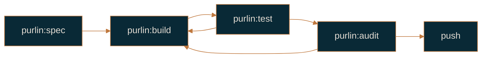

# Getting started

For the engineer setting Purlin up on a project for the first time.

By the end of this page you will have a spec, code, a tagged test and a committed record, and
you will know which process guide to read next. It takes about fifteen minutes on a small
project.

## What you need

- git, and a repository. Purlin reads git history to decide what counts as evidence, so
  `git init` before anything else.
- Python 3.9 or later.
- [Claude Code](https://docs.anthropic.com/en/docs/claude-code).

## Install

There are two ways to load Purlin, and both work the same afterwards.

**From the marketplace**, which is how a project uses it:

```bash
cd my-project
git init
claude plugin marketplace add https://github.com/rlabarca/purlin.git --scope project
```

Then start Claude Code, run `/plugin install purlin@purlin`, and run `/reload-plugins` so the
skill names autocomplete. The plugin lands under
`~/.claude/plugins/cache/purlin/purlin/<version>/`. `--scope project` writes the marketplace
entry into the project's `.claude/settings.json`, so a teammate who clones the repository
resolves the same source; each teammate still runs the install and the reload themselves.

**From a checkout**, which is how you try a version before installing it or work on Purlin
itself:

```bash
claude --plugin-dir /path/to/purlin
```

Your project never carries a copy of Purlin. Neither does a CI runner, which is why the workflow
`purlin:init` writes clones Purlin at a pinned tag and runs the audit from that checkout.

## Initialize

```
purlin:init
```

Init asks one question: **what must be true before CI lets a change merge?** The answer is the
**gate**, and it is the only setting. Each value names one more level of evidence, and the value
is the word a rule's last cell reads when it is met.

| Gate | Who it fits | What CI requires before merge |
|------|-------------|-------------------------------|
| `passed` | One developer | Every rule has a passing tagged test, from a run of any source |
| `strong` | A team of PM, designers, engineers and QA | Every rule has a record CI wrote at this commit, with the test strength at or above `min_strength`, no free-check finding and no hold |
| `signed` | The same team under GxP | Everything `strong` requires, plus a current signature on every rule at or above `sign_at`, in a signed commit by someone on the signer list |

Answer `passed` for now. You can raise the gate later with `purlin:init --gate strong`, which
adds what is missing and asks before each write.

Init asks nothing else. It reads the language and the test framework from the tree and the git
host from the remote URL. Two questions remain only because no answer can be read from anywhere:
an empty repository is asked which language it will be, and `signed` is asked for the signer
emails.

It writes `.purlin/config.json` with the gate and the derived defaults, `specs/` for the specs,
and `.purlin/records/` with a README saying that `purlin:audit` writes the files in it. It
installs the proof plugin for the detected framework and the breaks engine for the language,
adds a `.gitignore` block for `.purlin/runtime/`, copies the dashboard page so it opens from
disk, and offers a pre-push hook. It ends by printing every file it wrote or edited, one per
line. `purlin:init --dry-run` prints that list and writes nothing.

## Write the first spec

Describe the feature in plain language. A sentence, a ticket, a pasted block of acceptance
criteria and a folder of mocks all reach the same skill.

```
purlin:spec "Users sign in with email and password. After five failed attempts the
account is locked for fifteen minutes."
```

That sentence carries three claims, so it becomes three rules, each with one proof:

```markdown
# Feature: login

> Description: Email and password sign-in with a lockout after repeated failures.
> Scope: src/auth.py, src/session.py

## Rules

- RULE-1: Return 200 and a session cookie for a correct email and password [risk: high]
- RULE-2: Return 401 for a wrong password [risk: high]
- RULE-3: Lock the account for 15 minutes after 5 consecutive failures [risk: medium]

## Proof

- PROOF-1 (RULE-1): POST /login with a known user; verify 200 and a Set-Cookie header @integration
- PROOF-2 (RULE-2): POST /login with the wrong password; verify 401 and no cookie @integration
- PROOF-3 (RULE-3): POST /login 5 times with a wrong password, then once with the right one; verify 423 @integration
```

A single rule covering all three would pass while two thirds of the behaviour was missing. A
rule says what the software does; a proof says what a test asserts, naming a route, an input and
the observable that settles the claim. `> Scope:` names the files the feature lives in, and it
earns its place: a record carries the git tree hash of those files, which is what lets Purlin
tell a code change from a rule change later.

The skill ends with `Spec created: login. Build it now?`

## Build, test, audit

```
purlin:build login
```

Build reads every rule the feature is bound by, follows `> Requires:` through the anchors, writes
the smallest code that satisfies them, and writes one test per proof. Each test carries a marker
naming the feature, the proof and the rule:

```python
@pytest.mark.proof("login", "PROOF-1", "RULE-1")
def test_valid_credentials_return_200():
    assert authenticate("user@test.com", "secret") == 200
```

A test with no marker proves nothing as far as Purlin is concerned, however good it is. The
marker for every other framework is in
[references/formats/proofs_format.md](../references/formats/proofs_format.md).

```
purlin:test login
```

`purlin:test` runs the tagged tests, writes proof files into `.purlin/runtime/proofs/`, which is
not committed, and prints the passed cell of every rule. It takes seconds: no breaks, no record.

```
purlin:audit
```

`purlin:audit` runs the tests and writes
`.purlin/records/login/<timestamp>-<commit7>-developer.json`, commits it, and prints the table.
At the `passed` gate that is all it does, and the record's test strength reads `n/a`. From
`strong` upward it also breaks the code on purpose and measures the share of those breaks the
tests caught: that share is the **test strength**.



## Read the table

```
Feature  Rules  Spec                 Tests                             Run
──────────────────────────────────────────────────────────────────────────
login        3  3 ready · 0 drafted  3 passed · 0 failing · 0 no test  developer

3 of 3 rules meet the gate passed.
→ Next: nothing is outstanding at gate passed.
```

`purlin:status` prints that table any time, one row per feature and per anchor, sorted so the
rows needing the most work come first. `Spec` counts the rules a proof names against the rules
still drafted; `Tests` counts passed, failing and no test; `Run` names the source of the newest
record, and the operating system when the run was one job of a matrix. A column exists only
when the cell behind it does, so a project at the `passed` gate has no `Strength`, `Strong` or
`Signed` column. The gate is what adds them: `purlin:init --gate strong` adds the first two,
`--gate signed` adds the third.

Every command ends with one `→ Next:` line naming the step to take, computed from the cell that
blocks the rules: `purlin:spec` when a rule has no proof that clears the free checks,
`purlin:build` when a test fails or a proof has none, `purlin:test` when there is no run to
read, and `purlin:sign` when a rule is waiting for a person. Follow the line rather than
remembering an order.

## Where to go next

- One developer, gate `passed`: [solo-workflow.md](solo-workflow.md).
- A team, gate `strong`: [team-workflow.md](team-workflow.md).
- Under GxP or a similar obligation, gate `signed`: [regulated-workflow.md](regulated-workflow.md).
- An existing codebase with no specs yet: [spec-from-code.md](spec-from-code.md).
