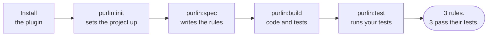

# Getting started

For a developer putting Purlin on a project. The example is a Python project that uses pytest.

## Purlin changes little in your project

- **A settings file.** `.purlin/config.json` holds your test command. Setup also writes a
  folder for evidence, an empty `specs/` and a few lines in `.gitignore`.
- **Your specs.** Markdown files you write, under `specs/`. Each holds the rules of one
  feature.
- **One comment per test.** `# purlin: cart PROOF-1` above the test. The test itself does not
  change.
- **Your test command.** Purlin runs your tests the way you already do. Nothing is installed in
  your test suite.
- **Your workflow.** You commit and push as before. Purlin commits only when you ask, and adds
  no git hook, no background job and no pipeline.

## Five steps take you from install to a first result


```mermaid
flowchart LR
    I["Install<br>the plugin"] --> N["purlin:init<br>sets the project up"]
    N --> S["purlin:spec<br>writes the rules"]
    S --> B["purlin:build<br>code and tests"]
    B --> T["purlin:test<br>runs your tests"]
    T --> R(["3 rules.<br>3 pass their tests."])
```

**1. Install.** Purlin needs git, Python 3.9 or later, and
[Claude Code](https://docs.anthropic.com/en/docs/claude-code).

```bash
cd my-project
claude plugin marketplace add https://github.com/rlabarca/purlin.git --scope project
claude plugin install purlin@purlin --scope project
```

Start Claude Code in the project, or run `/reload-plugins` in a session that is already open.

**2. Set up.** Type `purlin:init`. It names each file it wrote and asks one thing:
`Commit the files setup wrote? [y/N]`. Answer yes.

**3. Write the rules.** Type `purlin:spec cart` and say what the cart must do: a sentence, a
ticket or a list of criteria. It shows you the rules and proofs it drafted. Once you agree, it
commits the spec and ends on `Spec saved: cart. Next: purlin:build cart`.

**4. Build.** Type `purlin:build cart`. It writes the code and a test for each proof, with one
comment above each test naming the proof. Where a test you already have shows the proof, it
adds the comment there. It commits them and runs `purlin:test cart`.

The first test run has no test command, so it suggests one:
`Suggested for pytest: python3 -m pytest {files} --junitxml={report}`. Say yes. It writes the
command to `.purlin/config.json`, commits that file and runs the tests.
[supported_frameworks.md](../references/supported_frameworks.md) lists the test tools it
recognises.

**5. Commit the results.** Type `purlin:test --commit`. It commits the work and its evidence,
and ends on the status:

```text
Purlin status: shop, plugin 0.10.0
Tests: met
Sign-off: not signed

Spec  Rules  Proofs  Tests
───────────────────────────
cart  3      3       3 of 3
───────────────────────────

3 rules. 3 pass their tests.
Every rule passes its tests on the committed evidence. Optional: sign this version with purlin:sign
```

In a project that already holds code, run `purlin:spec-from-code` once after step 2. It reads
the code and writes the specs that code already implies.

## Every run ends on what to do next

- **`Tests: met`** means every rule's tests pass on the committed evidence. Before
  `purlin:test --commit` it reads `not met`, because the results are not in git yet.
- **`Sign-off: not signed`** means nobody has signed this code. Signing is optional.
- **A failing test names its rule.** The run prints
  `cart RULE-2 fails: tests/test_cart.py::test_sum. Run purlin:build cart.` and exits 1.
- **`Left to do` names the next command.** Its first line is the next step, such as
  `1 rule to fix: purlin:build`.
- **A change puts a result out of date.** Change `src/cart.py` and the rules of `cart` are out
  of date until `purlin:test` runs again.

Open `purlin-report.html` in a browser to see each rule on its own line.
[dashboard.md](dashboard.md) describes the page.

## Day to day, you run four commands

| Command | What it does |
|---|---|
| `purlin:drift` | says which rules and proofs your last pull changed |
| `purlin:spec <name>` | turns a requirement into rules and proofs |
| `purlin:build <name>` | writes the code and the tests, or marks a test you already have |
| `purlin:test` | runs what changed; `purlin:test --all` covers every feature, slow tests included |

`purlin:test --commit` makes two commits under your own git identity: the work, then the
evidence. It never pushes. The push is yours.
[running-and-evidence.md](running-and-evidence.md) covers a run in full.

## The audit and the sign-off are optional

- **`purlin:audit`** asks whether your tests would catch a bug. It plants a small bug for each
  proof, in a copy of the project, and runs that proof's test. Nothing waits on it.
  [audit.md](audit.md) says what it checks and why.
- **`purlin:sign`** builds the evidence package for the version and takes one signature. A
  project that never signs keeps its evidence all the same. [sign-off.md](sign-off.md) walks
  through it.

## Where to go next

- The model in one page: [how-purlin-works.md](how-purlin-works.md).
- A team of product, developers and QA: [working-together.md](working-together.md).
- Every command: [purlin_commands.md](../references/purlin_commands.md).
