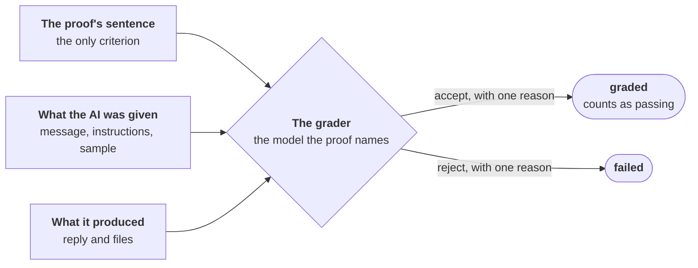

# Graded by an AI

For anyone who writes or reads a proof that an AI grades.

Some sentences about a prompt or a skill need judgment: "the reply blames nobody". No test
can hold that as a value. A second model, the grader, reads the output and judges it against
the proof's sentence.



## Use it where a test cannot hold the judgment

| The sentence | The check |
|---|---|
| names a value: an id, a phrase, a file written | exact, with `@ai` alone |
| needs judgment, and an AI's opinion is enough | graded |
| needs a person to look | by hand, with `@manual` |

[Testing a prompt or a skill](testing-ai.md#a-sentence-about-an-ai-is-checked-one-of-three-ways)
sets the three side by side.

## A graded proof carries two tags

```
- PROOF-6 (RULE-3): Asked for a refund over the limit, the reply refuses, gives the limit as the reason and blames nobody @ai(claude-opus-5-5) @graded(claude-haiku-4-5-20251001)
```

| Tag | What it names |
|---|---|
| `@ai(<model>)` | the model tested |
| `@graded(<grader>)` | the model that grades |

**The grader is named in the proof.** There is no default, and no setting names one.
`@graded` always stands beside an `@ai`.

The test makes one output, then asks for the grade:

```python
# purlin: refund_skill PROOF-6
@needs_the_helper
def test_the_refusal_blames_nobody():
    output('run', '--skill', 'skills/refund', '--project', 'tests/samples/shop',
           '--say', 'Refund order 1042 in full: 900.00.')
    graded = helper('grade', '--feature', 'refund_skill', '--proof', 'PROOF-6')
    assert graded.returncode == 0, graded.stdout + graded.stderr
```

## The grader is shown three things, and judges by the sentence alone

| The grader is shown | From |
|---|---|
| The proof's sentence | the spec |
| What the AI was given | the message, the instructions and the sample project, kept under `input/` |
| What it produced | `reply.md`, and each file the session wrote or changed |

It is shown nothing else. So the sentence must stand alone:

- **Poor:** `The reply follows the tone guide`. The grader is not shown the guide.
- **Good:** `Asked for a refund over the limit, the reply refuses, gives the limit as the
  reason and blames nobody`.
- **Good:** `The summary states no fact the sample report does not hold`. The sentence may
  compare the output with the input.

The input is what the output is checked against. It is never a second set of rules.

## The grader answers accept or reject, with one reason

The helper prints one line:

```
accept: The reply refuses, gives the 500.00 limit as the reason and blames nobody.
```

A reject fails the test, so the model run fails. A grader that gives no answer makes the
model run `not run`, never failed.

| Where you read it | What it shows |
|---|---|
| `purlin:status <name>` | `    PROOF-6  graded  3 of 3 on claude-opus-5-5  tests/test_refund.py::test_the_refusal_blames_nobody` |
| [The dashboard](dashboard.md#one-rule-shows-why-it-reads-what-it-reads), on the rule's page | the grader, each model, and each graded model run with the grader's reason |
| [The sign-off](sign-off.md#the-walk-names-each-model-and-each-graded-proof), in the list to read before you sign | `  refund_skill RULE-3: PROOF-6 on claude-opus-5-5, run 1 of 3, accepted by claude-haiku-4-5-20251001: The reply refuses, gives the 500.00 limit as the reason and blames nobody.` |
| The evidence and the package | each model run's grader, whether it accepted, and its reason |

## It reads `graded`, never `passed`

A graded proof that passes reads `graded`. So does its rule, in place of `passed`.

- **It counts as passing.** The tests read `met` with it, and nothing waits on it.
- **It is marked everywhere.** The summary says how many:
  `40 rules. 40 pass their tests, 6 of them graded by an AI.`
- **The sign-off's overview counts them**:
  `  Graded by an AI: 6 proofs, by claude-haiku-4-5-20251001.` A sign-off is optional.

## The audit tests the grader

The audit changes a copy of a kept output so the proof's sentence no longer holds. The test
then asks the grader about the changed output.

| The grader | The rule reads |
|---|---|
| rejects the wrong output | `strong`: the wrong output was caught |
| accepts the wrong output | `weak`, with the change it accepted |
| gives no answer | nothing is decided, and the audit says why |

A spot test also flags a graded proof whose test never asks for the grade.
[The audit](audit.md#for-an-ai-proof-the-audit-plants-a-wrong-output) says what a wrong
output shows.

## A person can check by hand, on top or in its place

- **On top:** give the rule a second proof tagged `@manual`. The sign-off walk stops there,
  and a person reads the output and types what they saw.
- **In its place:** where an AI's opinion is not enough, write the proof as `@manual` alone.
- **Beside an exact proof:** check the value with `@ai`, and the judgment with a graded proof.

## Where it stops

- **A grade is an AI's opinion against one sentence.** It is marked `graded` everywhere a
  person reads it.
- **A grade is not a person's judgment.** Your procedures decide whether a graded result is
  enough for a requirement. [Regulated work](regulated.md#when-the-product-is-a-prompt-or-a-skill)
  lists what they decide.
- **What the grader is shown has bounds.** It is always shown the message and the reply. Of
  the other files it is shown 50 at most, and the others by name alone. Each text is cut to
  20,000 characters.
- **The skill or the plugin itself is not shown to the grader**, and it is not kept with the
  output.
- **A caught wrong output shows the grader rejected one bad output.** It does not show the
  grader is right every time.

## Read next

- [testing-ai.md](testing-ai.md) for an AI proof from rule to evidence.
- [spec_quality_guide.md](../references/spec_quality_guide.md#a-proof-about-what-an-ai-does)
  for a sentence a grader can judge.
- [review_criteria.md](../references/review_criteria.md#a-wrong-output) for the wrong output
  the audit plants.
