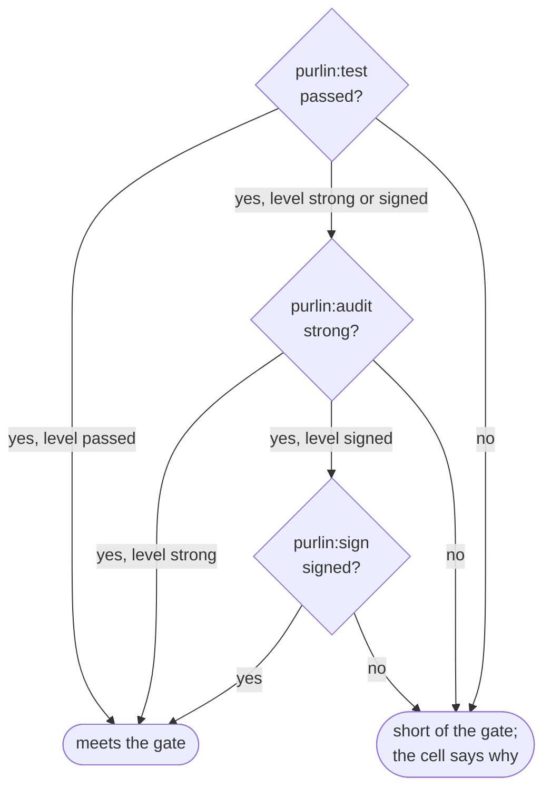

# How Purlin works

For anyone meeting Purlin for the first time, and for anyone who has to explain it. It is the
shortest description of the whole thing: one rule, three questions, and who answers each one.

A **rule** is one line in a spec saying what the software must do. A **proof** says in plain
language how that is shown. A **test** is any test in your own suite that carries a marker, one
comment above it naming the proof: `# purlin: login PROOF-4`. Every rule answers the same three
questions, top to bottom, and its level says how far down it must go.



The **gate**, the one setting in `.purlin/config.json`, says how many of the three levels a
project asks for. `passed` asks one, `strong` asks two, `signed` asks three. A cell above the
gate does not exist, so a project at `passed` never sees a strength, a queue or a signature.

Every rule also has a **level**, `passed`, `strong` or `signed`, meaning what the gate means. A
rule says its own with the tag `[level: passed]`, `[level: strong]` or `[level: signed]`, and a
rule with no tag takes the project's gate as its level. The gate is the ceiling: a tag above it
is read as the gate. A rule **meets the gate** when its passed cell is met, its strong cell is
met if its level is `strong` or `signed`, and its signed cell is met if its level is `signed`.
A rule has no cell above its level: one whose level is `passed` shows no strong and no signed
cell, and one whose level is `strong` no signed cell.
[references/hard_gates.md](../references/hard_gates.md) is the one definition.

## The loop, and where it runs

```
purlin:spec → purlin:build → purlin:test → purlin:audit → purlin:sign → git push
```

Every step runs on your own machine, at every gate. A project at `signed` on one laptop is the
ordinary case: you write the rule, you build it, you run the tests, you audit them, you sign
them, `purlin:sign` writes the tag, and you push. The gate says how far down the loop you go:
`passed` stops after the test, `strong` adds the audit, `signed` adds the signature. At `strong`
and `signed`, `purlin:sign` with no argument walks the queue; at `signed` it then writes the tag
when every rule meets the gate.

## Five words

**A push is `git push`, typed by you.** Any branch, any time. A command writes, commits where
you asked it to, and stops; at the gate `signed`, `purlin:sign` ends on the line `→ Run: git
push origin signed/<version>`.

**The tag is the marker that a version is proven.** At the gate `signed`, when every rule meets
it, `purlin:sign` writes the evidence package, `.purlin/evidence/package/<version>.json`, commits
it, and writes the signed tag `signed/<version>` (`git tag -s`) on that commit. It prints
`Tagged signed/<version> at <sha7>: every rule meets the gate signed.` No tag is written while
any rule falls short, and none below the gate `signed`. A tag holds the whole tree at that commit, so the code, every evidence
file and every signature are pinned together by one name. What the tag means is defined once,
in [hard_gates.md](../references/hard_gates.md).

**The evidence is what runs saw**: one `.purlin/evidence/<source>/<feature>.json` per feature
per source, with one section per operating system, and one `.purlin/tests.md` table for the
whole project, rendered from every evidence file. Your runs write into
`.purlin/evidence/local/`. `purlin:test` writes both and commits nothing; `purlin:test
--commit` commits them as `purlin: evidence at <sha7>`, so a teammate reads your run on the git
host without running anything. A section goes `out of date` when the spec, the code the spec
covers (`> Scope:`) or the tests change, and the next run clears it.

**An audit writes into the same evidence**: per rule, what the AI audit found, and the test
strength where mutation testing is on. `purlin:audit` writes it into
`.purlin/evidence/local/<feature>.json` and `purlin:audit --commit` commits it the same way.

**A signature is a named person's attestation** that a rule, its proof and its test belong
together, bound to the hashes of all three and to what the audit found. It logs who signed,
when, and on which machine (`machine`, `os`). `purlin:sign` writes it in a signed commit. Change
any of those four and the signature reads `stale`, including a re-audit that finds something
different.

| File | Written by | Where it lands |
|------|-----------|----------------|
| evidence | `purlin:test`, `purlin:audit` | `.purlin/evidence/local/<feature>.json` and `.purlin/tests.md` |
| signature | `purlin:sign` | `specs/<category>/<feature>.signatures/` |
| evidence package | `purlin:sign`, `purlin:export` | `.purlin/evidence/package/<version>.json` |

## When a project has a runner

Most projects have none, and nothing above needs one. `purlin:init` writes a CI workflow, for
GitHub or Azure DevOps, for two reasons only: a proof is tagged `@env` for an operating system
this machine is not, or you chose not to trust this machine for signing (`trust: remote`). The
matrix is one Linux job, plus one job per operating system the `@env` tags name.

The workflow runs on a push to a `run/*` branch and on a push of a `signed/*` tag, which only a
project at `signed` writes.
`purlin:test --remote` creates the run branch, waits for the run, pulls back what the runner
committed under `.purlin/evidence/ci/`, and deletes the branch. The runner runs the marked tests
and no audit. The tag run reruns the tests on a clean machine, checks that every signature still
binds the rule, proof, test and audit it names and that every file under `ci/` was committed by
the runner itself, and ends with the gate check. Evidence from either folder counts at every
gate. [running-and-evidence.md](running-and-evidence.md) has it in full.

## Questions every developer asks

**What is the loop?** `purlin:spec`, `purlin:build`, `purlin:test`, `purlin:audit`,
`purlin:sign`, `git push`. At `passed` it stops after the test: `purlin:test` prints the table
and ends with `Tests: <n> of <rules> rules pass.` and `gate passed met: <n> of <rules> rules`, which is
the check. At `strong` the audit follows,
and at `signed` the signature follows that.

**Do my tests run on my machine, or somewhere else?** On your machine. `purlin:test` runs the
marked tests the change touched, writes what they saw, and the board reads it at once;
`purlin:test --all` runs every feature. `purlin:audit` runs there too, and what it finds counts
at every gate. Nothing has to leave the machine for a rule to read `passed`, `strong` or
`signed`.

**What does `gate <gate> not met` mean?** The run's last line is `gate <gate> not met: <n> of
<rules> rules meet it`: <n> rules meet your gate and at least one does not, and the `→ Next:`
line above it says what blocks it and what to run. `purlin:test` exits 1 only when a test failed or a marker is wrong, because a test
run cannot make an audit or a signature appear.
At `passed` that is a failed test, a rule with no test, a pass that is `out of date`, or a rule
whose tests passed on one operating system and not on another. At `strong` the tests passed but
a rule's tests are not yet trusted: the audit found a gap, no audit has run on this code, the
rule has no proof, or a `@manual` proof waits on a person. At `signed` a rule that needs a
signature has none, or its rule, proof, test or audit changed after it was signed. The push is
yours either way: at `signed`, `purlin:sign` writes no tag while any rule falls short, so a
version that is not proven has no marker.

**What does a level do?** It decides three things: the evidence the rule must have to meet the
gate, whether the AI audit reads it, and whether it needs a signature. The AI audit reads every
rule whose level is `strong` or `signed` and no other, so a rule whose level is `passed` never
reads `not audited`. A rule needs a signature exactly when its level is `signed`. A rule whose
level is `signed`, whose passed and strong cells are met, and that waits for a signature is a
`signature` row in the queue, the one list of the rules that wait on a person.

**What if a rule has no proof?** At `passed` a proof is optional: a test may carry the rule's
own id, `# purlin: login RULE-2`. The passed cell reads `no test` with the reason
`no proof written` only when neither a proof nor a marked test names the rule, and the next
step is `purlin:spec`. From `strong` up a proof is required: a rule whose tests pass and that
has no proof reads `no proof` in its strong cell.

**What is the difference between `not audited` and `weak`?** `not audited` means the rule's
level is `strong` or `signed` and no audit has run on this code yet: it waits for
`purlin:audit`, not for you. `weak` means the AI audit did run and found a gap, or could not
decide whether the test shows what the proof says, and names why in its reason. Both are build
work, and neither is in the queue.

**When do I say which operating system a test needs?** On the proof line, with `@env(windows)`,
`@env(macos)` or `@env(linux)`. A proof with no `@env` runs anywhere, and a pass on any
operating system satisfies it. Your machine runs the untagged proofs and the ones tagged for it;
a proof tagged for another system reads `not run`, with the reason `<os>: no run yet`, until
that system runs it.

**What does `partial` mean?** The passed cell keeps one entry per operating system a current
run covered, and it reads `partial` when the rule's tests passed on some of them and failed or
did not run on the others. `partial` is not met, and it has its own tile and its own filter on
the board at every gate. Test strength is not measured per operating system; one number covers
the feature.

## Read next

Pick the gate you work at: [getting-started.md](getting-started.md) for `passed` and the first
session, [team-workflow.md](team-workflow.md) for `strong`,
[regulated-workflow.md](regulated-workflow.md) for `signed`.
