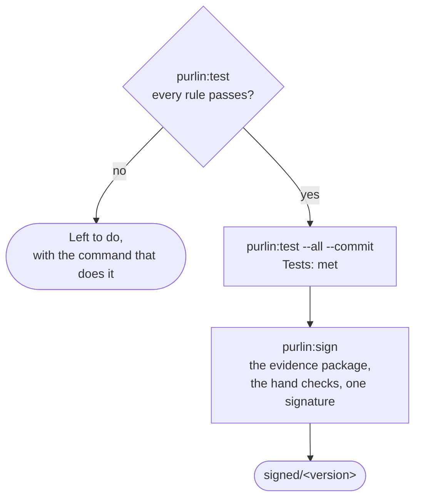

# How Purlin works

For anyone meeting Purlin for the first time, and for anyone who has to explain it. It is the
shortest description of the whole thing: one rule, its proof and its test, two facts, and who
takes each step.

A **rule** is one line in a spec saying what the software must do. A **proof** says in plain
language how that is shown. A **test** is any test in your own suite that carries one comment
above it naming the proof: `# purlin: login PROOF-4`. Purlin runs your own test command, reads
its report, and says which rules pass over the code as it is now.

Purlin keeps two things: the evidence of what the tests saw, and a person's sign-off over it.
It shows them as two facts, in the terminal and on the dashboard:

```
Tests: met
Sign-off: signed 0.1.0 at a1b2c3d
```

**Tests** reads `met` when every rule's tests pass on the committed evidence, and `not met`
otherwise. **Sign-off** reads `signed 0.1.0 at a1b2c3d` when a person signed this code,
`signed 0.1.0, 4 commits since` when the code moved on after the last sign-off, and
`not signed` when nobody has signed. Everything else Purlin prints is information.



[evidence_and_signoff.md](../references/evidence_and_signoff.md) is the one definition of the
two facts, of which evidence counts for a sign-off and of what `signed/<version>` means.

## The loop, and where it runs

`purlin:spec`, `purlin:build`, `purlin:test`, and `purlin:audit` where you want it, then
`git push`. Every step runs on your own machine. While the specs change, product, QA and the
developers improve rules, proofs and tests together, and `Left to do` lists the work with the
command for each line. When the tests are met, a person runs `purlin:sign` whenever the team
chooses. One person on one laptop is the ordinary case: you write the rule, you build it, you
run the tests, you sign, and you push the tag.

## Four words

**A push is `git push`, typed by you.** Any branch, any time. A command writes, commits where
you asked it to, and stops. `purlin:test --remote` is the one command that pushes, and it
pushes a run branch of its own, never the branch you are on.

**The evidence is what runs saw**: one `.purlin/evidence/<source>/<feature>.json` per feature
per source, with one section per operating system. Your runs write into
`.purlin/evidence/local/`. `purlin:test` writes the file and commits nothing;
`purlin:test --commit` commits the specs, the marked tests and the settings the results
describe, then the evidence as `purlin: evidence at <sha7>`. A section goes `out of date` when
the spec, the code the spec covers (`> Scope:`) or the tests change, and the next run clears
it. The developer's hand-off is run and commit: `purlin:test --all --commit`, and
`purlin:test --remote` for a proof tagged for another operating system.

**An audit writes into the same evidence**: per rule, whether the audit found its tests
`strong` or `weak`, with each finding and each bug it planted. You run `purlin:audit` when you
want it, and nothing waits on it. [audit.md](audit.md) says what it checks and why.

**A sign-off is a person's signature over the evidence package.** `purlin:sign` reads the
committed evidence, builds the package `.purlin/evidence/package/<version>.json`, stops at each
hand check, and takes one signature in a signed commit. The first sign-off of a version writes
the signed tag `signed/<version>`; later sign-offs are added after it. The sign-off records
what the signer was shown and each note they typed, and no judgment.
[sign-off.md](sign-off.md) is the walk in full.

| File | Written by | Where it lands |
|------|-----------|----------------|
| evidence | `purlin:test`, `purlin:audit`, a remote run | `.purlin/evidence/local/<feature>.json`, `.purlin/evidence/ci/<feature>.json` |
| evidence package | `purlin:sign` | `.purlin/evidence/package/<version>.json` |
| sign-off | `purlin:sign` | `.purlin/evidence/package/<version>.signoffs/` |

## When a project has a runner

Most projects have none, and nothing above needs one. A project gets a runner file for one
reason: a proof is tagged `@env` for an operating system your machine is not. The first
`purlin:test --remote` writes the file for the project's git host,
`.github/workflows/purlin.yml` on GitHub or `purlin.azure-pipelines.yml` on Azure DevOps, shows
it, and names the command that commits it and runs. From then on `purlin:test --remote` pushes
this commit to a run branch, waits for the run, pulls back what the runner committed under
`.purlin/evidence/ci/`, and deletes the branch. A runner runs only the tests tied to proofs
tagged for its own system, and no audit.
[running-and-evidence.md](running-and-evidence.md#when-a-project-has-a-runner) has it in full.

## Questions every developer asks

**What does a run end on?** The status: three opening lines, `Purlin status: <project>, plugin
<version>`, `Tests:` and `Sign-off:`, then the table, the sentence, such as `3 rules. 2 pass
their tests.`, and `Left to do`, one line per kind of work left with its count and its command.
The first line of `Left to do` is the next step. Where the tests are met and this code is not
signed, the last line reads
`Every rule passes its tests on the committed evidence. To sign it: purlin:sign`.
[getting-started.md](getting-started.md) shows both endings from a real run.

**Do my tests run on my machine, or somewhere else?** On your machine. `purlin:test` runs the
marked tests the change touched and writes what they saw; `purlin:test --all` runs every
feature. `purlin:audit` runs there too. A test leaves your machine only where its proof is
tagged for an operating system yours is not.

**When does `purlin:test` exit 1?** When a tied test failed or did not run, evidence is
missing, a comment above a test names nothing a spec has, the settings file is missing or
cannot be read, the project was set up by Purlin 0.9.5 and not upgraded, or no test command is
set. What the audit found never makes it exit 1.

**What keeps the tests from reading `met`?** A failed test, a rule with no test, a result that
is `out of date`, a rule whose tests passed on one operating system and failed on another, a
system that has not run its tests, a spec to repair, a test comment to correct, and results
that are written and not committed. Each is a line of `Left to do`, with the command that
clears it. A rule the audit found weak is left to do as `to strengthen`, and a rule with no
proof as a rule to write a proof for; the tests read `met` with either.

**What if a rule has no proof?** A test may carry the rule's own id,
`# purlin: login RULE-2`. The rule reads `no test`, with the reason `no proof written`, only
when neither a proof nor a marked test names it. A rule whose tests pass and that has no proof
is left to do as a rule to write a proof for, with `purlin:spec`.

**What is the difference between `not audited` and `weak`?** `not audited` means the evidence
holds no audit entry for the rule's current text, proof and test; `purlin:audit` writes one
when you run it. `weak` means the audit ran and a spot test fired on one of the rule's tests,
or a bug planted for one of its proofs was not caught: the rule is left to do as
`to strengthen`, with `purlin:build`. A rule whose tests have not passed reads neither: it
reads `waiting`.

**What is a hand check?** A proof tagged `@manual`, which only a person's judgment settles. It
has no test. Its rule reads `checked at sign-off`: the walk of `purlin:sign` stops at it, and
the signer may type what they saw. After a sign-off the rule shows its last note, as
`noted at the sign-off of 0.1.0 by quinn.qa@labconnect.example, 4 commits since: the tube is red`.

**When do I say which operating system a test needs?** On the proof line, with `@env(windows)`,
`@env(macos)` or `@env(linux)`. A proof with no `@env` runs anywhere, and a pass on any
operating system satisfies it. Your machine runs the untagged proofs and the ones tagged for it;
a proof tagged for another system reads `not run`, with a reason such as
`Windows: no run yet`, until that system runs it, and the rule is left to do as
`1 rule to test on Windows: purlin:test --remote`.

**What does `partial` mean?** A rule keeps one result per operating system a current run
covered. It reads `partial` when two systems that each have a current result disagree.
`partial` is not passing, and the rule is left to do as `to fix`.

**What about more than one checkout?** Each checkout of a repository, a worktree included, has
its own results, status and dashboard. [working-together.md](working-together.md#more-than-one-checkout)
says how they meet.

## Read next

[getting-started.md](getting-started.md) for the first session,
[working-together.md](working-together.md) for a team, and [sign-off.md](sign-off.md) for the
sign-off, QA's path to it and its use beside a regulated system.
