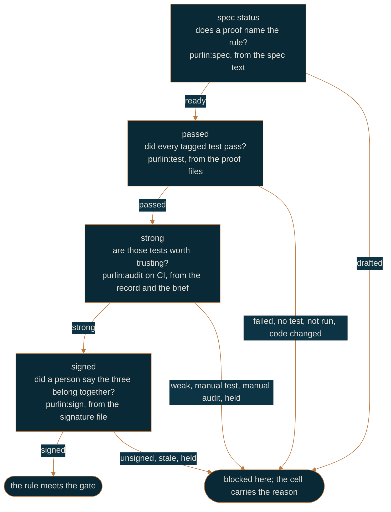

# How Purlin works

For anyone meeting Purlin for the first time, and for anyone who has to explain it. It is the
shortest description of the whole thing: one rule, four questions, and who is allowed to answer
each one.

A **rule** is one line in a spec saying what the software must do. A **proof** says how that
claim is observed. A **test** is the executable form of a proof, tagged with the rule it
settles. Every rule answers the same four questions, top to bottom.

The **gate**, the one setting in `.purlin/config.json`, says how many of the three evidence
levels a project asks for. `passed` asks one, `strong` asks two, `signed` asks three. A cell
above the gate does not exist, so a project at `passed` never sees a strength, a risk tag, a
review list or a signature. A rule **meets the gate** when every cell up to the gate's level is
met. [references/hard_gates.md](../references/hard_gates.md) is the one definition.

## Four words

**A push is `git push`, typed by a person.** No skill, no agent and no hook pushes, and none
opens a pull request. `purlin:audit --commit` commits the record, prints `Run: git push` and
stops. If a pre-push hook is installed it refuses a push made from an agent session outright.

**A remote run is `purlin:audit --remote`, the one case in which Purlin pushes.** It pushes a
**run branch**, `run/<branch>-<sha7>`, which it creates, waits on, pulls the records back from
and deletes. The branch you are working on is never pushed. Use it when a proof is tagged
`@env` for an operating system your machine is not.

**A record is the machine's evidence of one run**: which commit, which operating system, every
proof's result, and the test strength. `purlin:audit` writes it. What decides whether it counts
is the last commit that touched it, never anything inside it. That answer is its **source**:
`ci` when CI committed it through the git host's API, `developer` when a person committed it,
`local` when it is not committed. Under `passed` all three count. Under `strong` and `signed`
only `ci` counts, so nobody writes the evidence their own change is measured by.

**A signature is a named person's attestation** that a rule, its proof and its test belong
together, bound to the hashes of all three and to the rule's risk tag. `purlin:sign` writes it
in a signed commit. CI writes no signature file, ever. Change any of the four and the signature
reads `stale`.

## Who writes what, where it lands, and who may touch it

| File | Written by | Where it lands | Who may write it |
|------|-----------|----------------|------------------|
| record | `purlin:audit` | `.purlin/records/<feature>/` | CI, through the git host's API, where the run lands one; you too with `--commit`, and it counts under `passed` |
| brief | `purlin:audit --ci` | `.purlin/briefs/<feature>/` | CI alone. A local audit writes none |
| signature | `purlin:sign <feature> RULE-N` | `specs/<category>/<feature>.signatures/` | a person, in a signed commit; under `signed`, one on the signer list |
| hold | `purlin:sign <feature> RULE-N --hold "<case>"` | the same directory, `.hold.json` | any person, in a signed commit |

A branch rule restricts `.purlin/records/**` and `.purlin/briefs/**` to the CI identity, so a
person cannot push a record or a brief. The signature directory carries no such rule and needs
none: a person is supposed to write those, and five conditions, read from git and from the
file, decide whether one counts.

## Where CI runs

The workflow `purlin:init` writes starts on three things and nothing else: a pull request, a
push to the protected branch, and a push to a `run/*` branch. A push to any other branch starts
nothing. A pull request run does the tests, posts the comment and uploads the dashboard, and
commits nothing. A run on the protected branch, or on a run branch, commits its records and
briefs there. Every run ends with the gate check and fails when the gate is not met.

## Questions every developer asks

**Do my tests run on my machine, or only in CI?** On your machine first. `purlin:test` runs
the tagged tests in seconds and the board reads the result at once; `purlin:audit` runs them
again and writes a record. CI is the same audit run on the git host. The gate decides whose
record counts: at `passed` yours does, so you can meet the gate without CI; at `strong` and
`signed` only CI's does, and your local audit is a preview of what CI will find.

**What is my git host?** The service that holds your repository and runs CI: GitHub or Azure
DevOps. `purlin:init` reads it from your `origin` remote and writes it as `ci` in
`.purlin/config.json`. The green check or red cross beside a commit, the pull request comment
and the branch rules all live there.

**What does red mean?** The check ran the tests and at least one rule does not meet your gate.
The run's log ends with a list naming each rule and why. At `passed` that is a failed test or a
rule with no test. At `strong` the tests passed but a rule's tests are not yet trusted: the
breaks got past them, or a proof waits on a person to run it or judge it. At `signed` a rule
that needs a signature has none, or the code changed after it was signed. Red never stops a
push; with the branch rule applied it stops the merge until the list is dealt with.

**When do I say which operating system a test needs?** On the proof line, with `@env(windows)`,
`@env(macos)` or `@env(linux)`. A proof with no tag runs anywhere and any operating system's
pass satisfies it. Your machine runs the untagged proofs and the ones tagged for it; a proof
tagged for another system reads `not run` until that system runs it. `purlin:init` reads the
tags and writes the CI matrix from them: one Linux job always, plus one job per tagged system.
macOS is never in the matrix by default, so your Mac is the macOS runner; its audit records
are what light the `mac` box on the board.

## Read next

Pick the gate you work at: [solo-workflow.md](solo-workflow.md) for `passed`,
[team-workflow.md](team-workflow.md) for `strong`,
[regulated-workflow.md](regulated-workflow.md) for `signed`.
[getting-started.md](getting-started.md) walks the first session.
