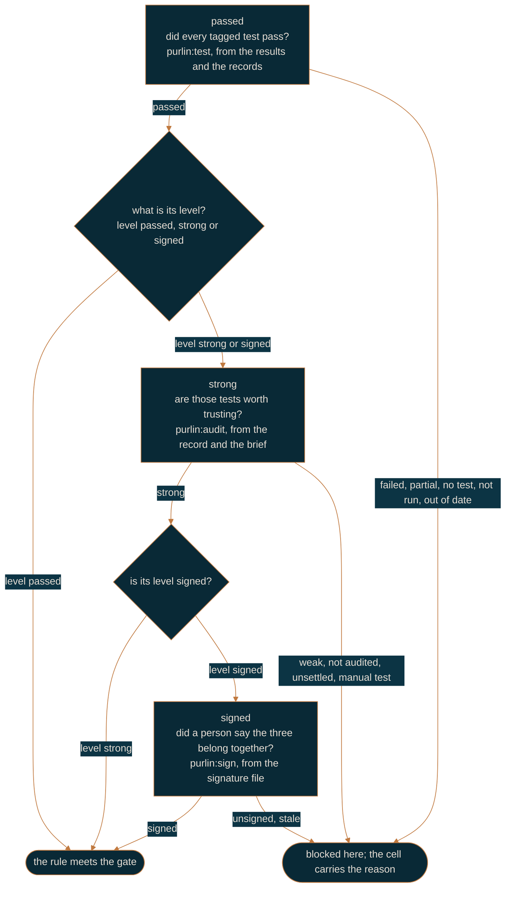

# How Purlin works

For anyone meeting Purlin for the first time, and for anyone who has to explain it. It is the
shortest description of the whole thing: one rule, three questions, and who is allowed to answer
each one.

A **rule** is one line in a spec saying what the software must do. A **proof** says how that
claim is observed. A **test** is the executable form of a proof, tagged with the rule it
settles. Every rule answers the same three questions, top to bottom.



The **gate**, the one setting in `.purlin/config.json`, says how many of the three evidence
levels a project asks for. `passed` asks one, `strong` asks two, `signed` asks three. A cell
above the gate does not exist, so a project at `passed` never sees a strength, a queue or a
signature.

Every rule also has a **level**, `passed`, `strong` or `signed`, meaning what the gate means. A
rule says its own with the tag `[level: passed]`, `[level: strong]` or `[level: signed]`, and a
rule with no tag takes the project's gate as its level. The gate is the ceiling: a mark above it
is read as the gate. A rule **meets the gate** when its passed cell is met, its strong cell is
met if its level is `strong` or `signed`, and its signed cell is met if its level is `signed`.
Cells above a rule's level are still shown and do not block, so a rule whose level is `passed`
is not held to the strong cell even at the `strong` gate.
[references/hard_gates.md](../references/hard_gates.md) is the one definition.

## The loop, and where it runs

```
purlin:spec → purlin:build → purlin:test → purlin:audit → purlin:sign → git push
```

Every step of that runs on your own machine, at every gate. A project at `signed` on one laptop
with no CI anywhere is the ordinary case, not a special one: you write the rule, you build it,
you run the tests, you audit them, you sign them, `purlin:sign` writes the tag, and you push.
The gate says how far down the loop you go: `passed` stops after the test, `strong` after the
audit, `signed` ends with the signature and the tag.

## Six words

**A push is `git push`, typed by a person.** It is free: any branch, any time, and nothing runs
when you make one. No skill, no agent and no hook pushes for you, and none opens a pull
request. A command commits, prints `Run: git push` and stops.

**The tag is the marker that a version is proven.** When the walk leaves every rule meeting the
gate, `purlin:sign` writes the signed tag `signed/<version>` over the commit, and a person
pushes it. No tag is written while any rule falls short; what the tag means is defined once, in
[hard_gates.md](../references/hard_gates.md). A tag holds the whole tree at that
commit, so the code, every evidence file and every signature are pinned together by one
name.

**The evidence is what runs saw**: one `.purlin/evidence/<source>/<feature>.json` per feature
per source, with one section per operating system, and one `.purlin/tests.md` table for the
whole project, rendered from every evidence file. `purlin:test` writes both and commits
nothing; `purlin:test --commit` commits them as `purlin: evidence at <sha7>`, so a teammate
reads your run on the git host without running anything. The folder is the source: yours sit
in `.purlin/evidence/local/` and a remote run's in `.purlin/evidence/ci/`, which the runner
always commits and `purlin:test --remote` pulls home. Both count at every gate.

**A brief is the machine's report on one rule**: the test strength beside the minimum, what
the audit observed, and whether it could settle the question. It recommends nothing, and a
signature binds it, so what a signer was shown is recoverable afterwards.

**An audit writes into the same evidence**: the test strength and, per rule, what the AI audit
found. `purlin:audit` writes it into `.purlin/evidence/local/<feature>.json` and
`purlin:audit --commit` commits it as `purlin: evidence at <sha7>`; a runner writes only its
own section and no audit. Which hand wrote a file is its **source**, and the folder it sits in
is the answer: `.purlin/evidence/ci/` holds what a runner wrote, `.purlin/evidence/local/`
holds what a run on somebody's machine wrote. A file whose own `source` field disagrees with
its folder is ignored, with a warning. Both count at every gate.

**A signature is a named person's attestation** that a rule, its proof and its test belong
together, bound to the hashes of all three and to what the audit observed.
`purlin:sign` writes it in a signed commit. A runner writes no signature file, ever. Change any
of those four and the signature reads `stale`, including a re-audit that observes something
new.

## Who writes what, where it lands, and who may touch it

| File | Written by | Where it lands | Who may write it |
|------|-----------|----------------|------------------|
| evidence | `purlin:test`, `purlin:audit`, and a remote runner | `.purlin/evidence/local/<feature>.json`, or `.purlin/evidence/ci/<feature>.json`, and `.purlin/tests.md` | anyone, into `local/`; a runner, into `ci/`, through the git host's API. Both count at every gate |
| signature | `purlin:sign <feature> RULE-N` | `specs/<category>/<feature>.signatures/` | a person, in a signed commit; the file names who signed |

Nothing on the git host guards those paths, and nothing has to. What makes a file under `ci/`
a runner's is the commit that added it: a tag run reads that commit and fails the job unless
the runner's own identity made it. What makes a signature count is a short list of conditions
read from git and from the file itself.

## When a project has a runner

Most do not, and nothing above needs one. `purlin:init` writes a CI workflow for two reasons
and no other:

- **A proof in `specs/` is tagged `@env` for an operating system this machine is not**, so only
  a runner can prove it. `purlin:test --remote` brings the runner's results home, and the
  rule's passed cell reads `passed` with that platform beside it.
- **You chose not to trust this machine for signing**, so the tests a signature rests on run on
  a clean one.

Where one exists it starts on two things: a push of a `signed/**` tag, and a push to the
`run/*` branch `purlin:test --remote` creates. A pull request starts nothing and a push to an
ordinary branch starts nothing. The tag run reruns the tagged tests on a clean machine, checks
that every signature still binds the rule, the proof, the test and the audit
it names, checks that every record and brief under `ci/` was committed by the runner
itself, and ends with the gate check. A run on a run branch runs the tests, audits at `strong`
and above, and commits its records and briefs there.
[running-and-records.md](running-and-records.md) has it in full.

## Questions every developer asks

**What is the loop?** `purlin:spec`, `purlin:build`, `purlin:test`, `purlin:audit`,
`purlin:sign`, `git push`. At `passed` it stops after the test: `purlin:test` prints the table
and the line `gate passed: <n> of <rules>`, which is the check. At `strong` the audit follows,
and at `signed` the signature and the tag follow that.

**Do my tests run on my machine, or somewhere else?** On your machine. `purlin:test` runs the
tagged tests in seconds, commits what they saw, and the board reads it at once. `purlin:audit`
measures them there too, and its record counts at every gate. Nothing has to leave the machine
for a rule to read `passed`, `strong` or `signed`. The two cases where a runner joins in are
above.

**What is my git host?** The service that holds your repository, and runs a workflow where the
project has one: GitHub or Azure DevOps. `purlin:init` reads it from your `origin` remote and
writes it as `ci` in `.purlin/config.json`. Where there is a workflow, the green check or red
cross beside a pushed tag lives there.

**What does red mean?** The check ran the tests and at least one rule does not meet your gate.
The run's log ends with a list naming each rule and why. At `passed` that is a failed test, a
rule with no test, or a rule whose tests passed on one operating system and not on another.
At `strong` the tests passed but a rule's tests are not yet trusted: the breaks got past them,
no audit has run on this code, or a proof waits on a person to run it or judge it. At `signed`
a rule that needs a signature has none, or the code changed after it was signed. Red never
stops a push, and there is nothing to stop: `purlin:sign` writes no tag while any rule falls
short, so a version that is not proven simply has no marker. Where a runner exists, a red run
on a pushed tag is the host's word that this version is not proven.

**What does a level do?** It decides three things and nothing else: the evidence the rule must
have to meet the gate, whether the AI audit runs on it, and whether it needs a signature at
all. The AI audit runs on every rule whose level is `strong` or `signed` and on no other, so a
rule whose level is `passed` never reads `not audited` or `unsettled`. A rule needs a signature
exactly when its level is `signed`. A rule whose level is `signed`, whose passed and strong
cells are met, and that is still waiting for a signature is a `signature` row in the queue,
the one list of the rules that wait on a person.

**What if no proof names a rule?** Its passed cell reads `no test` with the reason
`no proof written`, because there is nothing a test could be written against, and the next step
is `purlin:spec`. The judgment about whether a proof is any good is the audit's, and it lands on
the strong cell.

**What is the difference between `not audited` and `unsettled`?** `not audited` means the rule's
level is `strong` or `signed` and no audit has run on this code yet: it waits for `purlin:audit`,
not for you, so it is not in the queue. `unsettled` means the AI audit did run and could not
settle whether the test proves the proof, so a person judges it. That one is in the queue as a
`hand check`.

**When do I say which operating system a test needs?** On the proof line, with `@env(windows)`,
`@env(macos)` or `@env(linux)`. A proof with no tag runs anywhere and any operating system's
pass satisfies it. Your machine runs the untagged proofs and the ones tagged for it; a proof
tagged for another system reads `not run` until that system runs it. `purlin:init` reads the
tags and writes the CI matrix from them: one Linux job always, plus one job per tagged system.
macOS is never in the matrix by default, so your Mac is the macOS runner, and what it ran is
what the rule screen shows against `macos`.

**What does `partial` mean?** The passed cell keeps one entry per operating system a counting
run covered, and it reads `partial` when the rule's tests passed on some of them and failed or
did not run on the others. `partial` is not met: it has its own tile and its own filter on the
board, at every gate, and it stands until every operating system the rule's proofs name has a
passing run. Test strength is not measured per operating system; one number covers the rule.

## Read next

Pick the gate you work at: [solo-workflow.md](solo-workflow.md) for `passed`,
[team-workflow.md](team-workflow.md) for `strong`,
[regulated-workflow.md](regulated-workflow.md) for `signed`.
[getting-started.md](getting-started.md) walks the first session.
