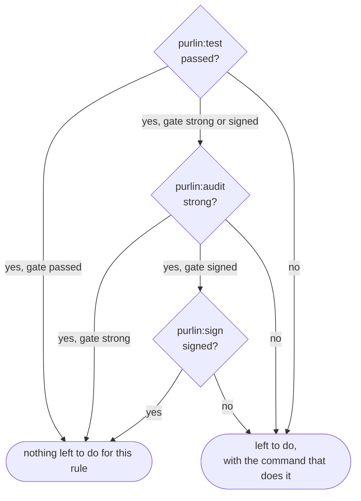

# How Purlin works

For anyone meeting Purlin for the first time, and for anyone who has to explain it. It is the
shortest description of the whole thing: one rule, three steps, and who takes each one.

A **rule** is one line in a spec saying what the software must do. A **proof** says in plain
language how that is shown. A **test** is any test in your own suite that carries one comment
above it naming the proof: `# purlin: login PROOF-4`. A rule goes through up to three steps, in
this order, each containing the one before: `passed`, `strong` and `signed`.

The **gate**, one setting in `.purlin/config.json`, is the last step every rule must reach
before a version is finished: `passed`, `strong` or `signed`. Every rule is asked what the gate
asks. The answer to each step is a **cell**, and a cell exists only at or below the gate, so a
project at `passed` shows no test strength and no `Strong` or `Signed` column. A proof marked
`@manual` is checked by a person, who signs the rule with `purlin:sign`, at any gate.
[references/hard_gates.md](../references/hard_gates.md) is the one definition.

## The loop, and where it runs

`purlin:spec`, `purlin:build`, `purlin:test`, `purlin:audit`, `purlin:sign`, then `git push`.
Every step runs on your own machine, at every gate. A project at `signed` on one laptop is the
ordinary case: you write the rule, you build it, you run the tests, you audit them, you sign
them, `purlin:sign` writes the tag, and you push. The gate says how far down the loop you go:
`passed` stops after the test, `strong` adds the audit, `signed` adds the signature.
`purlin:sign` with no argument walks the rules waiting for someone to test by hand or to sign,
at every gate; at `signed`, once nothing is left to do and every result came from committed
work, it writes the evidence package and the tag.

## Five words

**A push is `git push`, typed by you.** Any branch, any time. A command writes, commits where
you asked it to, and stops. `purlin:test --remote` is the one command that pushes, and it
pushes a run branch of its own, never the branch you are on. At the gate `signed`, `purlin:sign`
ends on the line `Nothing left to do. Push the tag to release it: git push origin signed/<version>`.

**The tag marks a finished version.** At the gate `signed`, when nothing is left to do and every
result came from committed work, `purlin:sign` writes the evidence package,
`.purlin/evidence/package/<version>.json`, commits it, and writes the signed tag
`signed/<version>` (`git tag -s`) on that commit. It prints `Tagged signed/<version> at <sha7>.`
and then the line naming the push. It writes no tag while anything is left to do, while the
working tree or a feature's results are not committed, or over a tag that already exists, and
none below the gate `signed`. A tag holds the whole tree at that commit, so the code, every
evidence file and every signature are pinned together by one name. What the tag means is
defined once, in [hard_gates.md](../references/hard_gates.md).

**The evidence is what runs saw**: one `.purlin/evidence/<source>/<feature>.json` per feature
per source, with one section per operating system, and one `.purlin/tests.md` table for the
whole project. Your runs write into `.purlin/evidence/local/`. `purlin:test` writes both and
commits nothing; `purlin:test --commit` commits the specs, the marked tests and the settings the
results describe, then the evidence as `purlin: evidence at <sha7>`, so a teammate reads your
run on the git host without running anything. A section goes `out of date` when the spec, the
code the spec covers (`> Scope:`) or the tests change, and the next run clears it.

**An audit writes into the same evidence**: per rule, what the AI audit found, and the test
strength where mutation testing is on. `purlin:audit` writes it into
`.purlin/evidence/local/<feature>.json` and `purlin:audit --commit` commits it the same way.

**A signature is a person's attestation** that a rule, its proof, its test, the code its
feature lists, what the audit found and the machine the tests ran on for each operating system
belong together. It records the signer's name and email as git holds them, the time and the
fingerprint of the key, and not the machine it was signed on. `purlin:sign` writes it in a
signed commit. A change to any of the six ends it: the status prints one line naming the rule,
the signer and why it ended, its cell reads `unsigned`, and the rule is left to do as `to sign`.
A hand check's signature is made over the rule's and its proofs' wording alone.

| File | Written by | Where it lands |
|------|-----------|----------------|
| evidence | `purlin:test`, `purlin:audit` | `.purlin/evidence/local/<feature>.json` and `.purlin/tests.md` |
| signature | `purlin:sign` | `specs/<category>/<feature>.signatures/` |
| evidence package | `purlin:sign`, `purlin:export` | `.purlin/evidence/package/<version>.json` |

## When a project has a runner

Most projects have none, and nothing above needs one. `purlin:init` writes a runner file,
`.github/workflows/purlin.yml` on GitHub or `purlin.azure-pipelines.yml` on Azure DevOps, for
one reason: a proof in `specs/` is tagged `@env` for an operating system the machine running
setup is not. It holds one job for each such system, and no other.

The runner file runs on a push to a `run/*` branch and on a push of a `signed/*` tag.
`purlin:test --remote` creates the run branch, waits for the run through `gh` on GitHub or `az`
on Azure DevOps, pulls back what the runner committed under `.purlin/evidence/ci/`, and deletes
the branch. A runner runs only the tests tied to proofs tagged `@env` for its own system, and no
audit. A pushed tag starts a run that runs those tests on a clean machine and writes nothing.
Evidence from either folder counts at every gate.
[running-and-evidence.md](running-and-evidence.md) has it in full.

## Questions every developer asks

**What does a run end on?** The summary, one count per step up to the gate, such as
`3 rules. 2 pass their tests.`, then `Left to do`, one line per kind of work left with its count
and its command. The first line of `Left to do` is the next step. A project with nothing left
ends on `Nothing left to do.` at `passed` and `strong`, and at `signed` on the line naming the
push of the tag. [getting-started.md](getting-started.md) shows both endings from a real run.

**Do my tests run on my machine, or somewhere else?** On your machine. `purlin:test` runs the
marked tests the change touched and writes what they saw, and the dashboard shows that run's
results the next time you open it; `purlin:test --all` runs every feature. `purlin:audit` runs
there too, and what it finds counts at every gate. Nothing has to leave the machine for a rule
to read `passed`, `strong` or `signed`.

**When does `purlin:test` exit 1?** When a tied test failed or did not run, evidence is
missing, a comment above a test names nothing a spec has, the settings file is missing or
cannot be read, the project was set up by Purlin 0.9.5 and not upgraded, or no test command is
set. A test run cannot make an audit or a signature appear, so a rule waiting for one never
makes it exit 1. [purlin_commands.md](../references/purlin_commands.md#exit-codes) lists every
command's exit codes.

**What keeps a rule from the gate?** At `passed`: a failed test, a rule with no test, a result
that is `out of date`, a rule whose tests passed on one operating system and failed on another,
or a system that has not run its tests. At `strong`: a rule with no proof, no audit of the
current rule, proof and test, a finding or a test strength under the minimum, or a `@manual`
proof no person has checked. At `signed`: no signature that still counts. Each is a line of
`Left to do`, with the command that clears it.

**What if a rule has no proof?** At `passed` a proof is optional: a test may carry the rule's
own id, `# purlin: login RULE-2`. The passed cell reads `no test` with the reason
`no proof written` only when neither a proof nor a marked test names the rule. From `strong` up
a proof is required: a rule whose tests pass and that has no proof reads `no proof` in its
strong cell, and is left to do as `to write a proof for`, with `purlin:spec`.

**What is the difference between `not audited` and `weak`?** `not audited` means the gate is
`strong` or `signed` and the evidence holds no audit entry for the rule's current text, proof
and test: it is left to do as `to audit`, and `purlin:audit` clears it. `weak` means the AI
audit ran and found a gap or could not decide whether the test shows what the proof says, or
the test strength is under `min_strength`: it is left to do as `to strengthen`, with
`purlin:build`, or as `to measure`, with `purlin:audit`, where only the strength could not be
measured. A rule whose tests have not passed reads neither: its strong cell reads `waiting`,
with the reason `waiting for its tests to pass`.

**When do I say which operating system a test needs?** On the proof line, with `@env(windows)`,
`@env(macos)` or `@env(linux)`. A proof with no `@env` runs anywhere, and a pass on any
operating system satisfies it. Your machine runs the untagged proofs and the ones tagged for it;
a proof tagged for another system reads `not run`, with a reason such as
`Windows: no run yet`, until that system runs it, and the rule is left to do as
`to test on Windows`, with `purlin:test --remote`.

**What does `partial` mean?** The passed cell keeps one entry per operating system a current
run covered, each section answering for the proofs it lists, and it reads `partial` when two
systems that each have a current section disagree. A system a proof is tagged for with no
current section makes it read `not run`. `partial` is not met, and the rule is left to do as
`to fix`. Test strength does not depend on the system:
[hard_gates.md](../references/hard_gates.md#the-three-steps) says how it is measured.

## Read next

Pick the gate you work at: [getting-started.md](getting-started.md) for `passed` and the first
session, [team-workflow.md](team-workflow.md) for `strong`,
[regulated-workflow.md](regulated-workflow.md) for `signed`.
