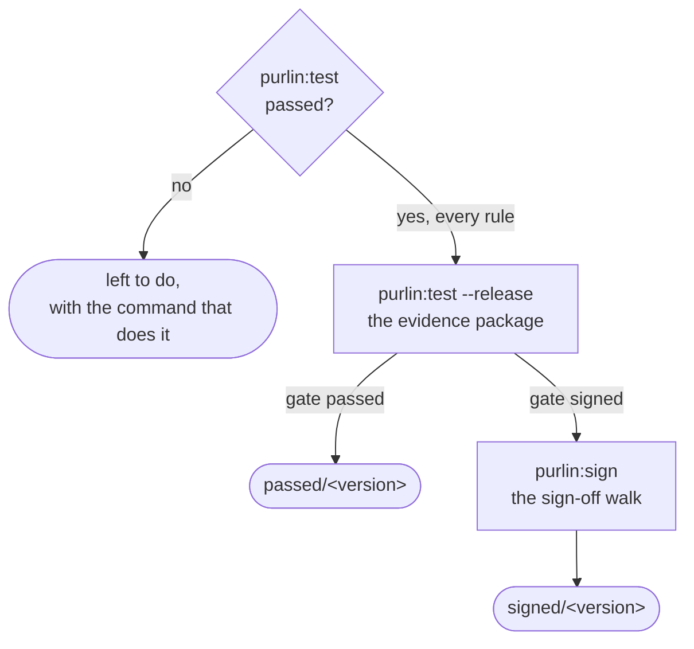

# How Purlin works

For anyone meeting Purlin for the first time, and for anyone who has to explain it. It is the
shortest description of the whole thing: one rule, two cells, a release, and who takes each step.

A **rule** is one line in a spec saying what the software must do. A **proof** says in plain
language how that is shown. A **test** is any test in your own suite that carries one comment
above it naming the proof: `# purlin: login PROOF-4`. Every rule carries two cells: `passed`,
whether its marked tests passed, and `strong`, what the AI audit found those tests to be, where
the audit ran.

The **gate**, one setting in `.purlin/config.json`, says what a release asks: `passed`, every
rule's tests pass on the evidence committed at the release commit; or `signed`, the same, and at
least one person signs the evidence package. The gate reads the passed cell alone. The audit and
mutation testing are tools you run with `purlin:audit`, at either gate, and nothing waits on
them; the strong cell and the `Strong` column show what they found only where they ran. A proof
marked `@manual` is checked by a person in the sign-off walk at the gate `signed`.
[references/hard_gates.md](../references/hard_gates.md) is the one definition.

## The loop, and where it runs

`purlin:spec`, `purlin:build`, `purlin:test`, and `purlin:audit` where you want it, then
`git push`. Every step runs on your own machine, at either gate. Nothing is signed while the
specs change: product, QA and the developers improve rules, proofs and tests together, and
`Left to do` lists only work. When nothing is left, a release branch runs `purlin:test --release`,
and at the gate `signed` a person then runs `purlin:sign`. A project at `signed` on one laptop is
the ordinary case: you write the rule, you build it, you run the tests, you release, you sign, and
you push the tag.

## Five words

**A push is `git push`, typed by you.** Any branch, any time. A command writes, commits where
you asked it to, and stops. `purlin:test --remote` is the one command that pushes, and it
pushes a run branch of its own, never the branch you are on. A release ends on the line
`Nothing left to do. Push the tag to release it: git push origin <tag>`.

**A release is a commit, a package and a tag.** `purlin:test --release` runs every test, commits
the evidence and the evidence package, `.purlin/evidence/package/<version>.json`, and at the gate
`passed` writes the tag `passed/<version>` on that commit, unsigned. At `signed` the first
`purlin:sign` writes the signed tag `signed/<version>` (`git tag -s`) on its sign-off commit, and
later sign-offs are added after it. A release is refused while a rule's tests do not pass, a spec
cannot be read, the working tree holds uncommitted changes, or the branch's copy on the host holds
commits the checkout lacks, and no tag that exists is moved. A tag holds the whole tree at that
commit, so the code, every evidence file, the package and the sign-offs are pinned together by
one name. What each tag means is defined once, in [hard_gates.md](../references/hard_gates.md).

**The evidence is what runs saw**: one `.purlin/evidence/<source>/<feature>.json` per feature
per source, with one section per operating system, and one `.purlin/tests.md` table for the
whole project. Your runs write into `.purlin/evidence/local/`. `purlin:test` writes both and
commits nothing; `purlin:test --commit` commits the specs, the marked tests and the settings the
results describe, then the evidence as `purlin: evidence at <sha7>`, so a teammate reads your
run on the git host without running anything. A section goes `out of date` when the spec, the
code the spec covers (`> Scope:`) or the tests change, and the next run clears it. Evidence may be
committed on any branch; a release uses only the evidence at the release commit.

**An audit writes into the same evidence**: per rule, what the AI audit found, and the test
strength where mutation testing is on. `purlin:audit` writes it into
`.purlin/evidence/local/<feature>.json` and `purlin:audit --commit` commits it the same way.

**A sign-off is a person's signature over a release's evidence package**: a file in a signed
commit carrying the package's fingerprint, the signer's name and email as git holds them, the
time, the fingerprint of the key, what the walk showed the signer and every note they typed. It
records no judgment. Several people may sign one release, each once.

| File | Written by | Where it lands |
|------|-----------|----------------|
| evidence | `purlin:test`, `purlin:audit` | `.purlin/evidence/local/<feature>.json` and `.purlin/tests.md` |
| evidence package | `purlin:test --release`, `purlin:export` | `.purlin/evidence/package/<version>.json` |
| sign-off | `purlin:sign` | `.purlin/evidence/package/<version>.signoffs/` |

## When a project has a runner

Most projects have none, and nothing above needs one. `purlin:init` writes a runner file,
`.github/workflows/purlin.yml` on GitHub or `purlin.azure-pipelines.yml` on Azure DevOps, for
one reason: a proof in `specs/` is tagged `@env` for an operating system the machine running
setup is not. It holds one job for each such system, and no other.

The runner file runs on a push to a `run/*` branch and on a push of a `signed/*` tag.
`purlin:test --remote` creates the run branch, waits for the run through `gh` on GitHub or `az`
on Azure DevOps, pulls back what the runner committed under `.purlin/evidence/ci/`, and deletes
the branch. A runner runs only the tests tied to proofs tagged `@env` for its own system, and no
audit. A pushed `signed/*` tag starts a run that runs those tests on a clean machine and writes
nothing. Evidence from either folder counts at either gate.
[running-and-evidence.md](running-and-evidence.md) has it in full.

## Questions every developer asks

**What does a run end on?** The summary, such as `3 rules. 2 pass their tests.`, with
`The audit found <s> strong and <w> weak.` added where the audit read a rule, then `Left to do`,
one line per kind of work left with its count and its command. The first line of `Left to do` is
the next step. A project with nothing left ends on the release step,
`Nothing left to do. To release a version: purlin:test --release`, with `, then purlin:sign` at
the gate `signed`. [getting-started.md](getting-started.md) shows both endings from a real run.

**Do my tests run on my machine, or somewhere else?** On your machine. `purlin:test` runs the
marked tests the change touched and writes what they saw, and the dashboard shows that run's
results the next time you open it; `purlin:test --all` runs every feature. `purlin:audit` runs
there too. Nothing has to leave the machine for a rule to read `passed` or `strong`.

**When does `purlin:test` exit 1?** When a tied test failed or did not run, evidence is
missing, a comment above a test names nothing a spec has, the settings file is missing or
cannot be read, the project was set up by Purlin 0.9.5 and not upgraded, or no test command is
set. What the audit found never makes it exit 1.
[purlin_commands.md](../references/purlin_commands.md#exit-codes) lists every command's exit
codes.

**What keeps a rule from a release?** A failed test, a rule with no test, a result that is
`out of date`, a rule whose tests passed on one operating system and failed on another, or a
system that has not run its tests. Each is a line of `Left to do`, with the command that clears
it. A weak rule is left to do as `to strengthen`, with `purlin:build`, and never stops a release.

**What if a rule has no proof?** At `passed` a proof is optional: a test may carry the rule's
own id, `# purlin: login RULE-2`. The passed cell reads `no test` with the reason
`no proof written` only when neither a proof nor a marked test names the rule. A rule whose
tests pass and that has no proof reads `no proof` in its strong cell; at `signed` it is left to
do as a rule to write a proof for, with `purlin:spec`, and it does not stop a release.

**What is the difference between `not audited` and `weak`?** `not audited` means the evidence
holds no audit entry for the rule's current text, proof and test; `purlin:audit` writes one when
you run it. `weak` means the AI audit ran and found a gap or could not decide whether the test
shows what the proof says: it is left to do as `to strengthen`, with `purlin:build`. A measured
test strength is a reason beside the word, `strength 84%`, and never changes it. A rule whose
tests have not passed reads neither: its strong cell reads `waiting`.

**When do I say which operating system a test needs?** On the proof line, with `@env(windows)`,
`@env(macos)` or `@env(linux)`. A proof with no `@env` runs anywhere, and a pass on any
operating system satisfies it. Your machine runs the untagged proofs and the ones tagged for it;
a proof tagged for another system reads `not run`, with a reason such as
`Windows: no run yet`, until that system runs it, and the rule is left to do as
`to test on Windows`, with `purlin:test --remote`.

**What does `partial` mean?** The passed cell keeps one entry per operating system a current
run covered, each section answering for the proofs it lists, and it reads `partial` when two
systems that each have a current section disagree. A system a proof is tagged for with no
current section makes it read `not run`. `partial` is not met, and the rule is left to do as
`to fix`. Test strength does not depend on the system:
[running-and-evidence.md](running-and-evidence.md#test-strength) says how it is measured.

## Read next

Pick the way you work: [getting-started.md](getting-started.md) for the first session at
`passed`, [team-workflow.md](team-workflow.md) for a team, and
[regulated-workflow.md](regulated-workflow.md) for `signed`.
