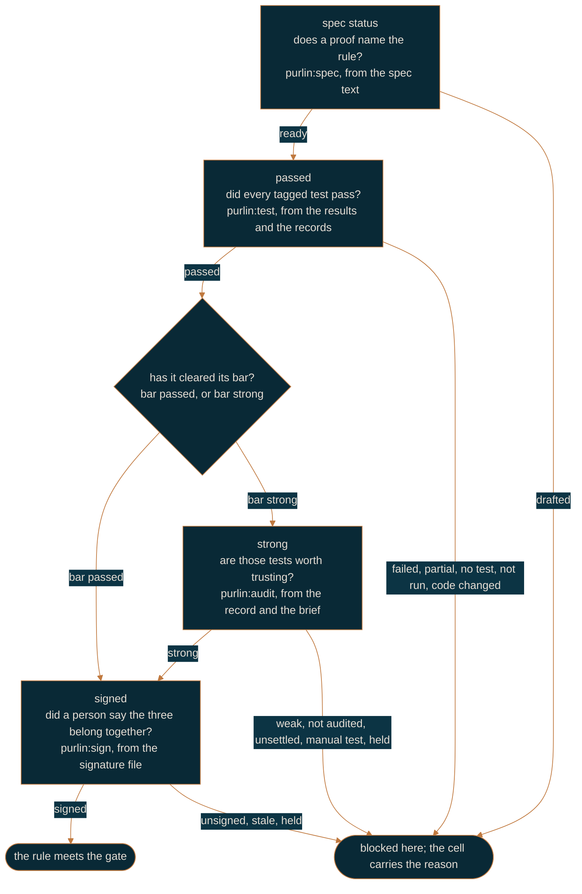

# How Purlin works

For anyone meeting Purlin for the first time, and for anyone who has to explain it. It is the
shortest description of the whole thing: one rule, four questions, and who is allowed to answer
each one.

A **rule** is one line in a spec saying what the software must do. A **proof** says how that
claim is observed. A **test** is the executable form of a proof, tagged with the rule it
settles. Every rule answers the same four questions, top to bottom.

The **gate**, the one setting in `.purlin/config.json`, says how many of the three evidence
levels a project asks for. `passed` asks one, `strong` asks two, `signed` asks three. A cell
above the gate does not exist, so a project at `passed` never sees a strength, a bar, a review
list or a signature.

Every rule also has a **bar**, `passed` or `strong`: the evidence that rule must have before it
can be signed. A rule says its own with the tag `[bar: passed]` or `[bar: strong]`, and a rule
with no tag takes the project's gate as its bar. A rule **meets the gate** when nothing up to
the gate's level blocks it: its tests pass, its bar is cleared, no hold is current, and where a
signature is required it counts. A rule whose bar is `passed` is therefore not held to the
strong cell even at the `strong` gate.
[references/hard_gates.md](../references/hard_gates.md) is the one definition.

## Five words

**A push is `git push`, typed by a person.** No skill, no agent and no hook pushes, and none
opens a pull request. A command commits, prints `Run: git push` and stops. If a pre-push hook
is installed it refuses a push made from an agent session outright.

**A remote run is `purlin:test --remote`, the one case in which Purlin pushes.** It pushes a
**run branch**, `run/<branch>-<sha7>`, which it creates, waits on, pulls the records back from
and deletes. The branch you are working on is never pushed. A remote runner is worth having for
three reasons and no others, and they are set out in
[solo-workflow.md](solo-workflow.md#when-you-want-a-remote-runner): your tests need another
operating system; proof from a clean machine that ran exactly the pushed code; no merge while
red.

**The test results are what your own run saw**: one `.purlin/tests/<feature>.json` per feature
and one `.purlin/tests.md` table for the whole project. `purlin:test` writes both and commits
them itself as `purlin: tests at <sha7>`, so a teammate reads your run on the git host without
running anything. They are a `local` source, so they count at `passed` and at `strong`; at
`signed` only a CI run's results do.

**A record is the machine's evidence of one audit run**: which commit, which operating system,
every proof's result, and the test strength. `purlin:audit` writes one per feature it audited
and commits it as `purlin: record for <sha7>`; the CI job writes the same files from the
runner. Which of the two wrote it is the record's **source**, and the folder it sits in is the
answer: `.purlin/records/ci/<feature>/` holds what CI wrote, `.purlin/records/local/<feature>/`
holds what a run on somebody's machine wrote. A file whose own `source` field disagrees with
its folder is ignored, with a warning. At `strong` both count, so your own audit proves a rule
strong. At `signed` only `ci` counts, for the tests and the audit both, so nobody writes the
evidence their own change is measured by.

**A signature is a named person's attestation** that a rule, its proof and its test belong
together, bound to the hashes of all three and to the rule's bar. `purlin:sign` writes it
in a signed commit. CI writes no signature file, ever. Change any of the four and the signature
reads `stale`.

## Who writes what, where it lands, and who may touch it

| File | Written by | Where it lands | Who may write it |
|------|-----------|----------------|------------------|
| test results | `purlin:test` | `.purlin/tests/<feature>.json` and `.purlin/tests.md` | you, at every gate. They count at `passed` and `strong` |
| record | `purlin:audit`, and the CI job | `.purlin/records/local/<feature>/`, or `.purlin/records/ci/<feature>/` | anyone, into `local/`; CI alone, into `ci/`, through the git host's API |
| brief | `purlin:audit`, and the CI job | `.purlin/briefs/local/<feature>/`, or `.purlin/briefs/ci/<feature>/` | the same two hands, into the same two folders |
| signature | `purlin:sign <feature> RULE-N` | `specs/<category>/<feature>.signatures/` | a person, in a signed commit; under `signed`, one on the signer list |
| hold | `purlin:sign <feature> RULE-N --hold "<case>"` | the same directory, `.hold.json` | any person, in a signed commit |

A branch rule restricts `.purlin/records/ci/**` and `.purlin/briefs/ci/**` to the CI identity,
so a person cannot push a file into the folder `signed` reads. The `local/` folders carry no
such rule: anyone writes those, and they count up to `strong`. The signature directory carries
no rule either, and needs none: a person is supposed to write those, and five conditions, read
from git and from the file, decide whether one counts.

## Where CI runs

The workflow `purlin:init` writes starts on three things and nothing else: a pull request, a
push to the protected branch, and a push to a `run/*` branch. A push to any other branch starts
nothing. A pull request run does the tests, posts the comment and uploads the dashboard, and
commits nothing. A run on the protected branch, or on a run branch, commits its records and
briefs there, under `.purlin/records/ci/` and `.purlin/briefs/ci/`. Every run ends with the
gate check and fails when the gate is not met.

## Questions every developer asks

**What is the loop?** At `passed` it is `purlin:spec`, `purlin:build`, `purlin:test`, then
`git push`, and that is it: no audit, no record, no script to run. `purlin:test` prints the
table and the line `gate passed: <n> of <rules>`, which is the check. At `strong` and above CI
adds the audit and the record, and the loop you type stays the same.

**Do my tests run on my machine, or only in CI?** On your machine first. `purlin:test` runs
the tagged tests in seconds, commits what they saw and the board reads it at once. CI runs the
same tests on the git host, and at `strong` and above audits them and writes the record. The
gate decides which evidence counts: at `passed` your committed test results do, so you can
meet the gate without CI; at `strong` your own `purlin:audit` record counts as well, so a rule
reads `strong` without waiting for a runner; at `signed` only CI's tests and CI's audit count,
and a local run there is a preview of what CI will find.

**What is my git host?** The service that holds your repository and runs CI: GitHub or Azure
DevOps. `purlin:init` reads it from your `origin` remote and writes it as `ci` in
`.purlin/config.json`. The green check or red cross beside a commit, the pull request comment
and the branch rules all live there.

**What does red mean?** The check ran the tests and at least one rule does not meet your gate.
The run's log ends with a list naming each rule and why. At `passed` that is a failed test, a
rule with no test, or a rule whose tests passed on one operating system and not on another.
At `strong` the tests passed but a rule's tests are not yet trusted: the breaks got past them,
no audit has run on this code, or a proof waits on a person to run it or judge it. At `signed`
a rule that needs a signature has none, or the code changed after it was signed. Red never stops a push; with the branch
rule applied it stops the merge until the list is dealt with.

**What does a bar do?** It decides three things and nothing else: the evidence the rule must
have before anyone can sign it, whether the AI audit runs on it, and whether it needs a
signature at all. The AI audit runs on every rule whose bar is `strong` and on no other, so a
rule whose bar is `passed` never reads `not audited` or `unsettled`. Under `signed` a rule
needs a signature when the project's `sign_at` is `all`, or when its own bar is `strong`.
A rule that has cleared its bar and is still waiting for a signature is **signable**, which
is what the board's `Signable` column counts and what the Sign list holds.

**What is the difference between `not audited` and `unsettled`?** `not audited` means the
rule's bar is `strong` and no audit has run on this code yet: it waits for `purlin:audit`, not
for you, so it is on no tab. `unsettled` means the AI audit did run and could not settle
whether the test proves the proof, so a person judges it. That one is on the Review tab.

**When do I say which operating system a test needs?** On the proof line, with `@env(windows)`,
`@env(macos)` or `@env(linux)`. A proof with no tag runs anywhere and any operating system's
pass satisfies it. Your machine runs the untagged proofs and the ones tagged for it; a proof
tagged for another system reads `not run` until that system runs it. `purlin:init` reads the
tags and writes the CI matrix from them: one Linux job always, plus one job per tagged system.
macOS is never in the matrix by default, so your Mac is the macOS runner, and what it ran is
what the rule screen shows against `macos`.

**What does `partial` mean?** The passed cell keeps one entry per operating system a counting
run covered, and it reads `partial` when the rule's tests passed on some of them and failed or
did not run on the others. `partial` is not met: it has its own tile and its own filter on the
board, at every gate, and it stands until every operating system the rule's proofs name has a
passing run. Test strength is not measured per operating system; one number covers the rule.

## Read next

Pick the gate you work at: [solo-workflow.md](solo-workflow.md) for `passed`,
[team-workflow.md](team-workflow.md) for `strong`,
[regulated-workflow.md](regulated-workflow.md) for `signed`.
[getting-started.md](getting-started.md) walks the first session.
