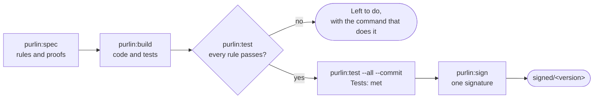

# How Purlin works

Purlin shows, rule by rule, that your software does what you said it must. People say what it
must do, and your own tests show it.

## One requirement becomes a rule, a proof and a test

| One requirement | As it is written |
|---|---|
| The requirement | Lock the account after five failed sign-ins. |
| The rule | `RULE-3: Lock the account for 15 minutes after 5 consecutive failures` |
| The proof | `PROOF-4 (RULE-3): A wrong password is entered five times. The sixth attempt is refused with the message "Account locked"` |
| The test | `# purlin: login PROOF-4` above your own test |

- A **rule** is one line in a spec saying what the software must do.
- A **proof** says in plain language how that is shown.
- A **test** is any test in your own suite with one comment above it naming the proof.

Purlin runs your own test command and reads its report. It says which rules pass on the code as
it is now.

## Purlin keeps two facts

It keeps the evidence of what the tests saw, and a person's sign-off over it. The terminal and
the dashboard open on both:

```
Tests: met
Sign-off: signed 0.1.0 at a1b2c3d
```

| Fact | What it reads |
|---|---|
| `Tests` | `met` when every rule's tests pass on the committed evidence, `not met` otherwise |
| `Sign-off` | `signed 0.1.0 at a1b2c3d` when a person signed this code |
| | `signed 0.1.0, 4 commits since` when the code moved on after the last sign-off |
| | `not signed` when nobody has signed |

Everything else Purlin prints is information.
[evidence_and_signoff.md](../references/evidence_and_signoff.md) is the one definition of both.

## Nothing is signed while the work goes on



- **Everyone edits the spec.** Product, QA and developers improve rules, proofs and tests
  together.
- **Every step runs on your own machine.** One person on one laptop is the ordinary case. A
  proof tagged `@env(windows)` needs a run on Windows, which your project sets up for itself:
  [running-and-evidence.md](running-and-evidence.md) has one worked example.
- **Every run ends on what to do next.** `Left to do` has one line per kind of work left, with
  its count and its command. Its first line is the next step.
- **The audit is optional.** `purlin:audit` asks whether your tests would catch a bug. Nothing
  waits on it. [audit.md](audit.md) says what it checks.
- **Signing is optional.** When the tests are met, a person runs `purlin:sign` whenever the
  team chooses. [sign-off.md](sign-off.md) walks through it.
- **No command pushes.** A push is `git push`, typed by you.

## A result stops counting when something changes

A result goes `out of date` when the spec, the tests or the code the spec covers change. The
next run clears it.

## The records are files in your repository

| File | Written by | Where it lands |
|------|-----------|----------------|
| evidence | `purlin:test`, `purlin:audit`, a project's own run on another system | `.purlin/evidence/local/<feature>.json`, `.purlin/evidence/ci/<feature>.json` |
| evidence package | `purlin:sign` | `.purlin/evidence/package/<version>.json` |
| sign-off | `purlin:sign` | `.purlin/evidence/package/<version>.signoffs/` |

`purlin:test` writes the evidence and does not commit it. `purlin:test --commit` commits the
work the results describe, then the evidence.

## Each rule reads one word for its tests and one for the audit

| Its tests | What the word means |
|---|---|
| `passed` | every test tied to the rule ran and passed |
| `failed` | a test tied to the rule failed |
| `no test` | the rule, or one of its proofs, has no test |
| `not run` | a test has not run yet, such as a slow test or one tagged for another operating system |
| `out of date` | the spec, the tests or the code changed since the last run |
| `partial` | the tests passed on one operating system and failed on another; it is not passing |
| `checked at sign-off` | a judgment call, tagged `@manual`; a person checks it when they sign |

| The audit | What the word means |
|---|---|
| `strong` | the spot tests found nothing, and the proof's test caught a planted bug |
| `weak` | a spot test flagged a test, or a planted bug was not caught; `purlin:build` strengthens the test |
| `spot-checked` | the spot tests found nothing, and no bug was planted and caught; the audit says why |
| `not audited` | no audit has read the rule |
| `waiting` | the rule's tests have not passed yet |

Each word carries its reason, such as `Windows: no run yet`.
[glossary.md](../references/glossary.md#the-chain) lists every word.

## Read next

- [getting-started.md](getting-started.md) for the first session.
- [working-together.md](working-together.md) for a team.
- [sign-off.md](sign-off.md) for the sign-off.
