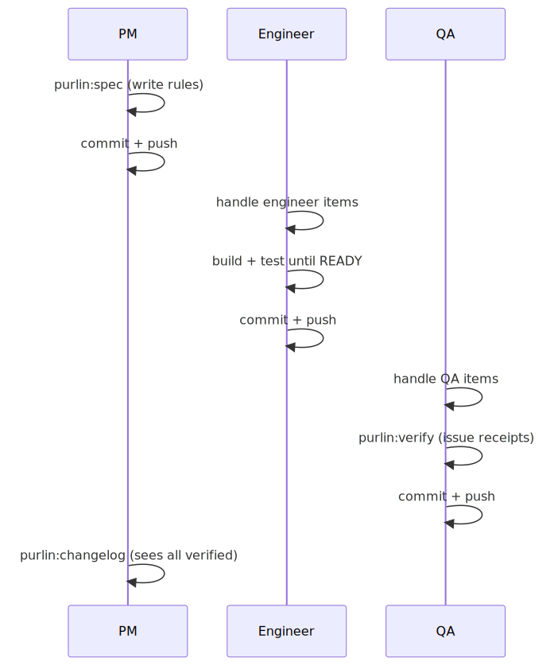

# The Purlin Lifecycle

## What You Need to Know

Purlin connects three roles through a simple loop: **write specs → build code → prove it works**.

```
purlin:spec <topic>     — define what the feature must do (rules + proof descriptions)
build <feature>         — implement code that satisfies the rules
test <feature>          — write tests, iterate until all rules pass
purlin:verify           — lock in verification receipts
```

**The progression:** UNTESTED → PARTIAL → PASSING → VERIFIED. Every rule needs a passing proof. Anchor rules count too.

**Anyone can do any job.** PMs write rules, engineers write code, QA writes tests — but nothing stops an engineer from writing rules or a PM from writing proofs. The roles below describe the typical flow, not restrictions.

---

## The Big Picture



Every role can do every job. The arrows show the typical flow, not restrictions.

## How It Works

1. **Specs define rules.** A PM (or engineer, or anyone) writes `RULE-1: passwords must be hashed with bcrypt`. Rules are the constraints — what must be true.
2. **Specs define proofs.** Each rule gets a proof blueprint: `PROOF-1 (RULE-1): Store a password; verify bcrypt hash in database`. Proofs describe how to verify the rule holds. An agent or engineer writes both rules and proofs together — they're two sides of the same spec.
3. **Tests implement proofs.** An engineer (or agent) writes a test marked `@pytest.mark.proof("login", "PROOF-1", "RULE-1")` that actually runs the assertion described in the proof blueprint.
4. **`purlin:status` shows the gaps.** 3/5 rules proved means 2 rules still need tests.
5. **`purlin:verify` locks it in.** All rules proved = verification receipt with a tamper-evident hash.

That's it. No tracking system, no ledger, no state files. The filesystem is the state.

### Spec Format

```markdown
# Feature: login

> Description: User authentication with email and password.
> Requires: security_policy
> Scope: src/auth/login.js, src/auth/session.js
> Stack: node/express, bcrypt, jsonwebtoken

## What it does
User authentication with email and password.

## Rules
- RULE-1: Passwords are hashed with bcrypt before storage
- RULE-2: Failed logins are rate-limited to 5 per minute

## Proof
- PROOF-1 (RULE-1): Store a password; verify bcrypt hash in database @integration
- PROOF-2 (RULE-2): Submit 6 invalid passwords; verify the 6th returns 429 @integration
```

**`## Rules`** — what must be true. Each rule is a testable constraint tracked by `purlin:status`.
**`## Proof`** — how to verify each rule. Proof descriptions guide whoever writes the test (human or agent).
**`> Requires:`** — anchors or other specs whose rules also apply to this feature.
**`> Scope:`** — which files this feature touches.

Full format: [references/formats/spec_format.md](../references/formats/spec_format.md)
Quality guide: [references/spec_quality_guide.md](../references/spec_quality_guide.md) — how to write good rules, proofs, and anchors

### Coverage States

**Feature-level statuses** (progression: UNTESTED → PARTIAL → PASSING → VERIFIED):

| Status | Meaning |
|--------|---------|
| VERIFIED | ALL behavioral rules proved + receipt matches |
| PASSING | ALL behavioral rules proved, no receipt yet |
| PARTIAL | Some rules proved, none failing — more tests needed |
| FAILING | Any proof has status FAIL |
| UNTESTED | No behavioral proofs at all |

**Rule-level statuses** (shown per-rule in detailed output):

| State | Meaning |
|-------|---------|
| PASS | Rule has a passing proof |
| FAIL | Rule has a failing proof |
| NO PROOF | No test linked to this rule |
| MANUAL PROOF STALE | Manual stamp exists but code changed since |
| MANUAL PROOF NEEDED | Manual proof declared but not stamped |

### Coverage at a glance

`purlin:status` shows a summary of all features with their coverage:

```
Summary: 42 features | 22 VERIFIED | 13 PASSING | 6 PARTIAL | 0 FAILING | 1 UNTESTED
```

Each feature gets detailed per-rule coverage. Features needing attention (FAILING, PARTIAL) sort to the top. Uncommitted spec/proof changes are flagged so you know the report may not reflect the latest state.

The integrity score comes from the last `purlin:audit` run. It shows what percentage of proofs are STRONG — tests that meaningfully prove their rules. Run `purlin:audit` after significant test changes to refresh the score.

### Verification Receipts

`purlin:verify` runs all tests and issues a receipt: `verify: [Complete:all] features=3 vhash=f7a2b9c1`. The `vhash` proves these rules had these test outcomes.

---

## PM Workflow

### Just do this

```
/purlin:drift pm        ← see what changed and what you need to do
handle PM items          ← Claude updates all affected specs, you review each one
/purlin:status           ← confirm coverage looks right
```

That's the daily loop. Everything below is detail for when you want more control.

---

**The PM defines what the software must do.** They own the rules — the testable constraints that the code must satisfy. Purlin helps PMs transform raw ideas (PRDs, customer feedback, Slack threads) into structured specs with numbered rules and proof descriptions. When engineers build and test, the PM sees exactly which rules are proved and which aren't via `purlin:status`. No more "is this feature done?" — the coverage number answers it.



### Quick commands

| What you want | What you type |
|---------------|---------------|
| See what changed | `/purlin:drift pm` |
| Handle all PM work | `handle PM items` |
| See rule coverage | `/purlin:status` |
| Write a new spec | `write a spec for notifications` |
| Add a rule to a spec | `add a rule to login: passwords must expire after 90 days` |
| Update a spec after code changed | `update the spec for login to reflect the recent changes` |
| Stamp a manual proof | `/purlin:verify --manual login PROOF-3` |
| Open the dashboard | Open `purlin-report.html` in a browser |

### Turning ideas into specs

You don't need to know Purlin's format. Just give Claude your raw input — a PRD, customer feedback, a Slack thread, or a plain English description — and it extracts the spec for you.

**From a plain description:**
```
I need password reset. Users click "forgot password", get an email with a link,
click it, set a new password. The link should expire after 24 hours.
```

Claude drafts a complete spec with rules (`RULE-1: POST /reset sends email with link`, `RULE-2: Link expires after 24 hours`, ...) and proof descriptions. Review the draft, adjust, done.

**From a PRD or requirements doc:**
```
Here's our PRD for the checkout flow: [paste or reference the doc]
```

Claude reads the entire document, extracts every testable constraint as a rule, generates proof descriptions, suggests anchors if it detects cross-cutting concerns (API conventions, security requirements), and presents the complete spec. It only asks follow-up questions about genuine gaps — not things already answered in the PRD.

**From a vague description (assumed tags):**
```
I need password reset. Link should expire quickly.
```

Claude drafts:
```
RULE-1: POST /reset sends email with link
RULE-2: Link expires after 24 hours (assumed — user said "quickly")
RULE-3: Clicking valid link allows new password
RULE-4: Expired link shows error message
```

The PM sees `(assumed)` on RULE-2 and says "actually make it 1 hour, not 24." Claude updates and removes the tag. Rules without a tag are implicitly accepted; the PM can also change a tag to `(confirmed)` to signal explicit approval.

**From customer feedback:**
```
Customers are complaining that search is slow and doesn't handle typos.
```

Claude translates complaints into rules: `RULE-1: Search returns results in under 500ms`, `RULE-2: Search handles common typos via fuzzy matching`. The PM refines the thresholds and priorities.

**What the PM DOESN'T do:**
- Write `RULE-N:` format — Claude does that
- Know what `> Requires:`, `> Scope:`, or `> Stack:` mean — Claude fills metadata automatically
- Decide on proof tiers (`@integration`, `@e2e`, `@manual`) — Claude applies the heuristics
- Write proof descriptions — Claude generates observable assertions from the rules

**What the PM DOES do:**
- Describe what the feature should do in their own words
- Review the drafted rules — are they right? Are any missing?
- Answer gap questions — "You mentioned 'fast.' Under 200ms? Under 1 second?"
- Stamp manual proofs for things automation can't check (brand voice, UX feel)

### Updating specs when code changes

Engineers change code. The PM needs to know: do the specs still match? Here's the workflow:

**Step 1: See what changed**
```
/purlin:drift pm
```

The drift report shows NEEDS ATTENTION items and ends with ACTION ITEMS — a complete list of everything the PM needs to do:

```
ACTION ITEMS (PM):
  1. Spec drift: skill_build — 7 new behaviors not covered by existing rules → Run: purlin:spec skill_build
  2. Spec drift: purlin_references — 3 new sections not covered → Run: purlin:spec purlin_references
  3. Missing spec: notifications — new code with no spec → Run: purlin:spec notifications
```

**Step 2: Handle all items at once**

Instead of updating specs one by one, just say:
```
handle PM items
```

Claude runs through every item in the ACTION ITEMS list, invoking `purlin:spec` for each affected feature. Or update one at a time:
```
update the spec for login to reflect the recent changes
```

Claude reads the existing spec and the code diff, then presents a **delta report** — showing exactly what will change and what stays:

```
Spec: specs/auth/login.md (5 rules currently)

KEEPING (unchanged):
  RULE-1: Returns 200 with JWT on valid credentials ✓
  RULE-2: Returns 401 on invalid credentials ✓
  RULE-3: Passwords compared using bcrypt ✓

ADDING:
  RULE-6 (new): Rate limiting blocks after 10 failed attempts per minute
    Reason: rate_limit.js was added in recent commit

UPDATING:
  RULE-4 (changed): Session timeout after 60 minutes
    Was: "Session timeout after 30 minutes"
    Reason: config changed from 30 to 60

REMOVING:
  (none)

Approve these changes? [y/n/edit]
```

The PM reviews and approves. Existing rules stay intact. New rules are added at the end. Changed rules are updated in place. Nothing happens without PM approval.

**Step 3: Check coverage**
```
/purlin:status
```

After spec updates, new rules show as NO PROOF — which is correct. The engineer writes tests for the new rules.

**What the PM DOESN'T do:**
- Manually diff code against specs
- Renumber rules or write RULE-N format
- Figure out which specs are affected by code changes
- Write proof descriptions from scratch

**What the PM DOES do:**
- Run drift detection to see what changed
- Say "update the spec for X" and review the proposed deltas
- Approve or adjust the changes

### What PMs own

- **Rules** in the `## Rules` section — what the code must do
- **Proof descriptions** in the `## Proof` section — what tests should verify (the blueprint, not the test code)
- **Manual proof stamps** — verifying things automation can't check (brand voice, UX feel)

### PMs can also

- Write code and tests (just ask Claude)
- Run tests (`test login`)
- Verify features (`/purlin:verify`)
- Create anchors from external sources (`/purlin:anchor sync`)

---

## Engineer Workflow

### Just do this

```
/purlin:drift eng        ← see what needs work
handle engineer items    ← Claude builds code + tests for each gap, iterates until VERIFIED
/purlin:verify           ← lock it in with a verification receipt
```

That's it. Build, test, verify. Everything below is detail for when you want more control.

---

**The Engineer builds code that satisfies the rules and writes tests that prove it.** Purlin injects the spec's rules into the build context so the engineer always knows what constraints to satisfy. The build/test loop is simple: write code, write proof-marked tests, run them, iterate until `purlin:status` shows PASSING (all rules proved). Then `purlin:verify` issues a receipt, moving the feature to VERIFIED. When rules and proofs align, the engineer ships with confidence — the verification receipt proves the code does what the spec says.



### Quick commands

| What you want | What you type |
|---------------|---------------|
| See what needs work | `/purlin:drift eng` |
| Build a feature | `build login` |
| Test a feature | `test login` |
| Handle all engineer work | `handle engineer items` |
| Work through all gaps | `work through the engineer action items` |
| See coverage | `/purlin:status` |
| Check proof quality | `purlin:audit login` |
| Ship it | `/purlin:verify` |
| Open the dashboard | Open `purlin-report.html` in a browser |

### The build/test loop

This is the most common workflow. You say `test login` and Claude:

1. Reads the spec and its rules
2. Checks if code exists — builds it if not
3. Writes tests with proof markers
4. Runs `purlin:unit-test`
5. If tests fail, fixes and retries
6. Repeats until `purlin:status` shows VERIFIED

You can also say `build login` to just write code (Claude injects the spec rules into context), then `test login` separately.

### Proof quality audit

After `purlin:verify`, an audit runs automatically (three passes: proof-file structural checks → static defect detection → LLM classification + semantic alignment). Structural-only proofs are EXCLUDED from integrity scoring. `assert True` and friends get caught deterministically as HOLLOW. Everything else goes to the LLM for STRONG/WEAK judgment. Fix HOLLOW and WEAK proofs in the build loop and re-verify.

### Engineers can also

- Write and edit specs (`write a spec for notifications`)
- Stamp manual proofs (`/purlin:verify --manual login PROOF-3`)
- Create anchors (`/purlin:anchor sync`)
- Review drift reports for any role (`/purlin:drift pm`)

---

## QA Workflow

### Just do this

```
/purlin:drift qa         ← see what needs testing or re-verification
handle QA items          ← Claude writes missing tests, you stamp manual proofs
/purlin:verify           ← issue receipts for PASSING features (all rules proved → VERIFIED)
```

Drift, verify, ship. Everything below is detail for when you want more control.

---

**QA verifies that the code truly meets the spec — not just that tests pass, but that the right tests exist.** Purlin shows QA exactly which rules have proofs and which don't, which manual proofs are stale, and which features are PASSING (all rules proved, ready for receipt) vs PARTIAL (more tests needed). QA stamps manual proofs for things automation can't check (visual quality, UX flow, brand voice) and runs `purlin:verify` to issue the final verification receipt. QA is the last gate before code ships.



### Quick commands

| What you want | What you type |
|---------------|---------------|
| See what needs testing | `/purlin:drift qa` |
| Handle all QA work | `handle QA items` |
| See coverage gaps | `/purlin:status` |
| Run all tests | `/purlin:unit-test` |
| Verify and ship | `/purlin:verify` |
| Stamp a manual proof | `/purlin:verify --manual checkout PROOF-4` |
| Write a test for an unproved rule | `write a test for login RULE-3` |
| Open the dashboard | Open `purlin-report.html` in a browser |

### Manual proof verification

Some rules can't be automated ("brand voice must be playful", "checkout flow is intuitive"). QA verifies these by hand:

1. Read the proof description in the spec: `PROOF-3 (RULE-3): Review error copy against brand guide @manual`
2. Perform the check
3. Stamp it: `/purlin:verify --manual login PROOF-3`
4. The stamp auto-captures your email, today's date, and the current commit SHA
5. If code changes later, `purlin:status` flags the stamp as stale

### QA can also

- Write code (`fix the login bug`)
- Write specs (`write a spec for notifications`)
- Build features (`build login`)
- Everything an engineer or PM can do

---

## Cross-Role Collaboration

### The handoff pattern



### No handoff needed

The handoff pattern is typical but not required. A solo developer does all three:

```
write a spec for login with rules for auth, rate limiting, and session timeout
build it
test it
/purlin:verify
```

Four messages. Spec → code → tests → receipt.

---

## How AI Instructions Fit into Rule-Proof Design

Not all of Purlin's behavior lives in Python or shell scripts. Agent definitions (`agents/purlin.md`), skill definitions (`skills/*/SKILL.md`), and reference docs (`references/`) are instructions that control what the AI does. They're as much "code" as the MCP server — if someone changes the spec quality guide, Purlin's behavior changes.

But instructions aren't testable the same way executable code is. You can't call a function on a markdown file. So Purlin uses two levels of verification:

### Level 2: Structural specs (cheap, fast)

Spec the structure of instructions — verify sections exist, required content is present, naming conventions are followed.

```markdown
# Feature: purlin_references

> Description: Structural integrity of Purlin reference documentation.
> Scope: references/spec_quality_guide.md, references/formats/*.md

## Rules
- RULE-1: spec_quality_guide.md contains sections for Tier Tags, FORBIDDEN Grep Precision, and Edge Case Specificity
- RULE-2: Every format file in references/formats/ has a Template section with a complete example

## Proof
- PROOF-1 (RULE-1): Grep spec_quality_guide.md for "## Tier Tags", "## FORBIDDEN Grep Precision", "## Edge Case"; verify all present
- PROOF-2 (RULE-2): For each file in references/formats/, grep for "## Template"; verify present
```

These are unit-tier tests. They catch accidental deletions and structural drift immediately.

### Level 3: E2E integration tests (expensive, nightly)

The real proof that instructions work is: **does the agent produce correct output when following them?**

```markdown
# Feature: e2e_purlin_lifecycle

> Description: End-to-end validation of the full Purlin spec-build-verify lifecycle.
> Scope: agents/purlin.md, skills/*/SKILL.md, references/**
> Requires: schema_spec_format, schema_proof_file

## Rules
- RULE-1: purlin:init creates .purlin/ and specs/ directories
- RULE-2: purlin:spec-from-code generates specs with numbered rules and observable proofs
- RULE-3: purlin:unit-test emits proof files next to specs
- RULE-4: purlin:status reports coverage with → directives
- RULE-5: purlin:verify issues receipts with valid vhash

## Proof
- PROOF-1 (RULE-1): Run purlin:init on empty project; verify directories exist @e2e
- PROOF-2 (RULE-2): Run purlin:spec-from-code; verify generated specs have RULE-N and PROOF-N lines @e2e
- PROOF-3 (RULE-3): Run tests with proof markers; verify .proofs-*.json files appear next to specs @e2e
- PROOF-4 (RULE-4): Run purlin:status; verify output contains feature table with Coverage and Status columns @e2e
- PROOF-5 (RULE-5): Run purlin:verify; verify receipt.json with vhash @e2e
```

The E2E test exercises every instruction file in the system. If the agent definition is wrong, the E2E breaks. If the spec quality guide is missing a section, generated specs will lack that quality, and the structural spec catches it.

### Where these specs live

| Category | What goes there |
|----------|----------------|
| `specs/integration/` | E2E flows testing the full system |
| `specs/instructions/` | Structural specs for agent instructions (references, skills) |

### The bottom line

You don't need to write simulation tests for every reference doc. You need:
- **Structural specs** (cheap) that catch deletions and drift → `specs/instructions/`
- **One solid E2E flow** (expensive, `@e2e` tier, runs nightly) that proves the whole system works → `specs/integration/`

The structural specs are the smoke detector. The E2E is the fire drill.

Purlin classifies proofs as structural checks or behavioral proofs. Structural checks (grep, file exists, section present) verify document content, not system behavior — they are excluded from integrity scoring and displayed with a green "Structural" tag in the dashboard. A feature reaches PASSING only when ALL behavioral rules have passing proofs, and VERIFIED once a receipt is issued. Features with some but not all rules proved are PARTIAL. Add E2E proofs in `specs/integration/` to get real coverage.

---

## Enforcement

Proofs keep specs and code in sync — but only if they're actually run. Purlin ships a pre-push hook; CI and deploy gates are your responsibility:

### Layer 1: Pre-push hook (provided by Purlin)

`purlin:init` installs a git pre-push hook. Every time you push, unit-tier tests run automatically. Two modes:

- **Warn mode** (default) — blocks on FAILING proofs, warns on PARTIAL and UNTESTED coverage. For incremental development.
- **Strict mode** — blocks unless ALL features are VERIFIED. For teams that want hard enforcement.

Set during `purlin:init` or changed later with `purlin:init --pre-push`. The Purlin agent is **prohibited** from using `--no-verify` to bypass the hook.

### Layer 2: CI pipeline (not provided by Purlin)

Your CI runs tiered tests per trigger — PRs get unit + `@integration`, merges to main get all tiers. See the [Testing Workflow Guide](testing-workflow-guide.md#layer-2-ci-pipeline) for GitHub Actions and Bitbucket Pipelines examples.

### Layer 3: CI verification gate (not provided by Purlin)

A clean-room re-execution step you configure in your CI pipeline before deploy. Re-runs tests, recomputes vhashes, and compares to committed receipts. If they match, CI independently confirmed the developer's verification. See the [Testing Workflow Guide](testing-workflow-guide.md#layer-3-deploy-gate) for setup.
