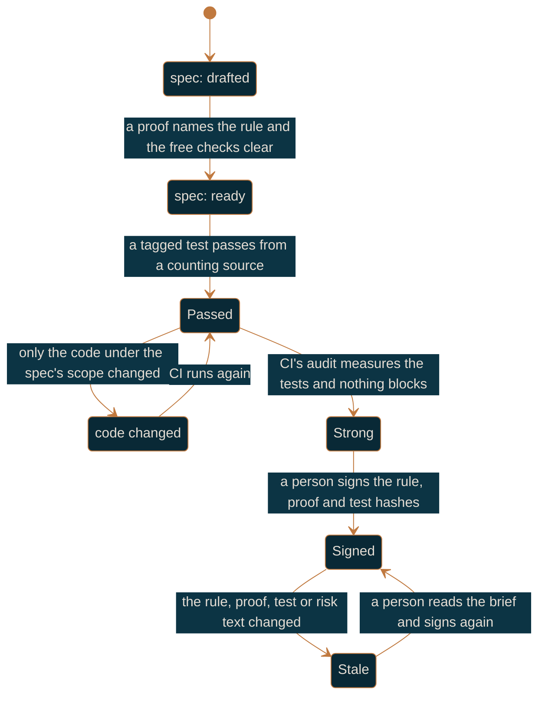

# Regulated workflow

For a team working under GxP or a similar obligation, at the `signed` gate.

`signed` is `strong` plus one requirement: a rule at or above `sign_at` needs a current
signature from someone on the signer list, in a signed commit that has reached the protected
branch. Nothing else about the day changes, so read [team-workflow.md](team-workflow.md) first
and treat this as what it adds.

## The three levels

A rule carries a spec status and one cell per level, and the gate says how many cells exist. At
`signed` all three do.

| Level | The question it answers | The command that answers it |
|-------|-------------------------|-----------------------------|
| passed | did every tagged test for this rule pass? | `purlin:test`, and `purlin:audit` on CI |
| strong | are those tests worth trusting? | `purlin:audit`, on CI |
| signed | did a person say the rule, the proof and the test belong together? | `purlin:sign` |

Level 2 is fully automatic: the breaks, the free checks and the model review run without anyone
asking. A person first appears at level 3.



Stale and `code changed` are the two answers to "something changed", and the difference is what
changed. A record carries `scope_tree`, the git tree hash of the files the spec's `> Scope:`
line names. When the code under that scope changed and the rule, proof and test text did not,
the signature stands and the passed cell reads `code changed`; CI clears it on the next run and
nobody is asked to look. When the rule text, the proof text, the test body or the rule's risk
changed, the signature is stale, because the attestation was given about text that no longer
exists. Raising a rule from low to high changes what signing it meant, which is why risk sits
inside the hashes a signature binds.

## What the gate requires

| Requirement | How it is met |
|-------------|---------------|
| A record CI wrote at this commit | the workflow `purlin:init` wrote, running `purlin:audit` |
| Test strength at or above `min_strength` | default 80 at this gate |
| A current signature on every rule at or above `sign_at` | `purlin:sign` |
| Every rule tagged with a risk and an origin | required at this gate, optional below it |
| The signing commit signed by someone on the signer list | `signers` in `.purlin/config.json` |
| The signing commit an ancestor of the protected branch head | it merges by pull request like any change |

The CI check, `scripts/ci/gate_check.py --check`, prints three sections, `Not passed (n)`,
`Weak (n)` and `Not signed (n)`, with each rule under the cell that blocks it and the reason
that cell carries. Every line it prints opens with `gate:`. `purlin:status` reads the same
cells and ends with one `→ Next:` line naming the step that clears the most rules.

## The signer list

`signers` in `.purlin/config.json` holds the emails of the people who may sign:

```json
"signers": ["jane@acme.com", "sam@acme.com"]
```

It changes by pull request like any other file, so git history records who could sign and when,
and a signature is judged against the list as it stood in the commit that added it. Add and
remove people at any time. There is no setting to configure on the git host, no owners file,
and no minimum number of people: one QA person is a working list.

`purlin:init --gate signed` asks for the emails. Without a list the gate cannot be met:
`purlin:status` and the CI check both print
`→ signer list missing: run purlin:init --gate signed`, and the check exits 1.

## The signed commit

Each signer runs these three commands once, on the machine they sign from:

```bash
git config gpg.format ssh
git config user.signingkey ~/.ssh/id_ed25519.pub
git config commit.gpgsign true
```

Then they upload the same public key to the git host as a signing key, so the host shows the
commit as signed. `purlin:init --gate signed` prints this for each person on the list.

A signature counts when five things hold. Each is read from git or from a file, never asserted:

1. The commit that added the signature file is signed and the signature verifies.
2. The author's email is on the signer list as of that commit.
3. That author is not the author of the commit that last touched the test. Write the test or
   sign it, not both.
4. The hashes the file binds still match the current rule text, proof text, test body and risk.
5. The commit is an ancestor of the protected branch head, so a signature living only on a side
   branch does not let a change merge.

## Risk, origin and `sign_at`

Every rule carries a risk tag and an origin tag at this gate. Risk decides how much evidence a
rule needs and whether a person has to sign; origin names who owns the claim and routes a
change to them in `purlin:drift`.

`sign_at` is the risk at which a signature starts being required, `medium` by default. A rule
below it reads `not required` in its signed cell and meets the gate at strong. Set `sign_at`
to `low` and every rule needs a signature.

| Risk | What it needs at this gate |
|------|----------------------------|
| `low` | a passing CI record, the strength floor, and a clear set of free checks. The signed cell reads `not required` unless `sign_at` is `low` |
| `medium` | all of that, the model review, and a signature |
| `high` | all of that, a signature, and at least one proof naming a rejection, an error or a boundary |

Origin is `pm`, `design`, `qa` or `eng`. `purlin:init --gate signed` lists every rule that
carries neither tag when you raise the gate, and `purlin:spec <feature>` tags them in one pass.

## What CI writes, and what it never writes

CI's `purlin:audit --ci` writes two kinds of file and commits them as
`purlin: record for <commit7>`:

- **the records**, under `.purlin/records/<feature>/`, one per feature per job;
- **the briefs**, under `.purlin/briefs/<feature>/<RULE-N>.<hash8>.brief.json`, one per rule the
  audit reached.

**CI writes no signature file, ever.** A signature directory holds only files a person wrote.
That is the whole of what makes the trail worth reading: the machine's evidence and a person's
attestation are written by different hands, into different paths, under different branch rules.

## `@manual` proofs

Some claims cannot be observed by a test: the tone of an error message against a brand voice
guide, a printed label read by eye, a physical step. Tag the proof `@manual`:

```
- PROOF-4 (RULE-4): Read the error messages against the brand voice guide @manual
```

There is no test and no break measurement. The strong cell reads `needs a person` with the
reason `manual proof`, and the rule waits on the list. The evidence is a signature carrying a
one-line note saying what the person did and what they saw:

```
purlin:sign <feature> RULE-4 --note "read the four messages on 2026-09-16; each matches the guide"
```

A model review that could not settle the question reads `needs a person` too, with the reason
`review not settled`, and the same `--note` settles it.

## Holds

A hold is a person's committed statement that the test does not prove the proof, with the
missing case named:

```
purlin:sign <feature> RULE-3 --hold "the lock expiry is never read"
```

It writes `specs/<category>/<feature>.signatures/<RULE-N>.<hash8>.<holder-slug>.hold.json` and
commits it. While the hold is current the strong cell reads `needs a person` and the signed
cell reads `held`, whatever the risk, so no rule slips past level 2 on the free checks alone.
Changing the test ends the hold, because the hashes it binds no longer match. A signature by a
person for the current hashes outranks it.

## Pinning a state

```bash
purlin:audit --tag 1.0
```

That writes an annotated tag `record/1.0` whose message lists the records it vouches for, one
path per line. Retention keeps the newest three records per feature per operating system and
prunes the rest, but a record any `record/<name>` tag names is kept for ever. Tag the state you
released, and the evidence behind that release stays readable however many runs follow it.

## The evidence trail

Everything an inspection asks for is already in git, in four places, and nobody assembles it by
hand:

- **`.purlin/records/`.** One file per audit run per feature, each naming the commit it
  observed, the operating system, the gate in force, the test strength and every proof's
  result. The git history of the folder is the log of what was proven and when, and the
  committer on each file is the git host's build identity.
- **`.purlin/briefs/`.** One file per rule per set of hashes: the strength beside the minimum,
  the free-check findings, and what the model review observed. It is what a signer was shown.
- **`specs/<category>/<feature>.signatures/`.** One file per signature, binding the hashes of
  the rule, the proof and the test, the risk at the time, the signer's email, the brief they
  read and the record they rested on. The commit that added it is signed by a person.
- **`refs/tags/record/*`.** The annotated tags naming which records back which release.

Add `.purlin/config.json`'s history for who could sign at any date, and the four questions an
inspection asks - what was required, what the tests proved, who said it was right, and when - each
have a file that answers them.

For anyone without a checkout,
`python3 "${CLAUDE_PLUGIN_ROOT}/scripts/report/scan.py" --repo <url> --ref <tag>` reads
`specs/` and `.purlin/records/` by sparse fetch and prints the same rollup for any branch or
tag, including a `record/<name>` one.

## Branch rules

The evidence only means something if a person cannot write it themselves. On GitHub, three
rulesets on the default branch, so each bypass stays narrow:

1. Require a pull request and require the `purlin` check, with the Actions app as the only
   bypass actor.
2. Restrict file paths on `.purlin/records/**` and `.purlin/briefs/**`, with the Actions app as
   the only bypass actor, so a person cannot push a record or a brief.
3. Block force pushes and restrict deletions, with no bypass actor at all.

On Azure DevOps: the build service alone holds Contribute on those same two paths through
branch security, plus no force push and no delete. `purlin:init` prints whichever set applies
to your git host; Purlin never changes a repository's settings itself.

The signature directories carry no such rule, and they do not need one. A person is supposed to
write them, and the five conditions above are what decides whether the file counts.

## The day to day

The engineer's loop is unchanged: `purlin:drift eng`, `purlin:spec`, `purlin:build`,
`purlin:test`, push, and read what CI wrote. QA's loop is `purlin:sign`, described in
[review-and-signing.md](review-and-signing.md). What changes is the last step: the signing
commits reach the default branch by pull request, and a merge waits for them.

Read next: [review-and-signing.md](review-and-signing.md) for the walk and what stales a
signature, [raising-the-gate-and-upgrading.md](raising-the-gate-and-upgrading.md) for the move
to this gate, [running-and-records.md](running-and-records.md) for records and test strength in
detail.
