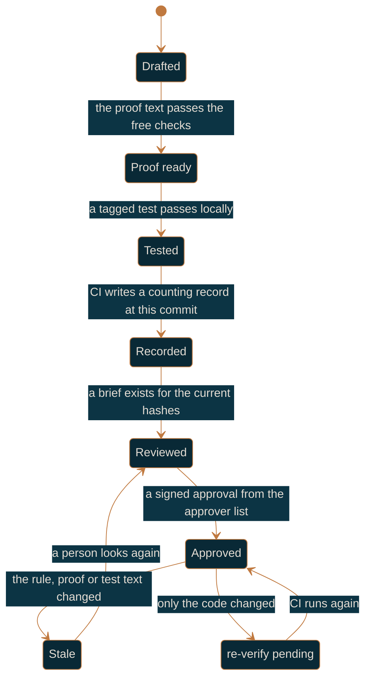

# Regulated workflow

For a team working under GxP or a similar obligation, at the `approved` gate.

`approved` is `recorded` plus one requirement: every high-risk and medium-risk rule needs a
current approval, written by someone on the approver list, in a signed commit that has reached
the protected branch. Low risk is auto-approved by CI. Nothing else about the day changes, so
read [team-workflow.md](team-workflow.md) first and treat this as what it adds.

## What the gate requires

| Requirement | How it is met |
|-------------|---------------|
| A record at this commit, written by CI | the workflow `purlin:init` wrote |
| Test strength at or above `min_strength` | default 80 at this gate |
| A current approval on every high and medium rule | `purlin:review` or `purlin:approve` |
| Every rule tagged with a risk and an origin | required at this gate, optional below it |
| The approval commit signed by someone on the approver list | `approvers` in `.purlin/config.json` |
| The approval commit an ancestor of the protected branch head | it merges by pull request like any change |

`purlin:status` and the CI gate check each condition on its own line, so a rule that fails one
of them says which one.

## The approver list

`approvers` in `.purlin/config.json` holds the emails of the people who may approve:

```json
"approvers": ["jane@acme.com", "sam@acme.com"]
```

It changes by pull request like any other file, so git history records who could approve and
when, and an approval is judged against the list as it stood in the commit that added it. Add
and remove people at any time. There is no setting to configure on the git host, no owners
file, and no minimum number of people: one QA person is a working list.

`purlin:init --gate approved` asks for the emails. Without a list the gate cannot be met:
`purlin:status` and the CI check both print
`→ approver list missing: run purlin:init --gate approved`, and the check exits 1.

## The signed commit

Each approver runs these three commands once, on the machine they approve from:

```bash
git config gpg.format ssh
git config user.signingkey ~/.ssh/id_ed25519.pub
git config commit.gpgsign true
```

Then they upload the same public key to the git host as a signing key, so the host shows the
commit as Verified. `purlin:init --gate approved` prints this for each person on the list.

An approval counts when four things hold. Each is read from git or from a file, never asserted:

1. The commit that added the approval file is signed and the signature verifies.
2. The author's email is on the approver list as of that commit.
3. That author is not the author of the commit that last touched the test. Write the test or
   approve it, not both.
4. The hashes the approval binds still match the current rule text, proof text and test body.

## Risk and origin

Every rule carries a risk tag and an origin tag at this gate. Risk decides how much evidence a
rule needs and whether a person has to look; origin names who owns the claim and routes a
change to them in `purlin:drift`.

| Risk | What it needs |
|------|---------------|
| `low` | a passing test and a clear set of free checks. CI approves it on its own |
| `medium` | a person reads the brief. Every blocking finding on the proof text clear, no finding on the test body |
| `high` | a person reads the brief, the model review always runs, and at least one proof has to name a rejection, an error or a boundary |

Origin is `pm`, `design`, `qa` or `eng`. `purlin:init --gate approved` lists every rule that
carries neither tag when you raise the gate, and `purlin:spec <feature>` tags them in one pass.

## Auto-approval of low risk

CI writes its own approval file, `<RULE-N>.<hash8>.ci.json`, for a rule that is low risk, has a
passing record, and has test strength at or above `min_strength`. A project with no break
engine installed has no strength to compare, so the free checks on the proof text stand in for
it: every check clear, or CI writes nothing.

High and medium are never auto-approved. A proof tagged `@manual` is never auto-approved at any
risk. A CI approval is exempt from the signature, the list and the author check, because no
person made it; what bounds it is the rule above.

## `@manual` proofs

Some claims cannot be observed by a test: the tone of an error message against a brand guide,
a printed label read by eye, a physical step. Tag the proof `@manual`:

```
- PROOF-4 (RULE-4): Read the error messages against the brand voice guide @manual
```

There is no test and no break measurement. The evidence is an approval file carrying a
one-line note saying what the person did and what they saw. It is always human, never
auto-approved, and it appears on the review list with `needs a human` as its verdict.

## The seven states



Stale and `re-verify pending` are the two answers to "something changed", and the difference
is what changed. A record carries `scope_tree`, the git tree hash of the files the spec's
`> Scope:` line names. When the code under that scope changed and the rule, proof and test
text did not, the approval stands and the rule is flagged `re-verify pending`; CI clears it on
the next run and no person is asked to look. When the rule text, the proof text or the test
body changed, the approval is Stale, because the attestation was given about text that no
longer exists. Changing a rule's risk stales its approval too: raising a rule from low to high
changes what approving it meant.

## Pinning a validated state

```bash
purlin:verify --tag 1.0
```

That writes an annotated tag `validated/1.0` whose message lists the records it vouches for,
one path per line. Retention keeps the newest three records per feature per operating system
and prunes the rest, but a record any `validated/<name>` tag names is kept for ever. Tag the
state you released, and the evidence behind that release stays readable however many runs
follow it.

## The evidence trail

Everything an inspection asks for is already in git, in three places, and nobody assembles it
by hand:

- **`.purlin/records/`.** One file per verify run per feature, each naming the commit it
  observed, the operating system, the gate in force, the test strength and every proof's
  result. The git history of the folder is the log of what was proven and when, and the
  committer on each file is the git host's build identity.
- **`specs/<category>/<feature>.approvals/`.** One file per approval, binding the hashes of the
  rule, the proof and the test, the risk at the time, the approver's email, the brief they
  read and the record they rested on. The commit that added it is signed. The brief sits
  beside it, so what the approver was shown is recoverable too.
- **`refs/tags/validated/*`.** The annotated tags naming which records back which release.

Add `.purlin/config.json`'s history for who could approve at any date, and the four questions
an inspection asks - what was required, what was tested, who said it was right, and when -
each have a file that answers them.

For anyone without a checkout,
`python3 "${CLAUDE_PLUGIN_ROOT}/scripts/report/scan.py" --repo <url> --ref <tag>` reads
`specs/` and `.purlin/records/` by sparse fetch and prints the same seven-state rollup for any
branch or tag, including a `validated/<name>` one.

## Branch rules

The evidence only means something if a person cannot write it themselves. On GitHub, three
rulesets on the default branch, so each bypass stays narrow:

1. Require a pull request and require the status checks, with the Actions app as the only
   bypass actor.
2. Restrict file paths on `.purlin/records/**` and `specs/**/*.approvals/*.ci.json`, with the
   Actions app as the only bypass actor, so a person cannot push a record or a CI approval.
3. Block force pushes and restrict deletions, with no bypass actor at all.

On Azure DevOps: the build service alone holds Contribute on those same paths through branch
security, plus no force push and no delete. `purlin:init` prints whichever set applies to your
git host; Purlin never changes a repository's settings itself.

## The day to day

The engineer's loop is unchanged: `purlin:drift eng`, `purlin:spec`, `purlin:build`,
`purlin:test`, `purlin:verify`, push. QA's loop is `purlin:review`, described in
[review-and-approval.md](review-and-approval.md). What changes is the last step: the approval
commits reach the default branch by pull request, and a merge waits for them.

Read next: [review-and-approval.md](review-and-approval.md) for the walk and what stales an
approval, [raising-the-gate-and-upgrading.md](raising-the-gate-and-upgrading.md) for the move
to this gate, [running-and-records.md](running-and-records.md) for records and test strength in
detail.
