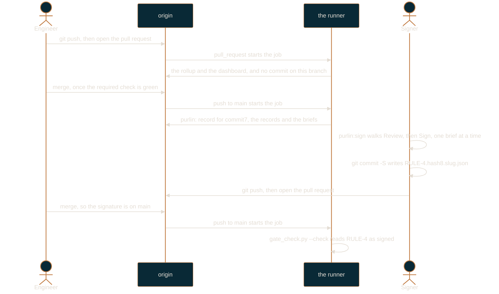

# Regulated workflow

For a team working under GxP or a similar obligation, at the `signed` gate.

`signed` is `strong` plus one requirement: a rule that needs a signature needs a current
signature from someone on the signer list, in a signed commit that has reached the protected
branch. Nothing else about the day changes, so read [team-workflow.md](team-workflow.md) first
and treat this as what it adds. [how-purlin-works.md](how-purlin-works.md) is the model in one
page.

## The three levels

A rule carries a spec status and one cell per level, and the gate says how many cells exist. At
`signed` all three do.

| Level | The question it answers | The command that answers it |
|-------|-------------------------|-----------------------------|
| passed | did every tagged test for this rule pass? | `purlin:test`, and the same tests on CI |
| strong | are those tests worth trusting? | `purlin:audit`, and the same audit on CI |
| signed | did a person say the rule, the proof and the test belong together? | `purlin:sign` |

Which machine ran them matters here and at no other gate. At `strong` a record your own
`purlin:audit` committed counts. At `signed` only CI's counts, for the tests and the audit
both: the run on the protected branch after the merge is what a signature attaches to, and a
run on your machine there is a preview. That is why every record and brief this page names
sits under `.purlin/records/ci/` and `.purlin/briefs/ci/`, the two paths a branch rule
reserves for the CI identity. A local audit still writes its own into `.purlin/records/local/`
and `.purlin/briefs/local/`, and at this gate the gate reads neither.

Level 2 is fully automatic: the breaks, the free checks and the model review run without anyone
asking. A person first appears at level 3, and this is where in a change's life they appear.


```mermaid
%%{init: {"theme": "base", "themeVariables": {"background": "#0C3444", "primaryColor": "#092936", "primaryTextColor": "#E4DDD4", "primaryBorderColor": "#C0793F", "lineColor": "#C0793F", "secondaryColor": "#0C3444", "tertiaryColor": "#092936", "fontFamily": "Arial", "textColor": "#E4DDD4"}}}%%
sequenceDiagram
    actor Engineer
    participant Origin as origin
    participant CI as the runner
    actor Signer
    Engineer->>Origin: git push, then open the pull request
    Origin->>CI: pull_request starts the job
    CI->>Origin: the rollup and the dashboard, and no commit on this branch
    Engineer->>Origin: merge, once the required check is green
    Origin->>CI: push to main starts the job
    CI->>Origin: purlin: record for commit7, the records and the briefs
    Signer->>Signer: purlin:sign walks Review, then Sign, one brief at a time
    Signer->>Signer: git commit -S writes RULE-4.hash8.slug.json
    Signer->>Origin: git push, then open the pull request
    Engineer->>Origin: merge, so the signature is on main
    Origin->>CI: push to main starts the job
    CI->>CI: gate_check.py --check reads RULE-4 as signed
```

The whole of what `signed` adds is the lower half of that picture. A person reads what CI wrote
in the briefs, commits one file per rule signed, and that commit reaches the protected branch
by pull request like any other change. Nothing in the picture pushes but a person: CI commits
through the git host's API, on the protected branch and on a run branch, and `purlin:sign`
makes its commit and stops.

A change that leaves a rule's text, its proof and its test alone leaves that rule's signature
standing, so the ordinary change merges and only the record run follows. A change that touches
one of the three stales the signature, and the gate check says `Not signed` until a signature
for the new hashes has reached the protected branch.

Stale and `code changed` are the two answers to "something changed", and the difference is what
changed. A record carries `scope_tree`, the git tree hash of the files the spec's `> Scope:`
line names. When the code under that scope changed and the rule, proof and test text did not,
the signature stands and the passed cell reads `code changed`; CI clears it on the next run and
nobody is asked to look. When the rule text, the proof text, the test body or the rule's bar
changed, the signature is stale, because the attestation was given about text that no longer
exists. Raising a rule's bar changes what signing it meant, which is why the bar sits
inside the hashes a signature binds.

## What the gate requires

| Requirement | How it is met |
|-------------|---------------|
| A record CI wrote at this commit | the workflow `purlin:init` wrote, running `purlin:audit` |
| Every operating system the rule's proofs name covered by a passing run | the CI matrix. A rule that passed on some and not others reads `partial`, which is not met |
| Test strength at or above `min_strength` | default 80 at this gate |
| A current signature on every rule that needs one | `purlin:sign` |
| Every rule tagged with a bar and an origin | the bar defaults to the gate; the origin is required at this gate |
| The signing commit signed, by an author on the signer list who did not last touch the test | `signers` in `.purlin/config.json`, read as it stood in that commit |
| The signing commit an ancestor of the protected branch | it merges by pull request like any change |

The CI check, `scripts/ci/gate_check.py --check`, is the last step of every run. It prints
one section per kind of work, `Not passed (n)`, `Partial (n)`, `Weak (n)`, `Not audited (n)`,
`To review (n)` and `To sign (n)`, each naming the rules the cell that blocks them puts there
and the reason that cell carries; it names the first twenty in a section and counts the rest.
Its own lines, the gate, the counts and the last word on whether the gate held, open with
`gate:`; the rules under a section heading are indented instead. It writes nothing, exits 0 when the gate is met and 1 when it is not, and exits 2 when it cannot
read the evidence, so an unreadable checkout never passes the branch. `purlin:status` reads the
same cells and ends with one `→ Next:` line naming the step that clears the most rules.

## The signer list

`signers` in `.purlin/config.json` holds the emails of the people who may sign:

```json
"signers": ["jane@acme.com", "sam@acme.com"]
```

It changes by pull request like any other file, so git history records who could sign and when,
and a signature is judged against the list as it stood in the commit that added it. Add and
remove people at any time. There is no setting to configure on the git host, no owners file,
and no minimum number of people: one QA person is a working list.

`purlin:init --gate signed` asks for the emails. Without a list the gate cannot be met:
`purlin:status` and the CI check both print
`→ signer list missing: run purlin:init --gate signed`, and the check exits 1.

## The signed commit

Each signer runs these three commands once, on the machine they sign from:

```bash
git config gpg.format ssh
git config user.signingkey ~/.ssh/id_ed25519.pub
git config commit.gpgsign true
```

Then they upload the same public key to the git host as a signing key, so the host shows the
commit as signed. `purlin:init --gate signed` prints this for each person on the list.

`purlin:sign` writes one file per rule and makes one `git commit -S` whether it carries one
rule or forty. Its subject is `sign(<feature>): RULE-N ...` for one feature and
`sign(batch): <feature> RULE-N, ...` across several; a hold commit reads `hold(<feature>):
RULE-N`. It does not push. The signer runs `git push` and opens the pull request, the same as
for any other change.

A signature counts when five things hold. Each is read from git or from a file, never asserted:

1. The commit that added the signature file is signed and the signature verifies.
2. The author's email is on the signer list as of that commit.
3. That author is not the author of the commit that last touched the test. Write the test or
   sign it, not both.
4. The hashes the file binds still match the current rule text, proof text, test body and bar.
5. The commit is an ancestor of the protected branch, so a signature living only on a side
   branch nobody merged does not let a change merge. Purlin reads that branch from what
   `origin/HEAD` points at, falling back to the branch the checkout is on and then to `main`.

The first four are read on every gate; the fifth is read under `signed` alone. Below `signed`
a signature from anyone counts, because what it clears there is a question the machine could
not settle rather than an attestation the gate rests on.

## The bar, origin and `sign_at`

Every rule has a **bar**, `passed` or `strong`: the evidence that rule must have before anyone
can sign it. A rule says its own with the tag `[bar: passed]` or `[bar: strong]`; a rule with
no tag takes the project's gate as its bar, which at this gate is `strong`. Before 0.10.0 a
rule carried a three-level tag in place of a bar; `purlin:init --update` rewrites it, the two
higher levels to `[bar: strong]` and the lowest to `[bar: passed]`.

The bar decides three things:

| The bar | The evidence it asks for | Does the AI audit run? | Does it need a signature? |
|---|---|---|---|
| `passed` | the rule's tagged tests pass on every platform a counting run covered | no | only when `sign_at` is `all` |
| `strong` | all of that, an audit, the strength floor, a clear set of free checks, no hold | yes | yes |

A rule that has met its bar has **cleared** it. A rule that has cleared its bar, needs a
signature and has none that counts is **signable**: the board's `Signable` column counts it,
the `To sign` card counts it for the project, and the Sign tab lists it until someone signs
it. A rule meets the gate `signed` when it has cleared its bar and, where it needs a
signature, that signature counts.

`sign_at` says which rules need a signature at all. `strong`, the default, asks for one on the
rules whose bar is `strong`; `all` asks for one on every rule. `purlin:init --gate signed`
asks which you want, and `--update` asks again.

Origin is `pm`, `design`, `qa` or `eng`. `purlin:init --gate signed` lists every rule that
carries no origin when you raise the gate, and `purlin:spec <feature>` tags them in one pass.

## What CI writes, and what it never writes

CI's run writes two kinds of file and commits them as
`purlin: record for <commit7>`, on the protected branch and on a run branch only. A pull
request run writes both on the runner and commits neither:

- **the records**, under `.purlin/records/ci/<feature>/`, one per feature per job;
- **the briefs**, under `.purlin/briefs/ci/<feature>/<RULE-N>.<hash8>.brief.json`, one per rule
  the audit reached.

**CI writes no signature file, ever.** A signature directory holds only files a person wrote.
That is the whole of what makes the trail worth reading: the machine's evidence and a person's
attestation are written by different hands, into different paths, under different branch rules.

## `@manual` proofs

Some claims cannot be observed by a test: the tone of an error message against a brand voice
guide, a printed label read by eye, a physical step. Tag the proof `@manual`:

```
- PROOF-4 (RULE-4): Read the error messages against the brand voice guide @manual
```

There is no test and no break measurement. The strong cell reads `manual test` with the
reason `manual proof`, and the rule waits on the list. The evidence is a signature carrying a
one-line note saying what the person did and what they saw:

```
purlin:sign <feature> RULE-4 --note "read the four messages on 2026-09-16; each matches the guide"
```

A rule whose bar is `strong` and on whose code no audit has run yet reads `not audited`, with
the reason `no audit has run on this code`. It waits for `purlin:audit`, not for a person, so
it is on no tab. Once the audit has run and could not settle the question, the cell reads
`unsettled` and the rule is on the Review tab. The same `--note` settles it.

## Holds

A hold is a person's committed statement that the test does not prove the proof, with the
missing case named:

```
purlin:sign <feature> RULE-3 --hold "the lock expiry is never read"
```

It writes `specs/<category>/<feature>.signatures/<RULE-N>.<hash8>.<holder-slug>.hold.json` and
commits it, signed like any other `purlin:sign` commit. A hold only ever withholds, so the
person who writes one need not be on the signer list. While the hold is current both the strong
cell and the signed cell read `held`, whatever the bar, so no rule slips past level 2 on the
free checks alone.
Changing the test ends the hold, because the hashes it binds no longer match. A signature by a
person for the current hashes outranks it.

## Pinning a state

```bash
purlin:audit --tag 1.0
```

That writes an annotated tag `record/1.0` whose message lists the records it vouches for, one
path per line. Retention keeps the newest three records per feature per operating system and
prunes the rest, but a record any `record/<name>` tag names is kept for ever. Tag the state you
released, and the evidence behind that release stays readable however many runs follow it.

## The evidence trail

Everything an inspection asks for is already in git, in four places, and nobody assembles it by
hand:

- **`.purlin/records/ci/`.** One file per audit run per feature, each naming the commit it
  observed, the operating system, the gate in force, the test strength and every proof's
  result. The git history of the folder is the log of what was proven and when, and the
  committer on each file is the git host's build identity. The records beside it under
  `.purlin/records/local/` are what a person's own audit saw, and at this gate they are a
  preview, not evidence.
- **`.purlin/briefs/ci/`.** One file per rule per set of hashes: the strength beside the
  minimum, the free-check findings, and what the model review observed. It is what a signer
  was shown.
- **`specs/<category>/<feature>.signatures/`.** One file per signature, binding the hashes of
  the rule, the proof and the test, the bar at the time, the signer's email, the brief they
  read and the record they rested on. The commit that added it is signed by a person.
- **`refs/tags/record/*`.** The annotated tags naming which records back which release.

Add `.purlin/config.json`'s history for who could sign at any date, and the four questions an
inspection asks - what was required, what the tests proved, who said it was right, and when - each
have a file that answers them.

For anyone without a checkout,
`python3 "${CLAUDE_PLUGIN_ROOT}/scripts/report/scan.py" --repo <url> --ref <tag>` reads
`specs/` and `.purlin/records/ci/` by sparse fetch and prints the same rollup for any branch
or tag, including a `record/<name>` one.

## Branch rules

The evidence only means something if a person cannot write it themselves. On GitHub, three
rulesets on the default branch, so each bypass stays narrow:

1. Require a pull request and require the `purlin` check, with the Actions app as the only
   bypass actor.
2. Restrict file paths on `.purlin/records/ci/**` and `.purlin/briefs/ci/**`, with the Actions
   app as the only bypass actor, so a person cannot push a file into the folder this gate
   reads.
3. Block force pushes and restrict deletions, with no bypass actor at all.

On Azure DevOps: the build service alone holds Contribute on those same two paths through
branch security, plus no force push and no delete. `purlin:init` prints whichever set applies
to your git host; Purlin never changes a repository's settings itself.

The signature directories carry no such rule, and they do not need one. A person is supposed to
write them, and the five conditions above are what decides whether the file counts.

## The day to day

The engineer's loop is unchanged: `purlin:drift eng`, `purlin:spec`, `purlin:build`,
`purlin:test`, push, and read what CI wrote. QA's loop is `purlin:sign`, described in
[review-and-signing.md](review-and-signing.md). What changes is the last step: the signing
commits reach the default branch by pull request, and a merge waits for them.

Read next: [review-and-signing.md](review-and-signing.md) for the walk and what stales a
signature, [raising-the-gate-and-upgrading.md](raising-the-gate-and-upgrading.md) for the move
to this gate, [running-and-records.md](running-and-records.md) for records and test strength in
detail.
