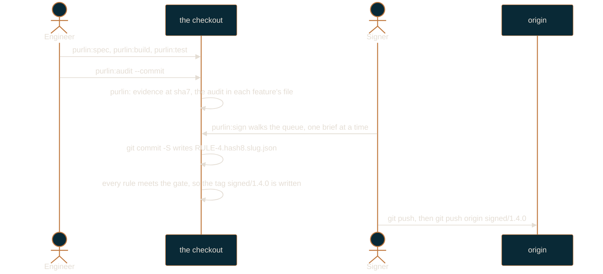

# Regulated workflow

For a team working under GxP or a similar obligation, at the `signed` gate.

`signed` is `strong` plus two things: a rule that needs a signature needs a current signature
in a signed commit; and the version carries the tag `purlin:sign` writes once every rule meets
the gate. What that tag means is defined once, in
[hard_gates.md](../references/hard_gates.md). Nothing else about the day changes, so
read [team-workflow.md](team-workflow.md) first and treat this as what it adds.
[how-purlin-works.md](how-purlin-works.md) is the model in one page.

The whole of it runs on one machine. A project at this gate with no CI anywhere is the ordinary
case: you spec, build, test and audit locally, a person signs, `purlin:sign` writes the tag,
and a person pushes it.

## The three levels

A rule carries one cell per level, and the gate says how many cells exist. At
`signed` all three do.

| Level | The question it answers | The command that answers it |
|-------|-------------------------|-----------------------------|
| passed | did every tagged test for this rule pass? | `purlin:test` |
| strong | are those tests worth trusting? | `purlin:audit` |
| signed | did a person say the rule, the proof and the test belong together? | `purlin:sign` |

Which machine ran them does not change at this gate. The evidence your own `purlin:audit`
wrote and `--commit` committed counts here exactly as it does at `strong`, under
`.purlin/evidence/local/`. What decides whether that is enough is the trust setting: answer `y` to
`Do you trust your own machine for the tests and the signing?` and it is, answer `n` and
`purlin:sign` asks for a `ci` run at this commit before it signs anything.

Level 2 is fully automatic: the breaks and the AI audit run without anyone asking. A person
first appears at level 3, and this is where in a change's life they appear.


```mermaid
%%{init: {"theme": "base", "themeVariables": {"background": "#0C3444", "primaryColor": "#092936", "primaryTextColor": "#E4DDD4", "primaryBorderColor": "#C0793F", "lineColor": "#C0793F", "secondaryColor": "#0C3444", "tertiaryColor": "#092936", "fontFamily": "Arial", "textColor": "#E4DDD4"}}}%%
sequenceDiagram
    actor Engineer
    participant Tree as the checkout
    actor Signer
    participant Origin as origin
    Engineer->>Tree: purlin:spec, purlin:build, purlin:test
    Engineer->>Tree: purlin:audit --commit
    Tree->>Tree: purlin: evidence at sha7, the audit in each feature's file
    Signer->>Tree: purlin:sign walks the queue, one brief at a time
    Tree->>Tree: git commit -S writes RULE-4.hash8.slug.json
    Tree->>Tree: every rule meets the gate, so the tag signed/1.4.0 is written
    Signer->>Origin: git push, then git push origin signed/1.4.0
```

The whole of what `signed` adds is the lower half of that picture. A person reads what the
audit wrote in the briefs, commits one file per rule signed, and `purlin:sign` closes by
writing the tag. Nothing in the picture pushes but a person, and the push is free: nothing runs
when they make one.

A change that leaves a rule's text, its proof and its test alone leaves that rule's signature
standing. A change that touches one of the three stales it, and so does a re-audit that
observes something new, because the signature binds what the audit saw as well. Until a
signature for the new evidence exists, `purlin:sign` writes no tag and the gate check lists
the rule under `Queue`.

Stale and `out of date` are the two answers to "something changed", and the difference is what
changed. The evidence carries a fingerprint of the spec, of the files the spec's `> Scope:`
line names and of the tests. When the code under that scope changed and the rule, proof and
test text did not, the signature stands and the passed cell reads `out of date`; the next run clears it and
nobody is asked to look. When the rule text, the proof text or the test body
changed, the signature is stale, because the attestation was given about text that no longer
exists. A signature records the rule's level but does not lock it, so re-marking a rule stales
no signature.

## What the gate requires

| Requirement | How it is met |
|-------------|---------------|
| A record at this commit for every rule | `purlin:audit`, run by anyone. Under `trust: remote` a `ci` record as well |
| Every operating system the rule's proofs name covered by a passing run | this machine, plus a runner for any `@env` it is not. A rule that passed on some and not others reads `partial`, which is not met |
| Test strength at or above `min_strength` | default 80 at this gate |
| A current signature on every rule that needs one | `purlin:sign` |
| The signing commit signed, and the signature verifies | the signer's own key, set up once with the three commands below |
| The tag `signed/<version>` on the commit | `purlin:sign` writes it once every rule meets the gate, and a person pushes it |

`scripts/ci/gate_check.py --check` is the check a runner makes, as the last step of every run.
`purlin:sign` asks the same question of the same cells before it writes a tag, and writes none
while any rule falls short. The check prints one section per kind of
work, `Not passed`, `Partial`, `Weak`, `Not audited`, `Queue` and, under `--verify`,
`Evidence`, each naming the rules the cell that blocks
them puts there and the reason that cell carries; it names the first twenty in a section and counts the rest. Its own lines, the
gate, the counts and the last word on whether the gate held, open with `gate:`; the rules under
a section heading are indented instead. It writes nothing, exits 0 when the gate is met and 1
when it is not, and exits 2 when it cannot read the evidence, so an unreadable checkout never
passes. `purlin:status` reads the same cells and ends with one `→ Next:` line naming the step
that clears the most rules.

## Who may sign

Anyone with commit signing set up. Signing is logged, not policed: Purlin keeps a log you can
check and trace, of where the tests ran and who signed that the rule, the proof, the test
and the audit match, and it does not decide who may. The signature file names the signer and
git names the commit's author. If your organisation limits who signs, that limit is yours to
hold; nothing in `.purlin/config.json` names a person, and there is no setting on the git host
and no owners file.

## The signed commit

Each signer runs these three commands once, on the machine they sign from:

```bash
git config gpg.format ssh
git config user.signingkey ~/.ssh/id_ed25519.pub
git config commit.gpgsign true
```

Then they upload the same public key to the git host as a signing key, so the host shows the
commit as signed. `purlin:init --gate signed` prints these commands.

`purlin:sign` writes one file per rule and makes one `git commit -S` whether it carries one
rule or forty. Its subject is `sign(<feature>): RULE-N ...` for one feature and
`sign(batch): <feature> RULE-N, ...` across several. It refuses to sign while a feature's
evidence is written and not committed: `sign: <feature> has evidence that is not committed.
Run: purlin:test --commit`. It does not push. The signer runs `git push`, and `git push origin signed/<version>`
for the tag.

A signature counts under `signed` when two things hold. Each is read from git or from a file,
never asserted:

1. The commit that added the signature file is cryptographically signed and the signature
   verifies.
2. The hashes the file binds still match the current rule text, proof text, test body and
   what the audit found: the strength, the observation sentences and whether the audit
   settled. A re-audit that sees something different stales the signature, because the person
   attested to what they were shown.

Nothing else is read. A signature counts whoever last committed to the test file, and on
whatever commit carries it, on any branch. Below `signed` a committed signature counts, because
what it clears there is a question the machine could not settle rather than an attestation the
gate rests on.

## The tag

```
purlin:sign
```

With no argument it walks the queue. When it leaves every rule meeting the gate it writes a
signed tag over the current commit (`git tag -s`, with the key you sign commits with):
`signed/<version>`, from the `VERSION` file at
the project root, or `--release <name>` where a release carries its own name. The message names
the commit and the gate. Then it prints two lines:

```
Tagged signed/1.4.0 at a1b2c3d: every rule meets the gate signed.
→ Run: git push origin signed/1.4.0
```

While any rule falls short it writes no tag and says so, `No tag: 3 of 42 rules do not meet the
gate signed.`, so the presence of the tag is the claim. A tag
holds the whole tree at that commit: the code, every record, every brief and every signature,
pinned together under one name. That is what an inspection is handed, and it is why no record
needs pinning of its own.

A tag of that name that already exists is not moved: `No tag: signed/1.4.0 is already written.
Name another with --release <name>.` A released version's marker stays where it was put.

## The level

Every rule has a **level**, `passed`, `strong` or `signed`, meaning what the gate means. A rule
says its own with the tag `[level: passed]`, `[level: strong]` or `[level: signed]`; a rule
with no tag takes the project's gate as its level, which at this gate is `signed`. The gate is
the ceiling: a mark above it is read as the gate.

The level decides three things:

| The level | The evidence it asks for | Does the AI audit run? | Does it need a signature? |
|---|---|---|---|
| `passed` | the rule's tagged tests pass on every platform a counting run covered | no | no |
| `strong` | all of that, an audit, the strength floor, nothing the audit observed outstanding | yes | no |
| `signed` | all of that, and a person's signature that counts | yes | yes |

A rule meets the gate when its passed cell is met, its strong cell is met if its level is
`strong` or `signed`, and its signed cell is met if its level is `signed`. Cells above a
rule's level are still shown and do not block. A rule needs a signature exactly when its level
is `signed`. A rule whose level is `signed`, whose passed and strong cells are met, and that
has no signature that counts is a `signature` row in the queue: the `Queue` card counts it for
the project, and the Queue tab lists it until someone signs it.

## What a machine writes, and what it never writes

`purlin:audit` writes one kind of file, `.purlin/evidence/local/<feature>.json`, holding the
test section for this operating system and, per rule the audit reached, what it found;
`--commit` commits it as `purlin: evidence at <commit7>`.

A remote runner writes only its own test section, under `.purlin/evidence/ci/`. **No machine writes a signature file, ever.** A
signature directory holds only files a person wrote. That is the whole of what makes the trail
worth reading: the machine's evidence and a person's attestation are written by different
hands, into different paths.

Where a project has a runner, a push of the `signed/**` tag starts one last run: it reruns the
tagged tests on a clean machine, checks that every signature still binds the
rule, the proof, the test and the audit it names, checks that every file under `ci/`
was committed by the runner's own identity, and ends with the gate check. On GitHub that
identity is read from the commit's committer and the host's signature on it. On Azure DevOps,
where a commit carries no signature and its committer is a name anyone can type, it is read
from the host itself: the run's own identity against the identity Azure DevOps names as having
pushed the commit, asked with the build service's token. The live behaviour on Azure DevOps is
confirmed by a hand-run check on a machine with Azure DevOps access. Anything it finds lands in
the gate check's `Evidence` section and fails the job. It commits nothing. A red run there is
the host's word that this version is not proven.

A squash merge or a rebase that rewrites a commit under `ci/`, on either host, makes the
rewritten commit a person's, and the tag run fails the file. Merge a run branch's evidence
without rewriting it.

## `@manual` proofs

Some claims cannot be observed by a test: the tone of an error message against a brand voice
guide, a printed label read by eye, a physical step. Tag the proof `@manual`:

```
- PROOF-4 (RULE-4): Read the error messages against the brand voice guide @manual
```

There is no test and no break measurement. The strong cell reads `manual test` with the
reason `manual proof`, and the rule waits in the queue as a `hand check`. The evidence is a signature carrying a
one-line note saying what the person did and what they saw:

```
purlin:sign <feature> RULE-4 --note "read the four messages on 2026-09-16; each matches the guide"
```

A rule whose level is `strong` or `signed` and on whose code no audit has run yet reads `not
audited`, with the reason `no audit has run on this code`. It waits for `purlin:audit`, not for a
person, so it is not in the queue. Once the audit has run and could not settle the question,
the cell reads `unsettled` and the rule is in the queue as a `hand check`. The same `--note`
settles it.

A person who finds that the test does not prove the proof adds the missing case as a proof line,
the walk's `case` answer, or changes the proof, alone or with AI help.

## The evidence trail

Everything an inspection asks for is already in git, in four places, and nobody assembles it by
hand:

- **`.purlin/evidence/`.** One file per feature per source, each section naming the commit it
  observed, the operating system and every proof's result, with the test strength and what the
  audit found per rule, in the sentences the audit wrote. The folder it sits in is its source,
  `local/` or `ci/`, and the git history of both is the log of what was proven and when. It is
  what a signer was shown, and the signature binds what the audit found.
- **`specs/<category>/<feature>.signatures/`.** One file per signature, binding the hashes of
  the rule, the proof and the test, the level at the time, what the audit observed, the signer's
  email, the time, the `machine` (host name) and `os` they signed on, and the evidence file they
  rested on. The commit that added it is signed
  by a person.
- **`refs/tags/signed/*`.** The signed tag on each version that met the gate. A tag holds
  the whole tree, so one name reaches the code and every file above.

Add `.purlin/config.json`'s history for who could sign at any date, and the four questions an
inspection asks - what was required, what the tests proved, who said it was right, and when -
each have a file that answers them.

## Branch rules

There are none, and Purlin asks for none. A push is free, to any branch, for anyone, and
nothing runs at push time. What an inspection reads is not who was allowed to push: it is the
signed commit behind each signature, the runner's own identity on each file under `ci/`, and
the tag that says every rule met the gate at one commit.

## The day to day

The engineer's loop is unchanged: `purlin:drift eng`, `purlin:spec`, `purlin:build`,
`purlin:test`, `purlin:audit`, push. QA's loop is `purlin:sign`, described in
[review-and-signing.md](review-and-signing.md). What changes is the last step: a person signs,
`purlin:sign` writes the tag, and a person pushes it.

Read next: [review-and-signing.md](review-and-signing.md) for the walk and what stales a
signature, [raising-the-gate-and-upgrading.md](raising-the-gate-and-upgrading.md) for the move
to this gate, [running-and-records.md](running-and-records.md) for records and test strength in
detail.
