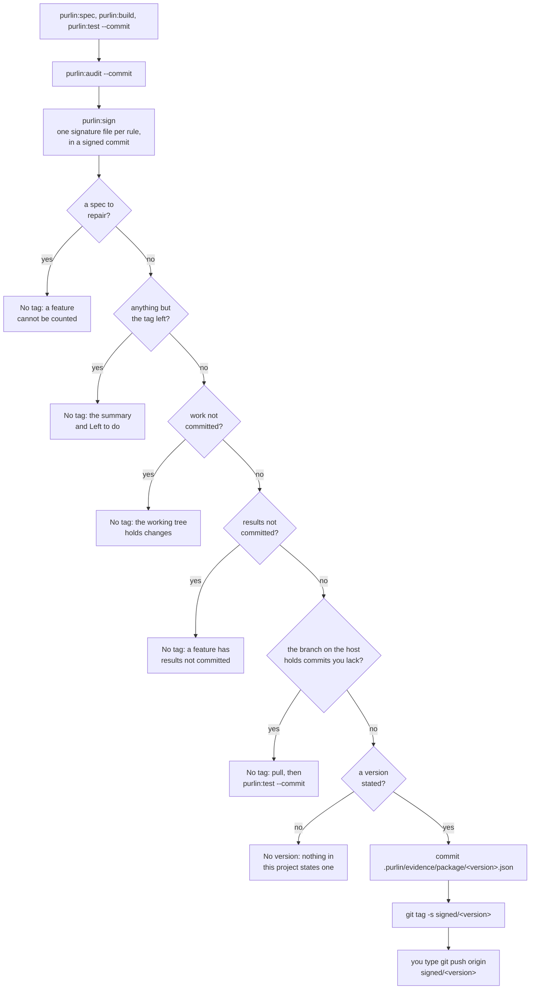

# Regulated workflow

For a team whose software is signed off in a regulated document and sign-off system, such as
Veeva, and who uses Purlin at the gate `signed`.

Purlin makes no claim that software is compliant with any regulation. It sits upstream of the
regulated system and produces evidence: what each rule claims, how that is shown, what ran, what
the audit found and who signed, tied to one commit. A person hands that evidence to the regulated
system, which holds the controlled document, the authority to sign it off and the signature that
counts under the regulation.

[review-and-signing.md](review-and-signing.md) covers the walk and the tag;
this page is what the gate `signed` produces and where Purlin's part ends.
[how-purlin-works.md](how-purlin-works.md) is the model in one page.

## What Purlin produces

Four things, all of them files or refs in the project's git repository.

**The evidence.** One file per feature per source,
`.purlin/evidence/local/<feature>.json` for a person's own run and
`.purlin/evidence/ci/<feature>.json` for a remote runner's. Each section names the operating
system and the machine the tests ran on, the commit, the time, every proof's result, and a
fingerprint of the spec, the covered code and the tests; once the audit has read a rule, it adds
what the audit found and the model that found it. `purlin:test` and `purlin:audit` write it, and
`--commit` commits it. [evidence_format.md](../references/formats/evidence_format.md) has every
field.

**The signatures.** One file per signed rule,
`specs/<category>/<feature>.signatures/<RULE-N>.<hash8>.<signer-slug>.json`, written by
`purlin:sign` in a signed commit. It records the signer's email and name as git holds them, the
key's fingerprint, the time, the gate and the note, and the hashes of the rule text, the proof
text, the test, the code the feature lists and what the audit found, with the machine each
system's tests ran on. [signature_format.md](../references/formats/signature_format.md) has every
field.

**The signed tag.** At the gate `signed`, when nothing but the tag is left and every result came
from committed work, `purlin:sign` writes `signed/<version>` with `git tag -s`, signed with the
key `user.signingkey` names. The version is the `VERSION` file at the project root, then what the
project's `package.json`, `pyproject.toml` or root `*.csproj` states, or what `--release <name>`
names. It prints:

```
Evidence package committed: .purlin/evidence/package/1.4.0.json.
Tagged signed/1.4.0 at 698261b.
Nothing left to do. Push the tag to release it: git push origin signed/1.4.0
```

While anything else is left it writes no tag and ends on the summary and `Left to do`, so the
tag's presence is the claim. It never writes over a tag that exists.
[review-and-signing.md](review-and-signing.md#the-tag) lists every line it prints instead.

**The evidence package.** One JSON file for one version,
`.purlin/evidence/package/<version>.json`. `purlin:sign` writes it and commits it just before the
tag, so the tagged commit carries the package that describes it; `purlin:export` writes it at any
other time and at any gate. Its state is `finished` when nothing is left to do and
`not finished` while anything is. An export while two kinds of work are left:

```
Evidence package written to .purlin/evidence/package/1.4.0.json. State: not finished.
```

and the file it wrote begins:

```
{
  "schema": "purlin-package/2",
  "state": "not finished",
  "rules": 3,
  "steps": {
    "passed": 2,
    "signed": 0,
    "strong": 2
  },
  "left": [
    {
      "command": "purlin:sign",
      "count": 1,
      "kind": "to_test_by_hand",
      "text": "1 rule to test by hand"
    },
    {
      "command": "purlin:sign",
      "count": 2,
      "kind": "to_sign",
      "text": "2 rules to sign"
    }
  ],
```

It holds:

- the state, the total of rules, the count at each step up to the gate, and each line of
  `Left to do` with its kind, count, words and command;
- the version of Purlin that wrote it, the project, the version, the tag, and the commit the
  evidence was taken at;
- the gate, the mutation setting and the minimum test strength;
- for every rule of every feature: its words exactly as the spec has them, the one kind of work
  it waits for, its proofs, the tests behind each proof, each result with its operating system,
  source, time, commit, runner and machine, what the audit found with the model and a fingerprint of the
  instructions it was given, each current signature with the signer's email and name, the key's
  fingerprint, the machines, the time, the note, whether its commit is signed and the hashes it
  locked, and one status for each step up to the gate;
- a fingerprint of the package itself.

Every time is UTC. The same commit always gives the same bytes. The package leaves out evidence
or a signature that is written and not committed, and names each such file under `warnings`.
Nothing in it names who last changed a test.
[package_format.md](../references/formats/package_format.md) has every field, and
`purlin:export --check <file>` recomputes the fingerprint:

```
The package matches its fingerprint.
```

## What you hand to the regulated system

The package: one data file per version, from the tagged commit. Its `state` comes second, after
the schema, so an export of work in progress reads `not finished` before anything else. How the
package is shown, read and filed is the receiving system's to decide.

## What a Purlin signature is

An engineering attestation. A person says that a rule, its proof, its test, the code the feature
lists and what the audit found belong together, over the results of the machine each system's
tests ran on, and `purlin:sign` locks those by their hashes into one file in a signed commit.
When every rule carries a signature that counts and nothing else is left, the tag marks the whole
of the evidence at one commit. It is evidence itself: it goes into the package like every other
result.

A signature counts, at every gate, while two things hold, each read from git or from the file:

1. The last commit that touched it carries a signature, made with any key, and that signature
   verifies over the commit. The key is not compared with the signer.
2. The hashes it was made over still match.

A change to any of them ends it, and its rule is `to sign` again; the status and every test run
print one line naming the rule, the signer and why it ended. A hand check's signature is made
over the rule's and its proofs' wording alone. Purlin records
who signed and the fingerprint of the key they signed with, and anyone with an SSH key can sign:
which signers were entitled is the regulated system's to decide.

## A requirement's number

A numbered requirement from the regulated system reaches the evidence in the rule's own words:

```
- RULE-3: Lock the account for 15 minutes after 5 consecutive failures (URS-042)
```

Purlin does nothing with the number. It reaches the package because the rule's words do, so the
receiving system can trace `URS-042` to the rule, its proofs, its tests, its results and its
signature.

## The day to day

Sign a version on a release branch, such as `release/1.2.0`, cut from the default branch once
its specs are done. New specs land on the default branch and wait for the next version; a fix
lands on the release branch and is merged back. The evidence a version is signed on is committed
on its release branch, and the tag is refused while `origin/release/1.2.0`, as this checkout last
fetched it, holds commits the checkout lacks.

The loop is the one every gate runs, with signing at the end. It runs on one machine unless a
proof is tagged `@env` for a system that machine is not; then `purlin:test --remote` has a remote
runner prove it.


```mermaid
flowchart TD
    W["purlin:spec, purlin:build, purlin:test --commit"] --> A["purlin:audit --commit"]
    A --> S["purlin:sign<br>one signature file per rule,<br>in a signed commit"]
    S --> B{"a spec to<br>repair?"}
    B -->|yes| NB["No tag: a feature<br>cannot be counted"]
    B -->|no| G{"anything but<br>the tag left?"}
    G -->|yes| L["No tag: the summary<br>and Left to do"]
    G -->|no| C{"work not<br>committed?"}
    C -->|yes| NC["No tag: the working tree<br>holds changes"]
    C -->|no| R{"results not<br>committed?"}
    R -->|yes| NR["No tag: a feature has<br>results not committed"]
    R -->|no| H{"the branch on the host<br>holds commits you lack?"}
    H -->|yes| NH["No tag: pull, then<br>purlin:test --commit"]
    H -->|no| V{"a version<br>stated?"}
    V -->|no| NV["No version: nothing in<br>this project states one"]
    V -->|yes| P["commit .purlin/evidence/package/#lt;version#gt;.json"]
    P --> T["git tag -s signed/#lt;version#gt;"]
    T --> U["you type git push origin<br>signed/#lt;version#gt;"]
```

Each signer needs an SSH key that git signs with. `purlin:sign` checks for one before it
signs; with none it prints the commands that set one up and exits 1:

```
No key to sign with. These commands set one up:
  ssh-keygen -t ed25519 -f ~/.ssh/id_ed25519 -N ""
  git config gpg.format ssh
  git config user.signingkey ~/.ssh/id_ed25519.pub
```

At the gate `signed` a rule whose spec names no files in `> Scope:` is signed all the same, and
its signature does not count until the spec names them: its line reads
`  <feature> <RULE-N>   does not count until the spec names its files: purlin:spec <feature>`, and
the rule is left to do as `to tie to its files`. A `@manual` proof has no test; its rule waits as
`to test by hand`, and the signer may write one line saying what they saw.

[hard_gates.md](../references/hard_gates.md) is the one definition of the gate and of what
`signed/<version>` means. [review-and-signing.md](review-and-signing.md) covers the walk and what
ends a signature, and [raising-the-gate-and-upgrading.md](raising-the-gate-and-upgrading.md) the
move to this gate.
