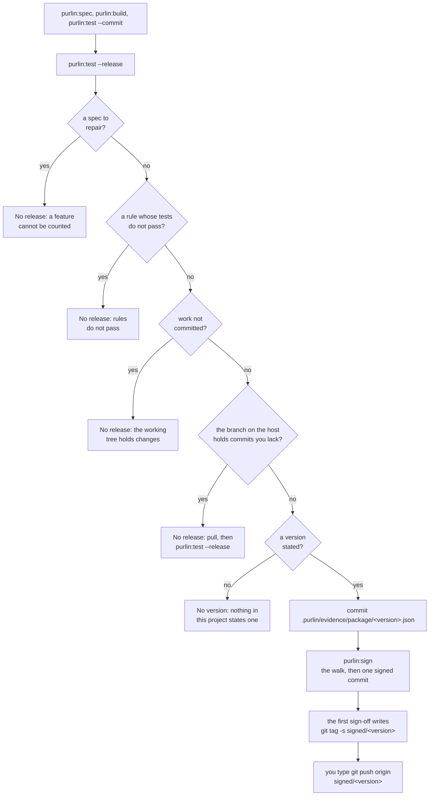

# Regulated workflow

For a team whose software is signed off in a regulated document and sign-off system, such as
Veeva, and who uses Purlin at the gate `signed`.

Purlin makes no claim that software is compliant with any regulation. It sits upstream of the
regulated system and produces evidence: what each rule claims, how that is shown, what ran, what
the audit found and who signed, tied to one commit. A person hands that evidence to the regulated
system, which holds the controlled document, the authority to sign it off and the signature that
counts under the regulation.

[review-and-signing.md](review-and-signing.md) covers the release run and the sign-off walk;
this page is what the gate `signed` produces and where Purlin's part ends.
[how-purlin-works.md](how-purlin-works.md) is the model in one page.

## What Purlin produces

Four things, all of them files or refs in the project's git repository.

**The evidence.** One file per feature per source,
`.purlin/evidence/local/<feature>.json` for a person's own run and
`.purlin/evidence/ci/<feature>.json` for a remote runner's. Each section names the operating
system and the machine the tests ran on, the commit, the time, every proof's result, and a
fingerprint of the spec, the covered code and the tests; once the audit has read a rule, it adds
what the audit found and the model that found it. `purlin:test` and `purlin:audit` write it, and
`--commit` commits it. Evidence may be committed on any branch; a release uses only the evidence
at the release commit. [evidence_format.md](../references/formats/evidence_format.md) has every
field.

**The evidence package.** One JSON file for one version,
`.purlin/evidence/package/<version>.json`. `purlin:test --release` writes it from the evidence at
the release commit and commits it alone, so the package describes that commit; `purlin:export`
writes it at any other time and at either gate. Its state is `finished` when no rule's tests are
left to pass and no spec or test comment is left to repair, and `not finished` while any is. An
export while two kinds of work are left:

```
Evidence package written to .purlin/evidence/package/1.4.0.json. State: not finished.
```

and the file it wrote begins:

```
{
  "schema": "purlin-package/3",
  "state": "not finished",
  "rules": 3,
  "steps": {
    "passed": 2
  },
  "audit": {
    "not_audited": 0,
    "strong": 1,
    "weak": 1
  },
  "left": [
    {
      "command": "purlin:build",
      "count": 1,
      "kind": "to_fix",
      "text": "1 rule to fix"
    },
    {
      "command": "purlin:build",
      "count": 1,
      "kind": "to_strengthen",
      "text": "1 rule to strengthen"
    }
  ],
```

It holds:

- the state, the total of rules, the count whose tests pass, what the audit found, and each line
  of `Left to do` with its kind, count, words and command;
- the version of Purlin that wrote it, the project, the version, the tag, and the commit the
  evidence was taken at;
- the gate and the mutation setting;
- for every rule of every feature: its words exactly as the spec has them, the one kind of work
  it waits for, its proofs, the tests behind each proof, each result with its operating system,
  source, time, commit, runner and machine, what the audit found with the model and a
  fingerprint of the instructions it was given, and its `passed` and `strong` statuses;
- every rule checked by hand, with its `@manual` proofs;
- a fingerprint of the package itself.

Every time is UTC. The same commit always gives the same bytes. The package leaves out evidence
that is written and not committed, and names each such file under `warnings`. Nothing in it
names who last changed a test. [package_format.md](../references/formats/package_format.md) has
every field, and `purlin:export --check <file>` recomputes the fingerprint:

```
The package matches its fingerprint.
```

**The sign-offs.** One file per signer beside the package,
`.purlin/evidence/package/<version>.signoffs/<signer>.json`, written by `purlin:sign` in a signed
commit. It carries the package's fingerprint, the signer's email and name as git holds them, the
key's fingerprint and the time, what the walk showed the signer, and every note they typed,
hand checks among them. [signature_format.md](../references/formats/signature_format.md) has every
field.

**The signed tag.** The first sign-off of a version writes `signed/<version>` on its commit with
`git tag -s`, signed with the key `user.signingkey` names. Later sign-offs are added after it and
the tag does not move. It never writes over a tag that exists.

```
Signed 1.4.0 as quinn.qa@labconnect.example with the key ending ...4f2a.
Tagged signed/1.4.0 at 698261b.
Nothing left to do. Push the tag to release it: git push origin signed/1.4.0
Sign-offs of 1.4.0: quinn.qa@labconnect.example.
```

[review-and-signing.md](review-and-signing.md#the-tag) lists what the release run and the walk
print instead when they refuse.

## What you hand to the regulated system

The package and its sign-offs, from the tagged commit. The package's `state` comes second, after
the schema, so an export of work in progress reads `not finished` before anything else. How the
package is shown, read and filed is the receiving system's to decide.

## What a Purlin sign-off is

An engineering attestation. A person walks the evidence package of one release, looks at each
hand check, each weak rule and each rule never audited, types what they saw where they have
something to say, and signs the package's fingerprint in one signed commit. It records what the
signer was shown and what they typed, and no judgment. It is evidence itself, filed beside the
package.

A sign-off counts while two things hold, each read from git or from the file:

1. The last commit that touched it carries a signature, made with any key, and that signature
   verifies over the commit. The key is not compared with the signer.
2. The package fingerprint it carries equals the fingerprint of the committed package.

Purlin creates evidence and enforces no policy about who signs: it records who signed and the
fingerprint of the key they signed with, and anyone with an SSH key can sign. Which signers were
entitled is the regulated system's to decide.

## A requirement's number

A numbered requirement from the regulated system reaches the evidence in the rule's own words:

```
- RULE-3: Lock the account for 15 minutes after 5 consecutive failures (URS-042)
```

Purlin does nothing with the number. It reaches the package because the rule's words do, so the
receiving system can trace `URS-042` to the rule, its proofs, its tests and its results, and
to the sign-offs over the package that holds them.

## The day to day

Release a version on a release branch, such as `release/1.2.0`, cut from the default branch once
its specs are done. New specs land on the default branch and wait for the next version; a fix
lands on the release branch and is merged back. The release run and the walk are refused while
`origin/release/1.2.0`, as this checkout last fetched it, holds commits the checkout lacks.

While the specs change, nothing is signed: product, QA and the developers improve rules, proofs
and tests together, and `Left to do` lists only work. The loop runs on one machine unless a proof
is tagged `@env` for a system that machine is not; then `purlin:test --remote` has a remote runner
prove it. The audit is a tool you run with `purlin:audit`; nothing waits on it.


```mermaid
flowchart TD
    W["purlin:spec, purlin:build, purlin:test --commit"] --> R["purlin:test --release"]
    R --> B{"a spec to<br>repair?"}
    B -->|yes| NB["No release: a feature<br>cannot be counted"]
    B -->|no| F{"a rule whose tests<br>do not pass?"}
    F -->|yes| NF["No release: rules<br>do not pass"]
    F -->|no| C{"work not<br>committed?"}
    C -->|yes| NC["No release: the working<br>tree holds changes"]
    C -->|no| H{"the branch on the host<br>holds commits you lack?"}
    H -->|yes| NH["No release: pull, then<br>purlin:test --release"]
    H -->|no| V{"a version<br>stated?"}
    V -->|no| NV["No version: nothing in<br>this project states one"]
    V -->|yes| P["commit .purlin/evidence/package/#lt;version#gt;.json"]
    P --> S["purlin:sign<br>the walk, then one signed commit"]
    S --> T["the first sign-off writes<br>git tag -s signed/#lt;version#gt;"]
    T --> U["you type git push origin<br>signed/#lt;version#gt;"]
```

Each signer needs an SSH key that git signs with. `purlin:sign` checks for one before it
signs; with none it prints the commands that set one up and exits 1:

```
No key to sign with. These commands set one up:
  ssh-keygen -t ed25519 -f ~/.ssh/id_ed25519 -N ""
  git config gpg.format ssh
  git config user.signingkey ~/.ssh/id_ed25519.pub
```

A `@manual` proof has no test; the walk stops at its rule and the signer types, in one line, what
they saw. The note goes into their sign-off.

[hard_gates.md](../references/hard_gates.md) is the one definition of the gate and of what
`signed/<version>` means. [review-and-signing.md](review-and-signing.md) covers the release run
and the walk, and [raising-the-gate-and-upgrading.md](raising-the-gate-and-upgrading.md) the move
to this gate.
