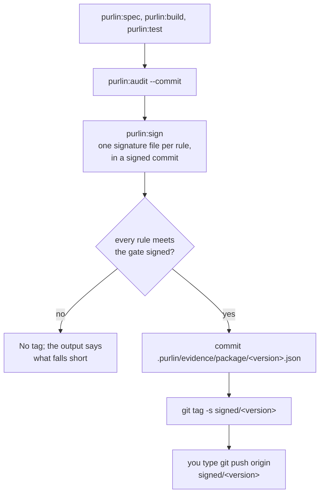

# Regulated workflow

For a team whose software is signed off in a regulated document and sign-off system, such as
Veeva, and who uses Purlin at the gate `signed`.

Purlin does not make software compliant. It sits upstream of the regulated system and produces
evidence: what each rule claims, how that is shown, what ran, what the audit found and who
signed, tied to one commit. A person hands that evidence to the regulated system, and the
regulated system is where the sign-off that counts under the regulation happens.

[team-workflow.md](team-workflow.md) covers the day at `strong`; this page is what `signed`
adds and where Purlin's part ends. [how-purlin-works.md](how-purlin-works.md) is the model in
one page.

## What Purlin produces

Four things, all of them files or refs in the project's git repository.

**The evidence.** One file per feature per source,
`.purlin/evidence/local/<feature>.json` for a person's own run and
`.purlin/evidence/ci/<feature>.json` for a remote runner's. Each section names the operating
system, the commit the tests ran at, the time, every proof's result, and a fingerprint of the
spec, the covered code and the tests; once the audit has read a rule, it adds what the audit
found and the model that found it. `purlin:test` and `purlin:audit` write it, and `--commit`
commits it. [evidence_format.md](../references/formats/evidence_format.md) has every field.

**The signatures.** One file per signed rule,
`specs/<category>/<feature>.signatures/<RULE-N>.<hash8>.<signer-slug>.json`, written by
`purlin:sign` in a signed commit. It records who signed, when, the machine they signed on and
its operating system, the rule's level, and the hashes of the rule text, the proof text, the
test body and what the audit found. [signature_format.md](../references/formats/signature_format.md)
has every field.

**The signed tag.** At the gate `signed`, when every rule meets it, `purlin:sign` writes
`signed/<version>` with `git tag -s`, using the key the signer signs commits with. Below
`signed` it writes no tag. The version is the `VERSION` file at the project root, else
`version` in `.purlin/config.json`, or what `--release <name>` names. It prints:

```
Tagged signed/1.4.0 at a1b2c3d: every rule meets the gate signed.
→ Run: git push origin signed/1.4.0
```

While any rule falls short it writes no tag and names why, `No tag: 3 of 42 rules do not meet
the gate signed.`, so the tag's presence is the claim. It never moves a tag that exists.

**The evidence package.** One JSON file for one version,
`.purlin/evidence/package/<version>.json`. `purlin:sign` writes it and commits it just before
the tag, so the tagged commit carries the package that describes it; `purlin:export` writes it
at any other time and at any gate, and below the gate `signed` the package reads
`work in progress` or `gate <gate> met`. It holds:

- the version, the tag, and the commit the evidence was taken at;
- its state, the first field after the schema: `signed`, `gate <gate> met` or
  `work in progress`, and `not_for_approval`, which is false only for `signed`;
- the gate, the trust setting, the mutation setting and the minimum test strength;
- for every rule of every feature: its words, its level, its proofs, the tests behind each
  proof, each result with when it ran, where (`local` or `ci`) and on which operating system,
  whether that result is current, what the audit found with the model that found it and a
  fingerprint of the instructions it was given, and every signature still current with its
  signer, time, machine and operating system;
- the version of Purlin that wrote it;
- a fingerprint of the package itself.

Every time is UTC. The same tag always gives the same bytes. The package leaves out anything
written and not committed, and names each such file under `warnings`. Nothing in it names who
last changed a test. [package_format.md](../references/formats/package_format.md) has every
field, and `purlin:export --check <file>` recomputes the fingerprint.

## What you hand to the regulated system

The package: one data file per version, from the tagged commit. How it is shown, read and
filed is the receiving system's job. Purlin writes no document and no report
layout for it.

A package whose state is anything but `signed` says so in its first field, and carries
`not_for_approval: true`, so a work-in-progress export cannot be mistaken for a version that
met the gate.

## What the regulated system does

Three things Purlin does not do:

- It holds the controlled document: the version of record, its history and its retention.
- It decides who may sign the version off, and in what order.
- It carries the signature that counts under the regulation.

Purlin reads nothing from that system and writes nothing into it. Its part ends at the file a
person hands over.

## What a Purlin signature is

An engineering attestation. A person says that a rule, its proof, its test and what the audit
found belong together, and `purlin:sign` locks those four by their hashes into one file in a
signed commit. When every rule that needs one carries a signature that counts, the tag locks the
whole of the evidence at one commit. It is the formal lock on the evidence, and it is evidence
itself: it goes into the package like every other result.

A signature counts at `signed` while two things hold, each read from git or from the file:

1. The commit that added it is cryptographically signed, and the signature verifies.
2. The hashes it binds still match the rule text, the proof text, the test body and what the
   audit found.

A change to any of the four stales it, and so does a re-audit that finds something different.
A code change under the spec's `> Scope:` leaves the signature standing and puts the evidence
`out of date` until the next run. Who signed and where is logged, not policed: anyone with
commit signing set up can sign, from any machine, and the signature names them. If your
organisation limits who may attest, that limit is yours to hold.

## A requirement's number

A numbered requirement from the regulated system reaches the evidence as a note in the rule's
own words:

```
- RULE-3: Lock the account for 15 minutes after 5 consecutive failures (URS-042)
```

Purlin does nothing with the number. It reaches the package because the rule's words do, so
the receiving system can trace `URS-042` to the rule, its proofs, its tests, its results and
its signature.

## What your git host must protect

The history is only as trustworthy as the host that holds it. Two settings are the team's to
supply at its git host, and Purlin neither checks nor sets them:

- **Branch protection** on the default branch, so its history cannot be rewritten or deleted.
- **Tag protection** on `signed/*`, so a signed tag cannot be moved or deleted once pushed.

## No claim of compliance

Purlin makes no claim that software is compliant with any regulation.

## The day to day

The loop is the one every gate runs, with signing at the end, all on one machine:


```mermaid
flowchart TD
    W["purlin:spec, purlin:build, purlin:test"] --> A["purlin:audit --commit"]
    A --> S["purlin:sign<br>one signature file per rule,<br>in a signed commit"]
    S --> G{"every rule meets<br>the gate signed?"}
    G -->|no| N["No tag; the output says<br>what falls short"]
    G -->|yes| P["commit .purlin/evidence/package/#lt;version#gt;.json"]
    P --> T["git tag -s signed/#lt;version#gt;"]
    T --> U["you type git push origin<br>signed/#lt;version#gt;"]
```

Each signer runs these once, on the machine they sign from, then uploads the same public key to
the git host as a signing key. `purlin:init --gate signed` prints them.

```bash
git config gpg.format ssh
git config user.signingkey ~/.ssh/id_ed25519.pub
git config commit.gpgsign true
```

`purlin:sign` refuses to sign over evidence that is written and not committed, `sign: login
has evidence that is not committed. Run: purlin:test --commit`, and at `signed` refuses a rule
whose spec names no files in `> Scope:`, because a signature must be tied to the code it
governs. A `@manual` proof has no test; its rule waits in the queue as a hand check, and the
signer writes one line saying what they saw.

[hard_gates.md](../references/hard_gates.md) is the one definition of the gate and of what
`signed/<version>` means. [review-and-signing.md](review-and-signing.md) covers the walk and
what stales a signature, and [raising-the-gate-and-upgrading.md](raising-the-gate-and-upgrading.md)
the move to this gate.
