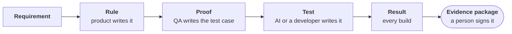
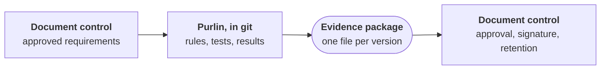

# Purlin in regulated work

Purlin does not make software compliant. It makes software more tested, and it keeps the
evidence.

**Use it beside a validated document control system, such as Veeva.** Purlin produces the
evidence. That system approves it, signs it and keeps it.

## More of your software is tested, on every build

AI writes code and tests quickly. Purlin holds both to rules people wrote.

- **QA defines quality before the code exists.** A proof is a test case in plain words, with
  its exact expected result. QA writes it beside product, in the same file as the rule.
- **The proofs steer the build.** The AI writes the code and the tests to the proofs. Quality
  is set at the start. It is not inspected in at the end.
- **Automated is the default.** Each proof gets a test that runs on every build. A check by
  hand is the exception, tagged `@manual`.
- **More cases cost one sentence each.** A new case is a new proof line. The test follows.
- **Nothing passes quietly.** A rule with no test is listed. A result stops counting when its
  rule, proof, test or code changes.
- **The tests are spot-checked.** The [audit](audit.md) plants one small bug for each proof
  and checks that its test fails. That shows the test can fail. It does not show the test
  catches every fault.

Purlin does not measure how much more is tested. It makes each of these the ordinary way to
work.

## The evidence is one file, per version

`purlin:sign` builds the evidence package from the committed results and a person signs it.

| For each rule, the package holds | |
|---|---|
| The requirement | the rule in its own words, with your requirement number if you wrote one into it |
| The test case | each proof, with its expected result |
| The test | its file and name |
| The execution | pass or fail, the commit, the time, the machine, the operating system, who ran it |
| The strength of the test | what the audit found, and the bug a test missed |
| The authors | who wrote and last changed each rule, proof and test, read from git |
| The sign-off | who signed, when, with which key, what they were shown, every note they typed |

The package carries a fingerprint, so anyone can check a copy is unchanged:
`purlin:sign --check <file>`. [The sign-off](sign-off.md) walks through it.

## Your document control system holds the record

Purlin works in git, where the team builds. The record that counts lives in the system your
company has validated for it.

| When | In your document control system |
|---|---|
| Before the work | The approved requirements. Write each one's number into its rule. |
| Before the tests count | Approval of the test cases: review the proofs there, or as a required review when they are merged. |
| When a test fails on a version meant for release | The deviation, raised and closed by your procedure. |
| After `purlin:sign` | The evidence package and its sign-offs, filed as the verification record. |
| At approval | The electronic signature, by a person that system has authenticated. |
| From then on | Retention, access control and the audit trail. |

## What a validation reader looks for, and where it is

Regulated teams work to rules such as FDA 21 CFR Part 11, GAMP 5 and the FDA's guidance on
Computer Software Assurance. **Purlin claims compliance with none of them.** It supplies
records that your own process can use.

| A reader looks for | Purlin's evidence | In your document control system |
|---|---|---|
| A requirement that can be traced | the rule and its id | the approved requirements document |
| A test case with an expected result | the proof | approval of test cases before they run |
| A record of execution | each result, with where, when and who | |
| Trace from requirement to result | the package lists rule, proof, test and result together | the trace matrix in your format |
| A reason to trust the tests | the audit's planted bugs | your judgment of risk |
| Review and approval | the sign-off, as a signed commit | the electronic signature that counts |
| A record that cannot change quietly | the fingerprint, the signed commit, the signed tag | retention, access control, the audit trail |

## Where Purlin stops

- **It is not a quality system.** It controls no documents and approves nothing.
- **A sign-off is not an electronic signature under Part 11.** It is a signed git commit: it
  shows which key signed which package. Your document control system carries the approval that
  counts.
- **Git can be rewritten.** The fingerprint shows a changed package. The copy filed in your
  document control system is the record.
- **Nothing is approved before a test runs.** Review the proofs when they are merged, or in
  your own system. Purlin records who wrote and last changed each one.
- **Purlin records who signed. It does not decide who may.**
- **Purlin is a tool.** Assess it as you would any tool your process relies on.
- **It cannot prove your code is correct.** It shows which rules have tests, that the tests
  pass, and that they catch a planted bug.

## What your procedures decide

- **How you qualify Purlin.** State what you use it for, pin its version, and control its
  updates, as for any tool your process relies on.
- **What risk asks for.** Purlin treats every rule alike. Your risk assessment says which
  requirements need more than these tests.
- **What kind of testing this is.** These are a developer's tests on a developer's machine.
  They are not acceptance testing in a qualified environment.
- **Who reviews the tests.** The same AI session can write the code and its tests. Decide who
  reads them.
- **That every requirement has a rule.** Purlin does not compare your approved requirements
  with its rules.
- **The run you release on.** A full run carries forward results for code that did not
  change. For a version meant for release, run every test: `purlin:test --clean --commit`.
- **What was observed.** A result is pass or fail. Where you need the value a test saw, keep
  the test's own log with the package.

## The workflow, step by step

Each step has a part in Purlin and a part in your document control system.

| Step | In Purlin | In your document control system |
|---|---|---|
| 1. Requirements | | Approve the requirements. Each has a number. |
| 2. Rules and test cases | Product and QA write a rule for each requirement, with its number in it, and the proofs: `purlin:spec`. | Approve the test cases, or require a review when they are merged. |
| 3. Build | The AI writes the code and the tests to the proofs: `purlin:build`. A person reads the tests. | |
| 4. Test, every build | `purlin:test` runs what changed and says what is left to do. | |
| 5. Check the tests | `purlin:audit` plants a bug for each proof. Strengthen what it finds weak. | |
| 6. A failure on a release version | Fix it and run again. The earlier result is in git. | Raise the deviation and close it. |
| 7. The release run | `purlin:test --clean --commit` runs every test on the version to release. | |
| 8. Sign-off | A person reads the evidence and signs it: `purlin:sign`. This is an engineering sign-off. | |
| 9. Approval | | File the evidence package and its sign-offs. Approve and sign there. |
| 10. A change | Change the rule or the code. Its results stop counting until the tests run again. | Approve the change to the requirement. |

**Three habits make the evidence hold up:**

- Write the requirement's number into its rule, so the package traces to it.
- Never reword a rule or a proof to make a test pass. Change the requirement first.
- Release on a `--clean` run, from a commit with nothing uncommitted.
