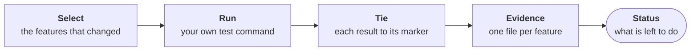
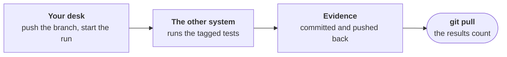

# Running the tests, and the evidence a run leaves

For the developer who runs Purlin, and for anyone who reads the evidence afterwards.

`purlin:test` runs your marked tests with your own test command, and writes what it saw as
evidence. Everything runs on your machine.



## A run tests what your change touched

| Command | What it runs |
|---|---|
| `purlin:test` | The features your change touched. Slow tests and AI proofs are left out. |
| `purlin:test <feature>` | One feature, or several. |
| `purlin:test --all` | Every feature: it runs what changed, slow tests and AI proofs included, and carries the rest forward. |
| `purlin:test --clean` | Every test of every feature. |
| `--commit`, on any of them | Also commits the work and the evidence the run wrote. |

A test is run when it carries a marker, the comment `# purlin: cart PROOF-1` above it. A test
file with no marker is never run.

**The first run sets your test command.** It finds the test tools the project uses, runs
nothing, and suggests an entry for each:

```
No test command is set in .purlin/config.json, so nothing ran.
Suggested for pytest: python3 -m pytest {files} --junitxml={report}
```

Say yes, and it writes the `tests` setting, commits `.purlin/config.json` alone and runs.
[supported_frameworks.md](../references/supported_frameworks.md) gives the entry for each tool.

**A run prints what it ran, what it wrote and where the project stands.** One feature with
three marked tests, run with `--all --commit`:

```
Running pytest: python3 -m pytest tests/test_cart.py --junitxml=.purlin/runtime/reports/pytest.xml

Markers: 3 tied to a test, 0 not tied.
Ran pytest on 1 feature.

Committed 373225b, the work these results describe:
  .purlin/config.json
  specs/shop/cart.md
  tests/test_cart.py

Evidence written to .purlin/evidence/local/cart.json.
Evidence committed.

Purlin status: shop, plugin 0.10.0
Tests: met
Sign-off: not signed

Spec  Rules  Proofs  Tests
───────────────────────────
cart  3      3       3 of 3
───────────────────────────

3 rules. 3 pass their tests.
Every rule passes its tests on the committed evidence. Optional: sign this version with purlin:sign
```

## Every run ends on what is left to do

The status counts every rule under `specs/`, not only the features the run covered. `Left to
do` has one line per kind of work left, with its count and its command. Its first line is the
next step.

A failing test is a result, recorded as `fail`. The run prints the end of the suite's own
output and names the rule:

```
cart RULE-2: rule to fix. tests/test_cart.py::test_sum fails. Run purlin:build cart.
```

After the table, it ends on:

```
3 rules. 2 pass their tests.
Left to do:
  1 rule to fix: purlin:build
```

- **`Tests` reads `met` when nothing left to do blocks it.** A rule to strengthen and a rule
  to write a proof for do not block.
- **A missing result is never read as a pass.** Where a marked test was skipped, or a suite
  left no report, the run prints a line of the kind `evidence missing` and exits 1.
- **A run that exits 1 says why in one line.**
  [purlin_commands.md](../references/purlin_commands.md#exit-codes) lists each exit code, and
  [evidence_and_signoff.md](../references/evidence_and_signoff.md#what-is-left-to-do) each
  line of `Left to do`.

## The evidence is one file per feature

```
.purlin/evidence/<source>/<feature>.json
```

| Part | What it is |
|---|---|
| `<source>` | `local` for a run on a person's machine, `ci` for your project's own run on another system |
| `<feature>` | the spec's name |

Both sources count. One file holds one section per operating system, so two machines never
overwrite each other. Once an audit has read the feature, the file also holds what the audit
found.

**What a result records.** Each section names the commit of the code it describes, the time,
who ran it and the machine. It holds each rule's word, and each proof's result with its test:
`pass`, `fail`, `missing`, `not run` or `nothing to check`.

It also keeps what the test tool reported for each test: its outcome, how long it took and,
where it did not pass, the whole failure text. The tool's report file stays on the machine
that ran it, so a sign-off can commit it.
[evidence_format.md](../references/formats/evidence_format.md) holds every field.

**A run writes the evidence, and `--commit` commits it.** It makes two commits under your own
git identity: first the specs, the marked tests and the settings the results describe, then
the evidence, as `purlin: evidence at <sha7>`. No Purlin command pushes.

The git history of `.purlin/evidence/` is the log of what was proven and when. A run deletes
the evidence of a feature no spec defines. When a merge conflicts in `.purlin/evidence/`, take
either side and run `purlin:test --commit`.

## A result stops counting when something changes

Each section carries a fingerprint over the spec, the code the spec covers and the tests. When
one of them changes, the rule reads `out of date` and names what changed, such as
`code changed since 373225b`. The next run clears it.

- A change to a spec, even to one rule's words, puts every rule of that spec out of date.
- A change to a test command in `.purlin/config.json` puts every result out of date.
- An anchor covers the whole project, so a change to any tracked file puts its rules out of
  date.

## The full run covers every feature and carries forward what did not change

```
purlin:test --all --commit
```

This is the developer's hand-off before a sign-off. It runs:

- each feature whose spec, code or tests changed since its results were taken;
- each feature whose results are not all passes;
- every anchor.

Every other feature is carried forward. None of its tests run. Its results are recorded again
on this commit, each marked `carried` with the commit, the time, the machine and the person
of the run that took it. A result from another system, such as Windows, is carried the same
way while nothing its feature covers changed.

```
Ran pytest on 3 features and carried 62 forward. purlin:test --clean runs every test.
Carried the Windows results of 9 features forward.
```

`purlin:test --clean` runs every test and carries nothing. After a change to a feature with a
proof tagged for another system, run the tests on that system again.

**A sign-off counts only results recorded on this version of the code, with nothing
uncommitted.** A carried result is one of them. Where a result does not count, `purlin:sign`
refuses and names what to run again. [sign-off.md](sign-off.md) is the sign-off, and
[evidence_and_signoff.md](../references/evidence_and_signoff.md#which-evidence-counts) the one
definition.

## An AI proof runs several times on each model

A proof tagged `@ai(...)` is about what an AI does with a prompt or a skill. It is a slow
proof: `purlin:test --all` starts its test, and a plain `purlin:test` leaves it out. The run
starts the test alone, 3 times on each model the tag names:

```
Running triage_prompt PROOF-4 on claude-opus-5-5, 1 of 3
```

- **Every run must pass.** The proof passes on a model when all its runs passed, and it passes
  when it passes on every model it names.
- **There is one result per model.** A rule that passed on one model and has no result on
  another reads `not run`. `Left to do` names the model:
  `1 rule to test on claude-sonnet-5-5: purlin:test --all`
- **A model that cannot be reached is `not run`, never failed.** The run says
  `claude-sonnet-5-5: model not reached. The login expired. Run purlin:test --all.`
- **The `runs` setting says how many.** `.purlin/config.json` holds `version`, `tests` and
  `runs`. A proof's own `runs=<n>`, in its tag, wins. Where neither says, it is 3.
- **A full run keeps a model that passed every run**, marked `carried`, and starts the rest.
  `purlin:test --clean` starts every model.

| For each model, the evidence holds | |
|---|---|
| The count | how many runs passed, of how many were asked |
| Each run | `pass`, `fail` or `not run`, and the sha256 of the folder holding its output |
| Who made the output | the helper, or your project's own test |
| A graded run | the grader, whether it accepted the output, and its one reason |
| A run that is `not run` | why, in one sentence |

**What is kept.** Each run writes one folder,
`.purlin/runtime/ai/<feature>/<PROOF-N>/<model>/<n>/`: the AI's reply, what the session did,
the files it wrote, and what the AI was given. Git ignores it, so it stays on the machine
that ran the test. A run removes a folder no evidence names. A sign-off is optional; the first
one of a version commits the folders with the package.

[testing-ai.md](testing-ai.md) walks an AI proof from rule to evidence, and
[graded-by-ai.md](graded-by-ai.md) is the page on a grade.

## The audit asks whether the tests would catch a bug

`purlin:audit` runs the same tests. Then it runs the spot tests, plants one small bug for each
proof in a copy of the project, and runs that proof's test. For an AI proof it plants a wrong
output in a copy of a kept one. It writes what it found into the same evidence file, and
nothing waits on it. [audit.md](audit.md) says how it works and what to do with a finding.

## Your project runs the tests on another system

Purlin runs your tests where you are. Reaching another platform is your project's own setup,
and Purlin keeps the evidence. Purlin itself only works locally. It drives no remote pipeline
and adds none to your repository.



| | |
|---|---|
| Say where it must hold | Tag the proof `@env(windows)`. Every status then lists it: `22 rules to test on Windows` |
| Ask the AI to set it up | It writes what your project needs for your git host, GitHub or Azure DevOps. The files live in your project and are yours to change. |
| Run it your way | How a run starts is up to your project: from your desk, on a push or on a schedule. The results come back through git. |
| Purlin tracks the results | Each result records the machine and the system it ran on, for every rule, like a result from your own machine. |

On your own machine such a proof is neither a pass nor a failure. Its rule reads `not run`,
and the run says:

```
Windows: proofs not run here. 1 proof needs it, and this machine is macOS. Run purlin:test on Windows.
```

### One example: GitHub, started from your desk

A workflow a project can copy to `.github/workflows/windows.yml`:

```yaml
name: windows
on:
  workflow_dispatch:
permissions:
  contents: write
jobs:
  windows:
    runs-on: windows-latest
    timeout-minutes: 90
    steps:
      - uses: actions/checkout@v4
        with:
          fetch-depth: 0
      - uses: actions/setup-python@v5
        with:
          python-version: '3.11'
      - name: Get Purlin
        shell: bash
        run: git clone --depth 1 --branch signed/0.10.0 https://github.com/rlabarca/purlin "$RUNNER_TEMP/purlin"
      - name: Install what the tests need
        shell: bash
        run: python3 -m pip install pytest
      - name: Run the tests tagged for Windows
        shell: bash
        run: |
          git config user.name "github-actions[bot]"
          git config user.email "41898282+github-actions[bot]@users.noreply.github.com"
          python3 "$RUNNER_TEMP/purlin/scripts/run/purlin_run.py" --ci --commit
      - name: Return the evidence
        if: always()
        shell: bash
        run: git push origin "HEAD:${{ github.ref_name }}"
```

Use the tag of the Purlin version in your `.purlin/config.json`, and install what your own test
command needs. Start it from your desk, on a branch you have pushed:

```
gh workflow run windows.yml --ref "$(git branch --show-current)"
gh run watch
git pull
```

GitHub starts a workflow by hand only once its file is on the default branch.

**What that run does.** `purlin_run.py --ci --commit` starts only the tests of the proofs
tagged for the system it is on, slow ones included. It writes that system's section of
`.purlin/evidence/ci/<feature>.json` and commits those files alone. The workflow's last step
pushes them, after a failed run too. No audit runs there.

The commit that comes back changes only files under `.purlin/`. So its results are recorded on
the same version of the code as yours, and both count for a sign-off.

For Azure DevOps or any other git host, ask the agent to
`set up a Windows run for this project on Azure DevOps`. It writes the pipeline file for that
host. The five things every such file does are in
[evidence_and_signoff.md](../references/evidence_and_signoff.md#a-run-on-another-system).

## Next

- [how-purlin-works.md](how-purlin-works.md): the model in one page, and who writes each file.
- [dashboard.md](dashboard.md): the same data as a page that opens from disk.
- [audit.md](audit.md): what the audit checks.
- [testing-ai.md](testing-ai.md): testing a prompt or a skill.
- [sign-off.md](sign-off.md): the evidence package, the sign-offs and the tag.
