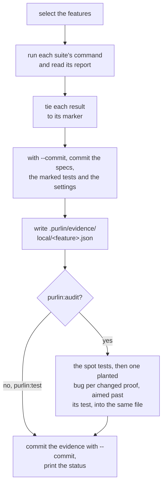

# Running the tests, and the evidence a run leaves

For the developer who runs Purlin, and for anyone who reads the evidence afterwards.

Two commands run your tests.

- `purlin:test` runs the marked tests and writes the evidence.
- `purlin:audit` runs the same tests, then asks whether they would catch a bug. It writes what
  it found into the same evidence.

Both call one run script, `scripts/run/purlin_run.py`, so a test is run one way. Both run on
your machine.

| | `purlin:test` | `purlin:audit` |
|---|---|---|
| Runs the marked tests | yes | yes |
| Runs the heuristic spot tests | no | yes, with no model |
| Plants one bug per changed proof, aimed past its test | no | yes, in a copy of the project |
| Writes the evidence, and commits it with `--commit` | yes | yes |
| The cell it writes | `passed` | `passed` and `strong` |

## purlin:test

```
purlin:test                     Run the features your change touched
purlin:test --all               Cover every feature: run what changed, carry the rest forward
purlin:test --clean             Run every test of every feature
purlin:test <feature> [...]     Run one feature, or several
purlin:test --commit            Commit the work and the evidence the run wrote
purlin:test --arm-timeout <seconds>  Give each suite longer than an hour
```

### The first run

Setup leaves the `tests` setting in `.purlin/config.json` empty. The first run finds the test
tools the project uses, runs nothing, and suggests an entry for each:

```
No test command is set in .purlin/config.json, so nothing ran.
Suggested for pytest: python3 -m pytest {files} --junitxml={report}
Suggested tests setting: [{"name": "pytest", "run": "python3 -m pytest {files} --junitxml={report}", "report": ".purlin/runtime/reports/pytest.xml", "format": "junit", "files": ["**/test_*.py", "**/*_test.py"]}]
```

`purlin:test` compares each suggested command with how the project runs its tests itself, and
shows you each difference. The run asks `Write this tests setting to .purlin/config.json? [y/N]`.
On your yes it prints `Wrote the tests setting to .purlin/config.json.` and runs.

Where the run finds no test tool it knows, it prints `No test command is set and no test tool
Purlin knows was found, so nothing ran. The agent reads the project and proposes a command for
you to confirm.` [supported_frameworks.md](../references/supported_frameworks.md) gives the
entry for each tool and what each needs added.

### Which features run

With no feature named, the run selects a feature in any of these cases:

- it has no run on this operating system;
- its spec, its code or its tests changed since its newest run here;
- its newest run here matches them and the status still counts one of its rules under
  `rules to test`, as after a run whose test tool could not start. The reason reads
  `1 rule to test`;
- an untracked file sits under its `> Scope:` or beside its tests;
- its spec names no files.

Before it runs anything, it says what it selected and why:

```
Selected 1 of 1 feature: cart (no run on macOS yet).
```

It names what it skipped on a line of its own, `Skipped <n> features whose spec, code and
tests match their evidence: <names>. purlin:test --clean runs them too.`, with ten names and a
count of the rest.

With nothing selected the run prints `Nothing to run: every feature's spec, code and tests
match its evidence. purlin:test --clean runs them anyway.` It runs no test. It exits 1 only where
the evidence it stands on holds a failing test.

Every run hands each suite only the test files that carry the markers of the features it runs,
and starts no suite that holds none. `--clean` hands over every marked file.
[supported_frameworks.md](../references/supported_frameworks.md#the-entry-suggested) gives the
one exception, a file list too long for a command line.

Where the `tests` setting changed since the evidence was taken, the run first prints
`The tests setting changed, so every result is out of date.` The status prints it too.

`purlin:test` skips every slow test. Only `--all` and `--clean` start the test of a proof
tagged `@slow`. Every other run lists it under `Left to do`, as
[Slow proofs](specs-and-anchors.md#slow-proofs) says.

A plain run keeps an earlier slow result while nothing its spec covers changed, marked
`carried` with the commit it was taken at. It counts like any other result.

### The run before a sign-off

`purlin:test --all --commit` covers every feature. It runs:

- each feature whose spec, code or tests changed since its results were taken;
- each feature whose results here are not all passes;
- every anchor.

It carries every other feature forward. None of its tests run. Its results are recorded again
on this commit, each marked `carried` with the commit, the time, the machine and the person of
the run that took it. A result from another system, such as Windows, is carried the same way,
from whichever machine took it. So is a slow proof's result.

The run says how many it ran and how many it carried:

```
Ran pytest on 3 features and carried 62 forward. purlin:test --clean runs every test.
Carried the Windows results of 9 features forward.
```

A result from another system is carried only while nothing its feature covers changed. After a
change, run the tests on that system again.

`purlin:test --clean` runs every test of every feature and carries nothing.

### What a run prints

The run takes three steps:

1. It runs each suite's own command from the `tests` setting.
2. It reads the report the suite writes under `.purlin/runtime/reports/`. That directory is
   generated and never committed.
3. It ties each result to the marker comment above its test, `# purlin: cart PROOF-1`.
   [marker_format.md](../references/formats/marker_format.md) is the one home of the marker.

As each suite starts the run prints `Running <suite>: <the command as run>`, so a long run
shows where it is.

A test file with no marker comment is never run, under `--all` too. A run with `--all` counts
the ones the `files` patterns of the `tests` setting match, after the `Markers:` line:
`12 test files carry no marker and were not run.`

A project with one feature and three marked tests, run with `--all --commit`, reads:

```
Running pytest: python3 -m pytest tests/test_cart.py --junitxml=.purlin/runtime/reports/pytest.xml

Markers: 3 tied to a test, 0 not tied.
Ran pytest on 1 feature.

Committed 373225b, the work these results describe:
  .purlin/config.json
  specs/shop/cart.md
  tests/test_cart.py

Evidence written to .purlin/evidence/local/cart.json.
Evidence committed.

Purlin status: shop, plugin 0.10.0
Tests: met
Sign-off: not signed

Spec  Rules  Proofs  Tests
───────────────────────────
cart  3      3       3 of 3
───────────────────────────

3 rules. 3 pass their tests.
Every rule passes its tests on the committed evidence. To sign it: purlin:sign
```

Each rule's passed cell reads `passed`, `failed`, `partial`, `no test`, `not run`,
`out of date` or, for a rule checked by hand alone, `checked at sign-off`. The run writes one tracked file per feature it ran:

```
.purlin/evidence/local/<feature>.json   this operating system's section: the commit, the
                                        time, who ran it, the fingerprint, each rule's
                                        word, each proof's result and test
```

A run of one feature replaces that feature's section and leaves the rest as it was.

Without `--commit` the run commits nothing. `--commit` makes two commits under your own git
identity:

1. The specs of the features it ran, the test files carrying their markers and
   `.purlin/config.json`, where any of them changed, as
   `purlin: specs, tests and settings for <feature>`. Over 5 features the subject counts
   them, `purlin: specs, tests and settings for 54 features`, and the body lists them.
2. The evidence, as `purlin: evidence at <sha7>`, naming the first.

It prints `Evidence committed.` When the run saw the same thing over the same code, it prints
`Evidence unchanged.`

The two commits hold only those files. Where others are still changed or untracked, the run
names up to 10 of them and says what to do:

```
1 file is still not committed:
  src/cart.py
Commit them, then run purlin:test --all --commit again: a sign-off needs results taken with nothing uncommitted.
```

### How a run ends

Every run ends on the status. The status counts every rule under `specs/`, not only the
features this run covered. It has the three opening lines, the table, the sentence and
`Left to do`.

```
Purlin status: labconnect, plugin 0.10.0
Tests: not met
Sign-off: signed 0.1.0, 4 commits since
```

`Tests` reads `met` when no line of `Left to do` is of a kind that blocks. `Sign-off` names the
newest signed version and whether the code has moved since.

`Left to do` names each kind of work left, with its count and its command, in this order. Its
first line is the next step.

| Line | Command | Blocks `Tests: met` |
|---|---|---|
| `1 spec to repair` | `purlin:spec` | yes |
| `1 rule to write a proof for` | `purlin:spec` | no |
| `1 test comment to correct` | `purlin:build` | yes |
| `1 rule to fix` | `purlin:build` | yes |
| `1 rule to write a test for` | `purlin:build` | yes |
| `1 rule to test` | `purlin:test` | yes |
| `1 slow proof to run` | `purlin:test --all` | yes |
| `1 rule to test on Windows` | `run purlin:test on Windows` | yes |
| `1 feature whose results are not committed` | `purlin:test --commit` | yes |
| `1 rule to strengthen` | `purlin:build` | no |

The line about results not committed shows last: only once no other work stops the tests being
met. While a rule fails, has no test or waits for a run, the list names that work alone.

Where the tests are met and this code is not signed, the run's last line reads
`Every rule passes its tests on the committed evidence. To sign it: purlin:sign`.

A sign-off counts only results recorded on this version of the code, with nothing uncommitted.
Where every rule passes and some result is not one of those, the last line names the run to
make first:

```
Every rule passes its tests on the committed evidence. Before a sign-off, run purlin:test --all --commit: a sign-off counts only results recorded on this version of the code.
```

That happens after a commit that changes a file outside `.purlin/`, such as a `--commit` run
of one feature. Results from a project's own run on another system read
`run purlin:test on Windows` in place of the command.

A test run exits on the tests alone:

| Exit | When |
|---|---|
| 1 | a test failed, evidence is missing, a comment names nothing a spec has, or a spec writes a number twice or holds a merge-conflict line |
| 1, before anything runs | there is no settings file, the settings file cannot be read, an older Purlin set the project up and nobody upgraded it, or no test command is set |
| 2 | the command line cannot be read |
| 0 | otherwise |

[purlin_commands.md](../references/purlin_commands.md) lists each command's exit codes.

### A failing test

A failing test is a result: the evidence records it as `fail`. The run prints the last 60 lines
of the suite's own output, between `--- pytest output (last 60 lines) ---` and
`--- end of pytest output ---`. It names the rule and exits 1:

```
cart RULE-2 fails: tests/test_cart.py::test_sum. Run purlin:build cart.
```

The run ends on the table and:

```
3 rules. 2 pass their tests.
Left to do:
  1 rule to fix: purlin:build
```

A rule with a proof that has no test is named the same way:

```
cart RULE-2 has no test for PROOF-5. Run purlin:build cart.
```

### Proofs for another operating system

A proof tagged `@env(windows)`, `@env(macos)` or `@env(linux)` is proven only by a run on that
operating system. On your machine the run counts the proofs tagged for another system, in one
line per system. They are neither a pass nor a failure:

```
1 proof needs Windows; this machine is macOS. Run purlin:test on Windows.
```

Their rules' passed cells read `not run`, with the reason `Windows: no run yet`. `Left to do`
carries `1 rule to test on Windows: run purlin:test on Windows`. That is an instruction, not a
command you type here: run `purlin:test` on a Windows machine, or start your project's own run
there. [Testing on another system](#testing-on-another-system) says how a project gets that run.

Three details:

- A proof tagged for another system with no test tied to it is not counted in that line. Its
  rule reads `no test`.
- The passed cell keeps one entry per operating system a current run covered: the word, the
  source and when the run happened.
- The cell reads `partial` when two systems that each have a current section disagree. A rule
  that reads `partial` is left to do as `to fix`.

### The two loud failures

A test framework that runs nothing says nothing about it. So the run script checks two things
the frameworks cannot check themselves. Each prints a line starting `Evidence is missing:` and
makes the run exit 1.

- **A: a suite ran and left no report Purlin can read.** The report path holds nothing, or a
  file that cannot be read. Purlin deletes a report before each run, so an old one is never
  read instead. The line names the suite and what was wrong, then `Check its command and
  report in the tests setting of .purlin/config.json, then run purlin:test.` A suite killed at
  `--arm-timeout`, 3600 seconds by default, is missing evidence the same way. Its line ends
  `Run purlin:test --arm-timeout <seconds> to give it longer.`
- **B: a marker of a feature the run covers has no passing or failing result.** Its test was
  skipped, the report does not hold it, or no test follows the marker. The line names the
  first five by file and line, counts the rest, and ends `Check that its test ran and was not
  skipped, then run purlin:test.` Where the test did run and the report names it by another
  spelling of its title, differing by white space, quotes or joined pieces, the line shows
  both names and ends `Write the title as the report reads, then run purlin:test.` One skip
  is a result: an anchor's test that found nothing to
  check, skipped with a reason starting `nothing to check:`
  ([specs-and-anchors.md](specs-and-anchors.md#a-rule-with-nothing-to-check)).

### A comment to correct

A comment above a test ties its test to nothing when it names a feature, a proof or a rule no
spec has, or names a rule that has proofs. The run prints one line for each, by file and line,
and exits 1 whatever the tests did:

```
tests/test_cart.py:22 names cart PROOF-9, which no spec has. Correct the comment, or run purlin:build to repair it.
```

A proof may be reworded after its test was last changed. The run prints that comment after the
`Markers:` line, quoting both wordings. It changes no exit code, and it clears once the test
itself changes:

```
tests/test_login.py:1 names login PROOF-4, whose wording changed after the test was last changed in 1cf829e: it read "A" and now reads "B". Run purlin:build login to make the test show it; the line clears once the test changes.
```

`Left to do` counts both kinds, and the tests read `not met` while one is left:

```
Left to do:
  1 test comment to correct: purlin:build
```

## purlin:audit

```
purlin:audit                    Run what the change touched, audit, write the evidence
purlin:audit <feature> [...]    One feature, or several
purlin:audit --all              Cover every feature as purlin:test --all does, and read every rule again
purlin:audit --commit           Commit the work and the evidence the run wrote
purlin:audit --arm-timeout <seconds>  Give each suite, and each planted bug's run, longer
purlin:audit <feature> RULE-N --settle  Plant each bug that survived again, and run its proof's test
purlin:audit <feature> RULE-N --settle --sound PROOF-N  The same, where that proof's test was judged sound and left as it was
```

A passing test is not proof that it checks anything. The audit tries to make each test fail.

An audit runs the tests as `purlin:test` does. Then it reads a rule when all of these hold:

- the rule is its feature's own or an anchor's;
- it has at least one proof with a test;
- its passed cell reads `passed`;
- it has no audit entry, its entry is out of date, or a proof still waits for its bug.

`--all` reads every such rule again. For each rule the audit takes three steps, in this order:

1. **The heuristic spot tests**, in code, with no model: six checks over each test's source
   and its proof's words. [review_criteria.md](../references/review_criteria.md#heuristic-spot-tests)
   is their one home.
2. **The model is asked for a small bug for each proof and for its reading.** An AI reads the
   proof, its test and the code, and writes the one small bug that test is most likely to miss.
   The bug must break the case the proof names. Where the test leaves no way past, the AI
   writes a plain bug. A proof whose test and covered code are as the audit last read them
   keeps its result and gets no new bug. The reading explains the tests and sets no verdict.
   The model is started with no tools, no plugins and none of your settings, in an empty
   folder.
3. **Each bug planted** in a copy of the project, and that proof's own test run. A test that
   still passes did not catch the bug. A test that is skipped, is not collected, runs past its
   limit or ends in an error decides nothing. The copy is then removed. A surviving bug is
   shown with the case the AI says it breaks.

A rule reads:

- `weak` when a spot test fires on one of its tests or a planted bug survived;
- `strong` when none did and a planted bug was caught by its proof's test;
- `spot-checked` when none did and no bug was planted and caught. The audit says why.

One caught bug makes a rule `strong`. Each of its proofs with no caught bug is named under it,
with the reason. No bug is planted for an anchor's proof, a `@manual` proof or a proof tagged
for another system. So an anchor's rule reads `spot-checked`.

Where the model cannot be reached, the audit prints one line, such as
`The model could not be reached: claude is not on PATH. 2 rules are spot-checked alone. Run purlin:audit again.`
A rule a spot test fired on is still `weak`, and the next `purlin:audit` reads the others again.

A finding is one line. A bug that survived adds two, the second the AI's own claim:

```
tests/test_age.py::test_age: the test checks nothing.
PROOF-1: the test still passes when src/age.py:12 reads "return minutes + 60"
PROOF-1: the AI says this breaks: a sample collected 90 minutes ago; the proof says 90; the changed code gives 150
```

An answer that names no case of the proof, or whose change touches only a comment, is not
planted, and the audit says so under the rule:
`No bug was planted: the model's answer for PROOF-2 could not be used: the answer named no case of the proof.`

The audit writes what it found under `audit` in `.purlin/evidence/local/<feature>.json`. Each
planted bug is there with its file, its line, the change and whether it was caught. The audit
commits only with `--commit`, in the same two commits as a test run.

It prints each rule with what it found, and last the share of rules it found strong, which counts no rule of an
anchor:

```
login RULE-2   weak
  tests/test_login.py::test_wrong_password: the test checks nothing.
  PROOF-2: the test still passes when src/auth.py:12 reads "return 200"
  PROOF-2: the AI says this breaks: a wrong password; the proof says 401; the changed code gives 200
login RULE-3   spot-checked
  The spot tests found nothing. No bug was planted: PROOF-3 needs Windows, and this machine is macOS.
The audit found 4 of 6 rules strong (66%): 4 strong, 1 weak, 1 spot-checked.
```

The run then ends on the status, as every run does. The sentence carries the audit's share, and
each weak rule is left to strengthen:

```
6 rules. 6 pass their tests. The audit found 4 of 6 rules strong (66%): 4 strong, 1 weak, 1 spot-checked.
Left to do:
  1 rule to strengthen: purlin:build
```

`purlin:build` does the work for a weak rule. It fixes a test a spot test flagged. For a bug
that survived, it writes the check the proof names, runs `purlin:test`, then settles the rule:

```
purlin:audit login RULE-2 --settle
```

The settle plants the bug the test missed again and runs the proof's test as it stands now.

- The test fails: the finding was right, and the bug reads `caught`.
- The test still passes: the bug did not break what the proof says. It is dropped, and one new
  bug is planted. If that one survives too, the proof gets no further bug until its test or
  code changes.
- The test does not run: the bug reads `not run`.

The rule then reads what the verdict gives: `weak` where a spot test fires or a bug still
survives, else `strong` where any of its proofs has a caught bug, else `spot-checked`, with the
reason. A rule can read `strong` through another proof. Where no new bug can be planted, the
printed line ends at `did not break what the proof says.`

[audit.md](audit.md#what-to-do-with-a-finding) says what to do with a finding.
[Settling a finding](../references/review_criteria.md#settling-a-finding) is the one home of
each step.

An audit exits 1 when a test it ran failed or did not run, or a file of the project changed
while it ran, and 0 whatever it found. The audit
is a tool, and nothing waits on it.

Your code is never changed by a planted bug. Where a file of the project changes while the
audit runs, the audit stops and says so:
`The audit stopped: src/age.py changed while the audit ran. Nothing in the project was written by the audit.`
[audit.md](audit.md) gives the reasoning and the research behind these steps.

### The flow

Both commands take the same steps on your machine, and the audit adds one:



## The evidence

The evidence is what runs saw. It is one file per feature per source, written into the tree
and committed when you ask. The git history of `.purlin/evidence/` is the log of what was
proven and when. [evidence_format.md](../references/formats/evidence_format.md) holds every
field.

```
.purlin/evidence/<source>/<feature>.json
```

| Part | What it is |
|---|---|
| `<source>` | `local` for a run on a person's machine, `ci` for a project's own run on another system |
| `<feature>` | the spec's name |

One file holds one section per operating system that ran the feature. Once an audit has read
the feature, it also holds one audit entry per rule. A run replaces only its own operating
system's section, so two machines never overwrite each other.

Each section carries:

- the commit of the code it describes, and whether files were changed and not committed;
- the time;
- who ran it, as the email git holds in that checkout, and the machine's name;
- a fingerprint over the spec, the covered code and the tests;
- each rule's word, and one entry per proof and test.

A proof's result is `pass`, `fail`, `missing`, `not run` or `nothing to check`, the last with
its reason. The `audit` object carries, per rule, the hashes the audit read, its `verdict`, its
findings, each planted bug with its aim and the case the AI says it breaks, why a proof had no
bug caught, the model's explanation and the model.

**A result stops counting when the rule, the test or the code changes, until the tests are run
again.** A section is current while its fingerprint equals one taken now, committed or not.
When the spec, the covered code or the tests change, the passed cell reads `out of date` and
names what changed: `code changed since <sha7>`, `spec changed since <sha7>` or
`tests changed since <sha7>`. The next run clears it. A test command in `.purlin/config.json`
is part of the tests: changing one ends the results, as changing the code does. The run and
the status then print `The tests setting changed, so every result is out of date.` Changing
`version` alone does not.

A change to a spec, even to one rule's words, puts every rule of that spec out of date. Its
results are held under one fingerprint of the whole spec. `purlin:test` runs that spec's tests
again. An anchor covers the whole project, so a change to any tracked file puts its rules out of
date, and its `Tests` cell counts them: `0 of 11 · 11 out of date`.

Outside tools read these files and the evidence package, whose formats are versioned for them.
People inside the project read the status and the dashboard.

### The source is the folder

- A file under `.purlin/evidence/local/` is written by `purlin:test` or `purlin:audit` on
  somebody's machine.
- A file under `.purlin/evidence/ci/` is written by a project's own run on another system.

Both sources count, as long as the section is current. A file whose own `source` field
disagrees with its folder is ignored, with one warning naming it.

### Retention

A file keeps the newest section per operating system and the newest audit entry per rule. The
history is the file's `git log`. A run deletes the evidence of a feature no spec defines and
prints `Removed <path>: no spec defines <feature>.`

### Which results count for a sign-off

The status counts a result while nothing its feature covers changed. The sign-off asks more. A
result counts only when all three hold:

- its section is current;
- it was taken with no file changed and not committed;
- it is recorded on this version of the code: every commit from the one its section names to
  `HEAD` changes only files under `.purlin/` and leaves the `tests` setting as it was.

A result `purlin:test --all` carried forward is recorded on this version, and says which
commit it was taken at. A project tested in part is refused.

So the developer's hand-off is run and commit:

```
purlin:test --all --commit
```

and your project's run on any other system whose results changed. That commit is ready for
`purlin:sign`. The sign-off reads the committed evidence and builds the evidence package,
`.purlin/evidence/package/<version>.json`. Where a result is not recorded on this code, it
refuses and names what to run again.

[sign-off.md](sign-off.md) is the sign-off in full, and
[evidence_and_signoff.md](../references/evidence_and_signoff.md) the one definition.

### Who commits the evidence

Whoever runs `purlin:test --commit` or `purlin:audit --commit` commits the evidence, on the
branch they are on. It describes that branch's code.

When a merge conflicts in `.purlin/evidence/`, take either side and run `purlin:test --commit`.
The file is written again, keeping each audit result whose rule, proof and test are unchanged.

## Who pushes

A push is `git push`, typed by a person. `purlin:test` and `purlin:audit` write the evidence,
commit it when you pass `--commit`, and stop. `purlin:sign` makes its signed commit and, for
the first sign-off of a version, writes the tag. Then it names the push for you to type. No
Purlin command pushes.

## Testing on another system

Purlin runs your tests where you are. Reaching another platform is your project's own setup,
and Purlin keeps the evidence. Purlin itself only works locally. It drives no remote pipeline
and adds none to your repository.

| | |
|---|---|
| Say where it must hold | Tag the proof `@env(windows)`. Every status then lists it: `22 rules to test on Windows` |
| Ask the AI to set it up | It writes what your project needs for your git host, GitHub or Azure DevOps. The files live in your project and are yours to change. |
| Run it your way | How a run starts is up to your project: from your desk, on a push or on a schedule. The results come back through git. |
| Purlin tracks the results | Each result records the machine and the system it ran on, for every rule, like a result from your own machine. |

### One example: GitHub, started from your desk

A workflow a project can copy to `.github/workflows/windows.yml`:

```yaml
name: windows
on:
  workflow_dispatch:
permissions:
  contents: write
jobs:
  windows:
    runs-on: windows-latest
    timeout-minutes: 90
    steps:
      - uses: actions/checkout@v4
        with:
          fetch-depth: 0
      - uses: actions/setup-python@v5
        with:
          python-version: '3.11'
      - name: Get Purlin
        shell: bash
        run: git clone --depth 1 --branch signed/0.10.0 https://github.com/rlabarca/purlin "$RUNNER_TEMP/purlin"
      - name: Install what the tests need
        shell: bash
        run: python3 -m pip install pytest
      - name: Run the tests tagged for Windows
        shell: bash
        run: |
          git config user.name "github-actions[bot]"
          git config user.email "41898282+github-actions[bot]@users.noreply.github.com"
          python3 "$RUNNER_TEMP/purlin/scripts/run/purlin_run.py" --ci --commit
      - name: Return the evidence
        if: always()
        shell: bash
        run: git push origin "HEAD:${{ github.ref_name }}"
```

Use the tag of the Purlin version in your `.purlin/config.json`, and install what your own test
command needs. Start it from your desk, on a branch you have pushed:

```
gh workflow run windows.yml --ref "$(git branch --show-current)"
gh run watch
git pull
```

GitHub starts a workflow by hand only once its file is on the default branch.

### What that run does

`purlin_run.py --ci` is the run script `purlin:test` runs, in the form a pipeline uses. It
starts only the tests tied to the proofs tagged for the system it is on, slow ones included,
and writes that system's section of `.purlin/evidence/ci/<feature>.json` for each feature it
covered: each rule's word, each proof's result, the commit, the time, the machine's name and
the git email set there. `--commit` commits those files alone, as `purlin: evidence at <sha7>`.
It never pushes; the workflow's last step does. It exits 1 only when one of those tests failed
or could not run, and a failed run's results come back too. No audit runs there.

The commit that comes back changes only files under `.purlin/` and leaves the `tests` setting
as it was, so its results are recorded on the same version of the code as yours, and both count
for a sign-off.

### Azure DevOps, or any other git host

Ask: `set up a Windows run for this project on Azure DevOps`. The agent writes the pipeline
file for that host, which does the same things as the example, and tells you how to start it.
On another machine with another git host, ask again and pick. The five things every such file
does are in
[evidence_and_signoff.md](../references/evidence_and_signoff.md#a-run-on-another-system).

## Next

- [how-purlin-works.md](how-purlin-works.md): the model in one page, and who writes each file.
- [dashboard.md](dashboard.md): the same data as a page that opens from disk.
- [audit.md](audit.md): what the audit checks, and why.
- [sign-off.md](sign-off.md): the evidence package, the sign-offs and the tag.
