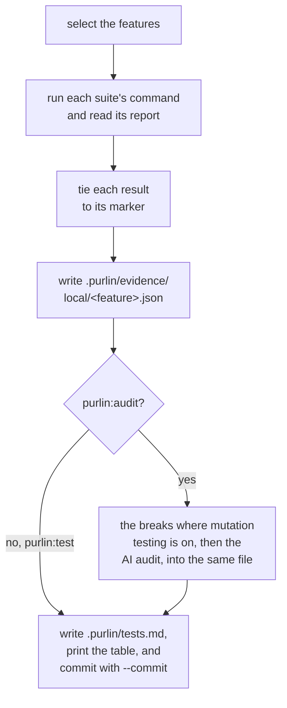
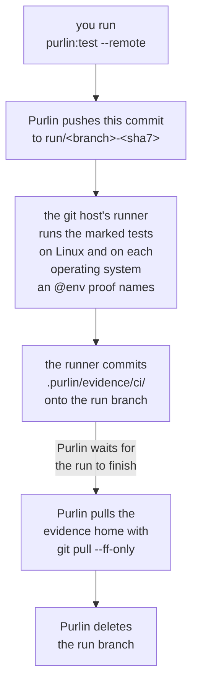

# Running the tests, and the evidence a run leaves

For the developer who runs Purlin, and for anyone who reads the evidence afterwards.

Two commands run your tests. `purlin:test` is the fast one you run constantly: it runs the
marked tests and writes the evidence. `purlin:audit` runs the same tests, then has a model read
each rule beside its proof and its test, and writes what it found into the same evidence. Both
call one run script, `scripts/run/purlin_run.py`, so there is one answer to how a test is run.
Both run on your machine, and neither pushes.

| | `purlin:test` | `purlin:audit` |
|---|---|---|
| Runs the marked tests | yes | yes |
| Reads each rule with a model | no | yes |
| Breaks the code to measure test strength | no | where mutation testing is on, above `passed` |
| Writes the evidence, and commits it with `--commit` | yes | yes |
| Takes | seconds | one model call per rule, plus the breaks |
| The cell it answers | passed | strong |

## purlin:test

```
purlin:test                     The features your change touched
purlin:test --all               Every feature
purlin:test <feature> [...]     One feature, or several
purlin:test --commit            Commit the evidence the run wrote
purlin:test --remote            Let the git host's runner do the run
```

With no feature named, the run selects a feature when it has no run on this operating system,
when its spec, its code or its tests changed since its newest run here, when an untracked file
sits under its `> Scope:` or beside its tests, or when its spec names no files. It says what it
selected and why before it runs anything, runs only the test files that carry those features'
markers, and names what it skipped:

```
Selected 2 of 34 features: login (code changed since a1b2c3d), invoice (no run on macos yet).
Skipped 32 features whose spec, code and tests match their evidence: auth, billing, cart, fees, gate, history, ledger, orders, refunds, search, and 22 more. purlin:test --all runs them too.
```

With nothing selected it prints `Nothing to run: every feature's spec, code and tests match its
evidence. purlin:test --all runs them anyway.`, runs no test, and exits 1 only where the evidence
holds a failing test.

The run runs each suite's own command from the `tests` setting in `.purlin/config.json`, reads
the report it writes under `.purlin/runtime/reports/`, and ties each result to the marker
comment above its test, `# purlin: login PROOF-4`
([marker_format.md](../references/formats/marker_format.md) is the one home of the marker).
That directory is generated and never committed. A run on a project with one feature reads:

```
Selected 1 of 1 feature: cart (no run on macos yet).

Running the pytest suite.

Markers: 3 tied to a test, 0 not tied.
Ran pytest on 1 feature.

Evidence written to .purlin/evidence/local/cart.json.

Purlin status: demo, plugin 0.10.0, gate passed

Spec  Rules  Tests
───────────────────
cart  3      3 of 3
───────────────────

3 of 3 rules meet the gate passed.
Untested 0 · Failing 0 · Partial 0 · Passing 3.
1 feature.

→ Next: nothing is outstanding at gate passed.

Tests: 3 of 3 rules pass.
gate passed met: 3 of 3 rules
```

Each rule's passed cell reads one word: `passed`, `failed`, `partial`, `no test`, `not run` or
`out of date`. The run writes two tracked files:

```
.purlin/evidence/local/<feature>.json   this operating system's section: the commit, the
                                        time, the fingerprint, each rule's word, each
                                        proof's result and test
.purlin/tests.md                        one table for the whole project, rendered from
                                        every evidence file
```

It commits nothing. `purlin:test --commit` commits both under your own git identity with the
subject `purlin: evidence at <sha7>`, and prints `Evidence committed.`, or `Evidence
unchanged.` when the run saw the same thing over the same code. A run of one feature replaces
that feature's section and leaves the rest as it was.

The run ends on two lines, counted over every rule under `specs/` rather than over the features
this run covered. `Tests: <p> of <rules> rules pass.` says what the tests found. `gate <gate>:
<n> of <rules>` or `gate <gate> not met: <n> of <rules> rules meet it` says where the project stands against its
gate, the number the status headline carries. At `passed` the two numbers are the same, and the
gate line is the check. The exit code follows the tests, whatever the gate line says: 0 when no
test failed and no marker is wrong, 1 otherwise, because a test run cannot make an audit or a
signature appear.

A proof tagged `@env(windows)`, `@env(macos)` or `@env(linux)` runs only on that operating
system. On a machine that does not match, the run prints one sentence rather than a pass or a
failure, and the rule's passed cell reads `not run`:

```
login PROOF-4 needs windows; this machine is macos. A remote runner runs it: purlin:init adds one.
```

A proof with no `@env` is satisfied by a run on any operating system. The passed cell keeps one
entry per operating system a current run covered: the word, the source and when the run
happened. It reads `partial` when the rule's tests passed on some of them and failed or did not
run on the others, and `partial` is not met.

## purlin:audit

```
purlin:audit                    The tests the change touched, then every rule not yet read
purlin:audit --all              Every feature's tests, and every rule read again
purlin:audit <feature> [...]    One feature, or several
purlin:audit --commit           Commit what it wrote
```

An audit runs the tests as `purlin:test` does, then the breaks where mutation testing is on,
then the AI audit. The AI audit reads a rule when at least one of its proofs has a test, its
passed cell reads `passed`, and the evidence holds no audit of its current rule, proof and test
text. Above the gate `passed`, a rule whose level is `passed` is not read. Before the first
call it prints `AI audit: <n> rules to read, <k> at a time.` and carries on without asking.

Each rule is one call to `claude -p`, with the rule, its proofs, the source of each test and
[review_criteria.md](../references/review_criteria.md) as the prompt, 300 seconds per call and
`audit_parallel` calls at once (4 by default, 1 to 16). The model is asked what it observed,
not for a grade. An answer that settled with nothing found is `strong`; one that settled with
findings is `weak`, one sentence per finding; one that could not settle is `undecided`, and the
strong cell reads `weak` with the reason `the AI audit could not decide`. Every entry names the
model that answered. A rule the model could not be reached for gets nothing written, reads
`not audited`, and the run prints `<n> rules could not be audited: <why>. Run purlin:audit
again.`

It writes what it found under `audit` in `.purlin/evidence/local/<feature>.json`, and commits
nothing; `purlin:audit --commit` commits it as `purlin: evidence at <sha7>` under your own git
identity. It prints `AI audit: <n> rules read, <n> strong, <n> weak.` and the test strength,
and, where a new finding moved what a signature bound, `<n> signatures went stale: their audit
findings changed.`

The run ends on two lines: `Audit: <n> strong, <n> weak.`, then the gate line `purlin:test`
ends on. At the gate `passed` the first adds `Nothing blocks at the gate passed.`, and nothing
the audit finds makes the run exit 1. Above it, the run exits 1 when a rule is short of its
tests or, where its level asks for one, of its audit, or when a rule could not be audited; a
rule waiting only on a signature does not make it exit 1.

### The flow

Both commands take the same steps on your machine, and the audit adds one before the table:



### The two loud failures

A test framework that runs nothing says nothing about it, so the run script checks two things
the frameworks cannot check themselves.

- **A: a suite ran and left no report Purlin can read.** The command exited or timed out, and
  the report path holds nothing, or a file that cannot be read. Purlin deletes a report before
  each run, so an old one is never read instead.
- **B: a marker of a feature the run covers has no passing or failing result.** Its test was
  skipped, the report does not hold it, or no test follows the marker. The message names the
  first five by file and line and counts the rest.

Both print as `Evidence is missing: ...` and both make the run exit 1; both mean the run cannot
tell you what it proved. A failing test prints neither: its result is in the report, the
evidence records it as `fail`, and the run prints the last 60 lines of the suite's own output
under `--- <suite> output (last 60 lines) ---` before the status table, then exits 1.

### A marker that names nothing

A marker that names a feature, a proof or a rule no spec has, or names a rule that has proofs,
ties its test to nothing. The run prints one line for each, by file and line, then one line
saying what to do, and exits 1 whatever the tests did:

```
purlin: login PROOF-9 at tests/test_login.py:12 names a proof no spec has
Remove the comment, or write the proof it names.
```

### Exit codes

| Code | What it means |
|---|---|
| `0` | Everything asked for happened |
| `1` | A test failed, evidence is missing, a marker names nothing a spec has, or the gate is not met |
| `2` | The command line was wrong |

## Test strength

Mutation testing is optional and off unless you turn it on. Test strength is the share of the
deliberate breaks made to the code that the tests caught, as an integer percent:

```
test_strength = killed / (killed + survived)
```

A break that no test covers counts survived. A break that made a test hang counts killed. The
technique is mutation testing; the output calls them breaks.

`mutation_engine` in `.purlin/config.json` turns it on: `purlin:init` writes `none` unless you
answer yes to its question or pass `--mutation`, and `auto` lets the detected test framework
pick the engine. A config with no `mutation_engine` is read as `none`, which is off.
`min_strength` is the floor: 70 under `strong` and 80 under `signed` while mutation testing is
on, null while it is off, and overridable by naming the key. No breaks run under `passed`, and
none run on a remote runner.

| Engine | Breaks the code behind | Install it with |
|---|---|---|
| mutmut | pytest | `pip install mutmut` |
| Stryker | Jest and Vitest | `npm install --save-dev @stryker-mutator/core` |
| Stryker.NET | xUnit | `dotnet tool install -g dotnet-stryker` |

Go, shell and SQL have no engine. Their rules report `n/a` rather than a number, and such a
rule meets the strong cell when the audit found nothing: the cell's reason reads `no mutation
score measured`.

Stryker and Stryker.NET report which test caught which break, so a rule carries its own tests'
number. mutmut reports totals per file, so every rule in that feature carries the same number.
An engine that runs past the run's `--arm-timeout`, 3600 seconds by default, measures nothing:
its rules report `n/a` and the run says why.

mutmut switches a break on only in a module imported by its full dotted name, so a test that
imports a file through a `sys.path` entry never switches one on; import by the dotted path.
mutmut runs on Linux and macOS. A test that reads git state or the source text sees the copy
mutmut makes under `mutants/`, so name such tests in `pytest_add_cli_args` with `--deselect`.

## The evidence

The evidence is what runs saw, one file per feature per source, written into the tree and
committed when you ask. The git history of `.purlin/evidence/` is the log of what was proven
and when. [evidence_format.md](../references/formats/evidence_format.md) holds every field.

```
.purlin/evidence/<source>/<feature>.json
```

| Part | What it is |
|---|---|
| `<source>` | `local` for a run on a person's machine, `ci` for a remote runner's |
| `<feature>` | the spec's name |

One file holds one section per operating system that ran the feature and, once an audit has
read the feature, one audit entry per rule. A run replaces only its own operating system's
section, so two machines never overwrite each other.

Each section carries the commit the run started on, whether the tree was dirty, the time, the
runner, a fingerprint over the spec, the covered code and the tests, each rule's word and one
entry per proof and test. The `audit` object carries the test strength under `mutation` and,
per rule, the hashes the audit read, its `verdict`, its findings and the model.

The fingerprint separates two kinds of change. The code changed and the rule, proof and test
did not: the passed cell reads `out of date` with the reason `code changed since <sha7>` until
the next run, and a signature stands. The rule, proof or test changed: the evidence goes out of
date and the signed cell reads `stale`, so a person looks again.

### The source is the folder

A file under `.purlin/evidence/local/` is written by `purlin:test` or `purlin:audit` on
somebody's machine. A file under `.purlin/evidence/ci/` is written only by a remote runner on a
run branch. A file whose own `source` field disagrees with its folder is ignored, with one
warning. Both sources count at every gate, as long as the section is current.

### Retention

A file keeps the newest section per operating system and the newest audit entry per rule; the
history is the file's `git log`. A run deletes the evidence of a feature no spec defines and
prints `Removed <path>: no spec defines <feature>.`

At the gate `signed`, when every rule meets it, `purlin:sign` writes the evidence package,
`.purlin/evidence/package/<version>.json`, commits it and tags that commit `signed/<version>`.
The tag holds the whole tree: the code, every evidence file, the signatures and the package.
[review-and-signing.md](review-and-signing.md#the-tag) has the rest.

## Who pushes

A push is `git push`, typed by a person. `purlin:test` and `purlin:audit` write the evidence,
commit it when you pass `--commit`, and stop. `purlin:sign` makes its signed commits, writes the
tag and stops; you push the tag. The one push Purlin makes is `purlin:test --remote`, to a
branch of its own, described below.

## When a project has a runner

Most have none. At every gate a rule reaches `passed`, `strong` and `signed` on your machine.
`purlin:init` writes a CI workflow for two reasons and no other:

- **A proof in `specs/` is tagged `@env` for an operating system this machine is not**, so only
  a runner can prove it.
- **The project set `trust: remote`**: you answered no to the trust question, `Do you trust
  your own machine for the tests? [y/n]` at the gate `passed` and `Do you trust your own
  machine for the tests and the signing? [y/n]` from `strong` up, so the tests run on a clean
  machine, and `purlin:sign` refuses a rule with a test whose feature has no current `ci`
  section.

With neither, init prints `No remote runner: every test runs on this operating system and you
trust this machine, so nothing has to run remotely.` at the gate `passed`, and from `strong` up
the same line with `every proof` in place of `every test`. Where one is called for, it writes
`.github/workflows/purlin.yml` on GitHub, or `purlin.azure-pipelines.yml` at the project root
on Azure DevOps. The job is named `purlin`.

Where one exists, `purlin:test --remote` hands this commit to it and brings back what it wrote:



### What starts a run

```yaml
on:
  push:
    branches: ['run/**']
    tags: ['signed/**']
```

Two things start a run: a push to a `run/*` branch, which `purlin:test --remote` creates and
deletes around one run, and a push of a `signed/*` tag.

| The run | What it does | Commits |
|---|---|---|
| a `run/*` branch | Runs the marked tests | its own section of each feature's `.purlin/evidence/ci/<feature>.json`, onto that branch |
| a `signed/*` tag | Reruns the marked tests on a clean machine, checks that every signature still binds the rule, the proof, the test and the audit it names, checks that every file under `.purlin/evidence/ci/` was committed by the runner's own identity, then runs the gate check | nothing |

No breaks and no AI audit run on the runner. Every run ends with the gate check:

```yaml
      - name: Check the gate
        shell: bash
        run: python3 "$PURLIN_ROOT/scripts/ci/gate_check.py" --check --verify
```

It exits 1 when a rule does not meet the gate, or when `--verify` finds a signature that no
longer binds this code or a `ci/` file the runner did not commit, and the job fails. It writes
nothing. `purlin:sign` asks the same question of the same cells before it writes a tag, so the
tag and a green run mean the same thing. A red run on a pushed tag is the git host's word that
this version is not proven.

The matrix carries `ubuntu-latest` first, then one job per operating system the `@env` tags in
`specs/` name. Each job writes its own section, merged into the file at the branch's head. A
checkout that carries `scripts/run/purlin_run.py` runs that Purlin; any other project's job
clones Purlin at the release the project pins, and the `PURLIN_REF` repository variable moves
that pin.

### Who committed a ci/ file

A person could write a file under `ci/`, so the tag run reads the commit that last changed each
one. On GitHub, a runner's commit made through the Git Data API carries `GitHub
<noreply@github.com>` as its committer and `github-actions[bot]` as its author, and GitHub signs
it; a signature status of `B` fails the file. On Azure DevOps the tag run asks the host with
the build service's token, `SYSTEM_ACCESSTOKEN`: its own `authenticatedUser.id` must equal the
`push.pushedBy.id` of the commit, and a different id, a refusal or no answer within 30 seconds
fails the file. On your own machine there is no token, so `gate_check.py --check --verify`
counts those files as not checked. On either host a squash merge or a rebase that rewrites a
`ci/` commit makes the file fail, so merge a run branch without rewriting it.

### purlin:test --remote

Use it for the two reasons above. It pushes a branch of its own, never the branch you are on:

1. It refuses a detached head and an uncommitted change, because the run would prove something
   other than what is on disk.
2. It pushes this commit to `run/<branch>-<sha7>` on `origin`, creating that branch there and
   nothing locally.
3. The runner commits its section of `.purlin/evidence/ci/<feature>.json` onto that branch.
4. On GitHub it finds the run with `gh run list --branch run/<branch>-<sha7>`, retrying for up
   to 60 seconds, and waits on it with `gh run watch --exit-status`. On Azure DevOps it finds
   the run with `az pipelines runs list`, asking every 3 seconds for up to 60, then asks `az
   pipelines runs show` every 15 seconds for up to 90 minutes; only `succeeded` is green. The
   Azure CLI needs its `azure-devops` extension and `az login`.
5. It runs `git pull --ff-only origin run/<branch>-<sha7>`, deletes the run branch from
   `origin` and prints the table. A proof tagged `@env(windows)` then reads `passed` on a Mac.
   A red run is pulled home too, and the command exits 1.

Without `gh` or `az`, or with no run found in time, it says so in one line naming the pull
command to run, and exits 1. No command here prompts: a push or a pull that needs a credential
fails rather than asks. If the run branch is still on `origin` when the command ends, it gives
you the delete command.

## Next

- [how-purlin-works.md](how-purlin-works.md): the chain, and who writes each file.
- [dashboard.md](dashboard.md): the same data as a page that opens from disk.
- [team-workflow.md](team-workflow.md): what the `strong` gate asks of a team.
- [regulated-workflow.md](regulated-workflow.md): signatures, the tag and the evidence package.
