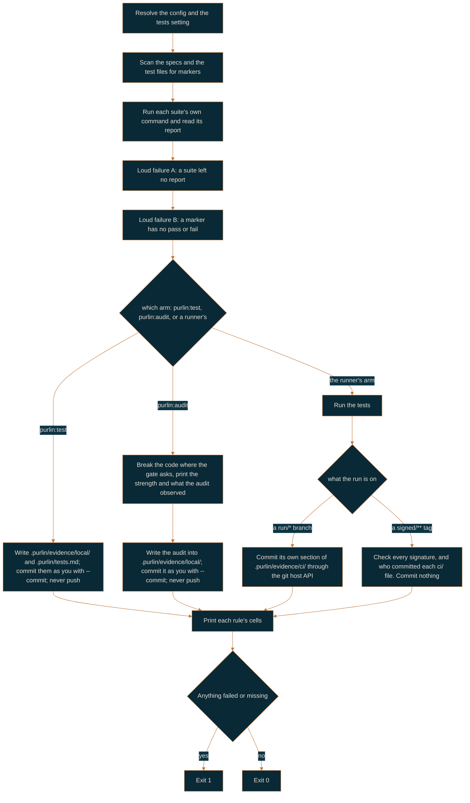

# Running the tests, and the records a run leaves

For the engineer who runs Purlin, and for anyone who has to read the evidence afterwards.

Two commands run your tests. `purlin:test` is the fast one you run constantly, and it writes
the evidence you keep at `passed`. `purlin:audit` is the slow one that measures how good those
tests are, and it writes what it found into the same evidence. Both call the same run script, so there
is one answer to how a test is run. Both run on your machine, and neither pushes.

| | `purlin:test` | `purlin:audit` |
|---|---|---|
| Runs the tagged tests | yes | yes |
| Breaks the code to measure test strength | no | at `strong` and above |
| Writes the evidence, and commits it with `--commit` | yes | yes |
| Writes what the audit found into the evidence | no | yes |
| Takes | seconds | as long as the breaks take |
| The level it answers | passed | strong |

## purlin:test

```
purlin:test                     The features your change touched
purlin:test --all               Every feature
purlin:test <feature> [...]     One feature, or several
purlin:test --remote            Let the git host's runner do the run
```

With no feature named, the run selects a feature when it has no run on this operating system,
when its spec, its code or its tests changed since its newest run here, when an untracked file
sits under its `> Scope:` or beside its tests, or when its spec names no files. It says what it
selected and why before it runs anything, runs only the test files that carry those features'
markers, and names what it skipped:

```
Selected 2 of 34 features: login (code changed since a1b2c3d), invoice (no run on macos yet).
Skipped 32 features whose spec, code and tests match their evidence: auth, billing, cart, fees, gate, history, ledger, orders, refunds, search, and 22 more. purlin:test --all runs them too.
```

With nothing selected it prints `Nothing to run: every feature's spec, code and tests match its
evidence. purlin:test --all runs them anyway.`, runs no test, and exits 0 where the gate is met.

The run runs each suite's own command, reads the report it writes under
`.purlin/runtime/reports/`, ties each result to the marker above its test, and prints one line
per rule, reading that rule's passed cell: `passed`, `failed`, `partial`, `no test`, `not run`
or `out of date`. That directory is generated and never committed, so two test runs never
conflict with each other.

It then writes what it saw into two tracked files and prints `Evidence written to
.purlin/evidence/local/<feature>.json.`:

```
.purlin/evidence/local/<feature>.json   this operating system's section: the commit, the
                                        time, the fingerprint, each rule's word, each
                                        proof's result and test
.purlin/tests.md                        one table for the whole project, rendered from
                                        every evidence file
```

It commits nothing. `purlin:test --commit` commits both under your own git identity with the
subject `purlin: evidence at <sha7>`, and prints `Evidence committed.`, or `Evidence
unchanged.` when the run saw the same thing over the same code. A `--feature` run replaces the
sections of the features it ran and leaves the rest of the table as it was. Nothing here
pushes. [references/formats/evidence_format.md](../references/formats/evidence_format.md) is
the contract.

The last line is `gate passed: <n> of <rules>` or `gate not met: <n> of <rules>`, counted over
every rule under `specs/` rather than over the features this run covered, and the run exits 1
on the second. At `passed` that line is the check.

A proof tagged `@env(windows)`, `@env(macos)` or `@env(linux)` runs only on that operating
system. On a host that does not match, the run prints one sentence rather than a pass or a
failure, and the rule's passed cell reads `not run`:

```
login PROOF-4 needs windows; this machine is macos. A remote runner runs it: purlin:init adds one.
```

Those three tags are the whole vocabulary; a proof with no `@env` is satisfied by a run on any
operating system.

The passed cell keeps one entry per operating system a counting run covered: the word, the
source and when the run happened. It reads `partial` when the rule's tests passed on some of
them and failed or did not run on the others, and `partial` is not met. A rule whose proofs
name one operating system and has no run there reads `not run` instead: nothing passed, so
nothing is partial. Test strength is not measured per operating system; one number covers the
rule.

## purlin:audit

```
purlin:audit                    The tests, the breaks, and what they found
purlin:audit <feature> [...]    One feature, or several
```

An audit is the level 2 run: the tests, then the breaks, then the AI audit on every rule whose level
is `strong` or `signed`. It prints each feature's test strength beside the minimum, then everything
the audit observed. An audit proves a rule strong or weak; it signs nothing.

The AI audit reads each proof beside the source of its test and writes what it observed, in its
own words, rather than a list of check names. An audit that settled and still observed something
proves the rule `weak`, with that sentence as the reason.

It writes the test section, the test strength and what it found per rule into
`.purlin/evidence/local/<feature>.json`, and commits nothing; `purlin:audit --commit` commits
it as `purlin: evidence at <sha7>` under your own git identity. It never pushes. Its last line is `gate strong: <n> of <rules>` or `gate not met: <n> of <rules>`, the
same shape as `purlin:test`'s, and it exits 1 on the second.

Under the `passed` gate there is nothing to measure and no strong cell to move, so the audit
runs the tests and no breaks. The breaks run only where you turned mutation testing on,
on your machine. No breaks and no AI audit ever run on a remote runner.

Your own evidence counts at every gate, `signed` included. What changes at `signed` is only
what `trust` says. Under `trust: local`, the default, this machine's runs are the evidence from
end to end. Under `trust: remote`, `purlin:sign` refuses a rule with a test whose feature has
no current `ci` section.

There is no `--remote` here. A remote runner runs the tests, so that flag belongs to
`purlin:test`.

### The flow



### The two loud failures

A test framework that runs nothing says nothing about it, so the run script checks two things
the frameworks cannot check themselves.

- **A: a suite ran and left no report to read.** The command exited, and nothing is at the
  report path. Purlin deletes a report before each run, so an old one is never read instead.
- **B: a marker of a feature the run covers has no passing or failing result.** Its test was
  skipped, the report does not hold it, or no test follows the marker. The message names the
  first five by file and line and counts the rest.

Both print as `Evidence is missing: ...` and both make the run exit 1. Neither is a test
failure; both mean the run cannot tell you what it proved.

### Exit codes

| Code | What it means |
|---|---|
| `0` | Everything asked for happened |
| `1` | A test failed, evidence is missing, or the passed level is not met |
| `2` | The command line was wrong |

## Test strength

Test strength is the share of the deliberate breaks made to the code that the tests caught, as
an integer percent:

```
test_strength = killed / (killed + survived)
```

A break that no test covers counts survived: nothing observed it. A break that made a test hang
counts killed: the test noticed. The technique is mutation testing, and this is the only place
in these docs it is named; everywhere else Purlin calls them breaks, because that is what the
output says.

`min_strength` in `.purlin/config.json` is the floor the gate holds you to while mutation
testing is on: unused under `passed`, where no breaks run, 70 under `strong` and 80 under
`signed`, each overridable by naming the key. With it off, the key is null. The breaks run on your machine and nowhere else: a remote runner never breaks
the code.

Three engines ship, one per language family, and `mutation_engine` in `.purlin/config.json`
picks one: `none` keeps the breaks off, the default, and under `auto` the detected test
framework decides.

| Engine | Breaks the code behind | Install it with |
|---|---|---|
| mutmut | pytest | `pip install mutmut` |
| Stryker | Jest and Vitest | `npm install --save-dev @stryker-mutator/core` |
| Stryker.NET | xUnit | `dotnet tool install -g dotnet-stryker` |

Two languages have no engine: shell and SQL. Their rules report `n/a` rather than a number, and
the run says so in a sentence. A rule with `n/a` still meets the strong cell as long as the
audit observed nothing outstanding: a gate that needs a minimum strength treats an unmeasured
rule as unmeasured, not as a failure.

The number beside a rule is worth what the engine could attribute. Stryker and Stryker.NET
report which test caught which break, so a rule carries its own tests' number. mutmut reports
totals per file, so every rule in that feature carries the same number. A run with no engine
installed prints the install line above and measures nothing.

An engine that runs past `--arm-timeout`, 3600 seconds by default, measures nothing either: the
rules it was breaking report `n/a`, and the run prints the seconds and the flag to raise, because
a partial run's number would read as a measurement it is not. mutmut breaks the whole project in
one run, so a timeout there leaves every feature unmeasured; Stryker and Stryker.NET run once per
feature, so only the feature that ran out of time is.

mutmut names a break after the file it changed, `scripts/run/host.py` as
`scripts.run.host`, and switches a break on only in a function whose module carries that
name. Tests that import the file as `host`, through a `sys.path` entry, never switch a break
on, and mutmut stops before running one. Import by the full dotted path, or rename the modules
while mutmut runs, as this repository's root `conftest.py` does. mutmut runs on Linux and macOS,
not on Windows. A test that reads git state or the source text sees the copy mutmut makes under
`mutants/`, so name such tests in `pytest_add_cli_args` with `--deselect`.

### SQL projects

A SQL project has no break engine. Each SQL test file is one test, run by the command its
suite names, `sqlite3 -bail :memory: < {files}` from `purlin:init`; change that command to use
another engine.

## The evidence

The evidence is what runs saw, one file per feature per source, written into the tree and
committed when you ask. The git history of `.purlin/evidence/` is the log of what was proven
and when. Its full field list is in the evidence format reference that ships with the plugin,
[references/formats/evidence_format.md](../references/formats/evidence_format.md).

### The file name

```
.purlin/evidence/<source>/<feature>.json
```

| Part | What it is |
|---|---|
| `<source>` | `ci` or `local`: the folder is what says which, and a tag run checks that every file under `ci/` came from the runner |
| `<feature>` | the spec's name |

One file holds one section per operating system that ran the feature, and once an audit has
read the feature, one audit entry per rule. A run reads the file and replaces only its own
operating system's section, so one matrix job never overwrites another's observations.

### What is in it

Each section carries the commit the run started on, whether the tree was dirty, the time, the
runner, a fingerprint over the spec, the covered code and the tests, each rule's word and one
entry per proof and test. The `audit` object carries the test strength under `mutation` and,
per rule, the hashes the audit read, its `verdict` and its findings.

The fingerprint is what separates two kinds of change. The code changed and the rule, proof and
test text did not: the signature stands and the passed cell reads `out of date` until the
next run. The rule, proof or test text changed: the signed cell reads `stale` and a person
looks.

### The source is the folder

A file can claim anything, so the folder decides. A file under `.purlin/evidence/ci/` is a
remote runner's; a file under `.purlin/evidence/local/` is anyone's, written by `purlin:test`
or `purlin:audit` on somebody's machine. Nothing stops a person writing into `ci/` by hand,
and nothing needs to: a tag run reads the commit that last changed each file there and fails
the job unless the runner's own identity made it. A file whose own `source` field disagrees
with its folder is ignored, and the run says so in a warning rather than reading a file that
contradicts itself.

| Source | Where it sits | Counts under |
|---|---|---|
| `ci` | `.purlin/evidence/ci/`, committed by a remote runner through the git host's API | `passed`, `strong`, `signed` |
| `local` | `.purlin/evidence/local/`, written by your own runs | `passed`, `strong`, `signed` |

Both count at every gate, whoever wrote them, as long as the section is current. What
`trust: remote` changes is not which evidence counts but what `purlin:sign` asks for before it
signs: a current `ci` section.

On GitHub a commit made through the Git Data API with the Actions token and no author or
committer field carries `GitHub <noreply@github.com>` as its committer and
`github-actions[bot]` as its author, and GitHub signs it with its own key. Purlin reads those
two names and treats the signature as confirmation: `git log --format=%G?` printing `B`, a
signature that does not match the commit, refuses it, and `N`, no signature, refuses it when
gpg is installed. Every other answer means this machine holds no current key for the
signature, which is the ordinary case for the git host's own key.

On Azure DevOps a commit carries no signature and its committer is a name anyone can type, so
Purlin never reads it. The tag run asks Azure DevOps instead, with the build service's token,
`SYSTEM_ACCESSTOKEN`, which the pipeline's `Check the gate` step hands it. It reads its own
identity, `authenticatedUser.id` from `_apis/connectionData`, then, for the commit that last
changed each `ci/` file, the `push.pushedBy.id` Azure DevOps holds for it, and the two must
be the same. A different id, a commit with no `push`, a refusal such as HTTP 401 or 403, or no
answer within 30 seconds names the file under `Evidence` and fails the job. On your own machine
there is no token, so `gate_check.py --check --verify` prints `ci/ provenance is checked by the
tag run; this machine has no token.` and counts those files as not checked, neither passed nor
failed. Purlin's own tests prove this check against a stand-in for Azure DevOps; how the live
service answers is confirmed by a hand-run check on a machine with Azure DevOps access.

On either host, a squash merge or a rebase that rewrites a commit under `ci/` breaks this
check: the rewritten commit is yours, not the runner's, and the file fails. Merge a run
branch's evidence without rewriting it.

### Retention

A file keeps the newest section per operating system and the newest audit entry per rule;
the history is the file's `git log`. A run deletes the evidence of a feature no spec defines.

Nothing pins the evidence. `purlin:sign` tags the commit, `signed/<version>`, and a tag holds
the whole tree at that commit: the code and every evidence file in it. One name reaches all
of it, however many runs follow.

## When a project has a runner

Most have none. Everything above runs on your machine, and at every gate a rule reaches
`passed`, `strong` and `signed` without anything leaving it. `purlin:init` writes a CI workflow
for two reasons and no other:

- **A proof in `specs/` is tagged `@env` for an operating system this machine is not**, so only
  a runner can prove it. Those rules stop reading `not run`, and the rule stops reading
  `partial`.
- **You chose not to trust this machine for signing**, so the tests a signature rests on run on
  a clean one. You answered no to `Do you trust your own machine for the tests and the
  signing?`, and `purlin:sign` asks for a current `ci` section of the code it is signing.

Where one is called for, `purlin:init` writes `.github/workflows/purlin.yml` on GitHub, or
`purlin.azure-pipelines.yml` at the project root on Azure DevOps. The job is named `purlin`.

### What starts a run

```yaml
on:
  push:
    tags: ['signed/**']
    branches: ['run/**']
```

Two things and nothing else: a push of a `signed/**` tag, and a push to a `run/*` branch, the
branch `purlin:test --remote` creates and deletes around one run. A pull request starts
nothing, and a push to an ordinary branch starts nothing, so working branches cost no runner
minutes at all.

### What each run does

| The run | What it does | Commits |
|---|---|---|
| a `signed/**` tag | Reruns the tagged tests on a clean machine, checks that every signature still binds the rule, the proof, the test and the audit it names, checks that every file under `.purlin/evidence/ci/` was committed by the runner's own identity, then runs the gate check | nothing |
| a `run/*` branch | Runs the tagged tests | its own section of each feature's `.purlin/evidence/ci/<feature>.json`, at every gate, onto that branch |

The tag run is a verification, not a fresh judgment: the evidence is already in the tree and
the run says whether it still matches the code the tag points at. An attestation that no longer
binds this code fails the job, and so does a file under `ci/` that a person committed; both
land in the gate check's `Evidence` section. No breaks and no AI audit run on the runner: the
strength in the evidence was measured where the audit ran.

The runner posts no comment and uploads no artifact. The dashboard is the page that opens from
disk beside your editor.

### The gate check is the last step

```yaml
      - name: Check the gate
        shell: bash
        run: python3 "$PURLIN_ROOT/scripts/ci/gate_check.py" --check --verify
```

It exits 1 when a rule does not meet the gate, or when `--verify` finds an attestation that no
longer binds this code or a `ci/` file the runner did not commit, and either fails the job. It writes nothing: a gate
that can edit the evidence it grades is not a gate. `purlin:sign` asks the same question of the
same cells before it writes a tag, so the tag and a green run mean the same thing.

A red run on a pushed tag is the git host's word that this version is not proven.

### Finding Purlin on the runner

Purlin is loaded two ways, and the workflow handles both. A checkout that already carries
`scripts/run/purlin_run.py` is the Purlin to run, which is the case when you develop with
`claude --plugin-dir <checkout>`. A consumer project installed Purlin from the marketplace, so
its plugin lives under `~/.claude/plugins/cache/purlin/purlin/<version>/` on your machine and
not on the runner at all; the job clones Purlin at the tag the project pins. Set the
`PURLIN_REF` repository variable to move that pin without editing the workflow.

### The matrix comes from `@env`

`purlin:init` writes `ubuntu-latest` first, then one job per operating system the `@env` tags
in `specs/` name; a project that tags nothing runs on `ubuntu-latest` alone. Each job runs the
same script and writes its own section, so no job overwrites another's. A rule whose proofs
name two operating systems needs a passing section from both: with neither run the passed cell
reads `not run` and carries `windows: no run yet`, and with one of the two passing it reads
`partial`, rather than inventing an answer for the system nothing ran on.

### The commit a run branch makes

A run branch's job creates one commit, `purlin: evidence at <sha7>`, holding its own section
of each feature's file under `.purlin/evidence/ci/`, at every gate. It holds nothing else, and
it writes no signature file, ever: a signature directory holds only files a person wrote. The
commit goes through the git host's REST API as one tree request carrying the text of every one
of those files, then a commit with no author or committer field, then a ref update, retrying on
a non-fast-forward. On every attempt each file is read again at the branch's head and this
runner's section is merged into it, so two matrix jobs never overwrite each other. On Azure
DevOps a file the branch already holds is sent as an edit and a new one as an add. That is what
makes the commit the host's and its files count as `ci`, which the tag run checks.

One run can write several hundred files, and a git host limits how many requests that create
content one token may make in a short span. Sending each file on its own would spend one of
those requests per file and be refused part way through, so the whole commit is one request.
If the git host asks for a pause anyway, answering 403 or 429 with `Retry-After` or
`x-ratelimit-reset`, the run waits what it was asked for, up to 120 seconds, says so in one
line, and sends the request again, up to 3 times before it gives up.

## Who pushes

A push is `git push`, typed by a person, and it is free: any branch, any time, and nothing runs
when you make one. No skill, no agent and no hook pushes, and none opens a pull request.
`purlin:test` and `purlin:audit` write the evidence, commit it when you pass `--commit`, and
stop. `purlin:sign` makes its signed commit, writes the tag and stops. A run branch's evidence
commit is not a push made on your behalf: it is the remote runner publishing
its own evidence through the git host's API.

Purlin installs no git hook. The rule that an agent does not push is an instruction in
`agents/purlin.md`, kept by the agent rather than enforced by a script, which is why the
instruction says it plainly.

## purlin:test --remote

Use it for the two reasons a runner exists at all: a proof is tagged `@env` for an operating
system your machine is not, or `trust` is `remote` and a signature needs a current `ci`
section. It is the one case in which Purlin pushes.

It pushes a branch of its own rather than the branch you are on:

1. It refuses a detached head, because there is no branch to name, and an uncommitted change,
   because the run would prove something other than what is on disk.
2. It pushes this commit to `run/<branch>-<sha7>` on `origin`, creating that branch there and
   nothing locally. The commit's own short sha is in the name, so two runs of the same branch
   never share one.
3. The push to `run/**` starts the workflow, which commits what it wrote onto that branch: its
   own section of `.purlin/evidence/ci/<feature>.json`, at every gate.
4. On GitHub it finds the run by that branch, `gh run list --branch run/<branch>-<sha7>`,
   retrying for a short while because a run takes a moment to register, then waits on that run
   by id with `gh run watch --exit-status`. Then `git pull --ff-only origin
   run/<branch>-<sha7>` brings that commit onto your branch as one fast-forward, then it
   deletes the run branch from `origin` and prints the table. That is how a proof tagged
   `@env(windows)` stops reading `not run` on a Mac: the runner's results come home, and the
   rule's passed cell reads `passed` with `windows · ci` beside it. A red run is pulled home
   too, and the command exits 1. Without the `gh` CLI installed it says so and tells you which
   branch to open and which pull command to run.
5. On Azure DevOps it reads the organisation, project and repository from `origin`, in any of
   `https://dev.azure.com/<org>/<project>/_git/<repo>`,
   `git@ssh.dev.azure.com:v3/<org>/<project>/<repo>` and
   `https://<org>.visualstudio.com/<project>/_git/<repo>`, before it pushes anything. It finds
   the run with `az pipelines runs list --branch refs/heads/run/<branch>-<sha7>`, asking every
   3 seconds for up to 60, then asks `az pipelines runs show` for the run's status every 15
   seconds for up to 90 minutes. When the status is `completed`, the result `succeeded` exits
   0 and `failed`, `canceled` and `partiallySucceeded` exit 1; either way it pulls, deletes
   the run branch and prints the table, as on GitHub. It needs the Azure CLI `az` with its
   `azure-devops` extension, signed in with `az login`. Without `az`, with no run registered
   within 60 seconds, or with the run still going after 90 minutes, it says so in one line
   naming the pull command to run, and exits 1.

Purlin's own tests prove the Azure DevOps steps against a stand-in for `az`. How the real
service answers, and how long a run takes to register there, is confirmed by a hand-run check
on a machine with Azure DevOps access.

No command here prompts: a push or a pull that needs a credential fails rather than asks, and
`az` reports a missing extension rather than offering to install it.

If the run branch is still on `origin` when the command ends, it says so and gives you the
delete command.

## Next

- [how-purlin-works.md](how-purlin-works.md): the chain, the six words, and who writes each file.
- [dashboard.md](dashboard.md): the same data as a page that opens from disk.
- [team-workflow.md](team-workflow.md): what the `strong` gate asks of a team.
- [regulated-workflow.md](regulated-workflow.md): signatures on top of records.
