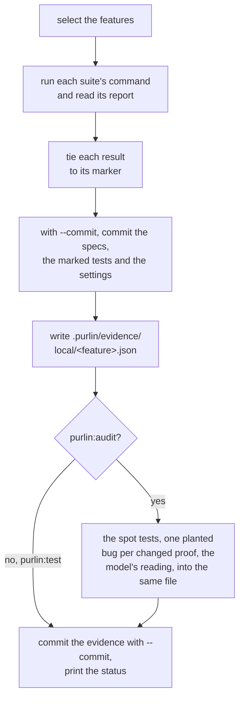
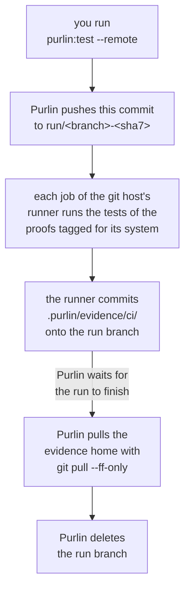

# Running the tests, and the evidence a run leaves

For the developer who runs Purlin, and for anyone who reads the evidence afterwards.

Two commands run your tests. `purlin:test` runs the marked tests and writes the evidence.
`purlin:audit` runs the same tests, then asks whether they would catch a bug, and writes what
it found into the same evidence. Both call one run script, `scripts/run/purlin_run.py`, so
there is one answer to how a test is run. Both run on your machine. `purlin:test --remote` is
the one command that pushes, and it pushes a run branch of its own ([Who pushes](#who-pushes)).

| | `purlin:test` | `purlin:audit` |
|---|---|---|
| Runs the marked tests | yes | yes |
| Runs the heuristic spot tests | no | yes, with no model |
| Plants one bug per changed proof | no | yes, in a copy of the project |
| Writes the evidence, and commits it with `--commit` | yes | yes |
| The cell it writes | `passed` | `passed` and `strong` |

## purlin:test

```
purlin:test                     Run the features your change touched
purlin:test --all               Run every feature
purlin:test <feature> [...]     Run one feature, or several
purlin:test --commit            Commit the work and the evidence the run wrote
purlin:test --remote            Let the git host's runner do the run
purlin:test --arm-timeout <seconds>  Give each suite longer than an hour
```

### The first run

Setup leaves the `tests` setting in `.purlin/config.json` empty. The first run finds the test
tools the project uses, runs nothing, and suggests an entry for each:

```
No test command is set in .purlin/config.json, so nothing ran.
Suggested for pytest: python3 -m pytest --ignore=mutants {files} --junitxml={report}
Suggested tests setting: [{"name": "pytest", "run": "python3 -m pytest --ignore=mutants {files} --junitxml={report}", "report": ".purlin/runtime/reports/pytest.xml", "format": "junit", "files": ["**/test_*.py", "**/*_test.py"]}]
```

`purlin:test` compares each suggested command with how the project runs its tests itself, shows
you each difference, writes the entry into the `tests` setting once you confirm, and runs.
Where the run finds no test tool it knows, it prints `No test command is set and no test tool
Purlin knows was found, so nothing ran. The agent reads the project and proposes a command for
you to confirm.` [supported_frameworks.md](../references/supported_frameworks.md) gives the
entry for each tool and what each needs added.

### Which features run

With no feature named, the run selects a feature when it has no run on this operating system,
when its spec, its code or its tests changed since its newest run here, when an untracked file
sits under its `> Scope:` or beside its tests, or when its spec names no files. It says what it
selected and why before it runs anything, and names what it skipped:

```
Selected 1 of 1 feature: cart (no run on macOS yet).
```

A skipped feature is named on a line of its own, `Skipped <n> features whose spec, code and
tests match their evidence: <names>. purlin:test --all runs them too.`, with ten names and a
count of the rest. With nothing selected the run prints `Nothing to run: every feature's spec,
code and tests match its evidence. purlin:test --all runs them anyway.`, runs no test, and
exits 1 only where the evidence it stands on holds a failing test.

A run over some features hands each suite only the test files that carry their markers. A run
over every feature runs every suite whole.

### What a run prints

The run runs each suite's own command from the `tests` setting, reads the report it writes
under `.purlin/runtime/reports/`, and ties each result to the marker comment above its test,
`# purlin: cart PROOF-1` ([marker_format.md](../references/formats/marker_format.md) is the one
home of the marker). That directory is generated and never committed. A run of a project with
one feature and three marked tests, with `--all --commit`, reads:

```
Selected 1 of 1 feature: cart (no run on macOS yet).

Running the pytest suite.

Markers: 3 tied to a test, 0 not tied.
Ran pytest on 1 feature.

Committed 373225b, the work these results describe:
  .purlin/config.json
  specs/shop/cart.md
  tests/test_cart.py

Evidence written to .purlin/evidence/local/cart.json.
Evidence committed.

Purlin status: shop, plugin 0.10.0
Tests: met
Sign-off: not signed

Spec  Rules  Proofs  Tests
───────────────────────────
cart  3      3       3 of 3
───────────────────────────

3 rules. 3 pass their tests.
Every rule passes its tests on the committed evidence. To sign it: purlin:sign
```

Each rule's passed cell reads one word: `passed`, `failed`, `partial`, `no test`, `not run` or
`out of date`. The run writes one tracked file per feature it ran:

```
.purlin/evidence/local/<feature>.json   this operating system's section: the commit, the
                                        time, who ran it, the fingerprint, each rule's
                                        word, each proof's result and test
```

Without `--commit` it commits nothing. `--commit` makes two commits under your own git
identity: first the specs of the features it ran, the test files carrying their markers and
`.purlin/config.json`, where any of them changed, as `purlin: specs, tests and settings for
<feature>`; then the evidence as `purlin: evidence at <sha7>`, naming the first. It prints
`Evidence committed.`, or `Evidence unchanged.` when the run saw the same thing over the same
code. A run of one feature replaces that feature's section and leaves the rest as it was.

### How a run ends

Every run ends on the status, counted over every rule under `specs/` rather than over the
features this run covered: the three opening lines, the table, the sentence and `Left to do`.

```
Purlin status: labconnect, plugin 0.10.0
Tests: not met
Sign-off: signed 0.1.0, 4 commits since
```

`Tests` reads `met` when no line of `Left to do` is of a kind that blocks, and `Sign-off` names
the newest signed version and whether the code has moved since. `Left to do` names each kind of
work left with its count and its command, in this order, and its first line is the next step:

| Line | Command | Blocks `Tests: met` |
|---|---|---|
| `1 spec to repair` | `purlin:spec` | yes |
| `1 rule to write a proof for` | `purlin:spec` | no |
| `1 test comment to correct` | `purlin:build` | yes |
| `1 rule to fix` | `purlin:build` | yes |
| `1 rule to write a test for` | `purlin:build` | yes |
| `1 rule to test` | `purlin:test` | yes |
| `1 rule to test on Windows` | `purlin:test --remote` | yes |
| `1 feature whose results are not committed` | `purlin:test --commit` | yes |
| `1 rule to strengthen` | `purlin:build` | no |

The line about results not committed shows once no other work stops the tests being met: while
a rule fails, has no test or waits for a run, the list names that work alone. Where the tests
are met and this code is not signed, the run's last line reads
`Every rule passes its tests on the committed evidence. To sign it: purlin:sign`.

A test run exits on the tests alone: 1 where a test failed, evidence is missing or a comment
names nothing a spec has, 0 otherwise. Before anything runs it also exits 1 with no settings
file, a settings file that cannot be read, a project an older Purlin set up and nobody
upgraded, or no test command. A command line it cannot read exits 2.
[purlin_commands.md](../references/purlin_commands.md) lists each command's exit codes.

### A failing test

A failing test is a result: the evidence records it as `fail`. The run prints the last 60 lines
of the suite's own output between `--- pytest output (last 60 lines) ---` and
`--- end of pytest output ---`, names the rule, and exits 1:

```
cart RULE-2 fails: tests/test_cart.py::test_sum. Run purlin:build cart.
```

The run ends on the table and:

```
3 rules. 2 pass their tests.
Left to do:
  1 rule to fix: purlin:build
```

A rule some of whose proofs have no test is named the same way:

```
cart RULE-2 has no test for PROOF-5. Run purlin:build cart.
```

### Proofs for another operating system

A proof tagged `@env(windows)`, `@env(macos)` or `@env(linux)` is proven only by a run on that
operating system. On your machine the run counts the proofs tagged for another system in one
line per system, rather than as a pass or a failure:

```
1 proof needs Windows; this machine is macOS. Run purlin:test --remote.
```

Their rules' passed cells read `not run`, with the reason `Windows: no run yet`, and `Left to
do` carries `1 rule to test on Windows: purlin:test --remote`. A proof tagged for another system
with no test tied to it is not counted in that line: its rule reads `no test`. The passed cell
keeps one entry per operating system a current run covered: the word, the source and when the
run happened. The cell reads `partial` when two systems that each have a current section
disagree, and a rule that reads `partial` is left to do as `to fix`.

### The two loud failures

A test framework that runs nothing says nothing about it, so the run script checks two things
the frameworks cannot check themselves. Each prints a line starting `Evidence is missing:` and
makes the run exit 1.

- **A: a suite ran and left no report Purlin can read.** The report path holds nothing, or a
  file that cannot be read. Purlin deletes a report before each run, so an old one is never
  read instead. The line names the suite and what was wrong, then `Check its command and
  report in the tests setting of .purlin/config.json, then run purlin:test.` A suite killed at
  `--arm-timeout`, 3600 seconds by default, is missing evidence the same way, and its line
  ends `Run purlin:test --arm-timeout <seconds> to give it longer.`
- **B: a marker of a feature the run covers has no passing or failing result.** Its test was
  skipped, the report does not hold it, or no test follows the marker. The line names the
  first five by file and line, counts the rest, and ends `Check that its test ran and was not
  skipped, then run purlin:test.` The one skip that is a result is an anchor's test that found
  nothing to check, skipped with a reason starting `nothing to check:`
  ([specs-and-anchors.md](specs-and-anchors.md#a-rule-with-nothing-to-check)).

### A comment to correct

A comment above a test that names a feature, a proof or a rule no spec has, or names a rule
that has proofs, ties its test to nothing. The run prints one line for each, by file and line,
and exits 1 whatever the tests did:

```
tests/test_cart.py:22 names cart PROOF-9, which no spec has. Correct the comment, or run purlin:build to repair it.
```

A comment that names a proof whose wording changed after the test was last changed is printed
after the `Markers:` line, quoting both wordings. It changes no exit code, and it clears once
the test itself changes:

```
tests/test_login.py:1 names login PROOF-4, whose wording changed after the test was last changed in 1cf829e: it read "A" and now reads "B". Run purlin:build login to make the test show it; the line clears once the test changes.
```

`Left to do` counts both kinds, and the tests read `not met` while one is left:

```
Left to do:
  1 test comment to correct: purlin:build
```

## purlin:audit

```
purlin:audit                    Run what the change touched, audit, write the evidence
purlin:audit <feature> [...]    One feature, or several
purlin:audit --all              Run every feature, and read every rule again
purlin:audit --commit           Commit the evidence the run wrote
purlin:audit --arm-timeout <seconds>  Give each suite, and each planted bug's run, longer
```

An audit runs the tests as `purlin:test` does, then reads each rule that is its feature's own
or an anchor's, has at least one proof with a test, whose passed cell reads `passed`, and that
has no audit of its current rule, proof and test in the evidence, or whose code changed since.
`--all` reads every such rule again. For each rule it takes three steps, in this order:

1. **The heuristic spot tests**, in code, with no model: six checks over each test's source
   and its proof's words. [review_criteria.md](../references/review_criteria.md#heuristic-spot-tests)
   is their one home.
2. **One planted bug per proof** whose test or covered code changed since the audit last read
   it. The model writes the smallest change to the code that would break what the proof says;
   Purlin plants it in a copy of the project, runs the proof's own tests there, and removes the
   copy. A test that still passes did not catch the bug. An anchor's proof and a `@manual`
   proof get no bug.
3. **The model's reading**, once per rule: an explanation of the findings, stored beside them.
   It sets no verdict.

A rule is `weak` when a spot test fired on one of its tests or a planted bug was not caught,
and `strong` otherwise. `strong` means the model's part of the audit ran: where the model
cannot be reached, the spot tests still report what they find as `weak`, a rule that passed
them alone stays `not audited`, and the audit prints one line, such as
`The model could not be reached: claude is not on PATH. 2 rules stay not audited. Run purlin:audit again.`
A finding is one line:

```
tests/test_age.py::test_age: the test checks nothing.
PROOF-1: the test still passes when src/age.py:12 reads "return 0"
```

The audit writes what it found under `audit` in `.purlin/evidence/local/<feature>.json`, each
planted bug with its file, its line, the change and whether it was caught, and commits it only
with `--commit`, in the same two commits as a test run. It prints each rule it found weak with
its findings, what the model calls cost, and last the share of rules it found strong:

```
login RULE-2   weak
  PROOF-2: the test still passes when src/auth.py:31 reads "return True"
The model was asked 31 times for 12 rules: $1.87 in all, $0.16 a rule.
The audit found 4 of 5 rules strong (80%).
```

The run then ends on the status, as every run does, with the audit's share in the sentence
and each weak rule left to strengthen:

```
5 rules. 5 pass their tests. The audit found 4 of 5 rules strong (80%).
Left to do:
  1 rule to strengthen: purlin:build
```

An audit exits 1 when a test it ran failed or did not run, and 0 whatever it found: the audit
is a tool, and nothing waits on it. Your project is never changed by a planted bug. Where a
file of the project changes while a bug's tests run, the audit stops and says so:
`The audit stopped: src/age.py changed while a break ran. Nothing in the project was written by the audit.`
[audit.md](audit.md) gives the reasoning and the research behind these steps.

### The flow

Both commands take the same steps on your machine, and the audit adds one:



## The evidence

The evidence is what runs saw, one file per feature per source, written into the tree and
committed when you ask. The git history of `.purlin/evidence/` is the log of what was proven
and when. [evidence_format.md](../references/formats/evidence_format.md) holds every field.

```
.purlin/evidence/<source>/<feature>.json
```

| Part | What it is |
|---|---|
| `<source>` | `local` for a run on a person's machine, `ci` for a remote runner's |
| `<feature>` | the spec's name |

One file holds one section per operating system that ran the feature and, once an audit has
read the feature, one audit entry per rule. A run replaces only its own operating system's
section, so two machines never overwrite each other.

Each section carries the commit of the code it describes, whether the tree was dirty, the time,
the runner, the email git holds for the person who ran it, the machine, a fingerprint over the
spec, the covered code and the tests, each rule's word and one entry per proof and test. A
proof's result is `pass`, `fail`, `missing`, `not run` or `nothing to check`, the last with its
reason. The `audit` object carries, per rule, the hashes the audit read, its `verdict`, its
findings, each planted bug, the model's explanation and the model.

A section is current while its fingerprint equals one taken now, committed or not. When the
spec, the covered code or the tests change, the passed cell reads `out of date`, naming what
changed, as `code changed since <sha7>`, `spec changed since <sha7>` or `tests changed since
<sha7>`, and the next run clears it.

Outside tools read these files and the evidence package, whose formats are versioned for them.
People inside the project read the status and the dashboard.

### The source is the folder

A file under `.purlin/evidence/local/` is written by `purlin:test` or `purlin:audit` on
somebody's machine. A file under `.purlin/evidence/ci/` is written by a remote runner on a run
branch. A file whose own `source` field disagrees with its folder is ignored, with one warning
naming it. Both sources count, as long as the section is current.

### Retention

A file keeps the newest section per operating system and the newest audit entry per rule; the
history is the file's `git log`. A run deletes the evidence of a feature no spec defines and
prints `Removed <path>: no spec defines <feature>.`

### Which results count for a sign-off

The status counts a result while nothing its feature covers changed. The sign-off asks more: a
result counts only when its section is current, was taken on a clean tree, and was taken on
this version of the code, which means every commit from the one its tests ran at to `HEAD`
changes only files under `.purlin/`. So the developer's hand-off is run and commit:

```
purlin:test --all --commit
purlin:test --remote
```

the second only where a proof is tagged for another operating system. That commit is ready for
`purlin:sign`, which reads the committed evidence, builds the evidence package
`.purlin/evidence/package/<version>.json`, and refuses, naming what to run again, where a
result was not taken on this code. [sign-off.md](sign-off.md) is the sign-off in full, and
[evidence_and_signoff.md](../references/evidence_and_signoff.md) the one definition.

### Who commits the evidence

Whoever runs `purlin:test --commit` or `purlin:audit --commit` commits the evidence, on the branch
they are on: it describes that branch's code. When a merge conflicts in `.purlin/evidence/`, take
either side and run `purlin:test --commit`: the file is written again, keeping each audit result
whose rule, proof and test are unchanged.

## Who pushes

A push is `git push`, typed by a person. `purlin:test` and `purlin:audit` write the evidence,
commit it when you pass `--commit`, and stop. `purlin:sign` makes its signed commit and, for
the first sign-off of a version, writes the tag, then names the push for you to type. The one
push Purlin makes is `purlin:test --remote`, to a branch of its own, described below.

## When a project has a runner

A project has a remote runner for one reason: a proof in `specs/` is tagged `@env` for an
operating system this machine is not, so only a runner can prove it. Setup writes no runner
file and asks nothing about one. The status names the work, as
`1 rule to test on Windows: purlin:test --remote`, and the first `purlin:test --remote` writes
the file for the git host of `origin`, `.github/workflows/purlin.yml` on GitHub or
`purlin.azure-pipelines.yml` at the project root on Azure DevOps, prints it, pushes nothing and
exits 0:

```
Purlin wrote .github/workflows/purlin.yml, the runner for GitHub, to run the proofs tagged for Windows:
```

then the file, then:

```
Commit it and run: purlin:test --remote --commit-runner
```

`purlin:test --remote --commit-runner` commits that file alone, as
`ci: the Purlin runner for GitHub`, prints
`Committed .github/workflows/purlin.yml, the runner for GitHub.`, and runs. From then on
`purlin:test --remote` hands this commit to the runner and brings back what it wrote:



### What starts a run

```yaml
on:
  push:
    branches: ['run/**']
```

One thing starts a run: a push to a `run/*` branch, which `purlin:test --remote` creates and
deletes around one run. The job runs the tests tied to the proofs tagged for its system and
commits its own section of each such feature's `.purlin/evidence/ci/<feature>.json` onto that
branch. A run on any other ref writes nothing and says that the ref is not a run branch.

A `ci` section lists only the proofs tagged for the runner's system and the rules they prove,
and names its machine `remote runner, <System>`, such as `remote runner, Windows`, with the name
the host lent the runner kept beside it as `hostname`
([evidence_format.md](../references/formats/evidence_format.md)).

No audit runs on the runner. The test step is the last step: it ends on the status, and its
exit code is the job's. The job fails only when a test tied to a proof tagged for its system
fails or could not run.

The runner file carries one job per operating system a proof in `specs/` is tagged `@env` for
that the machine writing it is not. Each job writes its own section, merged into the file at
the branch's head. The git host is read from `origin` each time.

### purlin:test --remote

Use it for the reason above. It pushes a branch of its own, never the branch you are on:

1. It refuses a detached head and an uncommitted change, because the run would prove something
   other than what is on disk, and an `origin` that is neither GitHub nor Azure DevOps.
2. It looks for the program it waits on the run with, `gh` on GitHub and `az` on Azure DevOps.
   Without it, it pushes nothing, names the program to install, and exits 1:

   ```
   purlin:test --remote waits for the run with the GitHub CLI, gh, which is not installed, so nothing was pushed. Install gh, then run purlin:test --remote again.
   ```

3. It pushes this commit to `run/<branch>-<sha7>` on `origin`, creating that branch there and
   nothing locally, and prints `Pushing <branch> as run/<branch>-<sha7>.`
4. The runner commits its section of `.purlin/evidence/ci/<feature>.json` onto that branch.
5. On GitHub it waits on the run of the `purlin.yml` workflow alone, so another workflow the
   push starts is never the one waited on. On Azure DevOps it finds the run with
   `az pipelines runs list`, then asks `az pipelines runs show` every 15 seconds for up to 90
   minutes; only `succeeded` passes. The Azure CLI needs its `azure-devops` extension and
   `az login`.
6. It runs `git pull --ff-only origin run/<branch>-<sha7>`, deletes the run branch from
   `origin` and prints the table. A proof tagged `@env(windows)` then reads `passed` on a Mac.
   A failed run is pulled home too, and the command exits 1.

The commit the runner made changes only files under `.purlin/`, so the results it brings home
were taken on the same version of the code as yours, and both count for a sign-off. On Azure
DevOps a run still going after 90 minutes is left on its branch, and the command prints the
pull and delete commands to run once it finishes. No process the command starts prompts: a
push or a pull that needs a credential fails rather than asks.

## Next

- [how-purlin-works.md](how-purlin-works.md): the model in one page, and who writes each file.
- [dashboard.md](dashboard.md): the same data as a page that opens from disk.
- [audit.md](audit.md): what the audit checks, and why.
- [sign-off.md](sign-off.md): the evidence package, the sign-offs and the tag.
