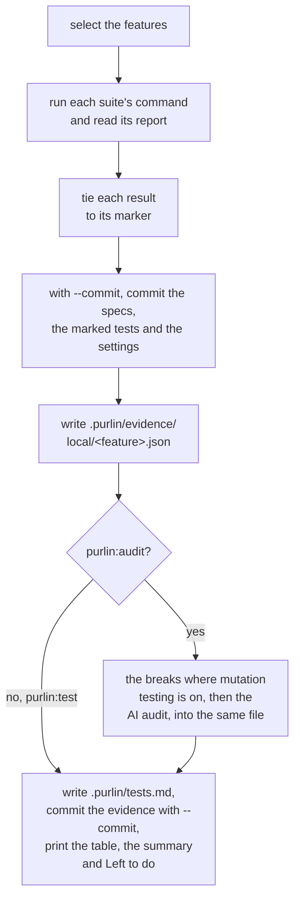
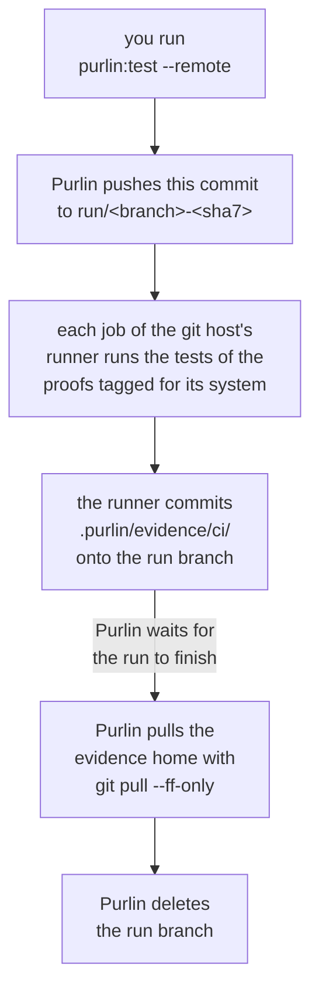

# Running the tests, and the evidence a run leaves

For the developer who runs Purlin, and for anyone who reads the evidence afterwards.

Two commands run your tests. `purlin:test` runs the marked tests and writes the evidence.
`purlin:audit` runs the same tests, then has a model read each rule beside its proofs and its
tests, and writes what it found into the same evidence. Both call one run script,
`scripts/run/purlin_run.py`, so there is one answer to how a test is run. Both run on your
machine. `purlin:test --remote` is the one command that pushes, and it pushes a run branch of
its own ([Who pushes](#who-pushes)).

| | `purlin:test` | `purlin:audit` |
|---|---|---|
| Runs the marked tests | yes | yes |
| Reads each rule with a model | no | yes, one call per rule |
| Breaks the code to measure test strength | no | where mutation testing is on, at the gates `strong` and `signed` |
| Writes the evidence, and commits it with `--commit` | yes | yes |
| The step it answers | `passed` | `strong` |

## purlin:test

```
purlin:test                     Run the features your change touched
purlin:test --all               Run every feature
purlin:test <feature> [...]     Run one feature, or several
purlin:test --commit            Commit the work and the evidence the run wrote
purlin:test --remote            Let the git host's runner do the run
purlin:test --arm-timeout <seconds>  Give each suite longer than an hour
```

### The first run

Setup leaves the `tests` setting in `.purlin/config.json` empty. The first run finds the test
tools the project uses, runs nothing, and suggests an entry for each:

```
No test command is set in .purlin/config.json, so nothing ran.
Suggested for pytest: python3 -m pytest --ignore=mutants {files} --junitxml={report}
Suggested tests setting: [{"name": "pytest", "run": "python3 -m pytest --ignore=mutants {files} --junitxml={report}", "report": ".purlin/runtime/reports/pytest.xml", "format": "junit", "files": ["**/test_*.py", "**/*_test.py"]}]
```

`purlin:test` compares each suggested command with how the project runs its tests itself, shows
you each difference, writes the entry into the `tests` setting once you confirm, and runs.
Where the run finds no test tool it knows, it prints `No test command is set and no test tool
Purlin knows was found, so nothing ran. The agent reads the project and proposes a command for
you to confirm.` [supported_frameworks.md](../references/supported_frameworks.md) gives the
entry for each tool and what each needs added.

### Which features run

With no feature named, the run selects a feature when it has no run on this operating system,
when its spec, its code or its tests changed since its newest run here, when an untracked file
sits under its `> Scope:` or beside its tests, or when its spec names no files. It says what it
selected and why before it runs anything, and names what it skipped:

```
Selected 1 of 1 feature: cart (no run on macOS yet).
```

A skipped feature is named on a line of its own, `Skipped <n> features whose spec, code and
tests match their evidence: <names>. purlin:test --all runs them too.`, with ten names and a
count of the rest. With nothing selected the run prints `Nothing to run: every feature's spec,
code and tests match its evidence. purlin:test --all runs them anyway.`, runs no test, and
exits 1 only where the evidence it stands on holds a failing test.

A run over some features hands each suite only the test files that carry their markers. A run
over every feature runs every suite whole.

### What a run prints

The run runs each suite's own command from the `tests` setting, reads the report it writes
under `.purlin/runtime/reports/`, and ties each result to the marker comment above its test,
`# purlin: cart PROOF-1` ([marker_format.md](../references/formats/marker_format.md) is the one
home of the marker). That directory is generated and never committed. A run of a project with
one feature and three marked tests, with `--commit`, reads:

```
Selected 1 of 1 feature: cart (no run on macOS yet).

Running the pytest suite.

Markers: 3 tied to a test, 0 not tied.
Ran pytest on 1 feature.

Committed 373225b, the work these results describe:
  .purlin/config.json
  specs/shop/cart.md
  tests/test_cart.py

Evidence written to .purlin/evidence/local/cart.json.
Evidence committed.

Purlin status: demo, plugin 0.10.0, gate passed

Spec  Rules  Proofs  Tests
───────────────────────────
cart  3      3       3 of 3
───────────────────────────

3 rules. 3 pass their tests.
Nothing left to do.
```

Each rule's passed cell reads one word: `passed`, `failed`, `partial`, `no test`, `not run` or
`out of date`. The run writes two tracked files:

```
.purlin/evidence/local/<feature>.json   this operating system's section: the commit, the
                                        time, the fingerprint, each rule's word, each
                                        proof's result and test
.purlin/tests.md                        one table for the whole project, rendered from
                                        every evidence file
```

Without `--commit` it commits nothing. `--commit` makes two commits under your own git
identity: first the specs of the features it ran, the test files carrying their markers and
`.purlin/config.json`, where any of them changed, as `purlin: specs, tests and settings for
<feature>`; then the evidence and the table as `purlin: evidence at <sha7>`, naming the first.
It prints `Evidence committed.`, or `Evidence unchanged.` when the run saw the same thing over
the same code. A run of one feature replaces that feature's section and leaves the rest as it
was.

### How a run ends

Every run ends on the status table, the summary and `Left to do`, counted over every rule under
`specs/` rather than over the features this run covered. The summary names each step up to the
gate; `Left to do` names each kind of work left with its count and its command, and its first
line is the next step. [hard_gates.md](../references/hard_gates.md#when-a-version-is-finished)
gives every kind. With nothing left, a project at `passed` or `strong` ends on `Nothing left to
do.`

A test run exits on the tests alone, whatever the gate: 1 where a test failed, evidence is
missing or a comment names nothing a spec has, 0 otherwise. Before anything runs it also exits
1 with no settings file, a settings file that cannot be read, a project an older Purlin set up
and nobody upgraded, or no test command. A command line it cannot read exits 2.
[purlin_commands.md](../references/purlin_commands.md#exit-codes) lists each line it prints
there.

### A failing test

A failing test is a result: the evidence records it as `fail`. The run prints the last 60 lines
of the suite's own output between `--- pytest output (last 60 lines) ---` and
`--- end of pytest output ---`, names the rule, and exits 1:

```
cart RULE-1 fails: tests/test_cart.py::test_sum. Run purlin:build cart.
```

The run ends on the table and:

```
3 rules. 2 pass their tests.
Left to do:
  1 rule to fix: purlin:build
```

A rule some of whose proofs have no test is named the same way:

```
cart RULE-2 has no test for PROOF-5. Run purlin:build cart.
```

### Proofs for another operating system

A proof tagged `@env(windows)`, `@env(macos)` or `@env(linux)` is proven only by a run on that
operating system; [hard_gates.md](../references/hard_gates.md#where-a-runner-runs-and-when-a-project-has-one)
says which machine proves which proof, the untagged ones included. On your machine the run
counts the proofs tagged for another system in one line per system, rather than as a pass or a
failure:

```
1 proof needs Windows; this machine is macOS. Run purlin:test --remote.
```

Their rules' passed cells read `not run`, with the reason `Windows: no run yet`, and `Left to
do` carries `1 rule to test on Windows: purlin:test --remote`. A proof tagged for another system
with no test tied to it is not counted in that line: its rule reads `no test`. The passed cell
keeps one entry per operating system a current run covered: the word, the source and when the
run happened. The cell reads `partial` when two systems that each have a current section
disagree, and a rule that reads `partial` is left to do as `to fix`.

### The two loud failures

A test framework that runs nothing says nothing about it, so the run script checks two things
the frameworks cannot check themselves. Each prints a line starting `Evidence is missing:` and
makes the run exit 1.

- **A: a suite ran and left no report Purlin can read.** The report path holds nothing, or a
  file that cannot be read. Purlin deletes a report before each run, so an old one is never
  read instead. The line names the suite and what was wrong, then `Check its command and
  report in the tests setting of .purlin/config.json, then run purlin:test.` A suite killed at
  `--arm-timeout`, 3600 seconds by default, is missing evidence the same way, and its line
  ends `Run purlin:test --arm-timeout <seconds> to give it longer.`
- **B: a marker of a feature the run covers has no passing or failing result.** Its test was
  skipped, the report does not hold it, or no test follows the marker. The line names the
  first five by file and line, counts the rest, and ends `Check that its test ran and was not
  skipped, then run purlin:test.`

### A comment that names nothing

A comment above a test that names a feature, a proof or a rule no spec has, or names a rule
that has proofs, ties its test to nothing. The run prints one line for each, by file and line,
and exits 1 whatever the tests did:

```
tests/test_cart.py:22 names cart PROOF-9, which no spec has. Correct the comment, or run purlin:build to repair it.
```

`Left to do` counts each such comment:

```
Left to do:
  1 test comment to correct: purlin:build
```

## purlin:audit

```
purlin:audit                    Run what the change touched, audit, write the evidence
purlin:audit <feature> [...]    One feature, or several
purlin:audit --all              Run every feature, and read every rule again
purlin:audit --commit           Commit the evidence the run wrote
purlin:audit --arm-timeout <seconds>  Give the breaking tool longer per feature
```

An audit runs the tests as `purlin:test` does, then the breaks where mutation testing is on,
then the AI audit. The AI audit reads a rule that is its feature's own, has at least one proof
with a test, whose passed cell reads `passed`, and that has no audit of its current rule, proof
and test text in the evidence. It reads the same rules at every gate. With no feature named it
reads the rules of every feature, whichever features its tests ran; `--all` reads every such
rule again. Before the first call it prints `AI audit: <n> rules to read, <k> at a time.` and
carries on without asking.

Each rule is one call to `claude -p`, with
[review_criteria.md](../references/review_criteria.md), the rule, its proofs, the source of
each test and the test strength as the prompt, 300 seconds per call and `audit_parallel` calls
at once (4 by default, 1 to 16). The model is asked what it observed, not for a grade. An
answer that settled with nothing found is `strong`; one that settled with findings is `weak`,
one sentence per finding; one that could not settle is `undecided`, and the strong cell reads
`weak` with a reason starting `the AI audit could not decide`. Every entry names the model that
answered. A proof longer than the standard, or holding two cases, is written among the audit's
notes and does not make the rule weak. A rule the model could not be reached for gets nothing
written, reads `not audited`, and the run prints `<n> rules could not be audited: <why>.` and
what to do.

It writes what it found under `audit` in `.purlin/evidence/local/<feature>.json`, and commits
it only with `--commit`, in the same two commits as a test run. An audit of a project at the
gate `strong` in which the model found one gap reads, after the tests:

```
AI audit: 3 rules to read, 3 at a time.

Evidence written to .purlin/evidence/local/cart.json.
Evidence committed.
AI audit: 3 rules read, 2 strong, 1 weak.

Purlin status: team, plugin 0.10.0, gate strong

Spec  Rules  Proofs  Tests   Strong
───────────────────────────────────
cart  3      3       3 of 3  2 of 3
───────────────────────────────────

3 rules. 3 pass their tests. 2 are strong.
Left to do:
  1 rule to strengthen: purlin:build
```

An audit exits 1 at every gate when a test it ran failed or did not run. Above the gate
`passed` it also exits 1 when a rule it read is weak or could not be audited; a rule waiting
only on a signature does not make it exit 1. At the gate `passed` nothing the audit finds
makes it exit 1.

### The flow

Both commands take the same steps on your machine, and the audit adds one:



## Test strength

Mutation testing is optional and off unless you turn it on. Test strength is the share of the
deliberate breaks made to a feature's code that its tests caught, as a whole percent:

```
test_strength = killed / (killed + survived)
```

A break that no test covers counts survived. A break that made a test hang counts killed. The
technique is mutation testing; the output calls them breaks.

`mutation_engine` in `.purlin/config.json` turns it on. `purlin:init` asks about it at the
gates `strong` and `signed` only, and writes `auto` when you answer yes or pass `--mutation`
and `none` otherwise; `auto` lets the detected test framework pick the engine. A config with no
`mutation_engine` is read as `none`, which is off. `min_strength` is the floor: 70 at `strong`
and 80 at `signed` while mutation testing is on, null while it is off, and you can set it in
the file. No breaks run under `passed`, and none run on a remote runner.

| Engine | Breaks the code behind | Install it with |
|---|---|---|
| mutmut | pytest | `pip install mutmut` |
| Stryker | Jest and Vitest | `npm install --save-dev @stryker-mutator/core` |
| Stryker.NET | `dotnet test` | `dotnet tool install -g dotnet-stryker` |

Go, shell and SQL have no engine, and mutmut does not run on Windows. Where no engine runs, the
audit alone decides the strong cell, and a rule it found nothing against reads `strong` with the
reason `no mutation score measured`.

Test strength is one share per feature, whatever the engine, so every rule of a feature is
judged on the same number. With mutation testing on, a share under `min_strength` leaves the
strong cell `weak` with the reason `strength <n>% under <m>%`, and a feature whose share could
not be measured leaves its rules `weak` with the reason `strength not measured: <why>`, counted
in `Left to do` as `rules to measure`. An engine that runs past `--arm-timeout`, 3600 seconds by
default, measures nothing for the feature it was breaking, and the run prints `purlin: the
engine timed out after 3600 s, so the breaks it made measure nothing: run purlin:audit
--arm-timeout <seconds> to give it longer`.
[supported_frameworks.md](../references/supported_frameworks.md#pytest) says what mutmut needs
of a Python project's tests.

## The evidence

The evidence is what runs saw, one file per feature per source, written into the tree and
committed when you ask. The git history of `.purlin/evidence/` is the log of what was proven
and when. [evidence_format.md](../references/formats/evidence_format.md) holds every field.

```
.purlin/evidence/<source>/<feature>.json
```

| Part | What it is |
|---|---|
| `<source>` | `local` for a run on a person's machine, `ci` for a remote runner's |
| `<feature>` | the spec's name |

One file holds one section per operating system that ran the feature and, once an audit has
read the feature, one audit entry per rule. A run replaces only its own operating system's
section, so two machines never overwrite each other.

Each section carries the commit the run started on, whether the tree was dirty, the time, the
runner, the machine, a fingerprint over the spec, the covered code and the tests, each rule's
word and one entry per proof and test. The `audit` object carries the test strength under
`mutation` and, per rule, the hashes the audit read, its `verdict`, its findings and the model.

A section is current while its fingerprint equals one taken now, committed or not. When the
spec, the covered code or the tests change, the passed cell reads `out of date`, naming what
changed, as `code changed since <sha7>`, `spec changed since <sha7>` or `tests changed since
<sha7>`, and the next run clears it. A signature is bound to the rule, its proof, its test, the
code the spec lists, what the audit found and the machine the tests ran on: a change to any of
them ends it, and the rule is left to do as `to sign`
([hard_gates.md](../references/hard_gates.md#when-a-signature-counts)).

### The table

`.purlin/tests.md` is one row per feature, from its newest section in either source, rendered
again from every evidence file on each run. It is what a teammate reads on the git host without
running anything:

```
# Tests at 373225b

| Feature | Rules | Passed | Failing | No test | Last run |
|---|---|---|---|---|---|
| cart | 3 | 3 | 0 | 0 | 373225b · 2026-09-30T03:49:17Z · macOS · local |

Each row is the newest run of that feature, whoever made it; the source in the last column says whose run it was.
```

### The source is the folder

A file under `.purlin/evidence/local/` is written by `purlin:test` or `purlin:audit` on
somebody's machine. A file under `.purlin/evidence/ci/` is written by a remote runner on a run
branch. A file whose own `source` field disagrees with its folder is ignored, with one warning
naming it. Both sources count at every gate, as long as the section is current.

### Retention

A file keeps the newest section per operating system and the newest audit entry per rule; the
history is the file's `git log`. A run deletes the evidence of a feature no spec defines and
prints `Removed <path>: no spec defines <feature>.`

At the gate `signed`, when nothing but the tag is left to do and every result came from
committed work, `purlin:sign` writes the evidence package,
`.purlin/evidence/package/<version>.json`, commits it and tags that commit `signed/<version>`.
[hard_gates.md](../references/hard_gates.md#what-signedversion-means) says what the tag means.

## Who pushes

A push is `git push`, typed by a person. `purlin:test` and `purlin:audit` write the evidence,
commit it when you pass `--commit`, and stop. `purlin:sign` makes its signed commits, writes the
tag and stops; you push the tag. The one push Purlin makes is `purlin:test --remote`, to a
branch of its own, described below.

## When a project has a runner

A project has a remote runner for one reason: a proof in `specs/` is tagged `@env` for an
operating system this machine is not, so only a runner can prove it. Which machine proves which
proof is in
[hard_gates.md](../references/hard_gates.md#where-a-runner-runs-and-when-a-project-has-one).

With no such proof, `purlin:init` writes no runner file and prints `skipped the runner file
(every proof runs on this operating system, so nothing has to run remotely)`, and at the gate
`passed` the same line with `every test` in place of `every proof`. Where one is called for, it
writes `.github/workflows/purlin.yml` on GitHub, or `purlin.azure-pipelines.yml` at the project
root on Azure DevOps, and says why:

```
A remote runner is written because:
  A proof in specs/ is tagged @env for Windows, which this machine is not, so only a runner can prove it.
wrote .github/workflows/purlin.yml
  it runs on windows-latest, the systems a proof in specs/ is tagged @env for that this machine is not.
  it runs on a push to a run/* branch and on a push of a signed/* tag.
```

The job is named `purlin`. Where the runner file exists, `purlin:test --remote` hands this
commit to it and brings back what it wrote:



### What starts a run

```yaml
on:
  push:
    branches: ['run/**']
    tags: ['signed/**']
```

Two things start a run: a push to a `run/*` branch, which `purlin:test --remote` creates and
deletes around one run, and a push of a `signed/*` tag.

| The run | What it does | Commits |
|---|---|---|
| a `run/*` branch | Runs the tests tied to the proofs tagged for the job's system | its own section of each such feature's `.purlin/evidence/ci/<feature>.json`, onto that branch |
| a `signed/*` tag | Runs the same tests on a clean machine | nothing |

A run on a ref that is neither prints `This run is on <ref>, which is neither a run branch nor a
signed tag: the tests ran and nothing is written.`

A `ci` section lists only the proofs tagged for the runner's system and the rules they prove,
and names its machine `remote runner, <System>`, such as `remote runner, Windows`, with the name
the host lent the runner kept beside it as `hostname`
([evidence_format.md](../references/formats/evidence_format.md)).

No breaks and no AI audit run on the runner. The test step is the last step: it ends on the
summary and `Left to do`, and its exit code is the job's. The job fails only when a test tied to
a proof tagged for its system fails or could not run; a rule not yet audited or signed never
fails it.

The runner file carries one job per operating system a proof in `specs/` is tagged `@env` for
that the machine running setup is not. Each job writes its own section, merged into the file at
the branch's head. A checkout that carries `scripts/run/purlin_run.py` runs that Purlin; any
other project's job clones Purlin at the release the project pins, and the `PURLIN_REF`
repository variable moves that pin.

### purlin:test --remote

Use it for the reason above. It pushes a branch of its own, never the branch you are on:

1. It refuses a detached head and an uncommitted change, because the run would prove something
   other than what is on disk. With `ci: none` in the settings it names `git remote add origin
   <url>` and pushes nothing.
2. It looks for the program it waits on the run with, `gh` on GitHub and `az` on Azure DevOps.
   Without it, it pushes nothing, names the program to install, and exits 1:

   ```
   purlin:test --remote waits for the run with the GitHub CLI, gh, which is not installed, so nothing was pushed. Install gh, then run purlin:test --remote again.
   ```

3. It pushes this commit to `run/<branch>-<sha7>` on `origin`, creating that branch there and
   nothing locally, and prints `Pushing <branch> as run/<branch>-<sha7>.`
4. The runner commits its section of `.purlin/evidence/ci/<feature>.json` onto that branch.
5. On GitHub it finds the run with `gh run list --branch run/<branch>-<sha7> --workflow
   purlin.yml`, so another workflow the push starts is never the one waited on, retrying for up
   to 60 seconds, and waits on it with `gh run watch --exit-status`. On Azure DevOps it finds
   the run with `az pipelines runs list`, asking every 3 seconds for up to 60, then asks `az
   pipelines runs show` every 15 seconds for up to 90 minutes; only `succeeded` passes. The
   Azure CLI needs its `azure-devops` extension and `az login`.
6. It runs `git pull --ff-only origin run/<branch>-<sha7>`, deletes the run branch from
   `origin` and prints the table. A proof tagged `@env(windows)` then reads `passed` on a Mac.
   A failed run is pulled home too: the command prints `The run failed on the git host. The
   table below is what came back.` and exits 1.

With no run found within 60 seconds it deletes the run branch, says that nothing came back and
what to check, and exits 1. Where the delete fails it prints the command that deletes the
branch. On Azure DevOps a run still going after 90 minutes is left on its branch, and the
command prints the pull and delete commands to run once it finishes. No process the command
starts prompts: a push or a pull that needs a credential fails rather than asks.

## Next

- [how-purlin-works.md](how-purlin-works.md): the chain, and who writes each file.
- [dashboard.md](dashboard.md): the same data as a page that opens from disk.
- [team-workflow.md](team-workflow.md): what the `strong` gate asks of a team.
- [regulated-workflow.md](regulated-workflow.md): signatures, the tag and the evidence package.
