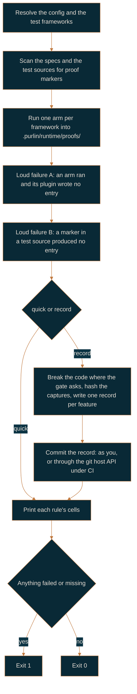

# Running the tests, and the records a run leaves

For the engineer who runs Purlin, and for anyone who has to read the evidence afterwards.

Two commands run your tests. `purlin:test` is the fast one you run constantly.
`purlin:audit` is the slow one that writes the evidence. Both call the same run script, so
there is one answer to how a test is run.

| | `purlin:test` | `purlin:audit` |
|---|---|---|
| Runs the tagged tests | yes | yes |
| Breaks the code to measure test strength | no | at `strong` and above |
| Writes a record | no | yes |
| Takes | seconds | as long as the breaks take |
| The level it answers | passed | passed and strong |

## purlin:test

```
purlin:test                     Every feature, unit tier
purlin:test <feature> [...]     One feature, or several
purlin:test --all               Every tier, not just unit
```

The run writes proof files into `.purlin/runtime/proofs/` and prints one line per rule, reading
that rule's passed cell: `passed`, `failed`, `no test` or `not run`. That directory is generated
and never committed, so two test runs never conflict with each other.

A proof tagged `@env(windows)`, `@env(macos)` or `@env(linux)` runs only on that operating
system. On a host that does not match, the run skips the test and lists the proof as
`login PROOF-4: needs windows` rather than as a pass or a failure, and the rule's passed cell
reads `not run`. Those three tags are the whole vocabulary; a proof with no `@env` is satisfied
by a run on any operating system.

## purlin:audit

```
purlin:audit                    The tests, the breaks, and a record
purlin:audit <feature> [...]    One feature, or several
purlin:audit --remote           Push, wait for CI, pull the records CI wrote
purlin:audit --tag <name>       Pin this state as record/<name>
```

An audit is the level 2 run: the tests, then the breaks, the free checks, and the model review
where the risk asks for one. It ends in one record per feature, and on CI in the briefs as well.
An audit proves a rule strong or weak; it never signs anything.

Under the `passed` gate there is nothing to measure, so the audit runs the tests alone, the
record carries `n/a` for strength, and a record you commit is the evidence. Raising the gate to
`strong` turns the breaks on, locally and in CI. From `strong` upward only a record CI wrote
counts, so your local audit is a preview: it prints the strength it measured, says that this run
does not count, and tells you the push will pass before you spend a CI run finding out.

### The flow



### The two loud failures

A test framework that runs nothing says nothing about it. That silence leaves a reader looking
at a proof file from an earlier run and believing it describes this one, so the run script
checks two things the frameworks cannot check themselves.

- **A: an arm ran and its plugin appended nothing.** Marked tests sit in the tree, the runner
  exited, and no proof entry was written. The proof plugin is not wired in.
- **B: a marker sits in a test source and this run produced no entry for it.** The message
  names the first five and counts the rest, because a project mid-migration has hundreds and a
  reader acts on the first few either way.

Both print as `Evidence is missing: ...` and both make the run exit 1. Neither is a test
failure; both mean the run cannot tell you what it proved.

### Exit codes

| Code | What it means |
|---|---|
| `0` | Everything asked for happened |
| `1` | A test failed, or evidence is missing |
| `2` | The command line was wrong |

## Test strength

Test strength is the share of the deliberate breaks made to the code that the tests caught, as
an integer percent:

```
test_strength = killed / (killed + survived)
```

A break that no test covers counts survived: nothing observed it. A break that made a test hang
counts killed: the test noticed. The technique is mutation testing, and this is the only place
in these docs it is named; everywhere else Purlin calls them breaks, because that is what the
output says.

`min_strength` in `.purlin/config.json` is the floor the gate holds you to: unused under
`passed`, where no breaks run, 70 under `strong` and 80 under `signed`, each overridable by
naming the key.

Three engines ship, one per language family, and `mutation_engine` in `.purlin/config.json`
picks one. Under `auto`, the detected test framework decides.

| Engine | Breaks the code behind | Install it with |
|---|---|---|
| mutmut | pytest | `pip install mutmut` |
| Stryker | Jest and Vitest | `npm install --save-dev @stryker-mutator/core` |
| Stryker.NET | xUnit | `dotnet tool install -g dotnet-stryker` |

Two languages have no engine: shell and SQL. Their rules report `n/a` rather than a number, and
the run says so in a sentence. A rule with `n/a` still meets the strong cell, which reads
`strong` with the reason `no engine: free checks only`, as long as no blocking finding sits on
its proof text: a gate that needs a minimum strength treats an unmeasured rule as unmeasured,
not as a failure.

The number beside a rule is worth what the engine could attribute. Stryker and Stryker.NET
report which test caught which break, so a rule carries its own tests' number. mutmut reports
totals per file, so every rule in that feature carries the same number. A run with no engine
installed prints the install line above and measures nothing.

An engine that runs past `--arm-timeout`, 3600 seconds by default, measures nothing either: the
rules it was breaking report `n/a`, and the run prints the seconds and the flag to raise, because
a partial run's number would read as a measurement it is not. mutmut breaks the whole project in
one run, so a timeout there leaves every feature unmeasured; Stryker and Stryker.NET run once per
feature, so only the feature that ran out of time is.

mutmut names a break after the file it changed, `scripts/run/records.py` as
`scripts.run.records`, and switches a break on only in a function whose module carries that
name. Tests that import the file as `records`, through a `sys.path` entry, never switch a break
on, and mutmut stops before running one. Import by the full dotted path, or rename the modules
while mutmut runs, as this repository's root `conftest.py` does. mutmut runs on Linux and macOS,
not on Windows. A test that reads git state or the source text sees the copy mutmut makes under
`mutants/`, so name such tests in `pytest_add_cli_args` with `--deselect`.

### SQL projects

A SQL project has no break engine, but it does choose the binary its tests run against.
`sql_engine` in `.purlin/config.json` names it; `sqlite3` is the default when the key is null.

## Records

A record is one audit run's observations for one feature, written into the tree and committed.
The git history of `.purlin/records/` is the log of what was proven and when. Its full field
list, at format version 2, is in the record format reference that ships with the plugin,
`references/formats/record_format.md`.

### The file name

```
.purlin/records/<feature>/<timestamp>-<commit7>-<runner>[-<os>].json
```

| Part | What it is |
|---|---|
| `<feature>` | the spec's name |
| `<timestamp>` | ISO 8601 UTC without separators, `20260913T120000Z` |
| `<commit7>` | the first seven characters of the commit the run observed |
| `<runner>` | `ci`, or the developer's git email local part, lowercased |
| `<os>` | `windows`, `macos` or `linux` when the run was one job of a matrix, absent otherwise |

One run writes one file per feature. Adding a file never conflicts, so two runs never collide
and one matrix job never overwrites another's observations.

### What is in it

Seven fields are required, and every other one is optional:

| Field | What it holds |
|---|---|
| `schema_version` | `2` for this format |
| `feature` | the spec this run observed |
| `commit` | the full sha of the commit the run observed |
| `timestamp` | ISO 8601 UTC, matching the file name |
| `runner` | `ci` or the developer's slug, matching the file name |
| `gate` | the gate in force when the run happened: `passed`, `strong` or `signed` |
| `proofs` | one entry per proof: its rule, `pass`, `fail` or `skip`, its tier, its `@env`, and the test that ran it |
| `os` | the operating system of this matrix job, or null |
| `test_strength` | the percentage of the deliberate breaks the tests caught, or null |
| `scope_tree` | the git tree hash of the spec's `> Scope:` files |
| `environment` | the operating system, the machine's shape, the CI job and the engines used |

Under the `passed` gate no breaks run, so `test_strength` is null on every record it writes.
An audit also writes the detail it gathered on the way - `features`, `plugins`, `missing`,
`log` and `dirty` - and no reader depends on any of it.

`scope_tree` is what separates two kinds of change. The code changed and the rule, proof and
test text did not: the signature stands and the passed cell reads `code changed` until CI runs
again. The rule, proof or test text changed: the signed cell reads `stale` and a person looks.

### The source comes from git, not from the file

A file can claim anything. What decides whether a record counts is the last commit that touched
it. That answer is the passed cell's `source`.

| Source | What git shows | Counts under |
|---|---|---|
| `ci` | the committer is the git host's build identity | `passed`, `strong`, `signed` |
| `developer` | a person committed it | `passed` only |
| `local` | it is not committed at all | `passed` only |

A record that does not count under the gate leaves the passed cell reading `not run`, with the
reason `<source> record does not count under <gate>`, rather than pretending the rule was never
run.

On GitHub a commit made through the Git Data API with the Actions token and no author or
committer field carries `GitHub <noreply@github.com>` as its committer and
`github-actions[bot]` as its author, and GitHub signs it with its own key. Purlin reads those
two names and treats the signature as confirmation: `git log --format=%G?` printing `B`, a
signature that does not match the commit, refuses it, and `N`, no signature, refuses it when
gpg is installed. Every other answer means this machine holds no current key for the
signature, which is the ordinary case for the git host's own key. On Azure DevOps the
committer is the build service and no signature exists, which is what Azure DevOps documents.

### Retention and record tags

A feature keeps the newest three records per operating system. The audit prunes the rest as it
writes, so a matrix of three operating systems keeps nine records per feature and no more.

`purlin:audit --tag 1.0` writes an annotated tag `record/1.0` whose message lists the record
paths it vouches for, one per line. Retention reads those paths and keeps every record such a
tag names, for ever.

## CI

CI is the git host's hosted runner executing the same `purlin:audit` you run. `purlin:init`
writes the workflow as `.github/workflows/purlin.yml` on GitHub, or
`purlin.azure-pipelines.yml` at the project root on Azure DevOps, whenever the gate is
`strong` or `signed`. Under `passed` no workflow is written; `purlin:init --ci` adds one
anyway.

The job runs `purlin_run.py --all --record --ci`. You never pass `--ci` by hand.

### Finding Purlin on the runner

Purlin is loaded two ways, and the workflow handles both. A checkout that already carries
`scripts/run/purlin_run.py` is the Purlin to run, which is the case when you develop with
`claude --plugin-dir <checkout>`. A consumer project installed Purlin from the marketplace, so
its plugin lives under `~/.claude/plugins/cache/purlin/purlin/<version>/` on your machine and
not on the runner at all; the job clones Purlin at the tag the project pins. Set the
`PURLIN_REF` repository variable to move that pin without editing the workflow.

### The matrix comes from `@env`

`purlin:init` writes `ubuntu-latest` first, then one job per operating system the `@env` tags
in `specs/` name; a project that tags nothing runs on `ubuntu-latest` alone. The Linux job is
always there because an untagged proof is satisfied by any operating system, and something has
to prove those and write the record that counts. Each job runs the same audit and writes its
own record, so the file names never collide. A rule whose proofs name two operating
systems needs a passing record from both; the passed cell reads `not run` and carries
`windows: no record yet` rather than inventing an answer for it.

### The commit CI makes

CI creates one commit, `purlin: record for <commit7>`, holding the records and the briefs and
nothing else. It writes no signature file, ever: a signature directory holds only files a person
wrote. The commit goes through the git host's REST API as one tree request carrying the text of
every one of those files, then a commit with no author or committer field, then a ref update,
retrying on a non-fast-forward. That is what makes the commit signed and its records count as
`ci`.

One run can write several hundred briefs, and a git host limits how many requests that create
content one token may make in a short span. Sending each file on its own would spend one of
those requests per file and be refused part way through, so the whole commit is one request.
If the git host asks for a pause anyway, answering 403 or 429 with `Retry-After` or
`x-ratelimit-reset`, the run waits what it was asked for, up to 120 seconds, says so in one
line, and sends the request again, up to 3 times before it gives up.

The briefs are written before that commit, because the commit is what carries them, and they
land under `.purlin/briefs/<feature>/`. A brief that stayed on the runner is evidence nobody can
read: the branch is what a reviewer works from, and every cell above level 1 is read out of a
checkout. A local `purlin:audit` writes no brief, so its commit holds the records alone.

A squash merge changes the sha, so the record that counts on the default branch is the one CI
writes after the merge. The pull request branch's own records fall to the retention rule.

### A pull request from a fork

A forked pull request gets a read-only token, so no commit is made. The audit still runs and
the comment still posts, and the job says in one line that no record was written.

## purlin:audit --remote

Use it when a proof is tagged `@env` for an operating system your machine is not.

`--remote` pushes the current branch and waits for the workflow. On GitHub it watches the run
with `gh run watch`, pulls the records CI committed, and prints the table. On Azure DevOps it
prints the pipeline URL and returns. Without the `gh` CLI installed it says so and tells you to
open the run on the pull request instead.

## Next

- [dashboard.md](dashboard.md): the same data as a page, locally and as a CI artifact.
- [team-workflow.md](team-workflow.md): what the `strong` gate asks of a team.
- [regulated-workflow.md](regulated-workflow.md): signatures on top of records.
