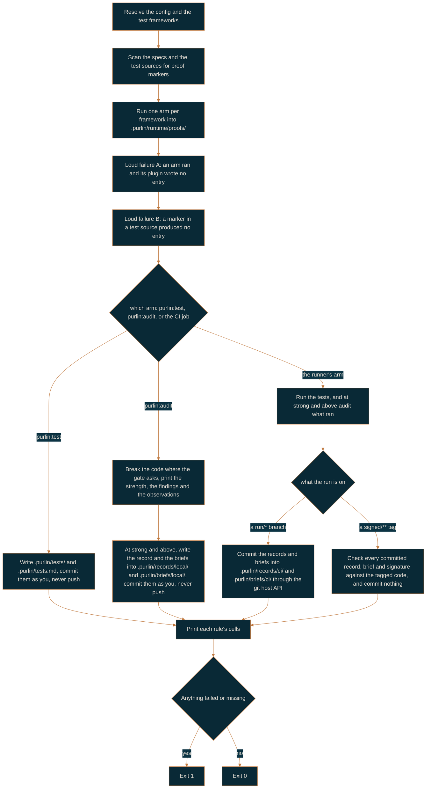

# Running the tests, and the records a run leaves

For the engineer who runs Purlin, and for anyone who has to read the evidence afterwards.

Two commands run your tests. `purlin:test` is the fast one you run constantly, and it writes
the evidence you keep at `passed`. `purlin:audit` is the slow one that measures how good those
tests are, and from `strong` up it writes the record. Both call the same run script, so there
is one answer to how a test is run. Both run on your machine, and neither pushes.

| | `purlin:test` | `purlin:audit` |
|---|---|---|
| Runs the tagged tests | yes | yes |
| Breaks the code to measure test strength | no | at `strong` and above |
| Writes the test results, and commits them | yes | no |
| Writes a record and the briefs, and commits them | no | at `strong` and above |
| Takes | seconds | as long as the breaks take |
| The level it answers | passed | strong |

## purlin:test

```
purlin:test                     Every feature, unit tier
purlin:test <feature> [...]     One feature, or several
purlin:test --all               Every tier, not just unit
purlin:test --remote            Let the git host's runner do the run
```

The run writes proof files into `.purlin/runtime/proofs/` and prints one line per rule, reading
that rule's passed cell: `passed`, `failed`, `partial`, `no test`, `not run` or `code
changed`. That directory
is generated and never committed, so two test runs never conflict with each other.

It then writes what it saw into two tracked files and commits them itself:

```
.purlin/tests/<feature>.json    the commit, the time, the operating system,
                                each rule's word, each proof's result and test
.purlin/tests.md                one table for the whole project
```

The commit subject is `purlin: tests at <sha7>`, made under your own git identity, and the run
prints `Test results committed.` A run that saw the same thing about the same code prints
`Test results unchanged.` and commits nothing. A `--feature` run replaces the files of the
features it ran and leaves the rest of the table as it was. Nothing here pushes.
[references/formats/tests_format.md](../references/formats/tests_format.md) is the contract.

The last line is `gate passed: <n> of <rules>` or `gate not met: <n> of <rules>`, counted over
every rule under `specs/` rather than over the features this run covered, and the run exits 1
on the second. At `passed` that line is the check.

A proof tagged `@env(windows)`, `@env(macos)` or `@env(linux)` runs only on that operating
system. On a host that does not match, the run prints one sentence rather than a pass or a
failure, and the rule's passed cell reads `not run`:

```
login PROOF-4 needs windows; this machine is macos. A remote runner runs it: purlin:init adds one.
```

Those three tags are the whole vocabulary; a proof with no `@env` is satisfied by a run on any
operating system.

The passed cell keeps one entry per operating system a counting run covered: the word, the
source and when the run happened. It reads `partial` when the rule's tests passed on some of
them and failed or did not run on the others, and `partial` is not met. A rule whose proofs
name one operating system and has no run there reads `not run` instead: nothing passed, so
nothing is partial. Test strength is not measured per operating system; one number covers the
rule.

## purlin:audit

```
purlin:audit                    The tests, the breaks, and what they found
purlin:audit <feature> [...]    One feature, or several
```

An audit is the level 2 run: the tests, then the breaks, then the AI audit on every rule whose
bar is `strong`. It prints each feature's test strength beside the minimum, then everything the
audit observed. An audit proves a rule strong or weak; it signs nothing.

The scans of the proof text and the test body are **hints**. They are handed to the AI audit as
plain sentences rather than printed as a list of check names, and what comes back is what the
audit observed, in its own words. An audit that settled and still observed something proves the
rule `weak`, with that sentence as the reason, so the audit's judgment is what carries the
scan.

From `strong` up it writes one record per feature it audited and one brief per rule it
reached, into `.purlin/records/local/<feature>/` and `.purlin/briefs/local/<feature>/`, and
commits both itself as `purlin: record for <sha7>` under your own git identity. It never
pushes. Its last line is `gate strong: <n> of <rules>` or `gate not met: <n> of <rules>`, the
same shape as `purlin:test`'s, and it exits 1 on the second.

Under the `passed` gate there is nothing to measure and no strong cell to move, so the audit
runs the tests alone and writes no record. Raising the gate to `strong` turns the breaks on,
locally and in CI, and turns the record on with them.

Your own record counts at every gate, `signed` included: the strong cell reads the newest
audit, yours or a runner's. What changes at `signed` is only what `trust` says. Under
`trust: local`, the default, this machine's runs are the evidence from end to end. Under
`trust: remote`, `purlin:sign` refuses a rule whose tests have no `ci` record at this commit.

There is no `--remote` here. A remote runner runs the tests, so that flag belongs to
`purlin:test`.

### The flow


```mermaid
%%{init: {"theme": "base", "themeVariables": {"background": "#0C3444", "primaryColor": "#092936", "primaryTextColor": "#E4DDD4", "primaryBorderColor": "#C0793F", "lineColor": "#C0793F", "secondaryColor": "#0C3444", "tertiaryColor": "#092936", "fontFamily": "Arial", "textColor": "#E4DDD4"}}}%%
flowchart TD
  A[Resolve the config and the test frameworks] --> B[Scan the specs and the test sources for proof markers]
  B --> C[Run one arm per framework into .purlin/runtime/proofs/]
  C --> D[Loud failure A: an arm ran and its plugin wrote no entry]
  D --> E[Loud failure B: a marker in a test source produced no entry]
  E --> F{"which arm: purlin:test, purlin:audit, or the CI job"}
  F -- "purlin:test" --> T1["Write .purlin/tests/ and .purlin/tests.md, commit them as you, never push"]
  F -- "purlin:audit" --> A1["Break the code where the gate asks, print the strength, the findings and the observations"]
  A1 --> A2["At strong and above, write the record and the briefs into .purlin/records/local/ and .purlin/briefs/local/, commit them as you, never push"]
  F -- "the runner's arm" --> H["Run the tests, and at strong and above audit what ran"]
  H --> Ci{"what the run is on"}
  Ci -->|"a run/* branch"| I2["Commit the records and briefs into .purlin/records/ci/ and .purlin/briefs/ci/ through the git host API"]
  Ci -->|"a signed/** tag"| I3["Check every committed record, brief and signature against the tagged code, and commit nothing"]
  T1 --> G["Print each rule's cells"]
  A2 --> G
  I2 --> G
  I3 --> G
  G --> J{Anything failed or missing}
  J -- yes --> K[Exit 1]
  J -- no --> L[Exit 0]
```

### The two loud failures

A test framework that runs nothing says nothing about it. That silence leaves a reader looking
at a proof file from an earlier run and believing it describes this one, so the run script
checks two things the frameworks cannot check themselves.

- **A: an arm ran and its plugin appended nothing.** Marked tests sit in the tree, the runner
  exited, and no proof entry was written. The proof plugin is not wired in.
- **B: a marker sits in a test source and this run produced no entry for it.** The message
  names the first five and counts the rest, because a project mid-migration has hundreds and a
  reader acts on the first few either way.

Both print as `Evidence is missing: ...` and both make the run exit 1. Neither is a test
failure; both mean the run cannot tell you what it proved.

### Exit codes

| Code | What it means |
|---|---|
| `0` | Everything asked for happened |
| `1` | A test failed, evidence is missing, or the passed level is not met |
| `2` | The command line was wrong |

## Test strength

Test strength is the share of the deliberate breaks made to the code that the tests caught, as
an integer percent:

```
test_strength = killed / (killed + survived)
```

A break that no test covers counts survived: nothing observed it. A break that made a test hang
counts killed: the test noticed. The technique is mutation testing, and this is the only place
in these docs it is named; everywhere else Purlin calls them breaks, because that is what the
output says.

`min_strength` in `.purlin/config.json` is the floor the gate holds you to: unused under
`passed`, where no breaks run, 70 under `strong` and 80 under `signed`, each overridable by
naming the key. The breaks run on your machine and nowhere else: a remote runner never breaks
the code.

Three engines ship, one per language family, and `mutation_engine` in `.purlin/config.json`
picks one. Under `auto`, the detected test framework decides.

| Engine | Breaks the code behind | Install it with |
|---|---|---|
| mutmut | pytest | `pip install mutmut` |
| Stryker | Jest and Vitest | `npm install --save-dev @stryker-mutator/core` |
| Stryker.NET | xUnit | `dotnet tool install -g dotnet-stryker` |

Two languages have no engine: shell and SQL. Their rules report `n/a` rather than a number, and
the run says so in a sentence. A rule with `n/a` still meets the strong cell as long as the
audit observed nothing outstanding: a gate that needs a minimum strength treats an unmeasured
rule as unmeasured, not as a failure.

The number beside a rule is worth what the engine could attribute. Stryker and Stryker.NET
report which test caught which break, so a rule carries its own tests' number. mutmut reports
totals per file, so every rule in that feature carries the same number. A run with no engine
installed prints the install line above and measures nothing.

An engine that runs past `--arm-timeout`, 3600 seconds by default, measures nothing either: the
rules it was breaking report `n/a`, and the run prints the seconds and the flag to raise, because
a partial run's number would read as a measurement it is not. mutmut breaks the whole project in
one run, so a timeout there leaves every feature unmeasured; Stryker and Stryker.NET run once per
feature, so only the feature that ran out of time is.

mutmut names a break after the file it changed, `scripts/run/records.py` as
`scripts.run.records`, and switches a break on only in a function whose module carries that
name. Tests that import the file as `records`, through a `sys.path` entry, never switch a break
on, and mutmut stops before running one. Import by the full dotted path, or rename the modules
while mutmut runs, as this repository's root `conftest.py` does. mutmut runs on Linux and macOS,
not on Windows. A test that reads git state or the source text sees the copy mutmut makes under
`mutants/`, so name such tests in `pytest_add_cli_args` with `--deselect`.

### SQL projects

A SQL project has no break engine, but it does choose the binary its tests run against.
`sql_engine` in `.purlin/config.json` names it; `sqlite3` is the default when the key is null.

## Records

A record is one audit run's observations for one feature, written into the tree and committed
there by whichever hand ran it. The git history of `.purlin/records/` is the log of what was
proven and when. Its full field list, at schema version 3, is in the
record format reference that ships with the plugin,
[references/formats/record_format.md](../references/formats/record_format.md). The test results
`purlin:test` commits are a different file in a different directory, described in
[references/formats/tests_format.md](../references/formats/tests_format.md).

### The file name

```
.purlin/records/<source>/<feature>/<timestamp>-<commit7>-<runner>[-<os>].json
```

| Part | What it is |
|---|---|
| `<source>` | `ci` or `local`: the folder is what says which, and a tag run checks that every file under `ci/` came from the runner |
| `<feature>` | the spec's name |
| `<timestamp>` | ISO 8601 UTC without separators, `20260913T120000Z` |
| `<commit7>` | the first seven characters of the commit the run observed |
| `<runner>` | `ci`, or the git email local part of whoever ran it, lowercased |
| `<os>` | `windows`, `macos` or `linux` when the run was one job of a matrix, absent otherwise |

One run writes one file per feature. Adding a file never conflicts, so two runs never collide
and one matrix job never overwrites another's observations.

### What is in it

Eight fields are required, and every other one is optional:

| Field | What it holds |
|---|---|
| `schema_version` | `3` for this format |
| `feature` | the spec this run observed |
| `commit` | the full sha of the commit the run observed |
| `timestamp` | ISO 8601 UTC, matching the file name |
| `runner` | `ci` or the slug of whoever ran it, matching the file name |
| `gate` | the gate in force when the run happened: `passed`, `strong` or `signed` |
| `source` | `ci` or `local`, and it must match the folder the file sits in |
| `proofs` | one entry per proof: its rule, `pass`, `fail` or `skip`, its tier, its `@env`, and the test that ran it |
| `os` | the operating system of this matrix job, or null |
| `test_strength` | the percentage of the deliberate breaks the tests caught, or null |
| `scope_tree` | the git tree hash of the spec's `> Scope:` files |
| `environment` | the operating system, the machine's shape, the CI job and the engines used |

Under the `passed` gate no breaks run and no record is written at all. A run at `strong` and
above also writes the detail it gathered on the way - `features`, `plugins`, `missing`, `log`
and `dirty` - and no reader depends on any of it.

`scope_tree` is what separates two kinds of change. The code changed and the rule, proof and
test text did not: the signature stands and the passed cell reads `code changed` until the
next audit runs. The rule, proof or test text changed: the signed cell reads `stale` and a
person looks.

### The source is the folder

A file can claim anything, so the folder decides. A record under `.purlin/records/ci/` is a
remote runner's; a record under `.purlin/records/local/` is anyone's, written by a
`purlin:audit` on somebody's machine. Nothing stops a person writing into `ci/` by hand, and
nothing needs to: a tag run reads the commit that added each file there and fails the job
unless the runner's own identity made it. A file whose own `source` field disagrees with its folder
is ignored, and the run says so in a warning rather than reading a file that contradicts
itself.

| Source | Where it sits | Counts under |
|---|---|---|
| `ci` | `.purlin/records/ci/`, committed by a remote runner through the git host's API | `passed`, `strong`, `signed` |
| `local` | `.purlin/records/local/`, plus this checkout's own run and the test results | `passed`, `strong`, `signed` |

Both count at every gate. The cell reads the newest counting record, whoever wrote it. What
`trust: remote` changes is not which records count but what `purlin:sign` asks for before it
signs: a `ci` record at this commit.

On GitHub a commit made through the Git Data API with the Actions token and no author or
committer field carries `GitHub <noreply@github.com>` as its committer and
`github-actions[bot]` as its author, and GitHub signs it with its own key. Purlin reads those
two names and treats the signature as confirmation: `git log --format=%G?` printing `B`, a
signature that does not match the commit, refuses it, and `N`, no signature, refuses it when
gpg is installed. Every other answer means this machine holds no current key for the
signature, which is the ordinary case for the git host's own key. On Azure DevOps the
committer is the build service and no signature exists, which is what Azure DevOps documents.

### Retention

A feature keeps the newest three records per operating system per source, and the run that
writes one prunes the rest, whoever ran it. A matrix of three operating systems therefore keeps
nine `ci` records per feature, and your own audits keep three more per system.

Nothing pins a record. `purlin:sign` tags the commit, `signed/<version>`, and a tag holds the
whole tree at that commit: the code, every record and every brief in it. One name reaches all
of it, however many runs follow.

## When a project has a runner

Most have none. Everything above runs on your machine, and at every gate a rule reaches
`passed`, `strong` and `signed` without anything leaving it. `purlin:init` writes a CI workflow
for two reasons and no other:

- **a proof is tagged `@env` for an operating system this machine is not.** The runner has that
  system, so those rules stop reading `not run` and the rule stops reading `partial`.
- **you answered no to the trust question**, `Do you trust your own machine for the tests and
  the signing?`. You chose not to trust this machine for signing, so tests must run on a clean
  machine before a signature counts, and `purlin:sign` asks for a `ci` record at the commit it
  is signing.

Where one is called for, `purlin:init` writes `.github/workflows/purlin.yml` on GitHub, or
`purlin.azure-pipelines.yml` at the project root on Azure DevOps. The job is named `purlin`.

### What starts a run

```yaml
on:
  push:
    tags: ['signed/**']
    branches: ['run/**']
```

Two things and nothing else: a push of a `signed/**` tag, and a push to a `run/*` branch, the
branch `purlin:test --remote` creates and deletes around one run. A pull request starts
nothing, and a push to an ordinary branch starts nothing, so working branches cost no runner
minutes at all.

### What each run does

| The run | What it does | Commits |
|---|---|---|
| a `signed/**` tag | Reruns the tagged tests on a clean machine, recomputes every committed record, brief and signature against the tagged code, checks that every file under `ci/` was committed by the runner's own identity, then runs the gate check | nothing |
| a `run/*` branch | Runs the tagged tests, and at `strong` and above audits what it ran | the records and the briefs, under `ci/`, onto that branch |

The tag run is a verification, not a fresh judgment: the evidence is already in the tree and
the run says whether it still matches the code the tag points at. A file whose hash no longer
matches fails the job, and so does a file under `ci/` that a person committed. No breaks run on
the runner: the strength in a record was measured where the audit ran.

The runner posts no comment and uploads no artifact. The dashboard is the page that opens from
disk beside your editor, and `scripts/report/scan.py --repo <url> --ref <tag>` prints the same
rollup for anyone holding only a URL.

### The gate check is the last step

```yaml
      - name: Check the gate
        shell: bash
        run: python3 "$PURLIN_ROOT/scripts/ci/gate_check.py" --check
```

It exits 1 when a rule does not meet the gate, which fails the job. It writes nothing: a gate
that can edit the evidence it grades is not a gate. `purlin:sign` runs the same check before it
writes a tag, so the two answer the same question from the same code.

A red run on a pushed tag is the git host's word that this version is not proven.

### Finding Purlin on the runner

Purlin is loaded two ways, and the workflow handles both. A checkout that already carries
`scripts/run/purlin_run.py` is the Purlin to run, which is the case when you develop with
`claude --plugin-dir <checkout>`. A consumer project installed Purlin from the marketplace, so
its plugin lives under `~/.claude/plugins/cache/purlin/purlin/<version>/` on your machine and
not on the runner at all; the job clones Purlin at the tag the project pins. Set the
`PURLIN_REF` repository variable to move that pin without editing the workflow.

### The matrix comes from `@env`

`purlin:init` writes `ubuntu-latest` first, then one job per operating system the `@env` tags
in `specs/` name; a project that tags nothing runs on `ubuntu-latest` alone. Each job runs the
same script and writes its own record, so the file names never collide. A rule whose proofs
name two operating systems needs a passing record from both: with neither run the passed cell
reads `not run` and carries `windows: no record yet`, and with one of the two passing it reads
`partial`, rather than inventing an answer for the system nothing ran on.

### The commit a run branch makes

A run branch's job creates one commit, `purlin: record for <commit7>`, holding the records and
the briefs it wrote under `.purlin/records/ci/` and `.purlin/briefs/ci/` and nothing else. It
writes no signature file, ever: a signature directory holds only files a person wrote. The
commit goes through the git host's REST API as one tree request carrying the text of every one
of those files, then a commit with no author or committer field, then a ref update, retrying on
a non-fast-forward. That is what makes the commit signed by the host and its records count as
`ci`, which the tag run checks.

One run can write several hundred briefs, and a git host limits how many requests that create
content one token may make in a short span. Sending each file on its own would spend one of
those requests per file and be refused part way through, so the whole commit is one request.
If the git host asks for a pause anyway, answering 403 or 429 with `Retry-After` or
`x-ratelimit-reset`, the run waits what it was asked for, up to 120 seconds, says so in one
line, and sends the request again, up to 3 times before it gives up.

### A run from a fork

A fork's push gets a read-only token, so no commit could be made. The run still happens, and
the job says in one line that no record was written.

## Who pushes

A push is `git push`, typed by a person, and it is free: any branch, any time, and nothing runs
when you make one. No skill, no agent and no hook pushes, and none opens a pull request.
`purlin:test` commits the test results and stops. `purlin:audit` commits its record and its
briefs and stops. `purlin:sign` makes its signed commit, writes the tag and stops. A run
branch's record commit is not a push made on your behalf: it is the remote runner publishing
its own evidence through the git host's API.

Purlin installs no git hook. The rule that an agent does not push is an instruction in
`agents/purlin.md`, kept by the agent rather than enforced by a script, which is why the
instruction says it plainly.

## purlin:test --remote

Use it for the two reasons a runner exists at all: a proof is tagged `@env` for an operating
system your machine is not, or `trust` is `remote` and a signature needs a `ci` record at this
commit. It is the one case in which Purlin pushes.

It pushes a branch of its own rather than the branch you are on:

1. It refuses a detached head, because there is no branch to name, and an uncommitted change,
   because the run would prove something other than what is on disk.
2. It pushes this commit to `run/<branch>-<sha7>` on `origin`, creating that branch there and
   nothing locally. The commit's own short sha is in the name, so two runs of the same branch
   never share one.
3. The push to `run/**` starts the workflow, which at `strong` and above commits its records
   and briefs onto that branch. At `passed` it writes no record, so there is nothing to bring
   home and the run says so.
4. On GitHub it finds the run by that branch, `gh run list --branch run/<branch>-<sha7>`,
   retrying for a short while because a run takes a moment to register, then waits on that run
   by id with `gh run watch --exit-status`. Then `git pull --ff-only origin
   run/<branch>-<sha7>` brings the record commit onto your branch as one fast-forward, then it
   deletes the run branch from `origin` and prints the table. Without the `gh` CLI installed it
   says so and tells you which branch to open and which pull command to run.
5. On Azure DevOps it prints the pipeline URL and the two commands to run when the pipeline
   finishes, and returns.

If the run branch is still on `origin` when the command ends, it says so and gives you the
delete command.

## Next

- [how-purlin-works.md](how-purlin-works.md): the chain, the five words, and who writes each file.
- [dashboard.md](dashboard.md): the same data as a page that opens from disk.
- [team-workflow.md](team-workflow.md): what the `strong` gate asks of a team.
- [regulated-workflow.md](regulated-workflow.md): signatures on top of records.
