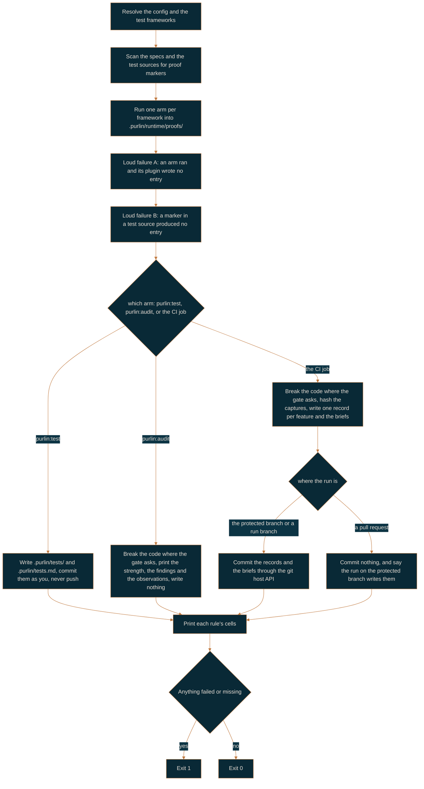

# Running the tests, and the records a run leaves

For the engineer who runs Purlin, and for anyone who has to read the evidence afterwards.

Two commands run your tests. `purlin:test` is the fast one you run constantly, and it writes
the evidence you keep at `passed`. `purlin:audit` is the slow one that measures how good those
tests are, and it writes nothing. Both call the same run script, so there is one answer to how
a test is run. The record is CI's, and nothing on your machine writes one.

| | `purlin:test` | `purlin:audit` |
|---|---|---|
| Runs the tagged tests | yes | yes |
| Breaks the code to measure test strength | no | at `strong` and above |
| Writes the test results, and commits them | yes | no |
| Writes a record | no | no |
| Takes | seconds | as long as the breaks take |
| The level it answers | passed | strong |

## purlin:test

```
purlin:test                     Every feature, unit tier
purlin:test <feature> [...]     One feature, or several
purlin:test --all               Every tier, not just unit
purlin:test --remote            Let the git host's runner do the run
```

The run writes proof files into `.purlin/runtime/proofs/` and prints one line per rule, reading
that rule's passed cell: `passed`, `failed`, `no test` or `not run`. That directory is generated
and never committed, so two test runs never conflict with each other.

It then writes what it saw into two tracked files and commits them itself:

```
.purlin/tests/<feature>.json    the commit, the time, the operating system,
                                each rule's word, each proof's result and test
.purlin/tests.md                one table for the whole project
```

The commit subject is `purlin: tests at <sha7>`, made under your own git identity, and the run
prints `Test results committed.` A run that saw the same thing about the same code prints
`Test results unchanged.` and commits nothing. A `--feature` run replaces the files of the
features it ran and leaves the rest of the table as it was. Nothing here pushes.
[references/formats/tests_format.md](../references/formats/tests_format.md) is the contract.

The last line is `gate passed: <n> of <rules>` or `gate not met: <n> of <rules>`, counted over
every rule under `specs/` rather than over the features this run covered, and the run exits 1
on the second. At `passed` that line is the check.

A proof tagged `@env(windows)`, `@env(macos)` or `@env(linux)` runs only on that operating
system. On a host that does not match, the run prints one sentence rather than a pass or a
failure, and the rule's passed cell reads `not run`:

```
login PROOF-4 needs windows; this machine is macos. A remote runner runs it: purlin:init adds one.
```

Those three tags are the whole vocabulary; a proof with no `@env` is satisfied by a run on any
operating system.

## purlin:audit

```
purlin:audit                    The tests, the breaks, and what they found
purlin:audit <feature> [...]    One feature, or several
purlin:audit --tag <name>       Pin the records in the tree as record/<name>
```

An audit is the level 2 run: the tests, then the breaks, the free checks, and the model review
where the risk asks for one. It prints each feature's test strength beside the minimum, then
each rule's findings and observations. An audit proves a rule strong or weak; it signs nothing
and it writes nothing, and it says so on its last line: `This audit counts only when CI runs
it.`

Under the `passed` gate there is nothing to measure, so the audit runs the tests alone and no
cell moves because of it. Raising the gate to `strong` turns the breaks on, locally and in CI.
At every gate the record is CI's, so your local audit is a preview: it tells you the CI run
will pass before you spend a CI run finding out.

There is no `--remote` here. A remote runner runs the tests, so that flag belongs to
`purlin:test`.

### The flow


```mermaid
%%{init: {"theme": "base", "themeVariables": {"background": "#0C3444", "primaryColor": "#092936", "primaryTextColor": "#E4DDD4", "primaryBorderColor": "#C0793F", "lineColor": "#C0793F", "secondaryColor": "#0C3444", "tertiaryColor": "#092936", "fontFamily": "Arial", "textColor": "#E4DDD4"}}}%%
flowchart TD
  A[Resolve the config and the test frameworks] --> B[Scan the specs and the test sources for proof markers]
  B --> C[Run one arm per framework into .purlin/runtime/proofs/]
  C --> D[Loud failure A: an arm ran and its plugin wrote no entry]
  D --> E[Loud failure B: a marker in a test source produced no entry]
  E --> F{"which arm: purlin:test, purlin:audit, or the CI job"}
  F -- "purlin:test" --> T1["Write .purlin/tests/ and .purlin/tests.md, commit them as you, never push"]
  F -- "purlin:audit" --> A1["Break the code where the gate asks, print the strength, the findings and the observations, write nothing"]
  F -- "the CI job" --> H["Break the code where the gate asks, hash the captures, write one record per feature and the briefs"]
  H --> Ci{"where the run is"}
  Ci -->|"the protected branch or a run branch"| I2["Commit the records and the briefs through the git host API"]
  Ci -->|"a pull request"| I3["Commit nothing, and say the run on the protected branch writes them"]
  T1 --> G["Print each rule's cells"]
  A1 --> G
  I2 --> G
  I3 --> G
  G --> J{Anything failed or missing}
  J -- yes --> K[Exit 1]
  J -- no --> L[Exit 0]
```

### The two loud failures

A test framework that runs nothing says nothing about it. That silence leaves a reader looking
at a proof file from an earlier run and believing it describes this one, so the run script
checks two things the frameworks cannot check themselves.

- **A: an arm ran and its plugin appended nothing.** Marked tests sit in the tree, the runner
  exited, and no proof entry was written. The proof plugin is not wired in.
- **B: a marker sits in a test source and this run produced no entry for it.** The message
  names the first five and counts the rest, because a project mid-migration has hundreds and a
  reader acts on the first few either way.

Both print as `Evidence is missing: ...` and both make the run exit 1. Neither is a test
failure; both mean the run cannot tell you what it proved.

### Exit codes

| Code | What it means |
|---|---|
| `0` | Everything asked for happened |
| `1` | A test failed, evidence is missing, or the passed level is not met |
| `2` | The command line was wrong |

## Test strength

Test strength is the share of the deliberate breaks made to the code that the tests caught, as
an integer percent:

```
test_strength = killed / (killed + survived)
```

A break that no test covers counts survived: nothing observed it. A break that made a test hang
counts killed: the test noticed. The technique is mutation testing, and this is the only place
in these docs it is named; everywhere else Purlin calls them breaks, because that is what the
output says.

`min_strength` in `.purlin/config.json` is the floor the gate holds you to: unused under
`passed`, where no breaks run, 70 under `strong` and 80 under `signed`, each overridable by
naming the key.

Three engines ship, one per language family, and `mutation_engine` in `.purlin/config.json`
picks one. Under `auto`, the detected test framework decides.

| Engine | Breaks the code behind | Install it with |
|---|---|---|
| mutmut | pytest | `pip install mutmut` |
| Stryker | Jest and Vitest | `npm install --save-dev @stryker-mutator/core` |
| Stryker.NET | xUnit | `dotnet tool install -g dotnet-stryker` |

Two languages have no engine: shell and SQL. Their rules report `n/a` rather than a number, and
the run says so in a sentence. A rule with `n/a` still meets the strong cell, which reads
`strong` with the reason `no engine: free checks only`, as long as no blocking finding sits on
its proof text: a gate that needs a minimum strength treats an unmeasured rule as unmeasured,
not as a failure.

The number beside a rule is worth what the engine could attribute. Stryker and Stryker.NET
report which test caught which break, so a rule carries its own tests' number. mutmut reports
totals per file, so every rule in that feature carries the same number. A run with no engine
installed prints the install line above and measures nothing.

An engine that runs past `--arm-timeout`, 3600 seconds by default, measures nothing either: the
rules it was breaking report `n/a`, and the run prints the seconds and the flag to raise, because
a partial run's number would read as a measurement it is not. mutmut breaks the whole project in
one run, so a timeout there leaves every feature unmeasured; Stryker and Stryker.NET run once per
feature, so only the feature that ran out of time is.

mutmut names a break after the file it changed, `scripts/run/records.py` as
`scripts.run.records`, and switches a break on only in a function whose module carries that
name. Tests that import the file as `records`, through a `sys.path` entry, never switch a break
on, and mutmut stops before running one. Import by the full dotted path, or rename the modules
while mutmut runs, as this repository's root `conftest.py` does. mutmut runs on Linux and macOS,
not on Windows. A test that reads git state or the source text sees the copy mutmut makes under
`mutants/`, so name such tests in `pytest_add_cli_args` with `--deselect`.

### SQL projects

A SQL project has no break engine, but it does choose the binary its tests run against.
`sql_engine` in `.purlin/config.json` names it; `sqlite3` is the default when the key is null.

## Records

A record is one CI run's observations for one feature, written into the tree and committed
there by CI. Nothing on a person's machine writes one. The git history of `.purlin/records/`
is the log of what was proven and when. Its full field list, at format version 2, is in the
record format reference that ships with the plugin,
[references/formats/record_format.md](../references/formats/record_format.md). The test results
`purlin:test` commits are a different file in a different directory, described in
[references/formats/tests_format.md](../references/formats/tests_format.md).

### The file name

```
.purlin/records/<feature>/<timestamp>-<commit7>-<runner>[-<os>].json
```

| Part | What it is |
|---|---|
| `<feature>` | the spec's name |
| `<timestamp>` | ISO 8601 UTC without separators, `20260913T120000Z` |
| `<commit7>` | the first seven characters of the commit the run observed |
| `<runner>` | `ci`, or the git email local part of whoever ran it, lowercased |
| `<os>` | `windows`, `macos` or `linux` when the run was one job of a matrix, absent otherwise |

One run writes one file per feature. Adding a file never conflicts, so two runs never collide
and one matrix job never overwrites another's observations.

### What is in it

Seven fields are required, and every other one is optional:

| Field | What it holds |
|---|---|
| `schema_version` | `2` for this format |
| `feature` | the spec this run observed |
| `commit` | the full sha of the commit the run observed |
| `timestamp` | ISO 8601 UTC, matching the file name |
| `runner` | `ci` or the slug of whoever ran it, matching the file name |
| `gate` | the gate in force when the run happened: `passed`, `strong` or `signed` |
| `proofs` | one entry per proof: its rule, `pass`, `fail` or `skip`, its tier, its `@env`, and the test that ran it |
| `os` | the operating system of this matrix job, or null |
| `test_strength` | the percentage of the deliberate breaks the tests caught, or null |
| `scope_tree` | the git tree hash of the spec's `> Scope:` files |
| `environment` | the operating system, the machine's shape, the CI job and the engines used |

Under the `passed` gate no breaks run and no record is written at all. A CI run at `strong`
and above also writes the detail it gathered on the way - `features`, `plugins`, `missing`,
`log` and `dirty` - and no reader depends on any of it.

`scope_tree` is what separates two kinds of change. The code changed and the rule, proof and
test text did not: the signature stands and the passed cell reads `code changed` until CI runs
again. The rule, proof or test text changed: the signed cell reads `stale` and a person looks.

### The source comes from git, not from the file

A file can claim anything. What decides whether a record counts is the last commit that touched
it. That answer is the passed cell's `source`.

| Source | What git shows | Counts under |
|---|---|---|
| `ci` | the committer is the git host's build identity | `passed`, `strong`, `signed` |
| `local` | anything else: not committed, or committed by somebody other than the git host | `passed` only |

A record that does not count under the gate leaves the passed cell reading `not run`, with the
reason `<source> record does not count under <gate>`, rather than pretending the rule was never
run.

On GitHub a commit made through the Git Data API with the Actions token and no author or
committer field carries `GitHub <noreply@github.com>` as its committer and
`github-actions[bot]` as its author, and GitHub signs it with its own key. Purlin reads those
two names and treats the signature as confirmation: `git log --format=%G?` printing `B`, a
signature that does not match the commit, refuses it, and `N`, no signature, refuses it when
gpg is installed. Every other answer means this machine holds no current key for the
signature, which is the ordinary case for the git host's own key. On Azure DevOps the
committer is the build service and no signature exists, which is what Azure DevOps documents.

### Retention and record tags

A feature keeps the newest three records per operating system. The CI run prunes the rest as
it writes, so a matrix of three operating systems keeps nine records per feature and no more.

`purlin:audit --tag 1.0` writes an annotated tag `record/1.0` over the records already in the
tree, whose message lists the record paths it vouches for, one per line. Retention reads those
paths and keeps every record such a tag names, for ever. With no record in the tree it says so
and writes nothing.

## CI

CI is the git host's hosted runner executing the same run script you run. `purlin:init` writes
the workflow as `.github/workflows/purlin.yml` on GitHub, or `purlin.azure-pipelines.yml` at
the project root on Azure DevOps, whenever the gate is `strong` or `signed`. Under `passed` it
explains a remote runner in three reasons, asks `Run the tests on a remote runner too? [y/n]`,
and writes the workflow on a yes.

The job runs the run script in its own arm, which nobody types by hand: the tagged tests, then
at `strong` and above the audit, the briefs and one record per feature. At `passed` it runs
the tests, posts the comment, publishes the dashboard and writes no record.

### What starts a run

```yaml
on:
  pull_request:
  push:
    branches: [main, 'run/**']
```

Three things and nothing else: a pull request, a push to the protected branch, and a push to a
`run/*` branch, which is the branch `purlin:test --remote` creates and deletes around one
run. `purlin:init` writes the project's own default branch in place of `main`. A push to any
other branch starts nothing, so a feature branch costs no runner minutes until you open it as
a pull request.

### What a run writes, and where

Evidence is decided where it lands, so where the run happens decides what it commits.

| Where the run happens | The tests run | Posts the comment | Uploads the dashboard | Runs the gate check | Commits records and briefs |
|---|---|---|---|---|---|
| a pull request | yes | yes | yes | yes | no |
| a push to the protected branch | yes | there is no pull request to comment on | yes | yes | at `strong` and above |
| a push to a `run/*` branch | yes | there is no pull request to comment on | yes | yes | at `strong` and above |
| any other branch | the run never starts | | | | |

At `passed` no run writes a record anywhere; the job says `The gate is passed, so this run
writes no record.` and the evidence stays the test results `purlin:test` committed.

A pull request run prints `Pull request run: the records stay on the runner; the run on <branch>
writes them.` and moves on. A record on a branch nobody merges from is evidence of a branch
that will not exist, so it is not committed. The comment and the dashboard still say everything
the run observed.

### The gate check is the last step

```yaml
      - name: Check the gate
        shell: bash
        run: python3 "$PURLIN_ROOT/scripts/ci/gate_check.py" --check
```

It runs after the artifact upload, on every run, wherever the run happens. It exits 1 when a
rule does not meet the gate, which fails the job, which is what a required check on this
workflow means. It writes nothing: a gate that can edit the evidence it grades is not a gate.

### Finding Purlin on the runner

Purlin is loaded two ways, and the workflow handles both. A checkout that already carries
`scripts/run/purlin_run.py` is the Purlin to run, which is the case when you develop with
`claude --plugin-dir <checkout>`. A consumer project installed Purlin from the marketplace, so
its plugin lives under `~/.claude/plugins/cache/purlin/purlin/<version>/` on your machine and
not on the runner at all; the job clones Purlin at the tag the project pins. Set the
`PURLIN_REF` repository variable to move that pin without editing the workflow.

### The matrix comes from `@env`

`purlin:init` writes `ubuntu-latest` first, then one job per operating system the `@env` tags
in `specs/` name; a project that tags nothing runs on `ubuntu-latest` alone. The Linux job is
always there because an untagged proof is satisfied by any operating system, and something has
to prove those and write the record that counts. Each job runs the same script and writes its
own record, so the file names never collide. A rule whose proofs name two operating systems
needs a passing record from both; the passed cell reads `not run` and carries `windows: no
record yet` rather than inventing an answer for it.

### The commit CI makes

CI creates one commit, `purlin: record for <commit7>`, holding the records and the briefs and
nothing else. It writes no signature file, ever: a signature directory holds only files a person
wrote. The commit goes through the git host's REST API as one tree request carrying the text of
every one of those files, then a commit with no author or committer field, then a ref update,
retrying on a non-fast-forward. That is what makes the commit signed and its records count as
`ci`.

One run can write several hundred briefs, and a git host limits how many requests that create
content one token may make in a short span. Sending each file on its own would spend one of
those requests per file and be refused part way through, so the whole commit is one request.
If the git host asks for a pause anyway, answering 403 or 429 with `Retry-After` or
`x-ratelimit-reset`, the run waits what it was asked for, up to 120 seconds, says so in one
line, and sends the request again, up to 3 times before it gives up.

The briefs are written before that commit, because the commit is what carries them, and they
land under `.purlin/briefs/<feature>/`. A brief that stayed on the runner is evidence nobody can
read: the branch is what a reviewer works from, and every cell above level 1 is read out of a
checkout. A local `purlin:audit` writes no brief and no record, so there is no local commit to
hold either.

A squash merge changes the sha, so the record that counts on the protected branch is the one
CI writes after the merge, which is the run that commits it.

### A pull request from a fork

A forked pull request gets a read-only token, so no commit could be made even on a branch that
keeps them. The run still happens and the comment still posts, and the job says in one line
that no record was written.

## Who pushes

A push is `git push`, typed by a person. No skill, no agent and no hook pushes, and none opens
a pull request. `purlin:test` commits the test results and stops. `purlin:sign` makes its
signed commit and stops. `purlin:audit --tag` writes the tag and stops. CI's record commit is
not a push made on your behalf: it is the remote runner publishing its own evidence through
the git host's API, onto the two paths a branch rule reserves for the CI identity.

The pre-push hook enforces the rest. Before it runs anything it checks for
`CLAUDE_CODE_SESSION_ID` in the environment; with that set and `PURLIN_REMOTE_RUN` unset it
prints `purlin: an agent does not push. A person runs git push.` and exits 1. `git push
--no-verify` skips the hook, and that override is yours: an agent reaching for it is doing the
thing the refusal exists to stop.

## purlin:test --remote

Use it when a proof is tagged `@env` for an operating system your machine is not, or when you
want a `ci` record at this commit before the merge. It is the one case in which Purlin pushes,
and it marks the two pushes it makes with `PURLIN_REMOTE_RUN=1` so the pre-push hook lets them
through.

It pushes a branch of its own rather than the branch you are on:

1. It refuses a detached head, because there is no branch to name, and an uncommitted change,
   because the run would prove something other than what is on disk.
2. It pushes this commit to `run/<branch>-<sha7>` on `origin`, creating that branch there and
   nothing locally. The commit's own short sha is in the name, so two runs of the same branch
   never share one.
3. The push to `run/**` starts the workflow, which at `strong` and above commits its records
   and briefs onto that branch. At `passed` it writes no record, so there is nothing to bring
   home and the run says so.
4. On GitHub it waits with `gh run watch --exit-status`, then `git pull --ff-only origin
   run/<branch>-<sha7>` brings the record commit onto your branch as one fast-forward, then it
   deletes the run branch from `origin` and prints the table. Without the `gh` CLI installed it
   says so and tells you which branch to open and which pull command to run.
5. On Azure DevOps it prints the pipeline URL and the two commands to run when the pipeline
   finishes, and returns.

If the run branch is still on `origin` when the command ends, it says so and gives you the
delete command.

## Next

- [how-purlin-works.md](how-purlin-works.md): the chain, the four words, and who writes each file.
- [dashboard.md](dashboard.md): the same data as a page, locally and as a CI artifact.
- [team-workflow.md](team-workflow.md): what the `strong` gate asks of a team.
- [regulated-workflow.md](regulated-workflow.md): signatures on top of records.
