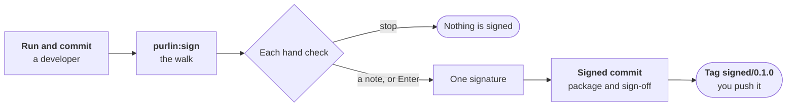

# The sign-off

For whoever signs: QA, product or a developer.

When everyone is done, a person signs the evidence once. **Signing is optional.** A project
that never signs keeps its evidence all the same.



## Nothing is signed while the work goes on

Product, QA and developers improve rules, proofs and tests on their branches. `Left to do`
lists only work. The sign-off is the final check, once everybody is done.

A judgment call takes a proof tagged `@manual`. It is a hand check: no test runs for it, and
the walk stops at it. [specs-and-anchors.md](specs-and-anchors.md) says when to tag one.

## Before you sign, a developer runs and commits every test

You run no tests. The developer runs them and commits the results:

```
purlin:test --all --commit
```

It runs what changed and carries the rest forward, results from other operating systems
included. The status then reads `Tests: met`. The developer pushes the branch and you pull it.

`purlin:sign` checks the commit before it shows anything. It signs only when:

- every changed file and every result is committed;
- every rule has a test that passes, or a hand check;
- every result is recorded on this version of the code;
- your checkout holds every commit of the branch on the host;
- the version is not already signed over other code.

Otherwise it prints one line with the cause and the command to run, and writes nothing:

```text
No sign-off: 1 rule has no test at 1cf829e: login RULE-3. Run purlin:build login, then purlin:sign.
```

The version is read from the `VERSION` file, then `package.json`, `pyproject.toml` or the
first `*.csproj` at the project root. `purlin:sign --version <version>` names it instead.

Purlin signs with an SSH key, any key. A checkout with none gets the commands that set one up.

A team may sign a version on a branch of its own, such as `release/1.2.0`. A fix lands there,
the developer runs and commits the tests again, and the fix is merged back.

## The walk shows who ran the tests and stops at each hand check

```text
Tests run by dana.dev@labconnect.example on dana-laptop at 2026-10-01 12:17 UTC on 1cf829e: 19 rules on Linux/Unix.
Signing 0.1.0 at 1cf829e.
  19 rules on Linux/Unix: 18 pass their tests, 1 has a hand check.
  The audit: 17 strong, 1 weak.
The audit's findings: 1 weak. list / go on: 
login RULE-2   hand check
Rule
  The error messages follow the brand voice guide
Proof
  PROOF-5: Read the error messages against the brand voice guide @manual
Results
  No test runs for this rule: you check it here.
login RULE-2   what did you see, in one line, or Enter for no note, or stop: 
```

| The walk asks | You answer |
|---|---|
| `list / go on` | `list` prints each weak rule with what the audit found. The findings add no stop. |
| `what did you see` | One line: the hand check's note. Enter records `no note`. |
| | `stop` ends the walk. Nothing is signed. |
| `Sign the evidence package for 0.1.0 as <you>? [y/N]` | `y` signs. Any other answer prints `Nothing was signed.` |

A stop also shows the last note an earlier sign-off holds for that rule, with its version and
how many commits have come since. You judge whether it still holds.

In Claude Code the agent shows you each stop and asks for your answers. To sign, you type your
own email address.

## One signature covers the whole package

```text
Sign the evidence package for 0.1.0 as quinn.qa@labconnect.example? [y/N] y
Signed 0.1.0 as quinn.qa@labconnect.example with the key ending ...4f2a.
Tagged signed/0.1.0 at e0deb2e.
Push the branch and the tag: git push origin main signed/0.1.0
```

`y` makes one signed commit, `sign(0.1.0): quinn.qa@labconnect.example`. It carries two files:

| File | What it holds |
|---|---|
| The evidence package, `.purlin/evidence/package/<version>.json` | Every rule, its proofs, its tests, the results, what the audit found, who ran the tests and who wrote what. It carries a fingerprint of itself. |
| Your sign-off, `.purlin/evidence/package/<version>.signoffs/<signer>.json` | The package's fingerprint, your name and email as git holds them, your key's fingerprint, the time, what the walk showed and every note you typed. |

The sign-off records no judgment and no answer word.
[package_format.md](../references/formats/package_format.md) and
[signature_format.md](../references/formats/signature_format.md) have every field.

**Several people may sign one version**, each once. A later signer pulls the tagged commit and
runs `purlin:sign`. Their file is added over the same package.

**Purlin records who signed. It does not decide who may.** A sign-off counts when the
signature on its commit verifies and the package is unchanged since.
[evidence_and_signoff.md](../references/evidence_and_signoff.md#when-a-sign-off-counts) is the
one definition.

## The first sign-off tags the version, and you push the tag

The signed tag `signed/0.1.0` is written on the sign-off's commit. It pins the code, the
evidence, the package and the sign-offs under one name. It is never moved.

You push the branch and the tag. Purlin pushes nothing.

| The status reads | When |
|---|---|
| `Sign-off: signed 0.1.0 at e0deb2e` | the tagged commit is the code as it stands |
| `Sign-off: signed 0.1.0, 1 commit since` | the code changed after the tag |
| `Sign-off: not signed` | no version has a sign-off that counts |

To sign code that changed after the tag, name a new version. After a `git pull` the tag may be
missing, since a pull fetches no tags: run `git fetch --tags`.

## Anyone can check a package

```
purlin:sign --check <file>
```

It recomputes the fingerprint of a package you were handed:

```text
The package matches its fingerprint.
```

For a file changed after it was written, it prints
`The package does not match its fingerprint: <why>.` and exits 1.

A sign-off file is not checkable alone. The signed commit that added it binds the sign-off,
the package and the code.

## In regulated work, file the package in your document control system

A Purlin sign-off is an engineering sign-off. It does not claim compliance. In regulated work, use Purlin beside a validated document control system, such as Veeva. File the evidence package and its sign-offs there, from the tagged commit, and approve and sign them there.

[Purlin in regulated work](regulated.md) gives the workflow step by step, what a validation reader finds in the package, and where Purlin stops.

## Read next

- [running-and-evidence.md](running-and-evidence.md) for the evidence a sign-off reads.
- [audit.md](audit.md) for what the audit's findings mean.
- [purlin_commands.md](../references/purlin_commands.md) for every form of `purlin:sign`.
