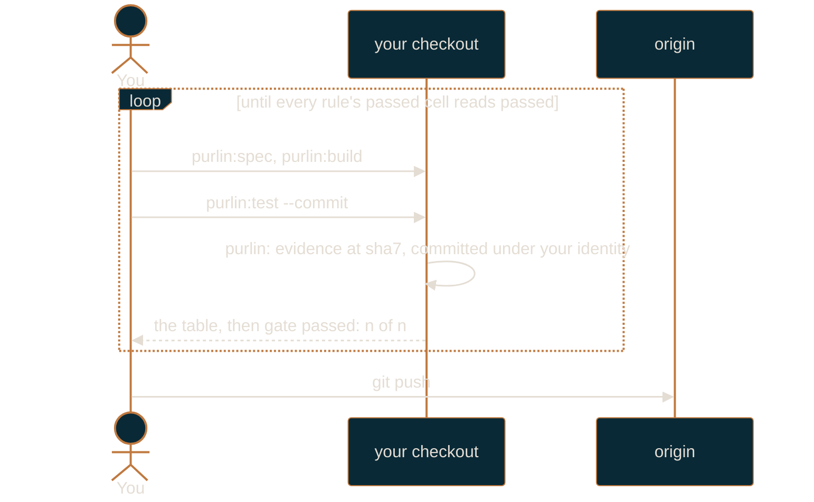

# Solo workflow

For one person working alone at the `passed` gate.

At `passed`, one question is asked of every rule: does every tagged test for it pass? The loop
is `purlin:spec`, `purlin:build`, `purlin:test`, `git push`, and that is the whole of it. It
runs on your machine from end to end. Nobody signs anything, nobody runs a script, and no CI
workflow is written at all unless one of two things is true, which this page comes to last.
This is the smallest thing Purlin can be, and everything above it is additive.

If you have not set the project up yet, read [getting-started.md](getting-started.md) first.
[how-purlin-works.md](how-purlin-works.md) is the model in one page.

## The loop



Every step of that happens in your checkout. `purlin:test --commit` commits the evidence and stops;
the push is yours to type, it is free, and nothing runs when you make one.

`purlin:audit` is available at this gate and counts for nothing here: the strong cell does not
exist at `passed`, so it runs the tests, reports what it observed, writes it into the evidence
and moves no cell.

## The setting

```json
{
  "gate": "passed",
  "mutation_engine": "none",
  "min_strength": null
}
```

`purlin:init` writes that into `.purlin/config.json` when you answer the gate question with
`passed` and the mutation question with its default, no. `min_strength` is unused at this
gate. Every rule's
level is read as `passed` here, because the gate is the ceiling: a rule meets the gate when its
tagged tests pass, which is the only evidence this gate asks for. Read
and change the file with the `purlin_config` tool rather than by hand, so a key the installed
Purlin no longer reads is reported instead of silently kept.

Purlin asks the git host for nothing, at this gate or any other: no setting to apply, no
check to require.

## A session

```
purlin:drift eng
```

Start here. Drift reports what changed since your last pull, merge, rebase or checkout: code
changed and the rules behind it, rules with no test, anchors behind their source, features out
of date. It writes nothing.

```
purlin:spec <name>
purlin:build <name>
purlin:test <name>
```

Spec when a requirement is new or a rule turns out to be wrong; build to write the code and the
tagged tests; test to run them. `purlin:test` takes seconds and is the one you run constantly.
Loop between build and test until every rule the feature owns has a passing test, then push.

## The evidence

`purlin:test` writes what the run saw into two tracked files:

```
.purlin/evidence/local/<feature>.json
.purlin/tests.md
```

The JSON file per feature carries one section per operating system: the commit, the time, the
fingerprint of the spec, code and tests it saw, each rule's word and each proof's result and
test. `.purlin/tests.md` is one table for the whole project, so a
`--feature` run leaves the rows it did not run exactly as they were:

```
# Tests at 4f1c2ab

| Feature | Rules | Passed | Failing | No test | Last run |
|---|---|---|---|---|---|
| login | 3 | 3 | 0 | 0 | 4f1c2ab · 2026-09-26T12:00:00Z · macos · local |
```

The run prints `Evidence written to .purlin/evidence/local/<feature>.json.` and commits
nothing. `purlin:test --commit` commits both under your own git identity with the subject
`purlin: evidence at <sha7>`, and prints `Evidence committed.`, or `Evidence unchanged.` when
it saw the same thing over the same code. It never pushes.
[references/formats/evidence_format.md](../references/formats/evidence_format.md) is the
contract both files are written to, and its `> Format-Version:` line says which version this
release ships.

Because both files are tracked, a teammate reading the repository on the git host sees your
committed run without running anything and without a remote runner. They are a `local` source,
and a `local` source counts at every gate. A remote run writes its own section under
`.purlin/evidence/ci/` and `purlin:test --remote` pulls it home, so the folder says which hand
wrote it.

| Source | Where it sits | Counts under |
|--------|---------------|--------------|
| `ci` | `.purlin/evidence/ci/`, written by a remote runner through the git host's API | `passed`, `strong`, `signed` |
| `local` | `.purlin/evidence/local/`, written by your own runs | `passed`, `strong`, `signed` |

## The gate line

The last line `purlin:test` prints is the answer:

```
gate passed: 3 of 3
```

or `gate not met: 2 of 3`, and the run exits 1 on the second. It counts every rule under
`specs/`, not only the rules of the feature you ran, because the gate is a question about the
project. At `passed` that line is the check: you run no script and you read no record. The
gate check, `scripts/ci/gate_check.py --check`, belongs to a runner where a project has one,
and [running-and-records.md](running-and-records.md) is where it is described.

## What the board shows

`purlin:status` also refreshes the local dashboard. At `passed` its headline reads `<passing>
of <rules> rules pass their tests · <failing> failing · <partial> partial · <untested>
untested`, with `<met> of <rules> meet the gate passed` as a second line underneath. Four
tiles: `Untested`, `Failing`, `Partial`, `Passing`. Four columns: `Spec`, `Rules`, `Proofs`,
`Tests`. Three filters: `Untested`, `Failing` and `Partial`. `Proofs` counts the proof lines
and says how many carry no tagged test; `Tests` reads `<passed> of <rules>`, with the partial
and failing counts after it. When a run happened, on which operating system and from which
source is in the hover on those cells rather than in a column of its own. No strength, no
Queue tab, no signature: those cells do not exist at this gate, so the board has
nothing to put in a column for them. [dashboard.md](dashboard.md) describes the four screens
in full.

## Test strength

At `passed` the strong cell does not exist, so no strength is measured and nothing asks for
one. `purlin:audit` still runs here: it runs the tagged tests and reports what it observed.
Nothing it writes at this gate moves a cell.

Turn mutation testing on with `purlin:init --mutation` to see a real number: of the deliberate
breaks the audit makes to your code, the share your tests caught. From the gate `strong` up what
the audit writes into the evidence counts, and `purlin:audit --commit` commits it.

## The one time a runner joins in

Nothing above needs one, and `purlin:init` writes no workflow unless one of two things is true:

- **a proof in `specs/` is tagged `@env` for an operating system this machine is not**, so only
  a runner can prove it;
- **you chose not to trust this machine for signing**, so the tests a signature rests on run on
  a clean one, which at this gate nothing yet does.

At `passed` it is the first that comes up. `purlin:test` says so in one sentence and changes
nothing itself:

```
login PROOF-4 needs windows; this machine is macos. A remote runner runs it: purlin:init adds one.
```

The rule reads `not run` until that system runs it. With a workflow in place,
`purlin:test --remote` hands the commit to the runner on a run branch of its own,
`run/<branch>-<sha7>`, which it creates, waits on, pulls back from and deletes. The runner
commits its section of `.purlin/evidence/ci/<feature>.json` and the pull brings it into
your tree, so the rule stops reading `not run` and its passed cell reads `passed` with
`windows · ci` beside it.
[running-and-records.md](running-and-records.md#purlintest---remote) is the whole of it.

Teammates do not need a runner to see your results: `purlin:test --commit` commits them, so they are in
the repository, readable on the git host and on the board after a pull.

## When to raise the gate

Raise to `strong` when any one of these becomes true:

- A second person commits to the repository. Two people means nobody has measured whether the
  tests one of you wrote are worth trusting, and `strong` is the question that measures it.
- Someone outside engineering owns a requirement. A PM's or a designer's rule needs `origin`
  tags and a queue to be worth tagging.
- You need to answer "what was proved at the commit we shipped?" to someone who was not there.
  A record at a known commit, carrying the strength the breaks measured, answers it; a test
  results file only says the tests ran.

```
purlin:init --gate strong
```

Raising is additive. It writes the setting, and asks before each write. It changes no rule, deletes no file and writes no workflow: a runner is
added for its own two reasons, not because the gate moved. From that point the evidence that
counts includes the audit your own `purlin:audit` writes into `.purlin/evidence/local/`.
The test sections stay where they are as the fast answer you read while you work.

[team-workflow.md](team-workflow.md) is the guide for the gate you land on.
[raising-the-gate-and-upgrading.md](raising-the-gate-and-upgrading.md) covers the move itself,
in both directions.
