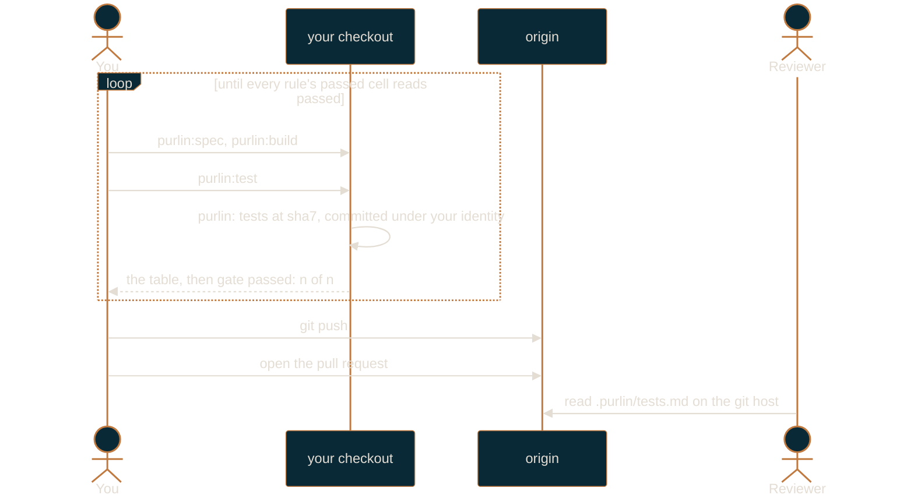

# Solo workflow

For one person working alone at the `passed` gate.

At `passed`, one question is asked of every rule: does every tagged test for it pass? The loop
is `purlin:spec`, `purlin:build`, `purlin:test`, `git push`, and that is the whole of it.
Nobody signs anything, nobody runs a script, and no CI workflow is written unless you ask for
one. This is the smallest thing Purlin can be, and everything above it is additive.

If you have not set the project up yet, read [getting-started.md](getting-started.md) first.
[how-purlin-works.md](how-purlin-works.md) is the model in one page.

## The loop



Nothing in that picture pushes but you. `purlin:test` commits the test results and stops; the
push and the pull request are yours to type. If you installed the pre-push hook, it refuses a
push made from an agent session outright.

`purlin:audit` is available at this gate and counts for nothing here: it runs the tests and
reports how good they are, writes nothing, and no cell moves because of it.

## The setting

```json
{
  "gate": "passed",
  "min_strength": null,
  "ai_review_at": "never"
}
```

`purlin:init` writes that into `.purlin/config.json` when you answer the one question with
`passed`. `min_strength` is unused at this gate, and risk and origin tags stay optional. Read
and change the file with the `purlin_config` tool rather than by hand, so a key the installed
Purlin no longer reads is reported instead of silently kept.

The only branch rule init prints at `passed` is the third one: no force push, no deletion.

## A session

```
purlin:drift eng
```

Start here. Drift reports what moved in the tree that the specs and the tests have not caught up
with: files touched and the rules they affect, rules with no test, tests with no marker. It
writes nothing, and it is also how you read what a pull request changed against your own tree.

```
purlin:spec <name>
purlin:build <name>
purlin:test <name>
```

Spec when a requirement is new or a rule turns out to be wrong; build to write the code and the
tagged tests; test to run them. `purlin:test` takes seconds and is the one you run constantly.
Loop between build and test until every rule the feature owns has a passing test, then push.

## The test results

`purlin:test` writes what the run saw into two tracked files and commits them itself:

```
.purlin/tests/<feature>.json
.purlin/tests.md
```

The JSON file per feature carries the commit, the time, the operating system, each rule's word
and each proof's result and test. `.purlin/tests.md` is one table for the whole project, so a
`--feature` run leaves the rows it did not run exactly as they were:

```
# Test results at 4f1c2ab

| Feature | Rules | Passed | Failing | No test | Last run |
|---|---|---|---|---|---|
| login | 3 | 3 | 0 | 0 | 4f1c2ab · 2026-09-26T12:00:00Z · macos |
```

The commit subject is `purlin: tests at <sha7>` and it is made under your own git identity. The
run prints `Test results committed.`, or `Test results unchanged.` when it saw the same thing
about the same code, and it never pushes.
[references/formats/tests_format.md](../references/formats/tests_format.md) is the contract both
files are written to.

Because both files are tracked, a teammate reading the repository on the git host sees your
run without running anything and without a remote runner. They are the `local` source: they
count at `passed` and nowhere above it.

| Source | How it got there | Counts under |
|--------|------------------|--------------|
| `ci` | created through the git host's API by the CI identity | `passed`, `strong`, `signed` |
| `local` | anything else: this checkout's own run, or the test results you committed | `passed` only |

## The gate line

The last line `purlin:test` prints is the answer:

```
gate passed: 3 of 3
```

or `gate not met: 2 of 3`, and the run exits 1 on the second. It counts every rule under
`specs/`, not only the rules of the feature you ran, because the gate is a question about the
project. At `passed` that line is the check: you run no script and you read no record.
`scripts/ci/gate_check.py --check` is the step a CI job runs, not yours.

## What the board shows

`purlin:status` also refreshes the local dashboard. At `passed` its headline reads `<passing>
of <rules> rules pass their tests · <failing> failing · <untested> untested`, with `<met> of
<rules> meet the gate passed` as a second line underneath. Three tiles: `Untested`, `Failing`,
`Passing`. Five columns: `Spec`, `Rules`, `Spec status`, `Tests`, `Last run`. Two filters:
`Untested` and `Failing`. No strength, no risk, no review list, no signature: those cells do
not exist at this gate, so the board has nothing to put in a column for them.
[dashboard.md](dashboard.md) describes the three screens in full.

## Test strength

At `passed` the strong cell does not exist, so no strength is measured and nothing asks for
one. `purlin:audit` still runs here: it runs the tagged tests and reports what the free checks
found, and it ends with `This audit counts only when CI runs it.` Nothing it prints moves a
cell at this gate.

Raise the gate to `strong` to turn the breaks on, locally and in CI, and see a real number: of
the deliberate breaks audit makes to your code, the share your tests caught.

## When you want a remote runner

A remote runner is the git host running your tests for you. Nothing at `passed` needs one, and
`purlin:init` explains it in three reasons and no others:

- **Your tests need another operating system.** Your machine cannot run a test tagged for
  Windows or Linux. The runner can, so those rules stop reading `not run`.
- **Proof from a clean machine.** Your laptop may have uncommitted edits or leftover files.
  The runner runs exactly the code you pushed, on a machine nobody touched. That is what the
  `strong` and `signed` gates trust.
- **No merge while red.** The git host refuses to merge the pull request while a test fails or
  a rule has no test. Nobody has to remember to check.

Teammates do not need a remote runner to see your results: `purlin:test` commits them, so they
are in the repository, readable on the git host and on the board after a pull.

At `passed` with a remote, init prints those three reasons, then that sentence, then asks:

```
Run the tests on a remote runner too? [y/n]
```

A yes writes the workflow; a no writes nothing and says `run purlin:init again to add it`.
Before either, init checks the prerequisites: a remote exists, its URL names GitHub or Azure
DevOps, and the protected branch is on that remote. The first that fails is printed in one line
with what to do, and no workflow is written. The host CLI, `gh` or `az`, is reported as present
or absent either way.

The one case where you will want it is a proof tagged for an operating system your machine is
not. `purlin:test` says so in one sentence and changes nothing itself:

```
login PROOF-4 needs windows; this machine is macos. A remote runner runs it: purlin:init adds one.
```

The rule reads `not run` until that system runs it. With a workflow in place,
`purlin:test --remote` hands the commit to the runner on a run branch of its own,
`run/<branch>-<sha7>`, which it creates, waits on and deletes. At `passed` the runner writes no
record, so there is nothing to pull back: the run prints what the runner saw.

## The pre-push hook

`purlin:init` offers a pre-push hook. It runs the tagged tests and nothing else: into
`.purlin/runtime/proofs/`, in seconds, with no breaks, so a push is never held up.

It prints one line either way. It blocks a push only when both of these are true: `pre_push` in
`.purlin/config.json` is `on`, and a tagged test failed. Every other outcome exits 0 and lets the
push through, including a missing Python interpreter, a project with no specs, and a failing test
in a project that left `pre_push` at its default of `off`. `git push --no-verify` skips it
entirely.

It refuses one push outright, before it runs anything: a push made from an agent session. With
`CLAUDE_CODE_SESSION_ID` in the environment and `PURLIN_REMOTE_RUN` unset it prints `purlin: an
agent does not push. A person runs git push.` and exits 1. `--no-verify` is your override, not
the agent's.

Apart from that one refusal the hook is a convenience, not a control. What a change must clear
before it merges is the gate, and the gate is the git host's to enforce.

## When to raise the gate

Raise to `strong` when any one of these becomes true:

- A second person commits to the repository. Two people means the test results one of you
  committed stand as evidence for the other's change, and `strong` is what stops that.
- Someone outside engineering owns a requirement. A PM's or a designer's rule needs `origin`
  tags and a review list to be worth tagging.
- You need to answer "what was proved at the commit we shipped?" to someone who was not there.
  A CI-written record at a known commit answers it; a test results file you committed yourself
  asks them to trust you.

```
purlin:init --gate strong
```

Raising is additive. It writes the CI workflow (`purlin.yml`), creates `designs/` if it is
missing, prints the branch rules for your git host, and asks before each write. It changes no
rule and deletes no file. From that point the evidence that counts is the record CI writes, and
the test results stay where they are as the fast answer you read while you work.

[team-workflow.md](team-workflow.md) is the guide for the gate you land on.
[raising-the-gate-and-upgrading.md](raising-the-gate-and-upgrading.md) covers the move itself,
in both directions.
