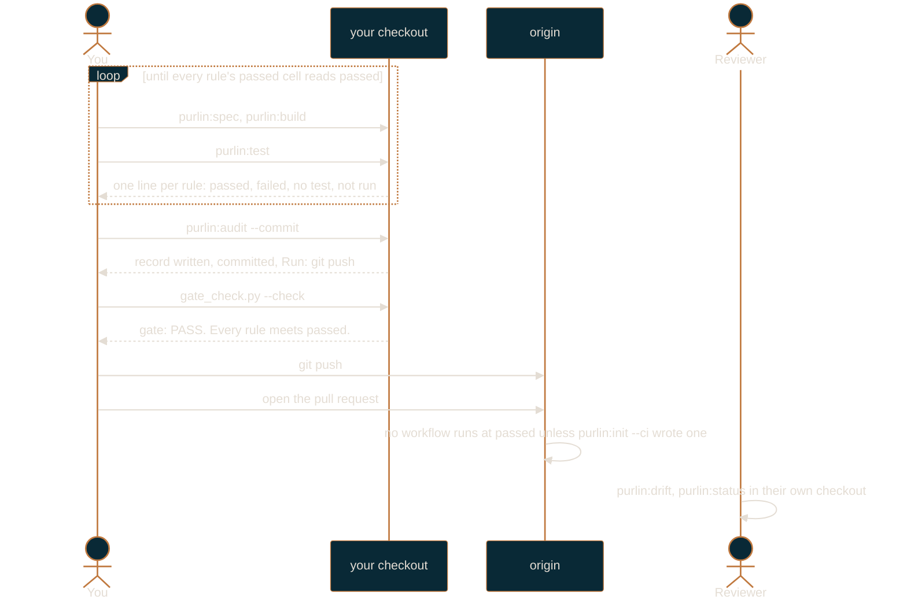

# Solo workflow

For one developer working alone at the `passed` gate.

At `passed`, one question is asked of every rule: does every tagged test for it pass? You write
the record yourself, no one signs anything, and no CI workflow is written unless you ask for
one, so the answer is one you read on your own machine. This is the smallest thing Purlin can
be, and everything above it is additive.

If you have not set the project up yet, read [getting-started.md](getting-started.md) first.
[how-purlin-works.md](how-purlin-works.md) is the model in one page.

## The loop



Nothing in that picture pushes but you. `purlin:audit --commit` makes the commit and prints the
push command; the push and the pull request are yours to type. If you installed the pre-push
hook, it refuses a push made from an agent session outright.

## The setting

```json
{
  "gate": "passed",
  "min_strength": null,
  "ai_review_at": "never"
}
```

`purlin:init` writes that into `.purlin/config.json` when you answer the one question with
`passed`. `min_strength` is unused at this gate, and risk and origin tags stay optional. Read
and change the file with the `purlin_config` tool rather than by hand, so a key the installed
Purlin no longer reads is reported instead of silently kept.

Init skips the CI workflow at this gate, because nothing here needs one. `purlin:init --ci`
writes it anyway when you want the run without the requirement. Whichever you choose, the only
branch rule printed at `passed` is the third one: no force push, no deletion.

## A session

```
purlin:drift eng
```

Start here. Drift reports what moved in the tree that the specs and the tests have not caught up
with: files touched and the rules they affect, rules with no test, tests with no marker. It
writes nothing, and it is also how you read what a pull request changed against your own tree.

```
purlin:spec <name>
purlin:build <name>
purlin:test <name>
```

Spec when a requirement is new or a rule turns out to be wrong; build to write the code and the
tagged tests; test to run them. `purlin:test` takes seconds and is the one you run constantly.
Loop between build and test until every rule the feature owns has a passing test.

```
purlin:audit
```

Then audit once, before you push.

## Your own record commit

At `passed`, `purlin:audit` runs the tagged tests only, no breaks, and the record's test
strength reads `n/a`. The run says `Strength n/a: the gate is passed.` on its own line, so a
blank where a percentage usually sits is never read as a missing engine.

```
.purlin/records/login/20260913T142201Z-a1b2c3d-jane.json
```

The last part of the name is the runner slug: `ci` on a CI run, and otherwise your git email's
local part, lowercased. One record per audit run, per feature. Adding a file never conflicts
with another branch. The commit message is `purlin: record for a1b2c3d`. It is committed and
not pushed: the run prints `Record committed. Run: git push` and the push is yours. CI
publishes its own evidence; a person pushes theirs.

The slug in the name is not what decides whether a record counts. The last commit that touched
the file decides, and that answer is the passed cell's `source`:

| Source | How it got there | Counts under |
|--------|------------------|--------------|
| `ci` | written through the git host's API by the CI identity | `passed`, `strong`, `signed` |
| `developer` | a person committed it | `passed` only |
| `local` | not committed | `passed` only |

At `passed`, your own commit is the record, so `purlin:audit --commit` commits it for you. That
is the one gate where a developer writes the evidence their own change is measured by, and it
is the honest trade for working alone: the point at `passed` is that the tests ran and passed,
not that someone independent watched them run. The moment you raise the gate to `strong`, only
a `ci` record counts and you stop committing them.

Audit keeps the newest three records per feature per operating system and prunes the rest. A
record named in the message of an annotated `record/<name>` tag, which `purlin:audit --tag
1.0` writes, is kept for ever. The log of what was proved and when is the git history of
`.purlin/records/`.

## Checking the gate before you push

`purlin:status` prints every rule's cells and ends with one `→ Next:` line. To read the same
answer in the form CI would give it, run the gate check by hand:

```bash
python3 "${CLAUDE_PLUGIN_ROOT}/scripts/ci/gate_check.py" --check
```

Every line it prints opens with `gate:`. It writes nothing, names each rule that falls short
under the cell that blocks it, and exits 0 when the gate is met and 1 when it is not. At
`passed` the only section that can fill is `Not passed`.

## What the board shows

`purlin:status` also refreshes the local dashboard. At `passed` its headline reads `<passing>
of <rules> rules pass their tests · <failing> failing · <untested> untested`, with `<met> of
<rules> meet the gate passed` as a second line underneath. Three tiles: `Untested`, `Failing`,
`Passing`. Five columns: `Spec`, `Rules`, `Spec status`, `Tests`, `Last run`. Two filters:
`Untested` and `Failing`. No strength, no risk, no review list, no signature: those cells do
not exist at this gate, so the board has nothing to put in a column for them.
[dashboard.md](dashboard.md) describes the three screens in full.

## Test strength

At `passed`, the strong cell does not exist and the record's test strength always reads `n/a`:
`purlin:audit` runs the tagged tests only, and no breaks are made to measure how much of your
code they would actually catch.

Raise the gate to `strong` to turn the breaks on, locally and in CI, and see a real number: of
the deliberate breaks audit makes to your code, the share your tests caught.

## The pre-push hook

`purlin:init` offers a pre-push hook. It runs `purlin:test` and nothing else: the tagged tests
into `.purlin/runtime/proofs/`, in seconds, with no breaks and no record, so a push is never
held up by a full audit.

It prints one line either way. It blocks a push only when both of these are true: `pre_push` in
`.purlin/config.json` is `on`, and a tagged test failed. Every other outcome exits 0 and lets the
push through, including a missing Python interpreter, a project with no specs, and a failing test
in a project that left `pre_push` at its default of `off`. `git push --no-verify` skips it
entirely.

It refuses one push outright, before it runs anything: a push made from an agent session. With
`CLAUDE_CODE_SESSION_ID` in the environment and `PURLIN_REMOTE_RUN` unset it prints `purlin: an
agent does not push. A person runs git push.` and exits 1. `--no-verify` is your override, not
the agent's.

Apart from that one refusal the hook is a convenience, not a control. What a change must clear
before it merges is the gate, and the gate is the git host's to enforce.

## When to raise the gate

Raise to `strong` when any one of these becomes true:

- A second person commits to the repository. Two people means one of you can write a record for
  the other's change, and `strong` is what stops that.
- Someone outside engineering owns a requirement. A PM's or a designer's rule needs `origin`
  tags and a review list to be worth tagging.
- You need to answer "what was proved at the commit we shipped?" to someone who was not there.
  A CI-written record at a known commit answers it; a developer-written one asks them to trust
  you.

```
purlin:init --gate strong
```

Raising is additive. It writes the CI workflow (`purlin.yml`), creates `designs/` if it is
missing, prints the branch rules for your git host, and asks before each write. It changes no
rule, deletes no record, and leaves every record you already committed exactly where it is. The
records you wrote yourself stop counting from that point; CI writes the ones that count from the
next run.

[team-workflow.md](team-workflow.md) is the guide for the gate you land on.
[raising-the-gate-and-upgrading.md](raising-the-gate-and-upgrading.md) covers the move itself,
in both directions.
